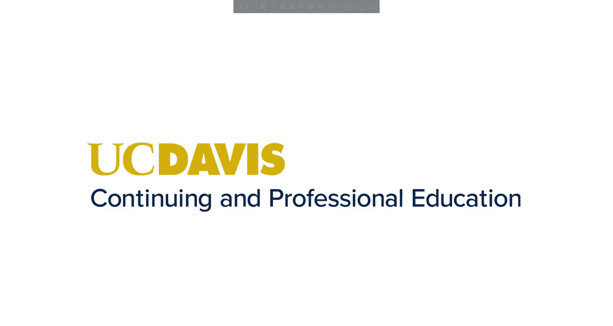
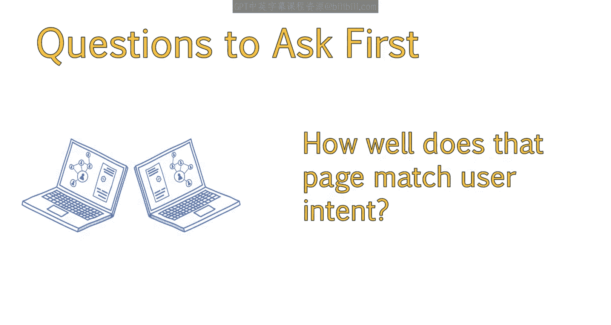
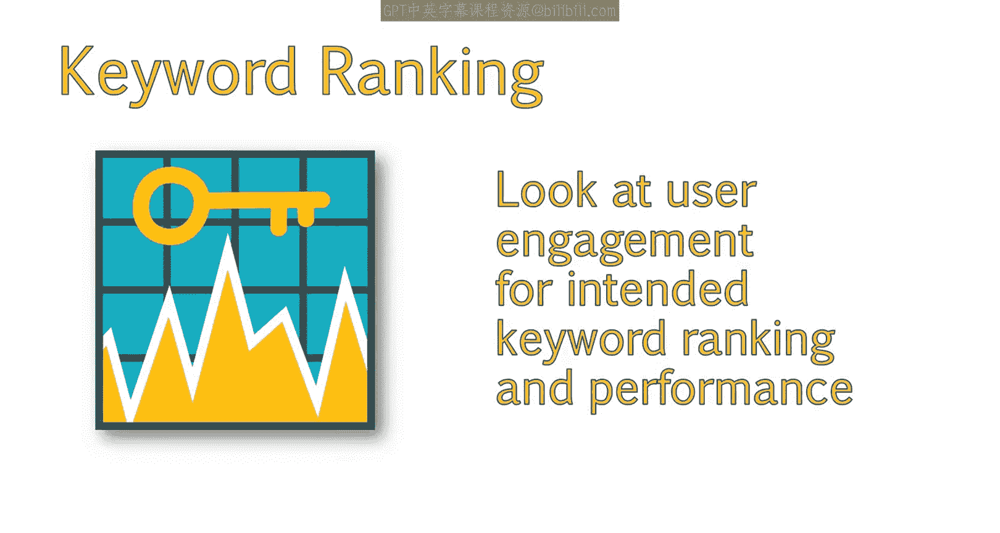
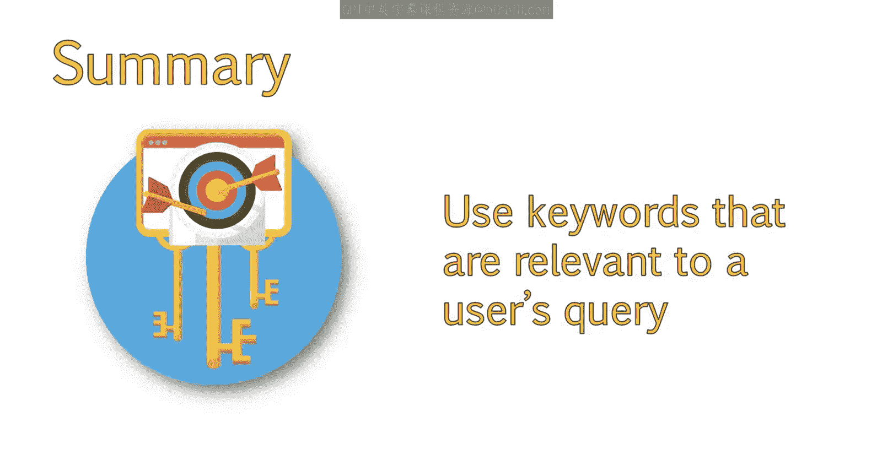

# 065：UCD《搜索引擎优化（谷歌、SEO基础、优化网站、进阶、毕业项目）｜Search Engine Optimization》中英字幕 p65 9_需提出的问题.zh_en -BV1N66VYsEue_p65-

Hello， again。If we want to understand the impact keywords have on the traffic to your website。

It's important to review the current user experience on each page of your site。

Are there changes you can make that will optimize the page and increase its ranking？

That and other questions will be the focus of this lesson and the answers will help you determine which keywords to assign to each page。

Before we start assigning keywords to existing pages。

We first need to look at how the page is performing from a user experience and optimization standpoint。

It's important to ask yourself the following questions。Ask yourself。

 how well does that page already rank for its current keywords。

Look at the title tag and content to see what the page's keyword focus may be。

If you can spot the keyword focus for that page。Perform a quick rank analysis to see how well that page is ranking for that keyword。

If it is ranking well。Ask yourself if that is an appropriate keyword to target。For example。

 does it have good search volume。How well does that page match user intent。

It's great to rank for textbooks， but of all the traffic bounces because they are looking for textbook rentals。

Then that isn't helping your efforts。If the page is ranking well for its intended keyword。

Take a look at user engagement to see how well the keyword is performing。

If user engagement is low， but other similar pages perform better。

Chances are that the keyword isn't drawing in the targeted traffic it needs to。

Looking at user engagement will also give you an idea of what pages may need a revamp before or shortly after your SEO efforts。

I also recommend taking your chosen keywords and running these through a rank tracking tool。

There may be existing pages that are already ranking well for your new keywords。

If a specific page is ranking well for a term。This means that historically。

 the search engines have found this page relevant for that topic。

This may present a great low hanging fruit opportunity that you can address with some minor changes by improving copy。

 keyword focus and adding additional resources。😊，To help ensure you are picking good Seo friendly keywords。

Other questions to consider include looking into how easy it is to add copy to the page that utilizes your chosen keyword。

If the keyword you chose doesn't fit naturally into a sentence。

Then it may not be the best keyword option。Also， consider how well the keyword fits in the title tag and potential heading tags。

For example， can you also use it within a meta description that will still entice a user to click。

Remember that having an optimized meta description can improve your click through rate。

You should now have an understanding of questions you should be asking when determining which keywords belong to what pages of your site。

Answering these questions will help ensure that you are choosing the keyword。

That is most appropriate for that page and that the page is most likely to rank for。

You also want to ensure you're choosing a keyword users are likely to find relevant to their query。

