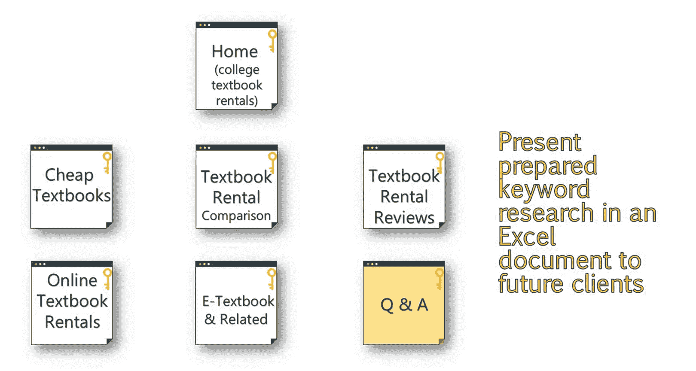
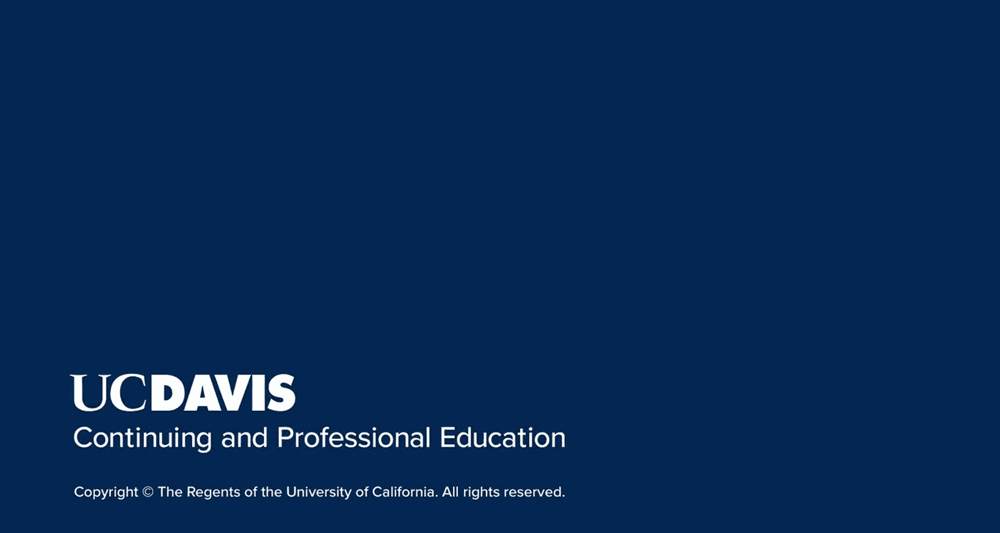

# 搜索引擎优化：066：关键词映射流程

在本节课中，我们将学习关键词映射的实际操作流程，并探讨其最佳实践与常见误区。我们将了解如何将已研究好的关键词合理地分配到网站的各个页面，以构建一个逻辑清晰、易于搜索引擎理解的网站结构。

## 概述

在之前的课程中，我们讨论了如何识别有效关键词以及如何利用它们提升网站的竞争力。我们也通过提问来帮助自己做出最佳的关键词选择决策。本节课程，我们将聚焦于关键词映射的实际过程，并了解其中的注意事项。

## 关键词映射的准备工作

上一节我们介绍了关键词研究，本节中我们来看看如何为映射做准备。在关键词研究阶段，我们已经将关键词分成了不同的组别。这为关键词映射阶段节省了大量时间。

以下是我们在研究阶段已建立的关键词组别示例：
*   与“电子教科书租赁”相关的关键词组，如“电子教材租赁”、“在线教科书租赁”。
*   包含限定词的关键词组，如“便宜的”或“实惠的”。
*   用户可能搜索的长尾问题关键词组。

## 关键词映射的核心原则

我们需要确保为不同的关键词组创建专门的页面，但要避免为含义过于相似的关键词创建重复页面。

以下是关键词映射中**不应**采取的做法示例：
*   **页面1**：专门针对“电子教科书租赁”。
*   **页面2**：专门针对“E教科书租赁”。
*   **页面3**：专门针对“便宜的教科书租赁”。
*   **页面4**：专门针对“实惠的教科书租赁”。

你可以看到，页面1和页面2非常相似，页面3和页面4也是如此。这会导致内容重复和内部竞争。

一个更优的关键词页面布局应如下所示。

## 页面结构与关键词分配策略

理想情况下，网站首页应具有更广的范围，并瞄准竞争度稍高的核心短语。由于网站的大部分权重通常集中在首页，因此它更有机会为竞争更激烈的关键词排名。

例如，如果你的网站主要专注于“大学教科书租赁”，那么这个关键词组就与首页高度相关，并能向搜索引擎和用户清晰地传达网站的整体定位。

其他页面则可以专注于更具体、竞争度较低的术语。

以下是针对不同关键词组创建页面的示例：

**1. 专注于“实惠性”的页面**
这个页面可以展示关于租赁教科书比购买更省钱的研究，或说明你的公司如何使教科书租赁过程变得负担得起。在此页面中，应使用多种同义词来提升该主题的相关性，并捕获额外的搜索量。这包括“affordable”、“economical”和“low cost”等关键词。

**2. 专注于“教科书租赁对比”的页面**
这个页面可以捕获“租书 vs 买书”或“租教科书好还是买二手教科书再卖掉好”等搜索词。

**3. 专注于“教科书评价”的页面**
“教科书评价”这个关键词是在关键词研究表格第一个标签页中，从“教科书租赁”研究中提取的。它不与相关关键词冲突，可以作为一个很好的页面来展示满意客户的评价。

**4. 专注于“在线教科书租赁”的页面**
可以创建一个类似“我们的在线教科书租赁如何运作？”的页面，介绍你的流程和便捷性。这个页面也可以更侧重于“在线租赁实体教科书并送货上门”的功能。

**5. 专注于“电子教科书”的页面**
这个页面可以介绍登录网站查看教科书、做笔记甚至下载教科书等功能。

**6. 常见问题页面**
大多数网站都有一个FAQ或问答区域。我们在研究表格的“问题”标签页下进行的研究，显示了可以包含在FAQ部分的各种问题。例如，“租教科书好还是买教科书好？”这个问题可以提供一个简短答案，并链接回最能解答该查询的页面，如“教科书租赁对比”页面。

## 关键词映射的可视化呈现

以上示例只是展示不同页面如何定位独特关键词组的视觉化方式。向客户展示时，更好的方式可能是使用Excel或Word文档，其中包含你计划使用的实际关键词、页面URL等更多信息。

我个人更倾向于使用Excel。

## 总结

本节课中，我们一起学习了关键词映射的完整流程。我们了解到，映射的基础在于前期良好的关键词分组。核心原则是避免为相似关键词创建重复页面，而应让首页覆盖核心宽泛词，并创建专门的子页面来覆盖更具体的长尾词和问题词。最后，通过表格等可视化工具清晰地规划关键词与页面的对应关系，是确保SEO策略有效执行的关键一步。