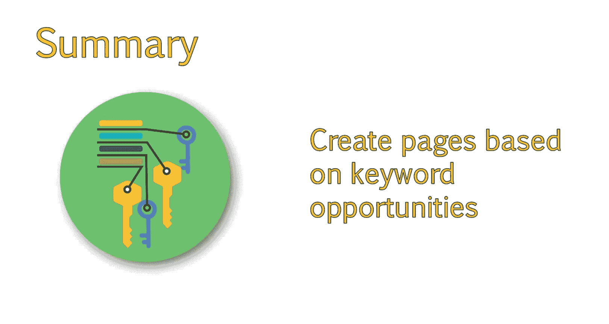

# 067：UCD《搜索引擎优化（谷歌、SEO基础、优化网站、进阶、毕业项目）｜Search Engine Optimization》中英字幕 p67 11_为客户创建关键词地图.zh_en -BV1N66VYsEue_p67-

Welcome back。In this last lesson of this module， we'll look at some examples of keyword maps that will give you some direction on how to build your own document。

Whether you are working with clients or coworkers， it's vital that you create a document that shows where keywords are used within your website。

You'll find that this makes planning and future updates to your site much easier。

So let's get started on helping you build your own Excel keyword map。

Here is an example of an Excel keyword map， I typically use。To go over this in person。

Download the document example keyword map， which shows everything I have here in better detail。

The way you lay this out will be dependent upon whether you are working on an existing site with pages that are already in place versus a new site where you get to recommend the pages that they create。

 The first example is far more common。And the site may not have pages that work well for the keywords you discovered。

In these cases， I try to find a page that can closely match the subject matter where they can make small changes to the copy。

If there are no pages that closely match the keyword。Then you may want to recommend new pages。

Keep in mind that pages earn authority over time。So if you can find a way to make small changes on a page that already exists。

This will have a quicker impact on rankings。 What I did with this document was lay out the pages that exist on the site or new pages we recommend。

Along with primary focus keywords and secondary or related keywords。

The secondary keywords are generally synonyms that have lower volume。

There is also a rank column where you would want to add the date you check the ranking。 So later on。

 once changes have been applied。You can begin comparing the new rankings to the previous one。

I also include the keyword volume。The last column is a column for notes。

 where I can add information about why I am making the specific recommendations I am in the second page example。

 I am recommending that the about page focus on the term cheap textbook rentals。

When we get into specific keyword usage recommendations。

I can recommend something like rent cheap textbooks。

 plus the company's name for something in the title tag。Which still makes sense as an about page。

However， the ultimate decision on whether or not to refocus their about page to highlight specific keywords。

Will depend on the company and their brand message。Some will prefer not to do so。 So in this case。

 I include a second option for a new page。As well as a recommended URL。

Which would include those keywords。Once I go through this in detail with my client。

I would note their preference by highlighting or deleting one of the options。

 I then recommend that the testimonials page focus on reviews instead of the term testimonials。

 as this may draw in more traffic。😊，I recommended updating a page that they have about their rental process to incorporate better keywords。

😊，And then I recommended a new page based on e textextbooks。If you end up working on a new site。

 this process is very similar and often easier， depending on the stage they seek your involvement。

After reviewing this video and the sample downloads provided。

You should now have a good understanding of how to map keywords to existing pages of a site or create new pages based on keyword opportunities that you discovered。

Next， we will look at developing a content and on page optimization strategy。

