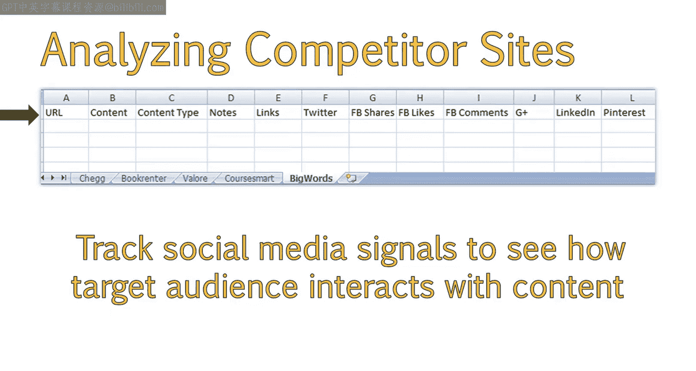
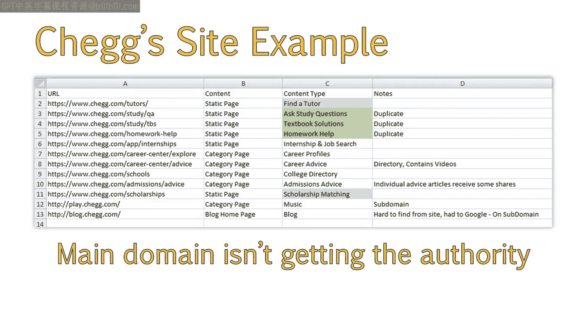
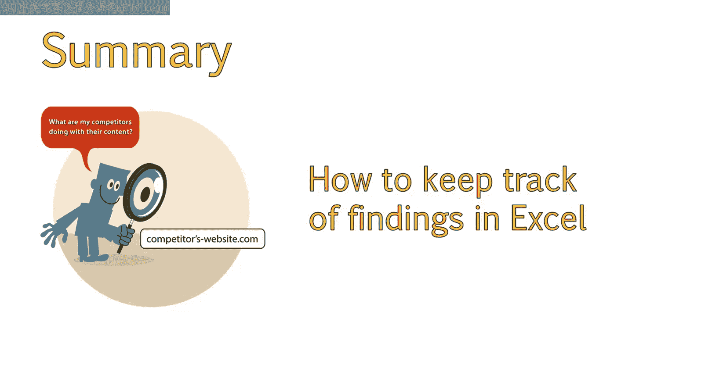

# 070：解析竞争性内容分析 📊

在本节课中，我们将深入探讨如何解析竞争性内容分析。上一节我们介绍了竞争性内容分析的概念以及如何识别竞争对手。本节中，我们将扩展并完善上节课创建的竞争性内容分析电子表格，为您提供一个分析竞争对手的有效工具。课程结束时，您将能够收集重要数据并将其录入电子表格。

## 分析竞争对手网站的内容 📝

分析竞争对手网站时，我会列出他们拥有的资源与内容页面。过程中，我会记录以下几点信息。

以下是记录内容的关键步骤：

*   **页面URL**：记录内容所在页面的URL，便于后续查阅。
*   **内容类型**：标注内容是静态页面、信息图、视频还是其他形式。
*   **内容备注**：随时记录关于该内容的任何想法或观察。
*   **外链数据**：通常跟踪指向该独立页面的域名数量。这些指标可以从Moz的Open Site Explorer或Ahrefs、Majestic SEO等工具获取。
*   **社交媒体信号**：跟踪各种社交媒体互动数据，以了解目标受众是否以及如何与该内容互动。

您可以在演示过程中下载并查看我正在使用的电子表格，也可以稍后下载它作为模板使用。

## 案例分析：Chegg网站示例 📈

接下来，我以Chegg网站为例进行了填写。相比列表中其他网站，Chegg拥有更多样化的内容类型，因此需要收集大量信息，这也是一个最佳的分析案例。

在分析中，我发现了一些情况：

*   部分内容需要登录才能访问，我将其标记为灰色作为参考。
*   标记为绿色的内容需要付费订阅（付费墙）才能查看。
*   此外，我注意到其中三个页面内容几乎完全相同。因此，从SEO角度看，这里有巨大的改进空间。
*   我还发现两个优质资源（他们的博客和一个音乐专题页面）位于子域名上。这意味着主域名未能获得子域名所积累的全部外链权威和社交媒体分享，而在这个案例中，子域名的这些数据非常可观。从SEO和内容策略的角度看，这是一个巨大的机会损失。

## 总结与工具应用 ✅

现在，您应该了解了分析竞争对手网站内容时需要关注哪些要点，也清楚了如何在Excel中记录您的发现。您可以自由使用提供的示例模板，或者创建最适合您和分析流程的Excel文件。

本节课中，我们一起学习了如何构建并完善竞争性内容分析电子表格，掌握了记录URL、内容类型、外链和社交媒体数据的关键方法，并通过实际案例加深了理解。