# 071：UCD《搜索引擎优化（谷歌、SEO基础、优化网站、进阶、毕业项目）｜Search Engine Optimization》中英字幕 p71 15_哪些内容能引发客户共鸣.zh_en -BV1N66VYsEue_p71-

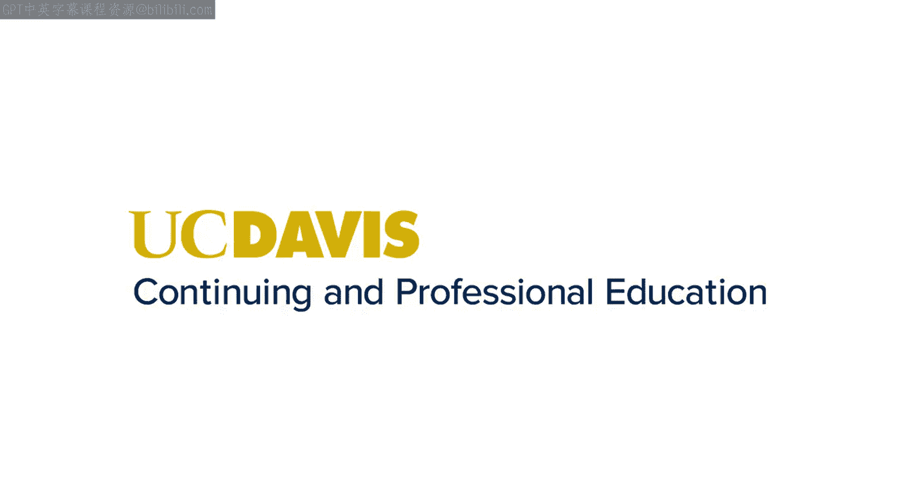

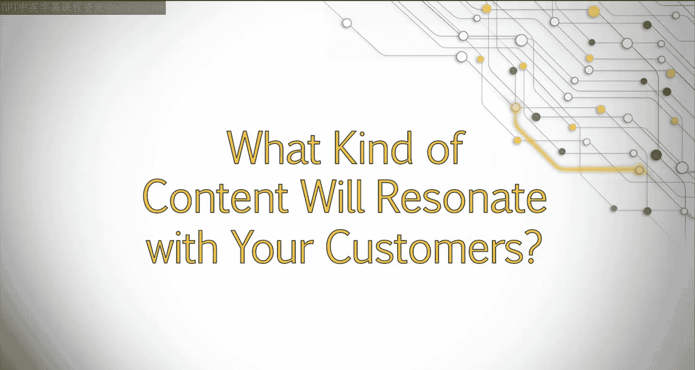

Hello again。Now that we know how to gather and analyze content on our competitor site。

 in this lesson， we'll take a look at how to analyze social signals。Social sites such as Facebook。

 Twitter， LinkedIn and Google Plus all contain important data that can be central to our success。😊。

We'll also look at some easily accessible online tools that will help us unlock and analyze this data。

 Next， I filled in the social media data I used a tool called shareremetric。

 which is a free Chrome extension。 There's a lot of different and similar tools out there to choose from。

😊，Basically， whenever you are looking at a page， you can click on the sharere metric icon for detail on social shares。

 and it will break all of this data out for you。While analyzing this。

 I can immediately see a few things。 Chegg's audience is very active on social channels。

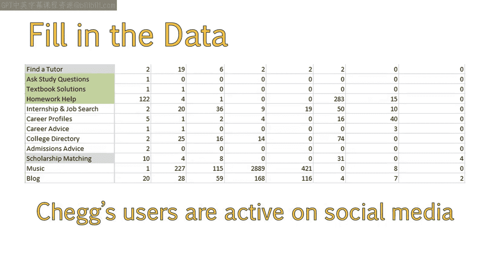

I bet if we created content with the right calls to action for comments。

 shares or another type of social interaction， we would be able to get a lot of traction out of that。

😊，I also see that people use Google+ to plus one content pretty frequently。

This is good to know a plus one button would be really important to include within the content。

Pinterest is the least popular， but to be honest， none of these pages have very penworthy graphics either。

Given how active this audience is on other social networks。

And the fact that there are still some pins。I bet if the client emphasized pinable images within their content。

 they could increase engagement and shares here。LinkedIn seems to be the most popular with career related posts。

This makes a lot of sense。 so if the client were to create any of these。

 sharing to LinkedIn would be really valuable。It might be worthwhile to add a specific call to action on these posts that mention sharing with their audience on LinkedIn。

Perhaps even some content that might appeal to college students。

 such as using LinkedIn to find a job or best ways to optimize your LinkedIn profile as a recent graduate。

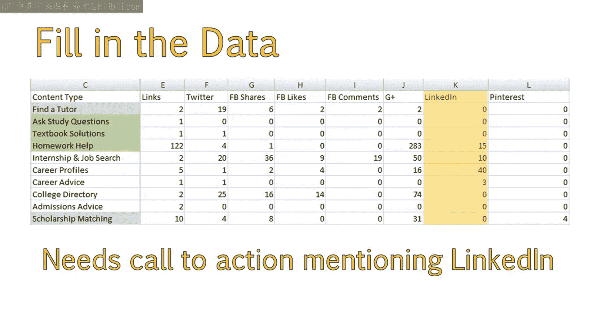

Another thing I like to do is add up all of the columns so I can get a good idea of what type of social sharing and content is the most popular。

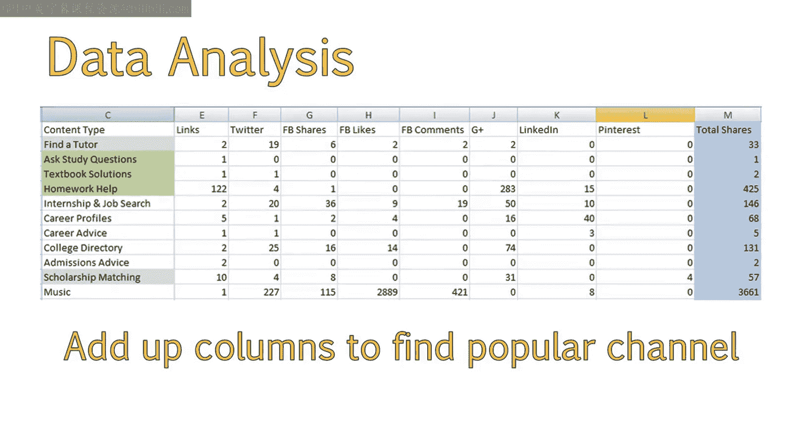

The vertical axis shows the type of social sharing people use the most。

 while the horizontal shows which pages get the most social shares and links。

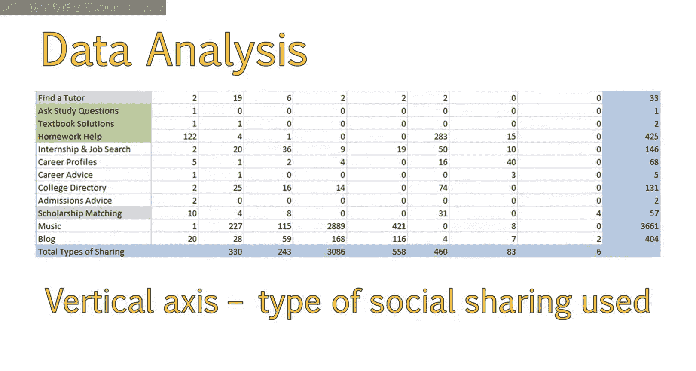

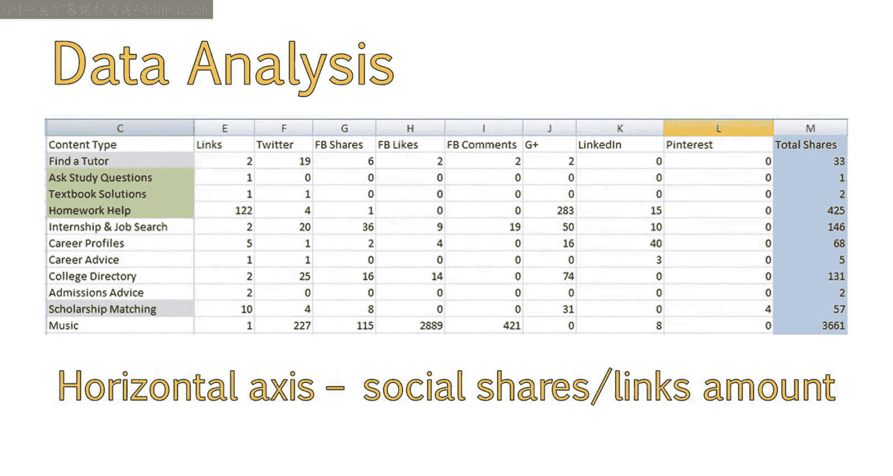

So we can see that Facebook likes and comments outweigh anything else。

 So having a strong Facebook presence is a good idea。😊，Google Plus ones outweigh Facebook shares。

 and Twitter is the next most popular sharing platform。

We can also see that the most shared page is scholarship matching， followed by Home helpelp。

 which is unfortunately a paid for resource。We can probably create some free homework related resources to increase social sharing on our site。

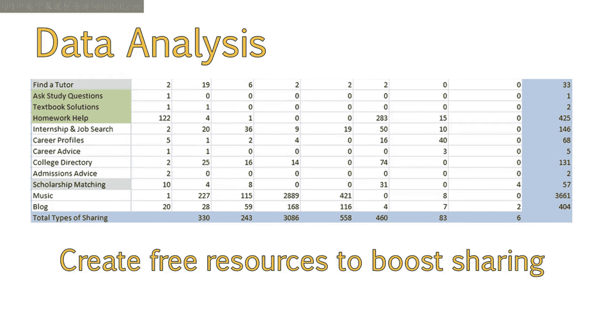

You want to make sure you're not copying your competitor's content strategies。

 but using this to come up with your own original ideas that take advantage of the insights you have gained。

Let's use something like homework help。 As an example。

 We know off the bat that we can create an area that helps students with their homework。

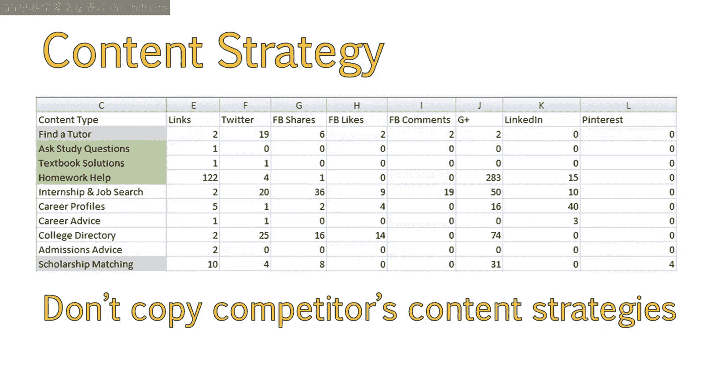

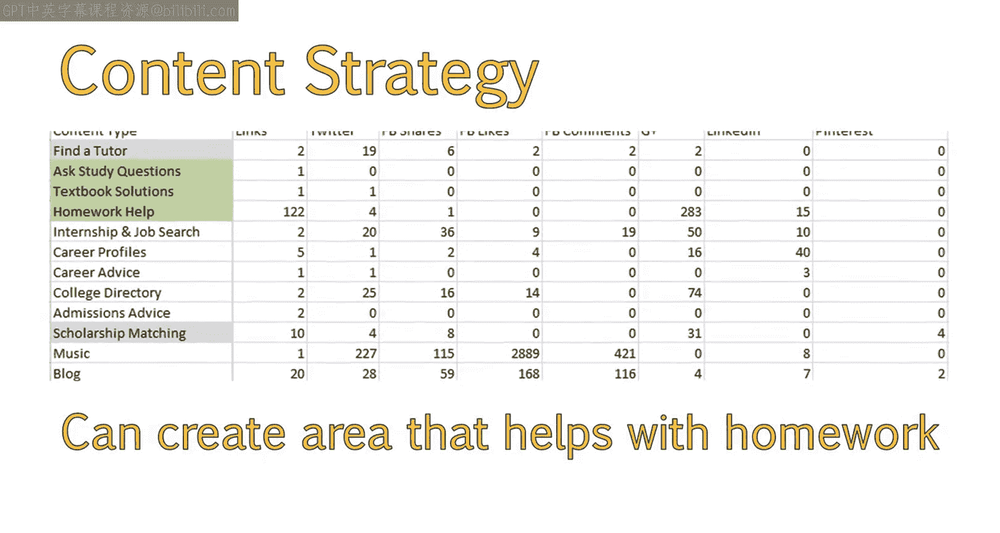

But this is a really time intensive solution to develop。

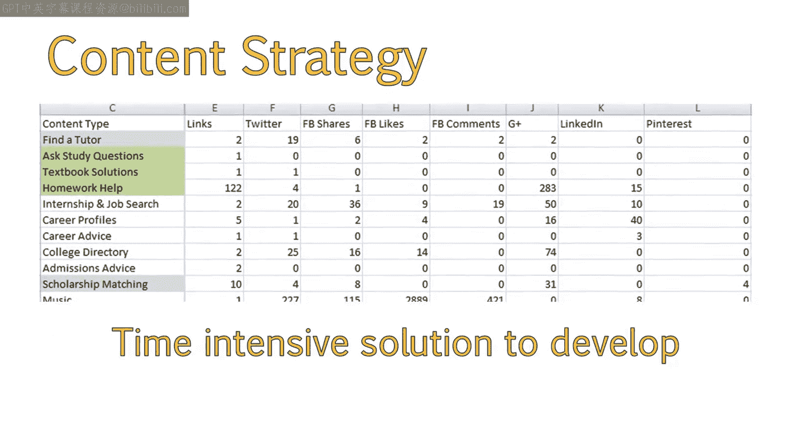

However， having a section of our blog dedicated to Homer Kelp might be a step in the right direction。

And would be a great resource that we can build up over time from our analysis of our first competitor。

😊。

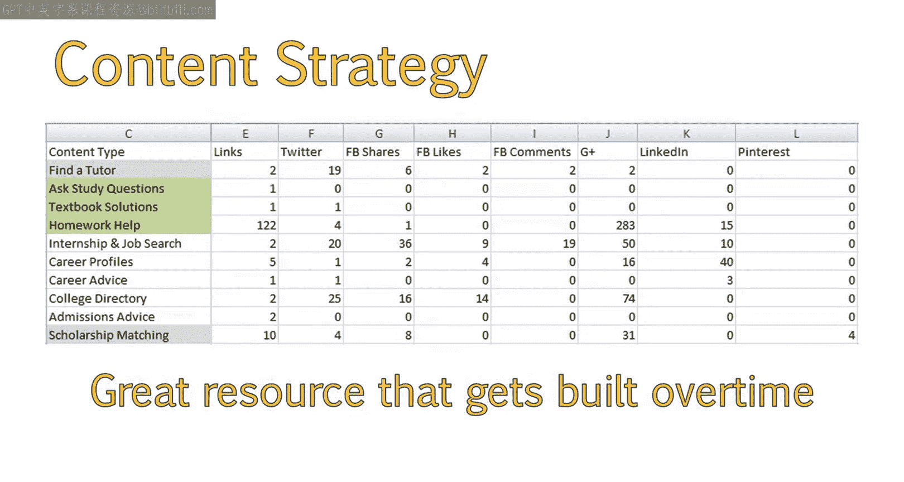

We have gained the following insights about both our target audience and our competition。

We know that our target audience are big social sharers。

 so it's a great idea to include calls to action， to share and also take advantage of social media to spread content。

😊，We can add some topics like homework helpp and career related posts。

This will increase interaction and engagement。We have also learned that our competition has some good Seo in place。

 but are also making some mistakes， such as having duplicate pages and hosting great content on sub domains。

😊，The next step is to complete this process for each of your main competitors and note your findings as you go。

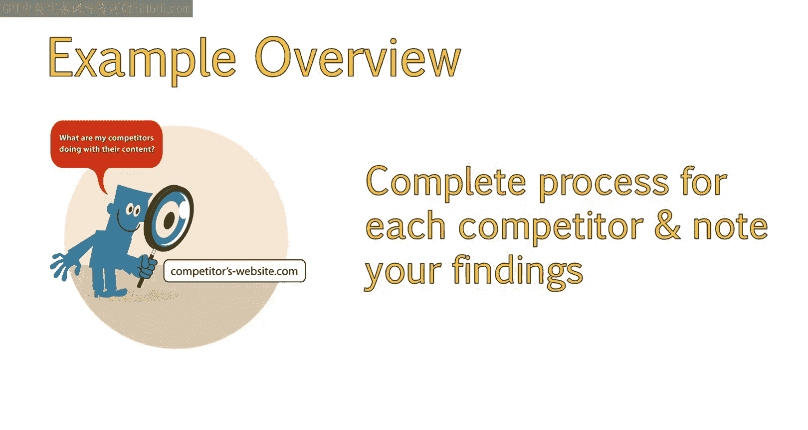

Following the steps laid out in this lesson。You should now be able to analyze your competition to determine what types of content they are producing。

And identify areas of opportunity for your site。

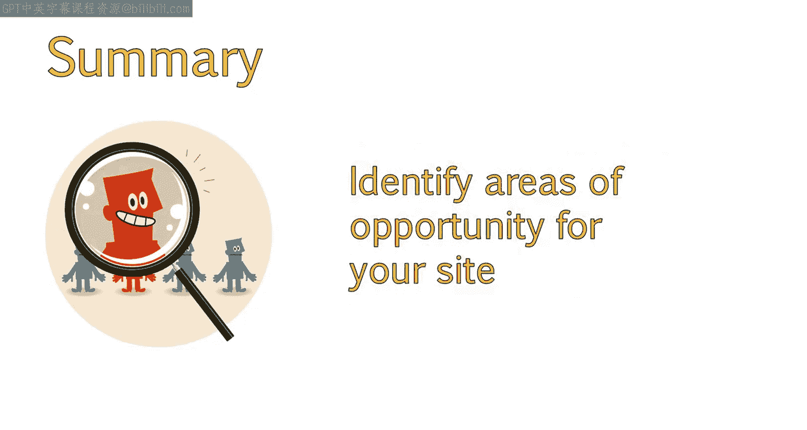