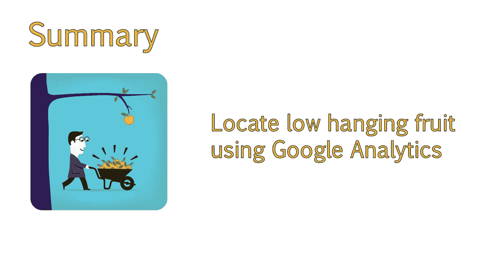

# 073：如何启动内容分析 🔍

在本节课中，我们将学习如何启动网站内容分析。我们将逐步拆解识别内容的过程，以获得最佳优化效果。同时，你将学会如何应用如Google Analytics等工具，开始进行内部内容审计，以最大化SEO效益。

上一节我们探讨了在审查网站内容时需要提出的关键问题。本节中，我们将更深入地审视自己的网站。

## 确定分析起点 🎯

审计的第一步是确定从何处开始分析。如果你的网站规模较大，可能会在决定起点时感到不知所措。因此，我们首先应识别那些“低垂的果实”。

“低垂的果实”指的是那些已经获得自然搜索访问的页面。我们知道这些页面存在用户兴趣，因为它们已经产生了流量。通过改进这些页面，有可能带来更多流量和社交分享。

以下是几种启动内容审计的方法，具体取决于你的偏好和网站规模。

## 使用Google Analytics识别页面 📊

在大型网站上启动内容审计时，我通常采用的一种方法是进入Google Analytics，查找当前的有机着陆页。我倾向于查看过去六个月的数据，这能提供大量有用信息。

你可以通过以下路径获取数据：进入“行为”报告，选择“着陆页”，然后通过“次级维度”进行排序，并选择“媒介”。这将列出所有着陆页及其获取流量的媒介，例如有机搜索、付费搜索、引荐或其他方式。

接下来，你只需关注有机访问。你可以通过高级排序功能，选择包含“有机搜索”的媒介来实现。这将过滤掉所有非有机流量。

## 组织审计数据 📝

现在，你可以通过几种不同的方式检查这些数据。根据网站规模，为博客页面和内部页面分别进行审计可能会更有帮助。这样，你不会一次性处理过多类型的数据。

我个人喜欢根据项目是内部资源还是博客页面来记录不同的笔记，因此我总是采用这种方式。你可以通过筛选包含“blog”一词的着陆页来过滤数据。这将过滤掉URL中不包含“blog”的所有页面。

请注意，这种方法仅在你的博客位于名为“blog”的目录下时才有效，大多数网站都是如此。如果你的博客目录名为“articles”或其他名称，请改用该词进行筛选。

你可以将此报告导出为CSV文件并在Excel中排序，也可以手动审查列表，并将你想要分析的页面及笔记添加到Excel中。最终结果将是相同的。

## 分析低流量页面 📉

在本节课中，为简化示例，我将不下载数据。首先，我将按会话数排序。这样，我可以首先看到获得有机访问量最低的页面。这有助于我判断这些页面是否可以通过任何方式进行改进。

现在，我们可以专注于提升这些页面有机访问量的方法。当你这样做时，尤其是对于博客页面，你会看到许多不相关的URL，例如URL中包含标签、分类或存档的页面。这些页面会引导你到文章列表页，而非具体的文章本身。最好在分析工具中过滤掉这些页面，或者如果你决定下载数据，在Excel中进行过滤。

## 发现改进机会 💡

在审查过程中，我注意到许多访问量较少的页面实际上拥有相当不错的网站参与度。在某些情况下，跳出率很低甚至为0，因为用户导航到了另一个页面。因此，至少这些页面有助于提升网站参与度指标。

由于用户参与度高但流量低，这告诉我这些页面未能从搜索引擎获得应有的关注。通过改进内容，例如添加更多内容或资源，我们可以帮助搜索引擎认识到这些页面为用户提供了价值，从而应该获得更高的排名。

## 总结 📚

本节课中，我们一起学习了如何启动内部内容审计以获得最大的SEO效益。你现在应该清楚从何处开始审计，以及如何在Google Analytics等分析程序中找到这些页面。我们介绍了识别“低垂的果实”、使用工具筛选数据以及分析低流量页面以发现改进机会的方法。

接下来，我们将探讨如何组织所发现的内容，并寻找进一步的改进机会。