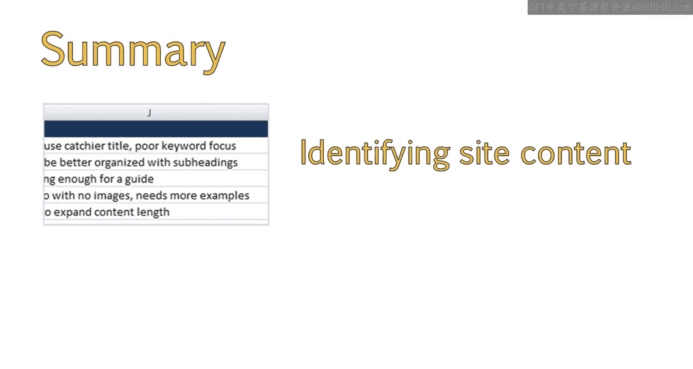
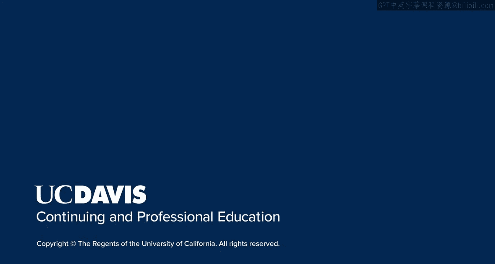

# 074：UCD《搜索引擎优化（谷歌、SEO基础、优化网站、进阶、毕业项目）｜Search Engine Optimization》中英字幕 p74 18_内容组织与评估.zh_en -BV1N66VYsEue_p74-

Hello again。As you have learned， the internal Con audit can uncover valuable information about how you can improve the content on your website。

In this lesson， we'll start to work with the content we have we'll discuss the steps you need to take in order to organize your content for maximum efficiency and you'll know how to identify content on your site。

To start with， I will create an Excel spreadsheet that allows me to keep notes of areas I want to pay particular attention to。

I will then go through each page listed in analytics。Analyze the page in question。

And add it to my Excel file， along with some notes about the page， which I can then reference later。

You can make whatever notes help you to track your content more efficiently。

Or you can adopt my evaluation style。I like to track the URL of the page I'm referencing so I can quickly go back to that page at a later date if needed。

I also note the seasonality， content type， and more。

Let's go over each of these areas in detail so you can understand what I'm tracking and why noting the seasonality of a resource allows me to reference that content more frequently certain times of the year。

For example， if I have a lot of resources related to a specific holiday。

I could create a new blog post each holiday， referencing some top content from past posts related to that holiday。

This will continue to drive traffic to those older posts and ensure search engine bots recallcra these past posts。

Alternatively， this may make you aware of content that is outdated and should either be updated or removed entirely。

It's also a good idea to note the type of content you are looking at。For example。

 is this a text post， an infographic， a video or something else？For resources like infographics。

 it's a good idea to revisit these on occasion and reach out to new sites or blogs that may be interested in republishing the infographic with a link back to your site。

😊，If it's a text post with no images， you now know that you can go back to that post and add more resources like images to improve the content。

It's also a good idea to note down whether or not there are any internal links。

This allows you to go back through and add links as needed。

It's a good idea to note down both internal and external links。

 as this can be beneficial to optimizing the page。Internal links。

 let search engines know that you consider the content important enough to link to。

This also helps bo crawl the page more frequently。External links provide more value to users。

 making your page more likely to rank well in search。Also， note down the post type or category。

This is different from the content type， where we are noting whether or not the resource text。

 image or video。This allows us to keep a note of the type of post or category a resource belongs to。

For example， if I end up with a lot of how to posts。

 I might want to make a single poster page highlighting all how to topics。

This will aid in discoverability and draw more traffic to those resources。

Keep track of how you are targeting your audience。This is what the column target in my spreadsheet refers to。

This column references how I am targeting my audience， whether it's through direct keywords。

 for example， posts about renting textbooks。Or indirect methods。For example。

 a post about college living on a budget which doesn't directly relate to my products。

 but will still attract the type of audience I am looking for。

The next area I look for is whether or not the post or resource contains a call to action。

By including a call to action， consumers visiting your site are more likely to perform that action。😊。

Even something as simple as including a button to sign up for a newsletter could be considered a call to action for that page。

Each page should contain a call to action that helps support your business goals。

The call to action doesn't always need to be the same， or be loud and obnoxious。

It can take the place of a helpful hint within your content。

Going through your content and ensuring some form of call to action is included can significantly boost conversion rates within your site。

Based on my initial findings here， all of these posts need to have a call to action。

Some need images and better internal linking。We can make these updates。

 which will also update the content so it is no longer seen as stale by search engines。

It would also be a good idea to add these updated posts to our social media calendar so this old content can be recycled and rediscovered by users。

I would keep going until I have a good amount of posts on this sheet。For large sites。

 this is an ongoing project where you might want to look at a couple different pages each month。

You can then do the same for pages with high bounce rate。Or if the site is tracking conversions。

 a good idea is to look at low converting pages to see how they can be improved。😊。

As you discover more content， you can look at pages outside of organic lending pages to see what might need a little push to get discovered by search engines。

You should now have an understanding of how to identify content on your site and how to organize that content efficiently。

