# 076：UCD《搜索引擎优化（谷歌、SEO基础、优化网站、进阶、毕业项目）｜Search Engine Optimization》中英字幕 p76 20_域名级内容策略.zh_en -BV1N66VYsEue_p76-

Hello， again。In the last lesson， we discussed content strategy and why it's important to create that strategy at the domain or site level rather than the page level。

In this lesson， we'll dive into the nuts and bolts of developing a strong content strategy。

We'll also discuss the importance of having a core theme and the need to develop a strong brand。

These are important concepts， so let's get started。While on page optimization is very important。

Google's algorithm has evolved to where it can look at websites from a whole picture perspective。

 rather than a primary focus of page level signals。

While individual pages on your website are what rank。

The content of your site contributes to your website's overall theme and authority around a particular subject。

This improves the Seo of your entire site。By including different types of useful and engaging content centered around a core theme or purpose。

😊，You are increasing opportunities that content has to get discovered。

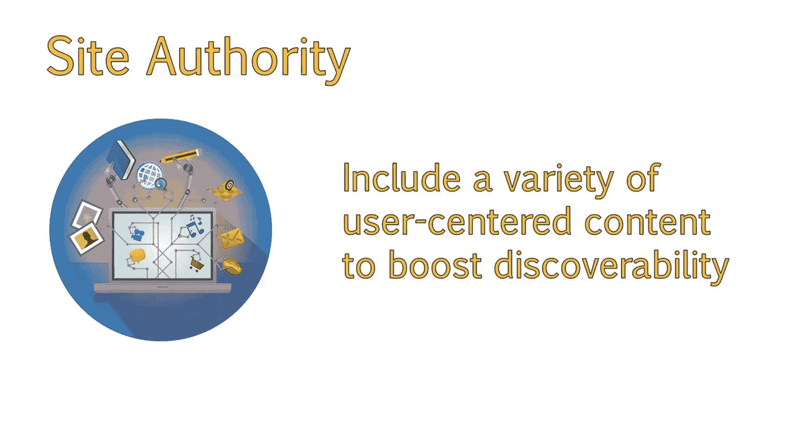

In addition to having your constant organized around a central theme。

It's also a good idea to devote time into developing your brand。

Having a strong brand presence is important to a successful content strategy。Eric Schmidt。

 a former CEO of Google， has been quoted as saying。Brands are the solution， not the problem。

 Brands are how you sort out the cespo。

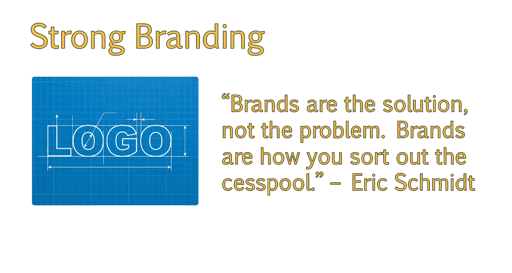

Strong branding adds legitimacy to your website。And is a strong signal to search engines that your site is trustworthy。

 Let's review some examples of how a strong brand and well developed content strategy can help your site in organic search。

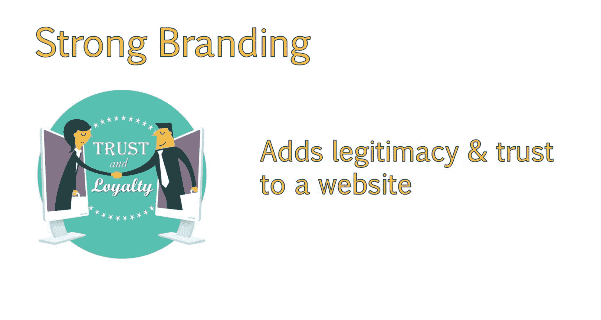

Google has created an algorithm that understands the answer you're trying to obtain。

Even if a web page is not optimized around those exact keywords related to your question。For example。

 in this search， I typed what is Doctor Whos Fo booth called。

 and the results show me that it is called a tarts。

But there really are a couple things going on here。

Notice that Wikipedia takes up the first two results of a page。

They have very strong brand signals and have developed quality content dedicated to answering people's questions。

The first result is actually the best answer for my search query。But if you visit this page。

 you'll notice that it does not actually contain the word phone booth anywhere in the content。

So Google was able to determine that the answer to my question was a TtIS based on the content on the page and the content it linked to。

Which you can see as the blue links underneath the meta description。In the second result。

 Google has determined that what I really meant is police box and not a phone booth。

Google can understand the similarities between these two words。And supply correct information。

The third result is a link to a site dedicated to Doctor。 Hu。

This has very strong brand signals because all of the site's content is focused around the theme of Doctor Who。

If I were to simply type in Doctor Ho Tdis， the site dedicated to Doctor Who is ranking higher than previous searches。

I notice in my searches that this site will tend to move between position 1 and2。

This site has more authority on Doctor who as a whole rather than other sites for that specific query。

This is because the entire site has content dedicated to Doctor Hu。

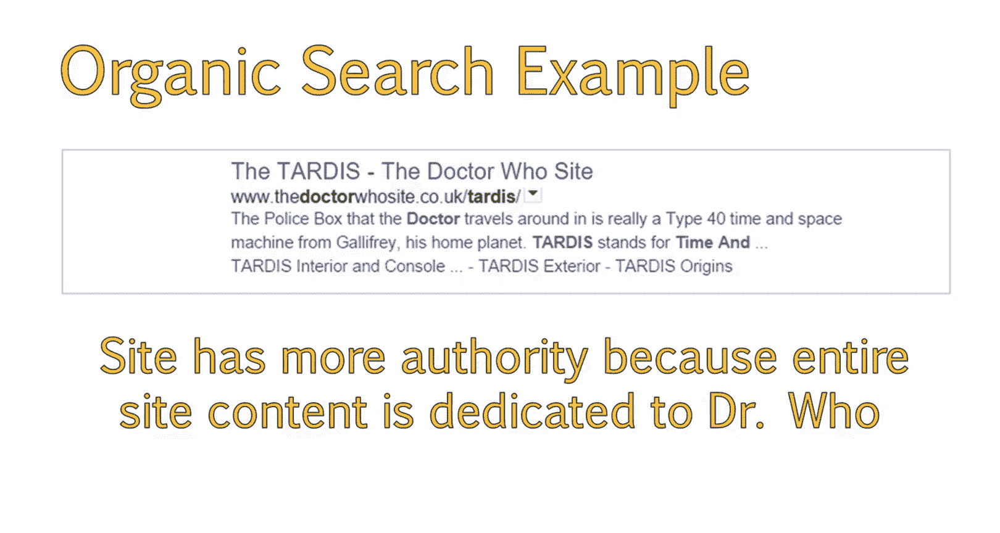

So， knowing this。It's important to ensure our site has pages dedicated to a central theme。

And that each of these pages are unique and useful to users。In addition。

 these pages should be linked together so users can easily find the answers they are looking for。

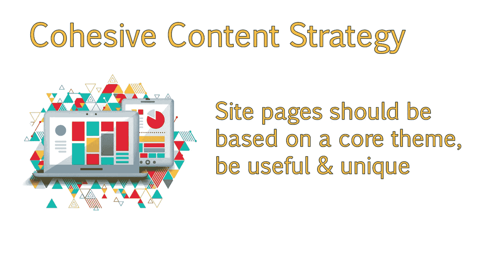

This will also increase site engagement metrics and lower bounce rate。

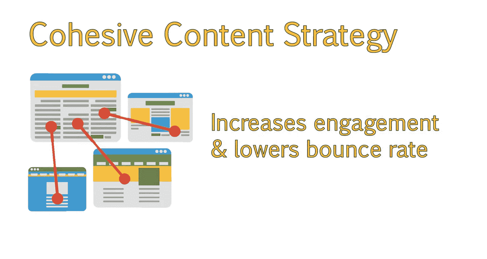

For example。Say you were browsing a page about the tarts and saw it mention Doctor who。Well。

 a good idea would be to have that anchor text linked to a page about the doctor。

That page may mention other characters， so it's a good idea to link to them where they're mentioned。

😊，And then those pages might reference a particular season they were in。

 which might reference particular episodes within that season。

This creates a cohesive content strategy for the domain。

Pvides users with the information they are looking for。

And get some interacting with other pages on your site。Keep in mind。

 you will still need to have site navigation with a clear hierarchy。

This is just a specific example of how articles can link out to one another。

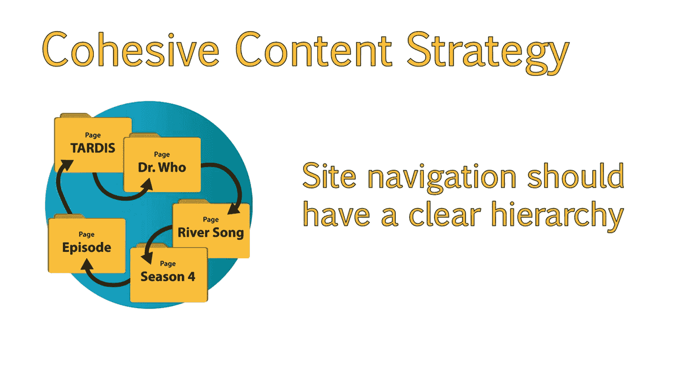

A good domain wide content strategy will take into account blog content as well as static pages on your site。

For many people， once your initial SEOo strategy and keywords are in place。

You will mostly be focusing on your blog for developing new content ideas。Where possible。

 blog topics and static pages should link to one another。For example， if you developed an FAQ page。

 you might provide a short answer to a question。

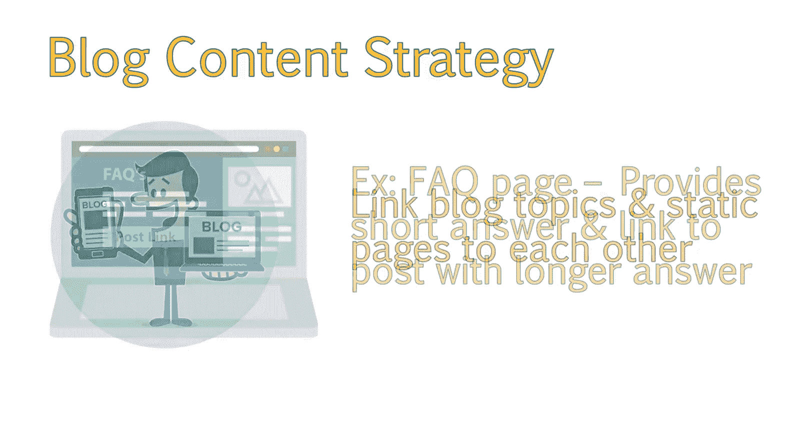

And then link to a post that has a longer， more detailed answer。

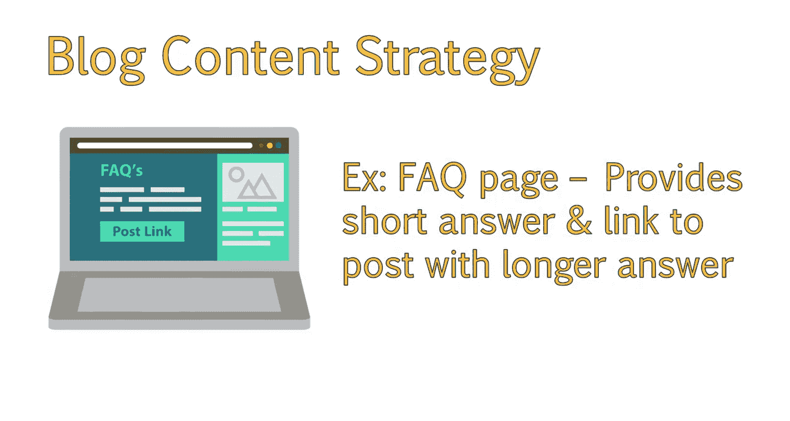

If you are writing a blog post。It's a good idea to link back to related areas of your site where applicable。

Especially deeper level pages that aren't as easily discovered by search engines or users。

For example， if you were writing a post about the subject of history。

Then it would be a great idea to link to your page about history， textbooks。

Since I work with a lot of clients in real estate， one of my common suggestions is to write posts around areas they service。

For example， a realtor focusing on locations around the Sacramento area。

Might want to write about the best neighborhoods in Sacramento and link to real estate pages for those neighborhoods。

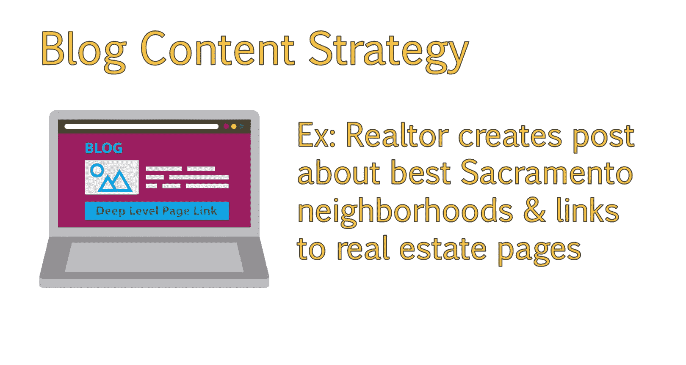

In conclusion， when developing a content strategy for your website。

It helps to have a strong brand， which will lend credibility to your site。

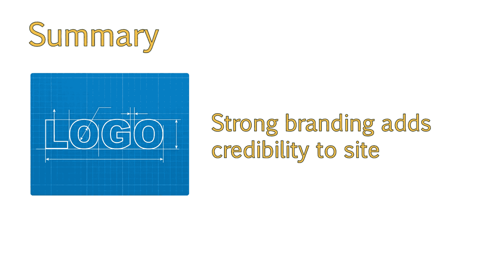

Make sure your content is devoted to a central theme and link related pieces of content to one another。

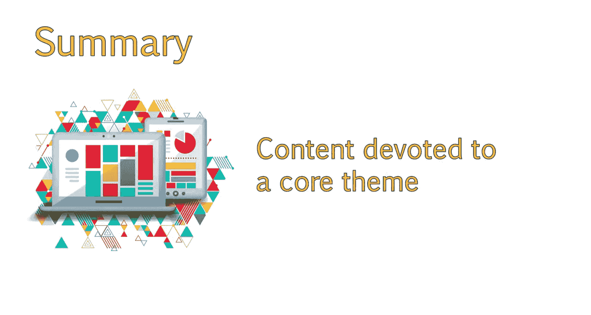

By doing this， you are increasing your authority around that topic while contributing to increased user engagement on your site。

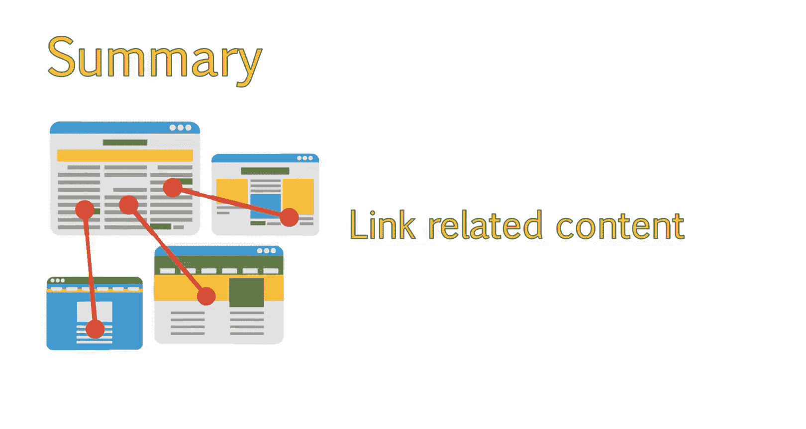