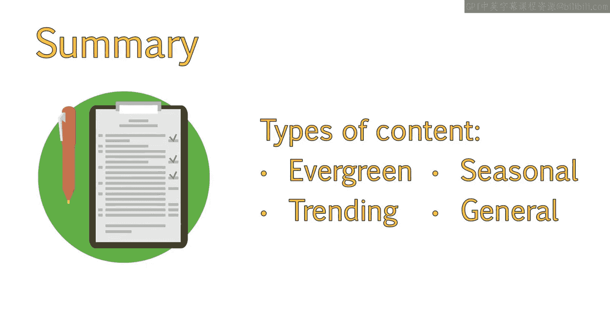

# 078：UCD《搜索引擎优化（谷歌、SEO基础、优化网站、进阶、毕业项目）｜Search Engine Optimization》中英字幕 p78 22_内容类型及其应用方法.zh_en -BV1N66VYsEue_p78-

Hello， in the last lesson， we reviewed what makes content great at a high level。

You'll learn how content that inspires action relates to larger business goals。In this lesson。

 we'll review content in more detail。You will learn about different content types and how to incorporate each type into an overall content strategy。

Something to consider when creating content is the lifetime value of your content。

There are four types of content you can create。Evergreen content。

 which is content that will always be useful regardless of the season， date or other factors。

Eventually， this may expire， but it will generally take a long time to do so。Trenending content。

 which is content that takes advantage of a trending topic or news story。Seasonal content。

 which relates to a specific season， time of year or holiday。😊，General content。

 which is content that is currently relevant and will be so for a while， regardless of the season。

But is likely to be out of date within a year or two。

All of these types of content have their place in your content and Seo strategy。

Evergreen content is great for Se O， as this will be around a while。

 building up a lot of authority and links。😊，While still remaining relevant years down the road。

Because of this， it content tend to rank higher than other forms of content。

Evergreen content should always be closely aligned with your audience and services。

While the content is evergreen。You should still update it on occasion to help boost the freshness of the content。

This way it gets re crawled and indexed on a regular basis。To help ensure your content is evergreen。

You should avoid mentioning things， like specific dates。

As this will quickly make your content appear old， even if the topic is still relevant。

You should avoid references to current news stories。

You should avoid references to technology as this changes rapidly。For example。

 a guide on the best laptop to buy is likely going to be out of date in six months to a year。

 if not sooner。Trending content is also great for Seo。😊。

Trding content takes advantage of a part of the Google algorithm referred to as QDF。

 or queryry deserves freshness。If a topic is trending。

 then that likely means something interesting just happened to cause so many people to begin searching for the same thing at the same time。

Due to this， existing content on that topic might not be as relevant to what those users are searching for at this moment。

Chances are they are looking for information related to whatever event just occurred。

Content published directly before or during the trend searches。

Is more likely to be relevant to what the search engine users are seeking at that time。

So this content is likely to rank much higher than a post which has been around for a while gaining authority。

This type of content can be difficult to write post for。

You need someone dedicated to looking at trending topics and then trying to find a way to relate that topic to your brand goals。

If the topic doesn't somehow tie into your services。Then it will not be useful to users。

 and they are unlikely to return。One of the main reasons to take advantage of trending topics is to get your site in front of a larger。

 newer audience。But doing so won't be helpful unless that audience finds your site useful and will return later。

Another type of trending content。Isn't about taking advantage of quick， trending， newsworthy stories。

But trends that tend to last a longer period of time。

Two examples that come to mind are bacon and zombies。

These are no longer trending as much as they were a while ago。 But for a while。

 you couldn't look at your Facebook feed without seeing something about bacon。

 whether it be a meme or product or just a post。While these aren't the types of trends that will help you rank higher through QDF。

These trends have a lot of shareability。Coming up with a clever way to use these trends。

While still making it relevant to your brand is a great strategy。😊。

Just make sure it aligns with your brand voice。For example。

 if you are a more serious brand in the financial sector。

Your customers might think it a little odd if you suddenly start posting about bacon。

Seasonal content can be slightly related to trending topics。

 especially as more people are likely to search for seasonal or holiday related topics。

For these types of searches， it is a good idea to brainstorm the type of content you want to create in advance。

And then begin publishing these posts a few weeks before it becomes relevant。

And then continue publishing posts throughout the whole season。

By publishing a small amount of time before the season or holiday rush begins。

The posts will already be indexed and potentially ranking for relevant keywords by the time users begin searching。

Also， keep in mind when the topic will become relevant。For example。

 a Christmas related post will definitely become relevant around Christmas。😊。

But depending on the content。Let's say Christmas tree decorating tips， for example。

This might start to get search volume in early November， maybe even earlier than that。

The last type of content is your general content。Which isn't trending。

 particularly evergreen or seasonal in nature。Chances are the majority of your posts will be this type of content。

Like other types of posts， you should always have some sort of call to action in sharing capabilities。

To ensure these spread in social channels and among friends and family。

There are also certain types of posts， which tend to be shared more and linked to more frequently than others。

I would save one of these formats for when you have a topic， you think is particularly shareworthy。

Example post formats include list posts like top 10 books to read before you die。How to posts。

These should be in more depth and provide a lot of detail on how to do or make a particular thing。

For example， how to cut your own hair。Interviews。You can interview someone in your industry or someone famous who happens to use your product。

Checklists。For example， checklist for auditing your content strategy。Case studies and white papers。

These are more on the B2 B side， but are great resources to have。

Now that you have a better understanding of the types of content that can help your site succeed。

You can better audit and improve your existing content strategy。

