# 搜索引擎优化：079：创建有影响力的内容 📝

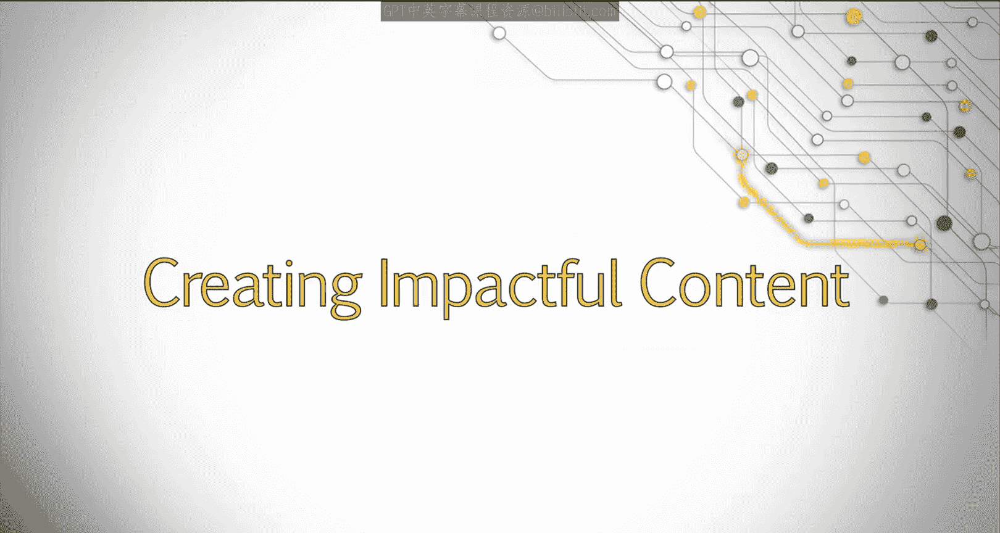

在本节课中，我们将学习如何创建对用户和搜索引擎都有价值的优秀内容。我们将探讨如何发现用户需求，并围绕这些需求来规划和制作内容。

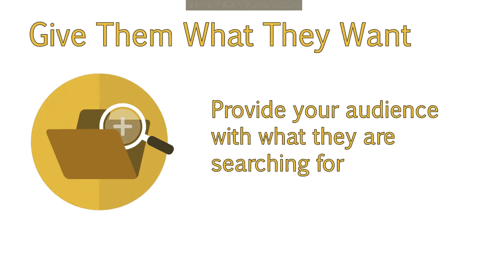

---

## 如何创建优秀内容？ 🎯

创建优秀内容的核心方法是：**找出你的受众正在寻找什么，然后提供给他们**。

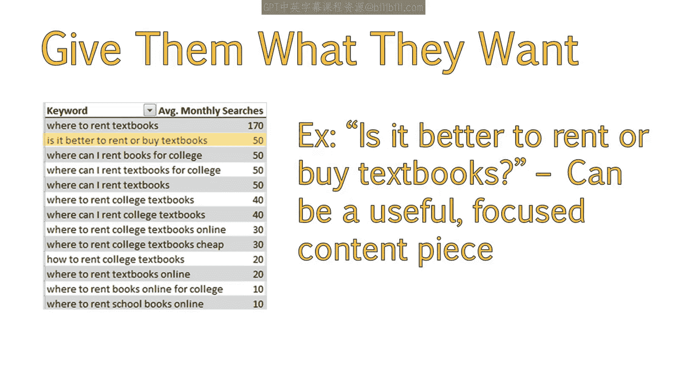

例如，在我们分析“教科书租赁”相关的关键词时，我们发现了一些用户正在提出的问题。他们正在寻找能够回答这些问题的具体内容。

当然，并非所有问题都适合用来创建内容。但有些问题，比如“**租教科书好还是买教科书好？**”，不仅是非常好的内容主题，而且紧密围绕着一个有实际搜索量的查询。

---

## 关注搜索引擎结果页功能 🔍

另一个需要注意的方面是，谷歌在搜索结果中直接提供答案的功能，例如“**People also ask**”（用户还问了）的问答框。在我查看与“Ttus”相关的搜索结果示例时，就出现了这个框。

围绕一个主题建立强大的品牌聚焦，会增加你的网站在答案框或这些额外区域中显示的机会。我们之前查看过的那位医生的网站，不仅在一个查询中排名第一，还因为他们专注于相关内容，从而获得了在答案框中展示的另一个机会。

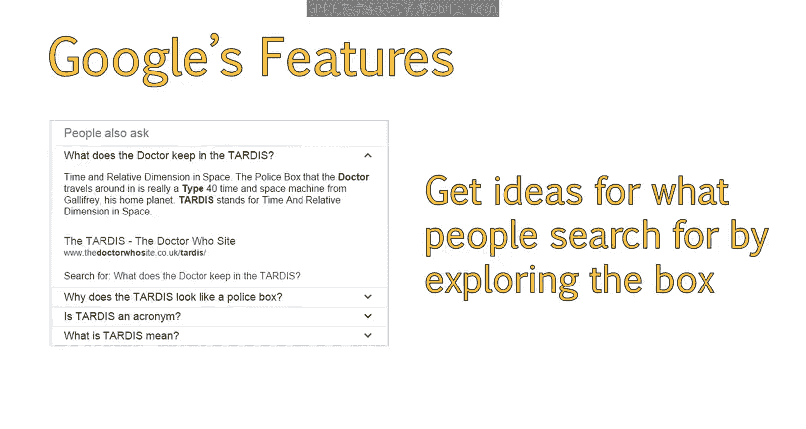

你还可以通过探索搜索框来获取人们正在搜索的内容灵感。例如，你可以点击“医生在TtIS中保留了什么”。这可能是你页面上可以包含的额外内容，或者可以围绕它开发一个新页面。

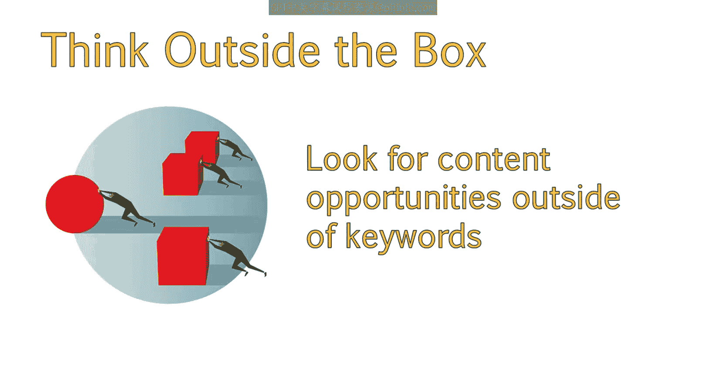

---

## 超越关键词的内容机会 💡

需要指出的是，你并不总是必须围绕一个关键词来创建内容。事实上，你也应该寻找关键词之外的绝佳内容机会。

找出目标受众的痛点、他们提出的问题，以及你如何能帮助解决他们的疑问，这将帮助你为用户提供有用的内容。此外，这类内容很可能自然地吸引各种长尾关键词，并且由于其有用性，可能会被更频繁地分享。

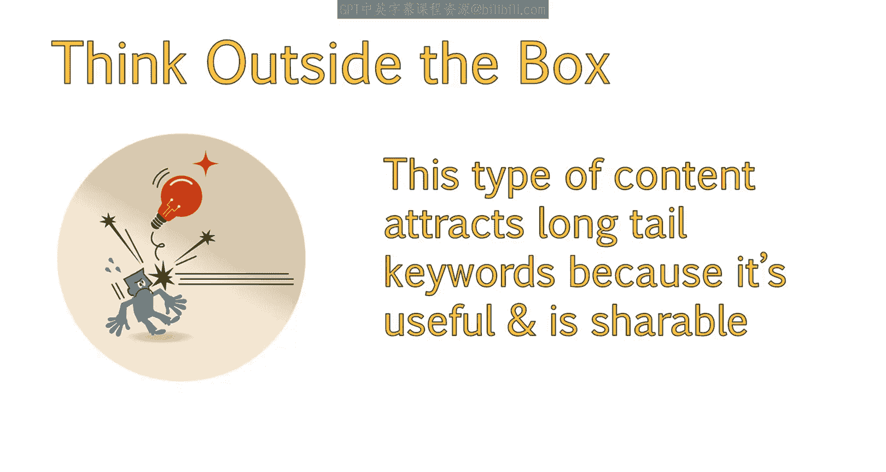

接下来，我们来看看一些可以发现用户正在经历的问题或他们正在寻找答案的方法。

---

## 利用问答网站寻找灵感 💬

问答网站是头脑风暴潜在内容机会的绝佳资源。

例如，**Quora** 就是一个很好的资源。在这个例子中，我输入了“textbooks”（教科书），已经得到了一些关于潜在博客文章或文章的创意想法。

*   “教科书的未来是什么？”会很有趣，考虑到越来越多的书籍正在转向数字格式。这篇文章可以让我们突出展示我们拥有的任何数字教科书产品。
*   顺着这个思路，我们可能还想创建一篇关于“教科书历史”的文章，并找出一些人们可以分享的趣闻。
*   第三个问题具体涉及计算机科学书籍，但在更广泛的背景下也适用。“提供教育价值的优秀小说书单”可能是一篇很棒的文章。
*   “阅读教科书的有效方法是什么？”这个问题让我想到，像“**快速学习的顶级教科书技巧**”这样的文章也会非常有效。

仅仅一次搜索就给了我四个内容创意，我可以花更多时间浏览该网站上的其他问题和答案，以获取更多想法。

---

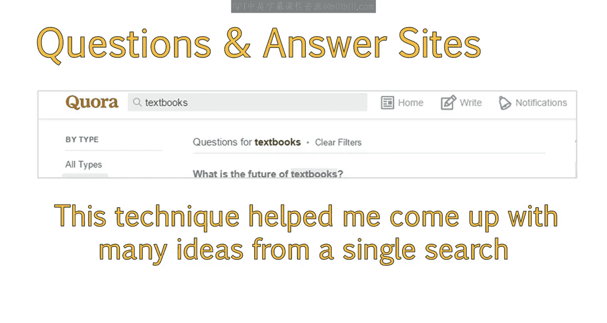

## 分析热门分享内容 📈

另一个我喜欢的网站是 **Buzzsumo**，它按主题或域名为你提供分享最多的内容。

这个工具很好用，因为你可以看到哪些内容创意非常值得分享。在这个例子中，我输入了“textbooks”，得到了一些非常棒的想法。

我们可以看到，除了新闻项目，列表类型的帖子（如“46张罕见照片”和“8个不可思议的发现”）表现得非常好。

由于这个网站也允许你检查特定域名，我检查了另一个教科书租赁网站 **Chegg.com**，以查看在该网站上哪些类型的内容被分享得最多。在这种情况下，我可以看到竞赛类内容以及列表式帖子在这个受众群体中往往表现非常好。

---

## 探索其他社交平台与数据 🗣️

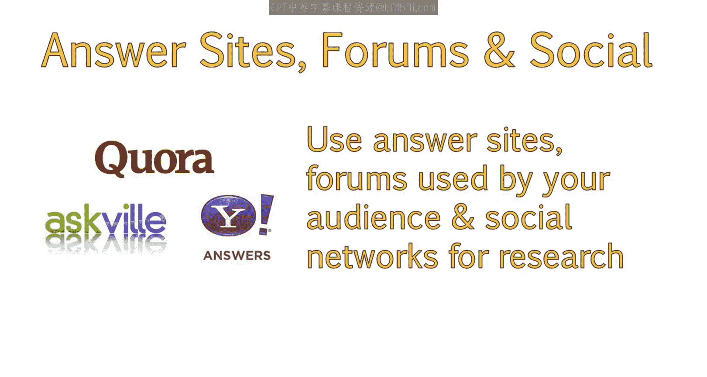

你还可以查看 **Yahoo Answers**、你的受众可能聚集的论坛以及社交网络。

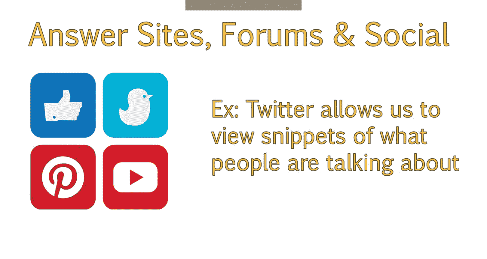

*   **Twitter**：允许你看到人们正在谈论的简短片段。如果你搜索“textbooks”，你会看到一个共同的主题：人们表达对教科书价格的负面看法。讨论“租赁比购买更实惠”可能会触及这类用户。
*   **Facebook**：往往有很多与教科书中新闻相关的趋势话题，你可以加以利用。
*   **Pinterest**：通过链接到关于“廉价教科书”的博客文章，印证了许多我们所知的痛点。但它也提供了很好的文章创意，比如“如何创建学习指南”。

---

## 利用网站分析数据 📊

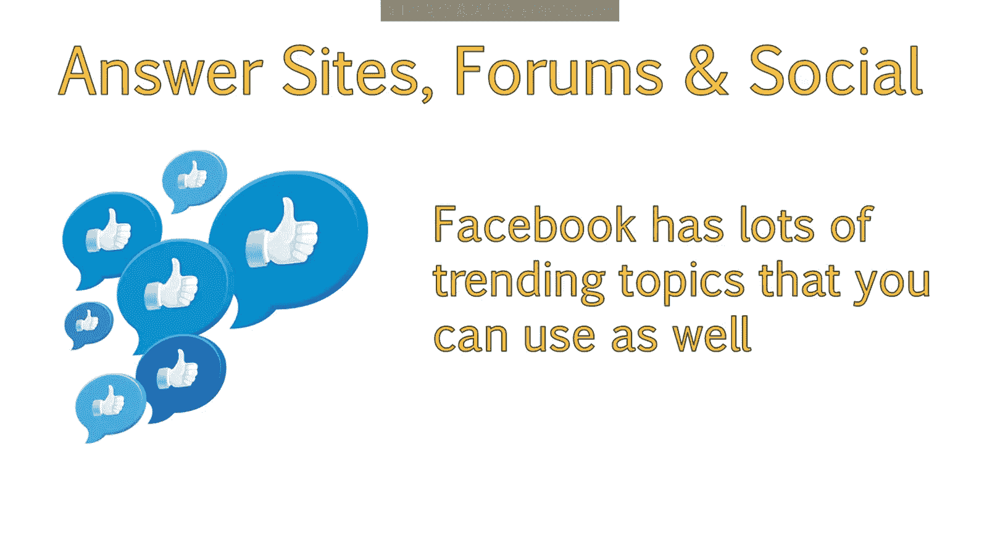

此外，请务必查看你的 **Google Analytics**（谷歌分析）。虽然很多关键词数据已经消失，但启用网站搜索功能可以让你深入了解用户在你的网站上试图寻找哪些你可能没有相关内容的主题。

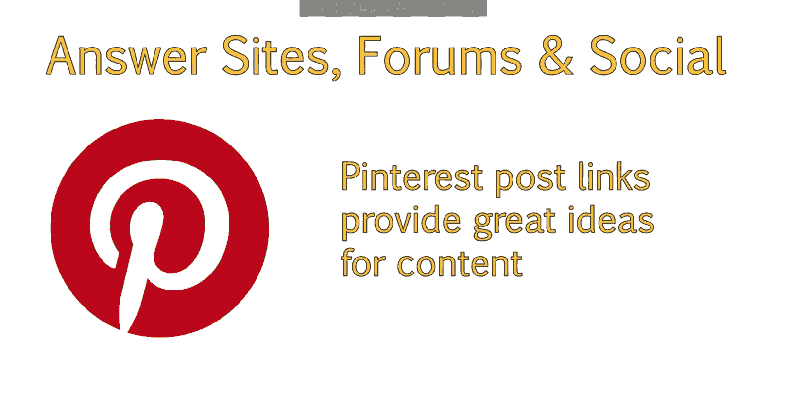

---

## 总结 📋

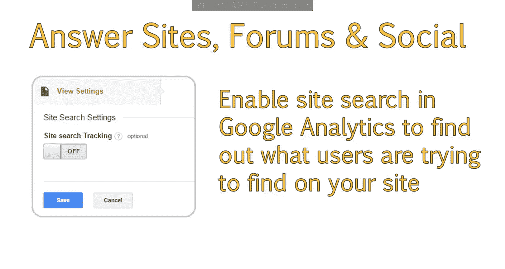

本节课中，我们一起学习了如何系统地创建有影响力的内容。关键在于**从用户需求出发**，而非仅仅围绕关键词。我们探讨了多种发现内容灵感的方法：利用搜索引擎功能（如“People also ask”）、问答网站（如Quora）、内容分析工具（如Buzzsumo）、社交媒体平台（如Twitter、Facebook、Pinterest）以及网站分析数据（如Google Analytics）。通过结合这些方法，你可以更全面地了解受众，并创造出既满足用户需求、又易于被分享和发现的优秀内容。