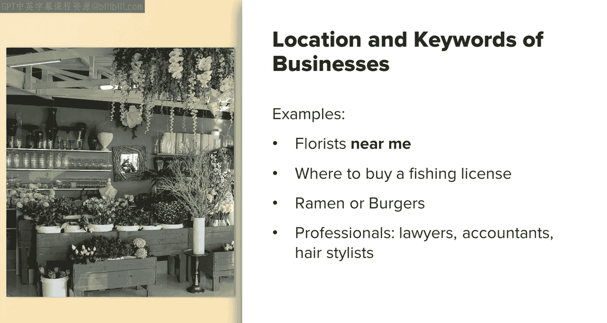
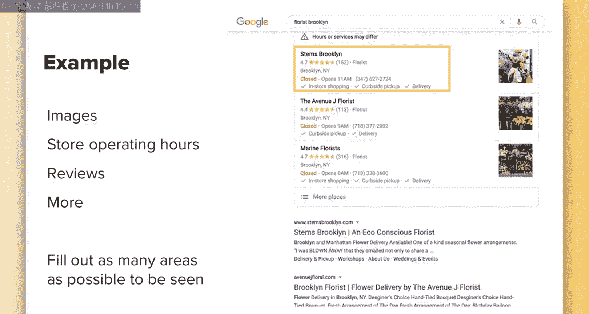
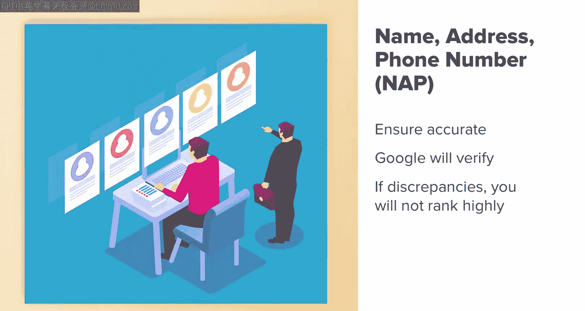
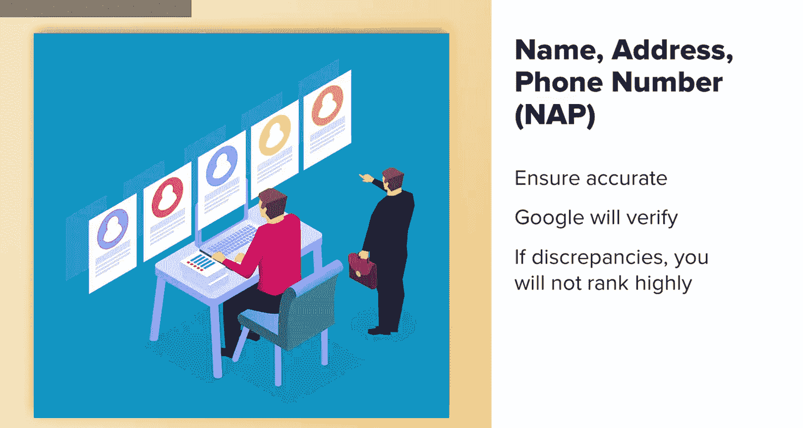

# 080：UCD《搜索引擎优化（谷歌、SEO基础、优化网站、进阶、毕业项目）｜Search Engine Optimization》中英字幕 p80 24_本地SEO 第一部分.zh_en -BV1N66VYsEue_p80-

Hi there。 Let's discuss local Seo。 We will cover what local Se is。

 how it is both similar to and different from regular SEOo tactics and some local Seo best practices。

Let's start out by defining what local SEO is。Local SEOo is the act of optimizing your website and any relevant business listings。

 This would be something like Google My business so that they appear for search queries related to the location of your business and relevant keywords。

Some examples of potential searches that would be identified as local SEO searches would be something like florists near me。

Where to buy a fishing license or a coat， whatever you're looking for near you。

Um just something like a food in particular， like ramen or burgers。

 just that word alone will generally trigger local search results。And also a profession。

 something like tax accountants， lawyers， many professions without any other keywords。

 so you don't even need to type your city name a lot of the time will return local search results as well。

As you can see from these examples， local SEO includes a lot of search queries and types of searches for local SEO。

 you generally will add location specific keywords to your search results。

 such as the city name or the phrase near me， but Google's become really advanced and is able to recognize your intent of searching and that the intent is probably local without necessarily having to add these extra words。

Now let's quickly cover Google my business。This is really closely related to local search。

 Google My business is a place Google has reserved for businesses to add their business listing and information so that this will then appear in the map。

 as well as what stubed the local search box。 Oftentimes these are now integrated into one listing。

 as you can see in this example， where we search for Taylor， Austin， Texas。

 and it has both a map and local search result listings。

In addition to giving your business the opportunity to appear in the map and local search results。

 Google My business has a host of other features。 Google is constantly adding and changing features。

 So this isn't a definite list and may change by the time you read this。

 Some examples of current features they have are the ability for users to leave reviews。

The ability for you to add the opening hours for your business。

Google will identify busy times and they do this for you based on how many people are on a certain device in your proximity within a certain time。

 you can add products that you sell， you or business can add posts and announcements。

 you have a Q&A section where customers can ask questions about your business or services and you can answer those and you can also add a variety of images around your shop。

 products and more。Now it's important to note， Google is constantly changing Google My business pages as well as how local search performs and functions。

This relates to how things appear in search， new features they' adding or removing and more。

Because Google is constantly testing local search results to see what works best and what features both paid or organic can be added。

 the appearance of results can change over time， so they may not always align with what you're seeing here now。

 but the concept of what you need to do for local SEL will remain the same。

So it's really almost impossible to include specific examples that remain relevant。

 but when looking at my examples， just don't be alarmed if they look different than what you see live。

 or if there are new features or some of them aren't there for the ease of learning due to this rapidly changing environment。

 I'm keeping this more at a high level and covering the best practices that will stand the test of time and help you succeed in the space。

With local SEOo， your goal is to acquire as much visibility as possible。 you can do this in two ways。

 The first way is through what's called the local pack。

 which is that list of local businesses sometimes with the map that appears at the very top of organic search results and then the second is in organic search results themselves。

 so you can see in this example there's this business that is ranking in both the local pack and in the first position of organic results。

 So being able to do this really allows you to take up more real estate on page1 and that can push competing sites and pages off of the page so you get more visibility。

Now in order to appear in both the local search pack and organic listings。

This will involve optimizing both your Google My business listing and optimizing your website with local search in mind。

The first step， if you don't already have one， is to grab your free Google My business listing。

 All you need to do is sign up and verify your business with Google。

These are free and you can just sign up at the link included in the reference notes。

The process of signing up is pretty self explanatory。

But do note that you will need some way to verify your actual physical presence before Google will launch your page。

Generally， this is done through a phone call or a postcard mailed to the physical address。

Once you have your Google My business listing set up。

 this will enable customers to better discover you and find out more about your business。

 you'll also be able to rank in the local pack as shown before。

 and if a user clicks on your local search results。

 they'll be taken to a map that shows a lot of the extra detail from products and reviews to more。

I'll go over an example here of the example of Brooklyn florist we saw in the previous search pack if I click onto that result and go to the business the Google Business page on Mas。

 we can see a lot of different features that they've added here from images to store opening hours。

 reviews and more。To help your business appear in these searches。

 it's best practice to make sure all of the information you have available to you is included in your Google My business listing。

 fill out as many areas as possible， the most important areas are your address， your opening hours。

 images of your store and social media and website links。

Now when you add your contact information I'm referring to this as NA or name。

 address and phone number it's critical to ensure that these are accurate What Google will do is verify that you are a legitimate business by checking for relevant existing addresses and phone numbers related to your business online so it will cross reference online mentions of your business with the data you provided。

If there are a lot of discrepancies with information found on your website。

 other business listings around the web， and your Google My business listing。

 this will impact your ability to rank highly。If you have outdated business information around the web。

 it's a really good idea to go back and correct it and make sure everything reflects the same business name。

 physical address and phone number。 and that way Google will know that your legitimate business。

 this is actually where customers can find you， and that'll help you rank better。

