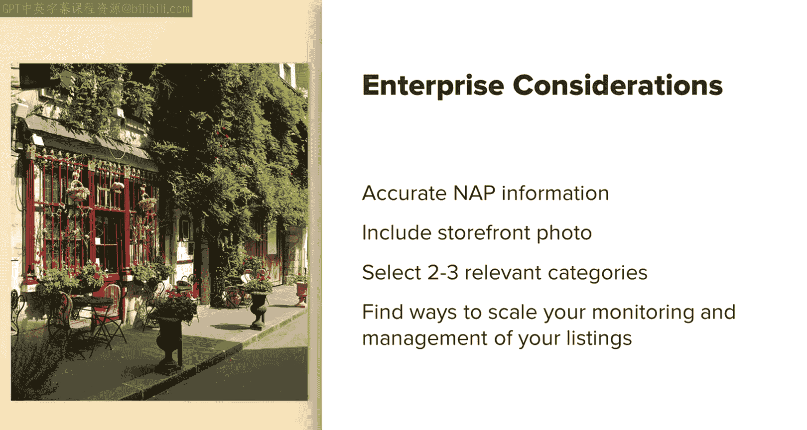

# 搜索引擎优化（谷歌、SEO基础、优化网站、进阶、毕业项目）：081：本地SEO 第二部分 🏪

在本节课中，我们将继续探讨本地SEO的核心策略，重点学习如何通过鼓励用户评价、管理企业信息、优化网站以及赋能团队来提升本地搜索排名和在线可见性。

---

上一节我们介绍了Google My Business（GMB）的基础设置与优化。本节中，我们来看看如何通过用户评价、链接引证以及团队协作来进一步强化你的本地SEO表现。

## 鼓励用户评价 📝

鼓励用户为你的企业留下评价至关重要。评价是本地搜索中企业需要关注的最重要领域之一。评价能帮助你的企业列表脱颖而出，因为每个列表上醒目的评价星级可以显著提高点击率。人们看到这些星级后，更愿意点击查看。

评价还能向谷歌表明你是一家合法企业，为潜在顾客提供社会认同证明，并帮助你获得更高排名。尤其是在用户按“评分最高”进行筛选时（这是非常常见的操作），评价的作用更为明显。此外，评价有助于回答顾客可能存在的疑问，减少不必要的电话或邮件咨询，从而为你节省大量时间。

除了上述好处，还需注意以下数据：63%的消费者在访问一家企业前会查看谷歌上的评价。目前，谷歌占据了所有在线评价57.5%的份额，这意味着人们通常会在谷歌上留下评价，然后才考虑其他平台。

根据研究，主动请求评价非常重要。主动请求评价的企业平均评分（约4.34星）高于那些只等待自发评价的企业（平均约3.89星）。向顾客索要谷歌评价往往能产生更高比例的五星评价，并且这些评价随时间推移更可能保持稳定。相反，自发评价随时间推移，一星评价的比例往往会增加，导致你的总体评分下降。如果你想查看这项研究，参考资料中附有链接。

请注意，虽然获取评价对本地搜索中的商业成功至关重要，但你必须谨慎选择鼓励评价的方式。如果谷歌发现你提供折扣或物品以换取评价，你所有的评价都可能被删除，甚至你的Google My Business列表也可能被禁止或受到更严厉的处罚。参考资料中包含了一些关于谷歌征集评价的规则链接，请确保遵循其最佳实践。重要的是，不要出现以免费产品、折扣、服务等任何形式换取评价的行为。

## 管理评价与问答 💬

请记住，要关注评价质量，对**所有评价（无论是正面还是负面）**进行回复非常重要。作为企业，你无法删除负面评价，只有顾客可以修改或移除他们的评价。因此，如果你能回应顾客并帮助改善他们的体验，之后可以跟进并请他们修改评价。如果你认为收到了来自竞争对手或其他人的虚假评价，可以标记它，供谷歌考虑移除。如果你确信某个评价违反了谷歌的评价政策，也应确保将其标记，以便谷歌知晓并可能将其移除。

所有Google My Business页面都有一个“问答”功能，允许公众向企业提问。这些问题和答案会被添加到你的资料中并公开可见。问题或回复是否有助于提升排名尚有争议，但无论如何，及时回应任何提问都是一个极佳的最佳实践。试想，如果你看到一家企业有很多人提问却无人回应，你还会想去吗？你也可以自己提问和回答问题，主动解答顾客可能有的疑问。

谷歌一直在测试一项功能，即通过人工智能，将问题中的关键词与你的评价中的关键词进行匹配来提供答案。例如，如果有人问“你们的菜单上有这道菜吗？”，而谷歌在评价中找到了“我真的很喜欢菜单上的这道菜”这样的表述，那么谷歌就会将该评价作为答案提供给提问者。这使得确保你拥有评价和产品信息源变得更加重要。

## 链接与引证 🔗

链接和引证对本地SEO很重要。回顾一些基础知识：**链接**是指一个网站链接到你的网站或你的Google My Business列表。**引证**是指提及你企业的信息，包括企业名称、可能还有地址和电话号码。

有一段时间，谷歌开始减少对引证的重视，但研究表明它们目前仍然有用。未来引证的重要性尚不明确，但目前请将其视为一项最佳实践，并努力跟上本地搜索的趋势。

## 企业级考量 🏢

有时企业是连锁店，在全国有很多分店，或者你只是需要管理很多不同的地点。对于拥有数百个地点的企业，管理Google My Business列表可能会变得非常繁重。确保所有地点的名称、地址和电话号码准确无误至关重要。

以下是管理多地点列表的一些关键步骤：

*   确保所有地点都包含店面照片。
*   在每个地点的资料中选择两到三个相关类别。
*   寻找可扩展的方式来监控和管理你的列表。

为此，可以使用一些企业级工具，如Moz Local、BrightLocal、GetFiveStars等，它们能帮助你大规模管理列表。这些工具会提醒你新的评价、问答，帮助你建立相关引证等。

## 赋能团队与制定计划 📅

在管理Google My Business列表时，牢记以下几点将真正帮助你取得成功：

为客服代表创建回复模板，他们可以在回应反馈时使用。鼓励客服代表根据需要定制回复，以免所有回复格式相同，显得不够真诚。你的客服团队应积极查看企业收到的评价并予以回应。此外，如果你的电话客服人员遇到满意的顾客，应鼓励这些顾客回到谷歌留下正面评价。因此，务必培训你的客服团队，并为他们创建模板，以便在各种情况下轻松回应。

接下来，你应该创建一个月度编辑日历，用于更新功能，例如添加新帖子、添加相关问答、回答相关问题、为企业添加新照片等。如果你有一个日历，清楚知道每周每天要做什么，就不必担心遗漏什么，因为可能有很多动态部分，很容易忘记某个特定功能。

同时，在企业内部，鼓励一种定期分析本地搜索空间和竞争的文化，以便你能主动应对任何问题。另一件事是培训你的团队创建引证。你也可以使用像Yelp和TripAdvisor这样的服务（它们通常不属于企业引证建设工具的一部分）来监控那里的评价，为你的企业添加引证等。因此，要真正依靠你的支持团队来帮助你完成这些工作。

## 网站优化与店内策略 🌐

以上主要直接讨论了Google My Business。我们不要忘记为优化你的外部网站所做的努力。

你应该确保你的网站包含诸如“门店查询”之类的功能，或其他方式来为你拥有的每个实体店展示一个着陆页。如果你只有一个地点和一个网站，那也没关系，只需确保有一个类似“找到我们”的页面，展示企业地址、电话号码和任何相关的联系信息。这应包括你拥有的每个Google My Business列表的完整联系信息，并且这些联系信息应使用**结构化数据标记**（例如从schema.org获取）进行适当标记。这将有助于确保谷歌理解这些信息与你企业的关联背景。例如，当它看到一个地址时，周围的标记语言会直接告诉谷歌这是一个地址，它能快速将其与你的Google My Business列表或正在搜索你企业特定信息的人匹配起来，从而帮助你在常规本地搜索结果中排名。

同时，确保将每个Google My Business列表链接到专门针对该地点的相应着陆页。这有助于增加信任和透明度，链接也有助于获得权威。

我们稍微讨论了一下客服团队，培训你的店内员工了解Google My Business的重要性也会带来更好的成功。确保所有面向公众的员工都了解Google My Business，并接受必要的培训，以帮助在店内实施品牌的客户服务政策，帮助回答顾客的常见问题或在需要时升级问题，这是一个好主意。店内员工应具备所需的能力和资源，在投诉变成网上的负面评价之前解决它们，或者帮助创造真正积极的体验，鼓励网上的好评。

对于店内策略，你还可以安装标牌和其他材料，引导消费者投诉到现场团队或帮助热线，这样投诉就不会直接发布到谷歌上留下差评。你也可以告诉员工，例如，如果客服代表感觉到顾客心情很好，觉得他们有了非常积极的体验，可以在顾客离开商店时鼓励他们：“嘿，别忘了去谷歌上给我们评价。”因此，要培训员工发现那些愿意留下正面评价的顾客的机会，并记住始终要求他们这样做。

## 本地公关与社交媒体 📱

还有本地公关机会，这可能更适用于企业级业务，但与所有本地企业都高度相关。确保你的商店（或者如果你是 enterprise level，确保每家商店）在社区中都有本地足迹，本地公关可以帮助提升品牌形象，并在你合作活动或赞助某事时帮助优化你的Google My Business列表。例如，尽量让你赞助的企业链接到你的网站或你的Google My Business列表，因为这将有助于为该列表增加权威。

你应该做的是授权每家本地商店建立这种本地足迹，并为它们提供赞助、举办本地研讨会、会议或聚会等所需的资源，选择与你的本地业务最相关的活动。同时，不要忽视社交媒体。

你应该确保负责单个地点或企业客户多个地点的社交媒体运营的社交媒体经理，了解Google My Business及其提供的价值。培训你的社交媒体经理在负面讨论变成网上的负面评价之前解决投诉或任何负面讨论。培训他们处理正面评价，并鼓励人们在谷歌上留下评价，同时培训他们告诉顾客如何操作。你可以激活社交聆听，以很好地了解整体情绪，并在机会出现时帮助发现积极或消极的机会。市面上有很多社交聆听工具，我没有特别推荐的一款，但这些工具确实很好，尤其对本地企业而言。

---

本节课中我们一起学习了Google My Business列表的深层优化策略。我们探讨了用户评价的重要性与管理方法，了解了链接和引证的作用，并研究了针对多地点企业的管理策略。我们还学习了如何通过赋能团队、优化网站、制定计划以及利用本地公关和社交媒体来全面提升本地搜索的在线能见度。掌握这些策略，将帮助你更有效地在本地搜索竞争中脱颖而出。