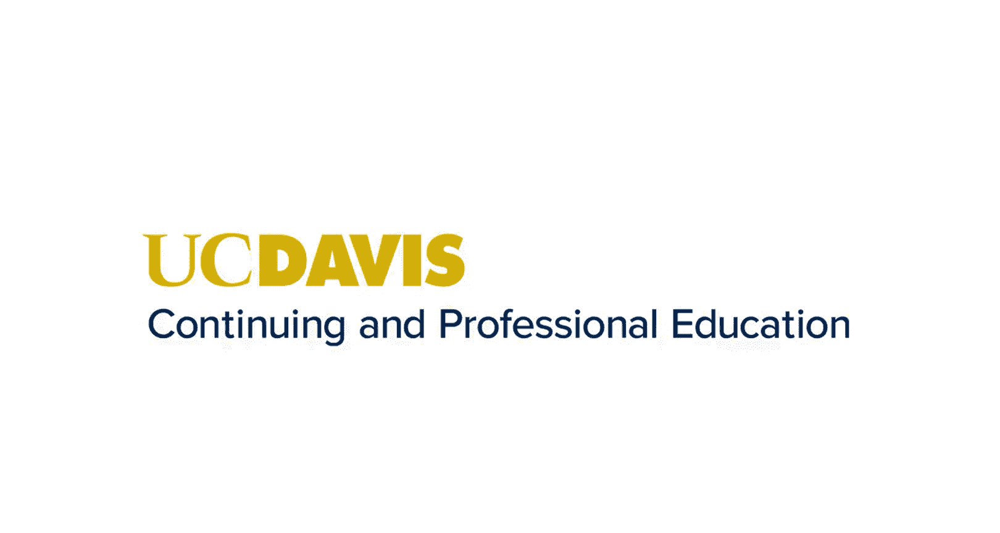
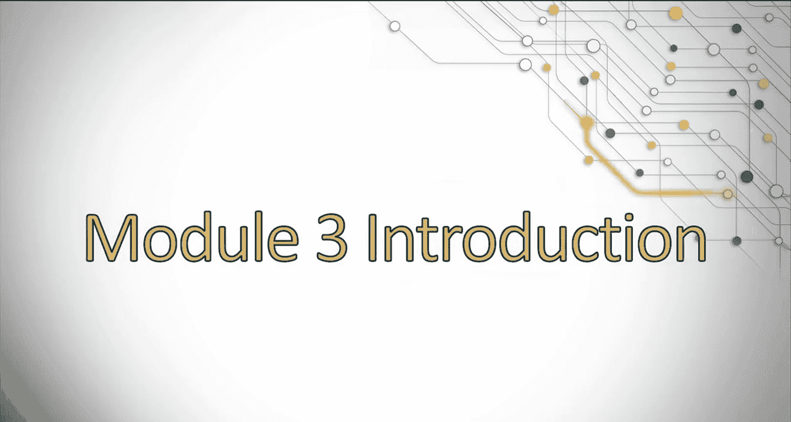

# 搜索引擎优化（谷歌、SEO基础、优化网站、进阶、毕业项目）：082：移动应用SEO与SEO指标

在本节课中，我们将学习如何为移动应用制定搜索引擎优化策略，以及如何开发和衡量SEO的关键绩效指标。课程分为两个主要部分：移动应用SEO，以及SEO指标与KPI。

## 移动应用SEO策略 🚀

上一节我们介绍了课程的整体结构，本节中我们来看看移动应用SEO的具体内容。

你是否曾多次决定去搜索一个能帮助你日常生活或提供娱乐的应用程序？你的第一步很可能是访问应用商店目录，例如App Store或Google Play，具体取决于你使用的设备类型。本节课将讨论如何让你的应用在这些应用商店目录中被列出和发现。

我们还将探讨如何在传统的应用商店目录之外优化你的移动应用，以及你可能希望这样做的原因。作为其中的一部分，我们也会讨论如何测试和衡量你的应用优化策略在不同应用商店中的效果。

以下是本部分将涵盖的关键主题：

*   **应用商店列表优化**：讨论如何优化应用在App Store或Google Play中的可见性。
*   **传统渠道外的优化**：探讨在应用商店之外进行SEO的策略和原因。
*   **策略测试与衡量**：介绍如何通过A/B测试等方法评估优化效果，例如测试不同的**应用图标**、**标题**和**描述**。

## SEO指标与关键绩效指标 📊

在了解了移动应用SEO后，本节我们将深入探讨如何制定SEO指标和关键绩效指标。

要成为一名成功的SEO专家，你不仅需要知道如何制定成功的SEO策略，还必须理解如何衡量该策略，以及如何向管理层或客户报告策略的执行结果。这可能是SEO中最关键的领域之一。如果不知道如何衡量和报告结果，你将很难获得对策略的支持，或展示策略迄今为止的效果以持续推进工作。

以下是本部分的核心要点：

*   **衡量与报告的重要性**：阐述为什么测量和汇报结果是SEO工作的核心。
*   **关键绩效指标开发**：介绍如何为SEO策略设定可衡量的目标。
*   **结果沟通**：讨论如何有效地向利益相关者展示SEO工作的价值和进展。

## 总结

本节课中，我们一起学习了移动应用SEO的基本策略，包括在应用商店内外的优化方法，以及通过A/B测试等手段进行效果评估。随后，我们深入探讨了SEO工作中至关重要的环节：如何制定、衡量和报告SEO指标与关键绩效指标，以确保策略的有效性和获得持续支持。掌握这些技能对于任何希望提升数字资产可见性和影响力的专业人士都至关重要。