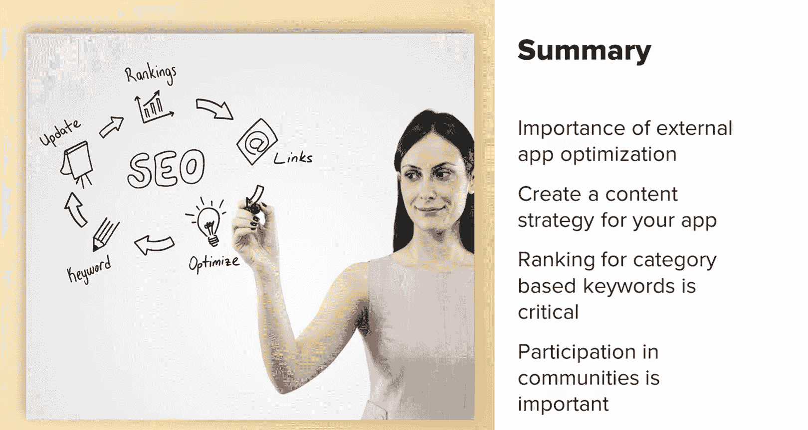
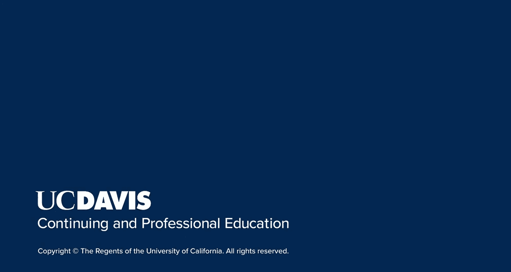

# 搜索引擎优化（谷歌、SEO基础、优化网站、进阶、毕业项目）：083：外部应用优化 📱

在本节课中，我们将要学习应用搜索引擎优化（App SEO）的两个核心方面：应用商店优化（ASO）和外部应用优化。我们将探讨它们各自的定义、重要性以及具体的实施方法，帮助你理解如何为你的应用获取更多用户。

## 什么是应用SEO与ASO？

首先，我们来简要讨论一下什么是应用SEO和ASO。

在本课程中，我们将涵盖这两个主题。当我说ASO时，我指的是在苹果或谷歌Play等独立应用商店中优化你的应用的做法。当我说应用SEO时，我指的是如何优化你的网站或其他外部资产，以吸引对应用感兴趣的人群，然后将流量引导至你的应用。

请注意，这些并非行业特定术语，因此你在其他地方可能不会听到。我在这里使用它们只是为了在本课程中区分这两种做法。对许多人来说，应用SEO也等同于ASO。所以，如果你以后没有听到这两个术语这样区分，请不要感到困惑。

## ASO的好处 📈

上一节我们介绍了ASO的定义，本节中我们来看看它的具体好处。

ASO能让你在应用商店内部获得高排名。这能增加你在寻找你所在类别应用的人群中的曝光度，无论是直接浏览类别，还是在苹果或谷歌Play等应用商店内使用关键词搜索。

根据苹果搜索广告的数据，应用商店优化能带来许多好处。以下是其主要优势：

*   **35%至40%的自然下载量提升**：随着时间的推移，ASO能显著提升应用的有机下载量。
*   **65%的应用通过应用商店搜索被发现**：这意味着如果优化得当，你将有很好的机会在应用商店中获得可见性。
*   **更高的用户终身价值**：有机用户的终身价值（LTV）可能是付费搜索用户的三到五倍。
*   **提升其他用户获取策略的效果**：提高应用的转化率，也能通过增加用户终身价值和降低付费广告获取用户的成本，使其他用户获取策略受益。

## 外部应用SEO的好处 💰

现在，让我们讨论外部应用SEO的一些好处。

外部应用SEO是指在应用商店之外的搜索引擎（如谷歌）上优化你的网站或其他资产，以获取应用商店本身无法提供的额外流量。因为你局限于人们在苹果和谷歌Play中搜索非常具体的短语或类别，外部优化将允许你在应用商店之外建立关于你应用的品牌知名度。

以下是外部应用SEO的一些关键好处：

*   **节省应用佣金费用**：根据你的应用类型，这可以节省大量资金。我们稍后会详细讨论这一点。
*   **降低付费广告支出**：通过在应用外部捕获更大份额的有机流量，可以减少对付费广告的依赖。
*   **增加品牌知名度和可见性**：通过让你的应用商店主页和你自己的网站在有机搜索结果中显示，可以提升品牌认知。别忘了，应用商店主页现在也能在自然搜索结果中排名。

## 关于佣金费用 💸

上一节提到了节省佣金费用，本节我们来深入了解一下。

苹果和谷歌都会从应用内购买和订阅中抽取大约15%到30%的佣金。你的应用在他们的商店中存在的时间越长，他们收取的费用比例就越低。对于一些零售商来说，这可能会累积成一笔巨款。

因此，有些人（例如Netflix）选择将流量引导到他们的网站进行订阅，然后允许人们在应用内使用该服务。一些应用采取更混合的方法，试图让更多人通过网站有机注册，但仍然允许应用内购买。不过，这可能很棘手，因为苹果尤其对哪些应用可以这样做有非常武断的规定，开发者很容易因此被禁止上架。

高昂的佣金费用使得通过你的网站生成有机注册变得更加关键，这最终可以为公司节省大量支付给各个应用商店的费用。

关于他们如何以及何时收费的规则，我已经在资源说明中包含了一些链接，因为这些规则确实非常武断且解释不清。我认为阅读这些文章，看看一些因未遵守这些规则而被从应用商店移除的应用例子，以及这些做法有时如何不公平的例子，是很有益的。读起来真的很有趣。

## 外部应用SEO方法 🛠️

既然我们已经讨论了应用外部优化的一些好处，现在让我们讨论一些用于在应用商店之外增加品牌知名度和可见性的外部应用SEO方法。

### 拥有一个网站

第一件也是最重要的事情，这几乎是理所当然的，但我必须提到，为你的应用建立一个网站至关重要。许多应用公司觉得他们不需要一个实体的网络存在，因为他们只是一个应用。其中一些只有一个非常基础、内容很少的着陆页。这些应用因为没有实现线上存在的多样化，而失去了大量的潜在流量机会。

这对于电子商务商店尤其如此。研究表明，客户仍然更习惯在网站上（即使是移动网站）结账和购买，而不是在应用内。我确实预计，随着我们越来越习惯允许这样做的应用，这种趋势会逐渐减弱，但目前寻求网站进行购买仍然是消费者的行为。因此，只有一个应用而没有允许购买的网站，从长远来看可能会让你损失很多钱。

除此之外，你也失去了很多让人们在应用商店之外发现你应用的机会。

### 制定内容营销策略

为你的应用制定内容营销策略非常重要。在制定内容营销策略时，你应该考虑网站的哪些部分可以放置内容，从而将用户引导至你的应用。

拥有一个定期发布与受众寻找的互补主题相关的博客，是让更多人在搜索与这些博客文章相关的问题时看到你的绝佳方式。思考相关的博客主题。例如，在为FishBrain制定SEO策略时，我们重写了关于不同主题和经验水平的钓鱼指南，然后将其与应用程序如何帮助用户联系起来。这些人可能并不是专门在寻找钓鱼应用，他们可能只是在寻找关于钓鱼的建议或问题的答案。这使FishBrain能够解决他们的问题，并在提供有帮助的用户体验的同时，向用户介绍品牌和应用。

### 创建专用着陆页

别忘了，你的应用有使其独特的特定功能或特性。人们会专门搜索这些东西，有时是为了寻找应用的推荐，有时只是为了寻找更大问题的解决方案，而没有意识到存在一个应用可以提供解决方案。

创建突出显示你应用功能的专用着陆页。例如，在Fishbrain，我们围绕单个应用功能创建了页面，这不仅有助于吸引更多流量，还将注册转化率提高了5%。

### 针对评论和类别搜索

针对与你应用类别相关的关键词，并结合“评论”这个关键词，也非常重要。评论类关键词的搜索量往往要少得多，但很多转化会在这里发生，而且竞争非常低，价值很高，因此是非常好的目标关键词。针对与你应用类型相关的关键词对于获得品牌知名度至关重要。

所有这些示例中的搜索都发生在应用商店之外的谷歌上，因此人们是专门在网上搜索这些类型的应用，通常在他们去应用商店之前。这是一个很好的机会，可以让你在寻找你所提供服务的客户面前出现，而且竞争比应用商店本身要小。

### 寻找错失的机会

始终花时间寻找你应用错失的机会。尝试将仅存在于你应用中的功能转化为网站上的可用工具。然后，你可以限制这些功能，并说服用户下载应用以获得完全访问权限。这是吸引那些恰好需要你所提供内容的受众的好方法。

例如，对于FishBrain，该应用的主要吸引力之一是帮助人们找到附近的钓鱼点。然而，网上没有这样的工具。通过将我们庞大的钓鱼点数据库添加到网络上（我们在二月份左右完成了这项工作，你可以看到那里有一个小点），然后允许谷歌抓取这些数据，我们花了一些时间来建立流量和势头，但我们能够捕获寻找钓鱼地点的人的访问，然后将他们转化为应用用户。所以，要始终寻找这些小机会，不要害怕将你应用的一个功能以有限版本的形式放到网上，作为吸引更多人使用你应用的一种方式。

### 参与在线社区

早些时候，我提到了社区参与。监控并参与与你应用相关的在线社区是一个非常好的主意。回顾一些之前的例子，如果我们选择一个流行的在线社区，以Reddit为例，只需在谷歌搜索“Reddit”加上一个类别术语，如“workout apps”，你可以看到人们不断转向他们最喜欢的社区寻求推荐。这是一个讨论你的应用、参与这些关于你应用或竞争对手应用的对话的好地方，你可以非常自然和有机地参与其中，并以这种方式向人们介绍你的应用。

## 制定你的优化策略 ❓

对于你的应用优化策略，重要的是问自己或你的同事以下问题，以便制定一个解决所有这些问题的SEO内容计划。

如果你在代理机构工作或是自由职业专家，与你的同事或营销团队进行一次头脑风暴会议，这将非常有助于生成这些问题的答案并激发大量灵感。

以下是需要回答的关键问题：

*   你的应用解决了什么问题？
*   你的应用有哪些独特的功能？
*   你的目标受众是谁？
*   你的受众在寻找什么类型的内容？
*   你的受众在哪些社区活跃？
*   你的竞争对手在做什么？
*   你如何将流量从你的网站引导到你的应用？

## 总结 📝

本节课中我们一起学习了外部应用优化的重要性，并看到了一些它带来回报的例子。

理想情况下，你现在理解了如何创建一个内容策略，将人们引导到你的网站，然后下载你的应用。你理解了为什么在基于类别的搜索中排名靠前很重要，以及如何将围绕“评论”的关键词纳入你的策略。你也理解了为什么参与那些已经围绕你的品牌、竞争对手甚至你的一般应用类别进行讨论的社区很重要。