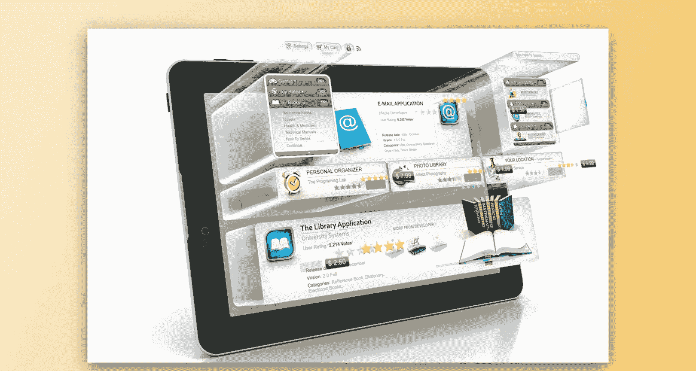
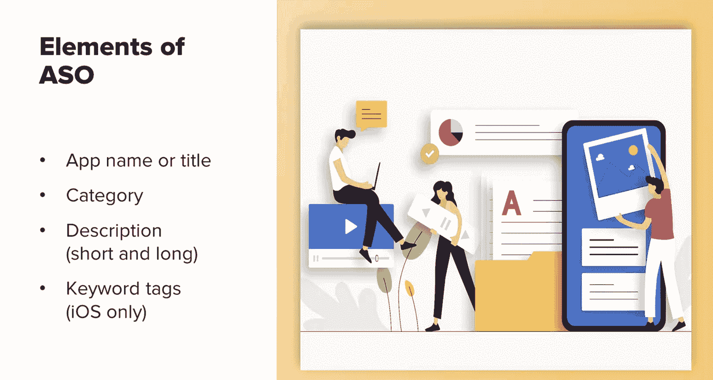
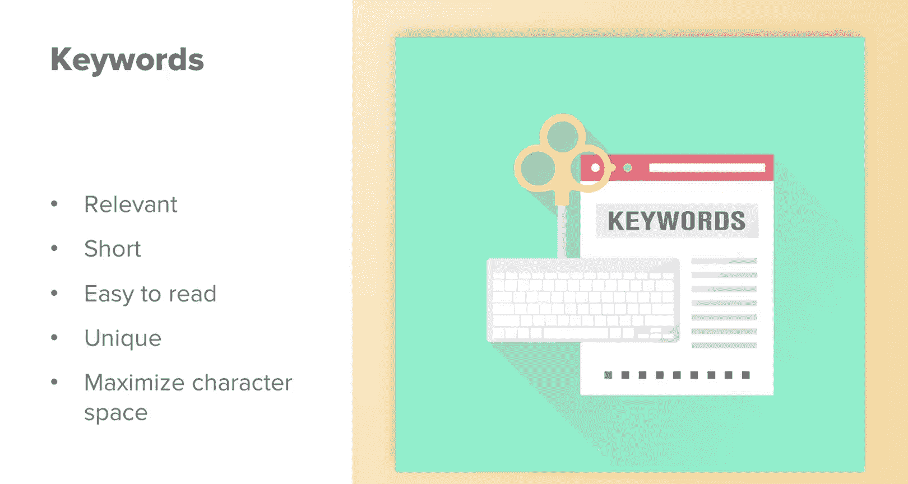
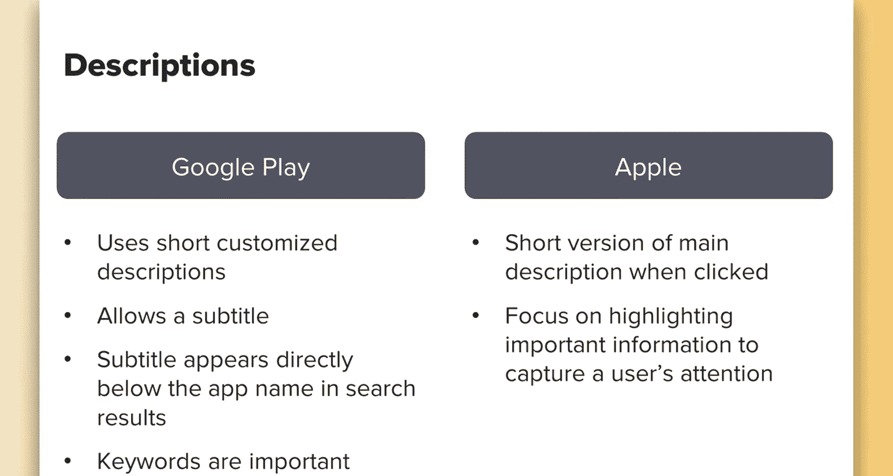
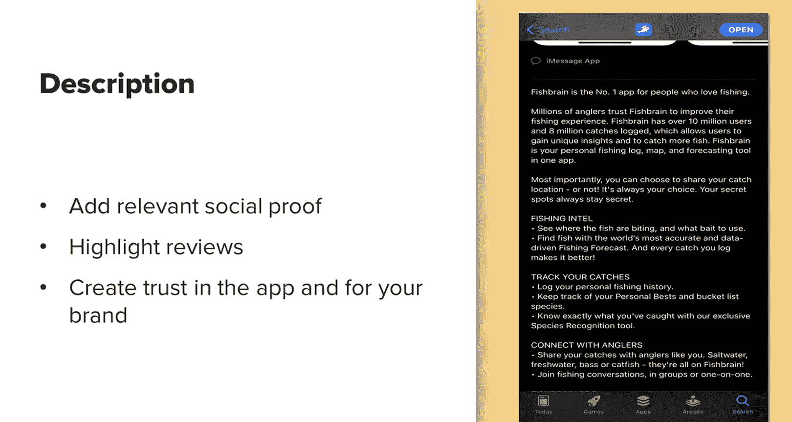
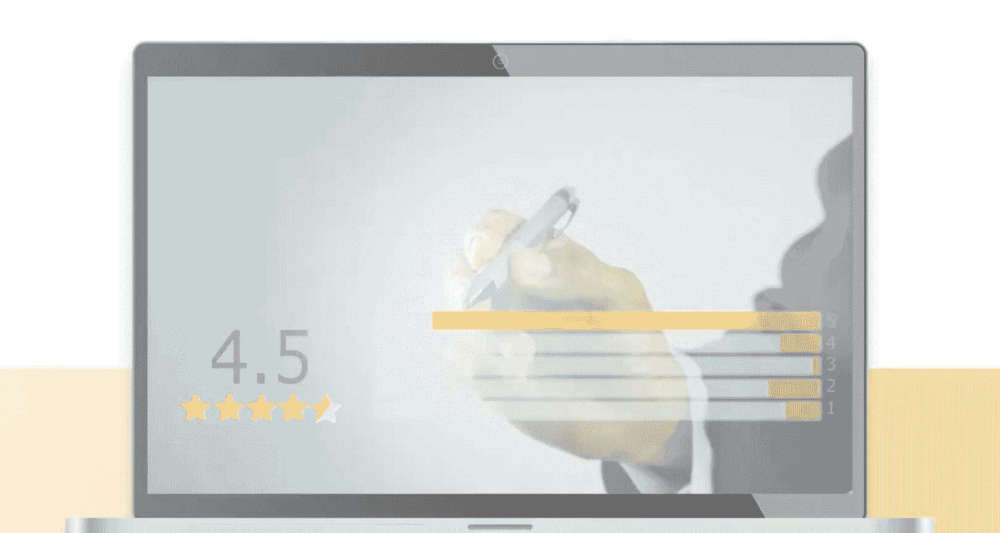
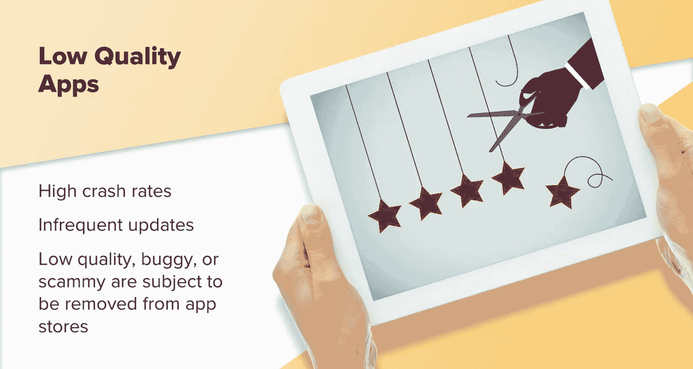
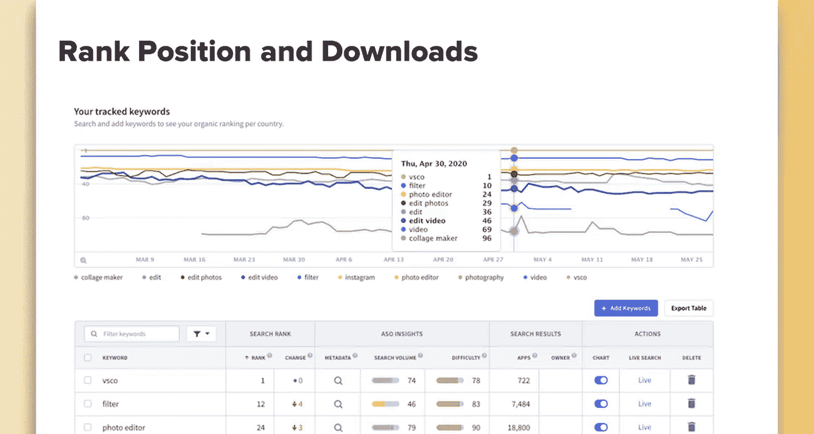
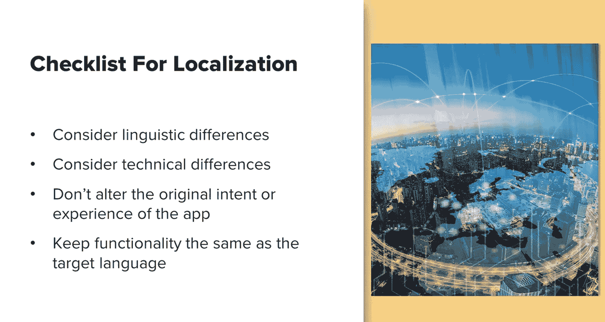
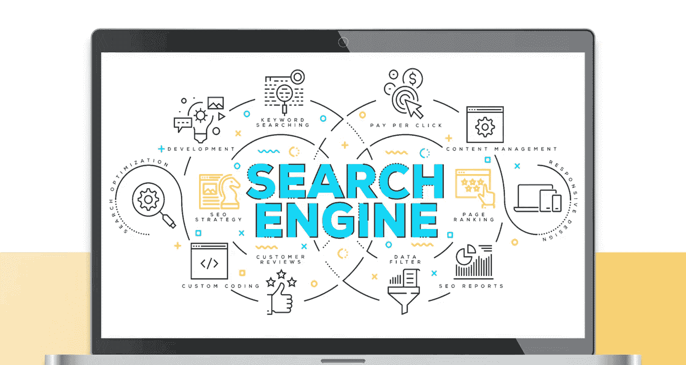

# 084：UCD《搜索引擎优化（谷歌、SEO基础、优化网站、进阶、毕业项目）｜Search Engine Optimization》中英字幕 p84 28_应用商店优化.zh_en -BV1N66VYsEue_p84-

Now that we've discussed external app optimization， let's discuss app Store optimization。

 which is the act of optimizing your app for the Apple Store or Google Play。

So similar to SEO， there is a higher weight placed on keywords in certain elements， such as titles。

In this case， the name of your app is also the app's title。With apps。

 the key element you want to focus on is incorporating keywords into the app name， the category。

 the description， which can be both a long and a short description。

 depending on which app store you're in。And keyword tags， depending on which apps you're in。

Keyword tags are available for iOS only。Google uses a more modern approach to keywords。

 where instead of relying on keyword tags， it is more like it crawls the web and crawls your product description。

 title， keywords and reviews， all of that and then tries to determine what your app is about in what keywords it should rank for。

 so you should really try and incorporate all of those keywords naturally into all of those areas and encourage reviews because reviews will generally naturally incorporate those keywords as well。

Let's start with app titles。According to a study by Mobile Devev。

 which has actually been renamed to tune since this was done。

 having a keyword in the title resulted in an average ranking increase of 10。3%。

Your title should be structured to include both your brand name and relevant keywords。

Based on app guidelines， you will need to include the brand or app name first。

 and then you can include relevant keywords after。This will differ in character limits and requirements between Google Play and the Apple App Store。

 so be sure to check the latest character requirements when adjusting your titles。In general。

 App Store usually has stricter requirements as well as a longer review process。

 so plan accordingly when you're optimizing the app Store apps。Also。

 remember that not only are the requirements different between the app stores。

 users behave differently as well。So don't just take one app store and apply all of the same text and images to the others without running some tests to see how the users between the two react to both of those。

Now let's briefly touch on keywords。So when thinking of what keywords to incorporate in your app title。

 think of things that are relevant， short， and easy to read。

You want to try to utilize as much of the character space you have available as possible in each app store。

Let's briefly touch on keyword research I recommend that you perform keyword and user research to come up with relevant keywords and categories for your app。

When researching appropriate keywords， consider the following。

 think about the main and most popular features of your app。

Some alternative words or synonyms that best describe each of those features。

What similar successful apps use。The right categories that your app might be listed in。

And the terms people commonly search for within that particular category。For keyword research。

 you can rely either on app specificword keyword research tools that can give some idea on like what your competitors are ranking for and what people are currently finding you for。

 and you can also rely on traditional keyword research tools and that's really only people searching for like on Google。

 but you can apply some of those learnings to the app store and test that and see if those keywords work well in the app stores as well。

Let's touch on description。One thing to note is that Google Play uses a short description while the app Store allows users to have what's called a subtitle。

For the app Store， the subtitle appears directly below the app name and search results。

 and you don't see any part of the app description until you click on the app itself。In Google。

 you see a custom short description that the app maker creates。

 but the search functionality shows just the app title and category。In Apple。

 once you click on the app itself， you'll see a short version of the main description that you then have to click on to expand。

If you're on Google Play， you'll have a customized short description that's different than the longer description。

Since Apples is a shortened version of the main description。

 you want to focus on highlighting important information that can capture a users' attention as high up in the description as possible because this will be shortened for Google keywords are important here as R calls to action to get users to download。

The app description is an essential part of your app's metadata。

 it provides users with information on what your app is about and gives an overview of its main features。

For both the App Store and Google Play， the description can be up to 4000 characters long。However。

 for Apple， if your app offers purchases or subscriptions。

 you have to include that additional information and tell the customer how it will be billed and when and other legal requirements in order for your app to be approved。

 so this will take up part of your description。For Apple。

 the description is an important opportunity to convince users to download your app。

 but the keywords here are not relevant to your ranking。 remember。

 Apple doesn't crawl your description but relies on keyword tags。For Google Play。

 the description is especially important for both convincing users to download your app and for the app's SEO ranking。

The description is one of the main areas where Google finds keywords for your app and determines what your app should rank for。

Now， this does not mean you could just put all your keywords into the description and wait for magic to happen don't try that。

Try to incorporate your keywords into sentences naturally。

You also want to convince users to download your app and introduce them to your brand this way your description is both attractive to readers and relevant to Google's algorithm。

 so don't make it too SEO optimized because you might scare users away。Ideally。

 you want your description to be informative， easy to understand， and clearly structured。

You can get creative and use bullet points as well as emojis。

 just remember that the description is limited to 4000 characters in both stores。

Because the user base is different， as well as Apple using a shortened version of the length and description。

 you really should customize each description for its intended target audience and its intended optimization effect in the individual app stores。

Another thing to consider adding to the description itself is relevant social proof。

 you can consider highlighting reviews， or in this case with FishBin。

 we highlighted that we're the number one fishinging app with over a million users。

 so there's a good amount of social proof and create some trust in the app and our brand so helps convince users to download it。

So in addition to all of these text based elements that you directly control。

 there are also important factors to your apps ranking that you have no direct control over。

These are considered engagement metrics， and both app stores use these to determine the quality of your app and where it should rank。

The best way to influence these ranking signals is by providing a good user experience。

 Mon these metrics closely so you can find opportunities to correct them as soon as possible。

 For example， if people are downloading your app and opening it once and then going and uninstalling it。

😊，This tells the app stores that your app is really low quality and people aren't interested in keeping it around and that will impact your ranking so when you see metrics like this。

 investigate the cause and run test to see how you can increase engagement and that user lifetime value and lifecycle within your app。

User feedback is an integral part of app Store optimization。

Both stores take into account the comments and reviews users leave for your app。

The better you're rating， the more relevant your app is considered by the stores and the higher it will rank。

In addition， 80% of mobile users read at least one review before downloading an app。As a result。

 it's essential to reply to reviews and keep them engaged。

 potential users like to see developers who care about user feedback and take user feature requests into consideration。

Apps with high crash rates and infrequent app updates are considered low quality。

 and therefore they have lower rankings， buggy， low quality or scammy apps are also subject to removal from both of the app stores。

As more people develop mobile apps and games， Google and Apple become more selective with the ones that they allow to be published in their stores。

Apps that are more frequently updated are rewarded by appearing higher in store search results。

 so make sure to update it frequently， fix bugs， and always provide a good user experience。

Another thing to note is that the search ranking position of an app directly correlates with the number of downloads。

 the higher your app ranks in the search result， the more relevant it appears to users High ranking apps get more downloads since users don't usually scroll through every search result they usually only look at the first five or so。

Also， if you operate internationally， consider app localization。

If you have an international presence or operate in an area where multiple languages are spoken。

 it's a really good idea to localize your app。This will help improve your app store visibility and expand your reach by making your app available to users who search in their native language。

This helps to present your app to a broader audience。

 and that can lead to more downloads and increased revenue。Also。

 studies show that users place more trust in apps that are in their native language and they're more likely to download the app。

When considering localization， make sure to take necessary differences into account while keeping functionality and experience the same。

You should work with a company experience in app localization that can assist with this。

 as there are a lot of little nuances to be aware of。

In review， you should now have an understanding of what ASO is and how it differs between the two main app stores。

You should understand what ranking signals are important to each app store。

You should have an idea on how to improve your app's name and title。

How to improve your apps description。You should know why user experience is key to good rankings。

And reasons to consider localizing your app。And that wraps up this presentation on app as you。

