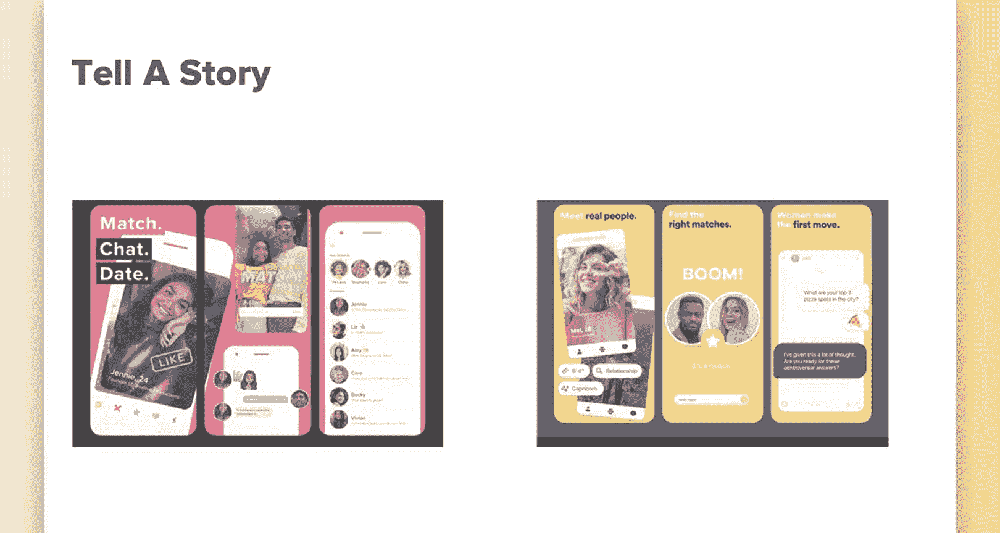
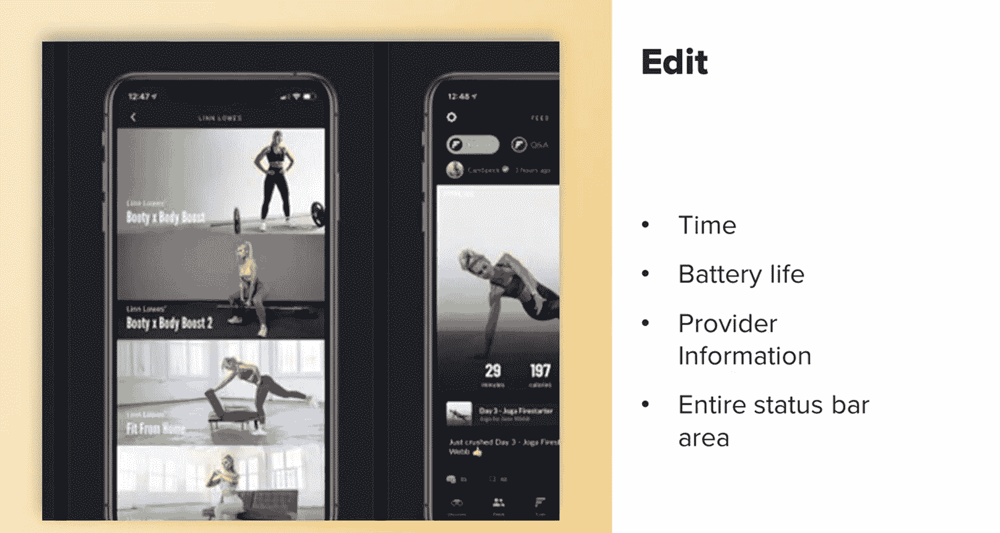
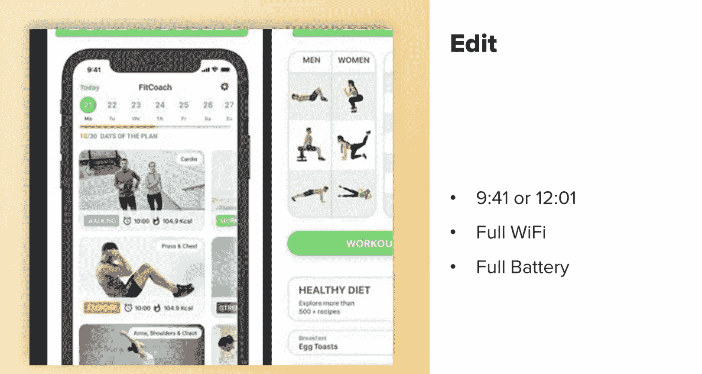
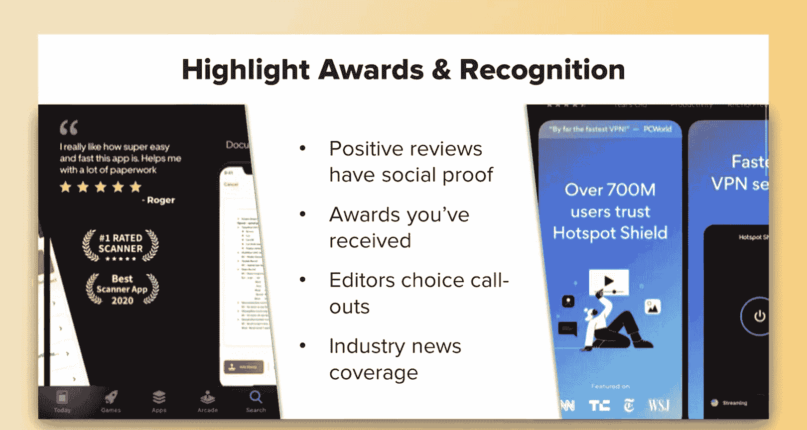
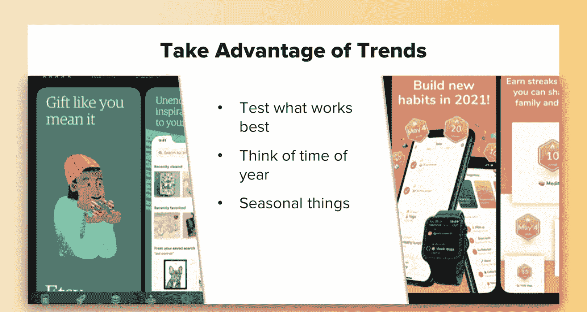
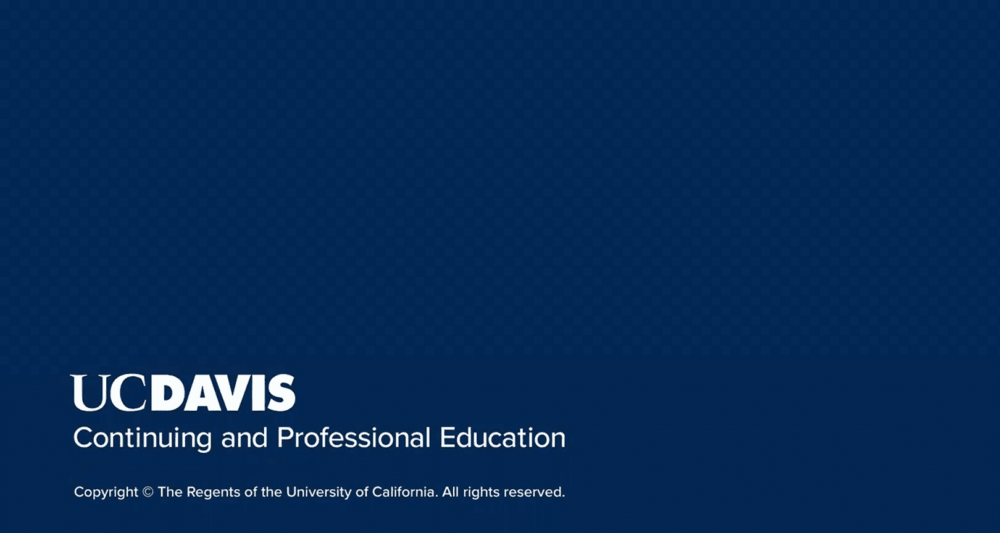

# 搜索引擎优化（谷歌、SEO基础、优化网站、进阶、毕业项目）：086：截图优化技巧 📱

在本节课中，我们将要学习如何优化应用商店中的截图和视频，以提升应用的下载转化率。我们将探讨截图的重要性、各平台的要求以及一系列行之有效的优化策略。

上一节我们介绍了如何提升在单个应用商店中的排名，本节中我们来看看截图在吸引用户下载方面扮演的角色，以及如何最大化其价值。

## 平台要求与差异

每个应用商店都允许你上传图片来展示你的应用。但两个主要商店（Apple App Store 和 Google Play Store）的要求有所不同。

*   **Apple App Store**：允许上传更多素材，但对要求极为严格。图片必须符合非常具体的尺寸规定，哪怕只差一个像素，应用也可能被拒绝。你必须为每个可用的设备选项上传图片，且每个选项都有其特定的图片尺寸要求。
*   **Google Play Store**：要求相对宽松，但遵循其推荐准则将提高你的应用被“编辑精选”展示的机会。如果不遵循，虽然不太可能被下架（除非有严重违规），但也不会获得推荐位。

此外，两个平台都规定，截图和视频必须是应用本身的内容。这意味着不能使用外部拍摄的图片或视频素材。例如，你不能用一个用户谈论应用功能的采访视频作为展示视频。

不过，Google Play 在视频方面更为灵活。它允许上传任何能传达应用或游戏精髓的视频内容，并且视频必须通过 YouTube 链接添加。因此，上传视频时，务必选择一个有吸引力的缩略图，因为它会在用户点击播放前显示。你也可以选择设置为自动播放，这样用户一进入你的应用页面，视频就会开始播放。

## 为何要优化截图与视频

既然我们了解了平台规则，接下来探讨为何优化这些视觉素材至关重要。

因为截图和视频在两家应用商店中都位于“首屏”（即用户无需滚动就能看到的位置），这是提升转化率的绝佳机会。

你可以将此作为引导用户的第一步，教育他们如何使用应用，以及打开应用后你希望他们采取的下一步行动。由于截图和视频的突出位置，它们形成了用户对你的应用或游戏的**第一印象**，并帮助他们决定是否下载。

同时需要注意，由于苹果的严格规定，这一点在 Apple Store 中不太明显，但在 Google Play 中，图片和视频可以提供**社会认同**。例如，你可以展示人们谈论他们为何喜爱你的应用的视频，或在街头采访陌生人的片段。唯一不能做的是包含任何反映或暗示 Google Play 商店表现、排名、价格或促销信息的内容。

以下数据来自 Fitchcher 公司的一项研究（链接将附在参考资料中），值得注意：

*   用户会在**前 7 秒**内决定是否要下载或查看你的应用。你只有这么短的时间来吸引他们的兴趣并说服他们你的应用值得下载。
*   只有 **9%** 的用户会滚动查看前两张截图之后的内容。对于游戏类应用，这一比例会上升到 **17%**，但仍然很低。

因此，你必须利用视频和图片立即吸引用户。😊 前两张截图应经过充分测试，并应是你表现最佳、最能突出应用亮点和立即下载理由的截图。

## 应用图片最佳实践

鉴于说服用户下载的时间窗口非常短暂，遵循一些最佳实践至关重要。

以下是优化应用截图和视频的一些关键建议：

*   **优先展示最重要内容**：确保将最重要的图片放在最前面。如果不确定哪张最重要，务必进行 A/B 测试。事实上，你应该持续进行测试。
*   **确保视觉吸引力**：确保你的截图和视频美观、醒目，能立刻抓住用户的注意力。截图上的任何文字都应清晰易读。
*   **传达清晰信息**：用户应能快速理解图片或视频展示的内容。如果元素过多或文字过密，可能会使用户感到困惑并迅速失去兴趣。
*   **直截了当**：在应用商店中，引发好奇心再逐步揭示的策略通常效果不佳。应直接展示你最好的功能和下载理由。
*   **保持品牌一致性**：你希望用户能将你的品牌形象与应用联系起来，使两者都易于识别。请记住，在所有营销材料中保持品牌资产的一致性。

## 优秀案例与创意启发

在下一部分，我将通过一些例子来说明哪些做法有效，希望能激发你的创意灵感。

请记住，在两家应用商店中，你都可以将前两张截图合并为一张长图，并添加重要文字。以 Fish Brain 为例，我们目前就使用这种方式来突出最重要的功能，并结合社会认同来表明我们的受欢迎程度。随着持续测试，未来这可能会改变。

同时，记得**讲述一个故事**。Tinder 和 Bumble 都在用它们的应用图片讲故事方面做得非常出色。它们不仅仅是展示应用功能，而是引导你经历一个用户旅程。

另外，记得编辑状态栏信息（时间、电池、运营商等）。你应该这样做，是因为这与苹果自身的做法有关。这是一个基于苹果使用习惯的潜意识技巧。并非所有用户都会联想到这一点，并且它可能只在 App Store 内效果最佳。但如果你仔细观察，苹果在其设备截图中总是使用 **9:41** 或 **12:01** 这样的时间。

这源于史蒂夫·乔布斯精心的营销策略，他通常在发布会进行约40分钟时宣布产品，希望人们看向自己的手机或手表时，显示的时间与屏幕上设备显示的时间一致。如果你想了解更多，有一篇关于此的有趣文章。

你还可以**突出应用获得的奖项和认可**。例如，这个应用展示了一条评论和两个奖项，但如果能提供颁奖方信息会更可信。😊

再比如，下面这个 VPN 应用在最顶部展示了一家知名杂志的引述，用用户数量作为社会认同加以支持，然后通过突出展示其被报道的新闻网站来强化其专业形象。

最重要的是，**利用趋势并持续测试**。某些图片在一年中的特定时段可能效果更好。例如，Etsy 在圣诞节期间更新了其图片，提醒人们使用其应用进行礼物选购。

或者看看这张在新年期间更新的图片，它旨在引导用户下载应用，并帮助他们实现新年决心。

## 总结

本节课中我们一起学习了应用商店截图与视频的优化技巧。

让我们简要总结一下所学内容：请记住，你只有最初的 **7 秒钟** 来吸引用户兴趣并促使他们下载应用，因此要使用能立即抓住注意力的图片和视频。其次，充分利用每一个可用的图片位。始终遵守每个平台的规则，你肯定不希望自己的应用被下架。并且要持续测试图片，以找到最适合你的行业和用户的内容。

