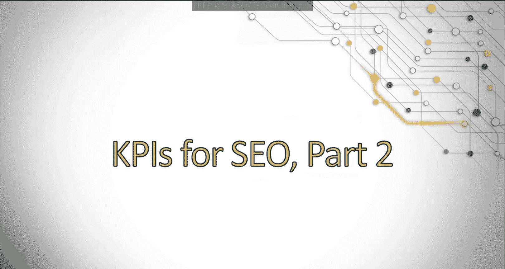
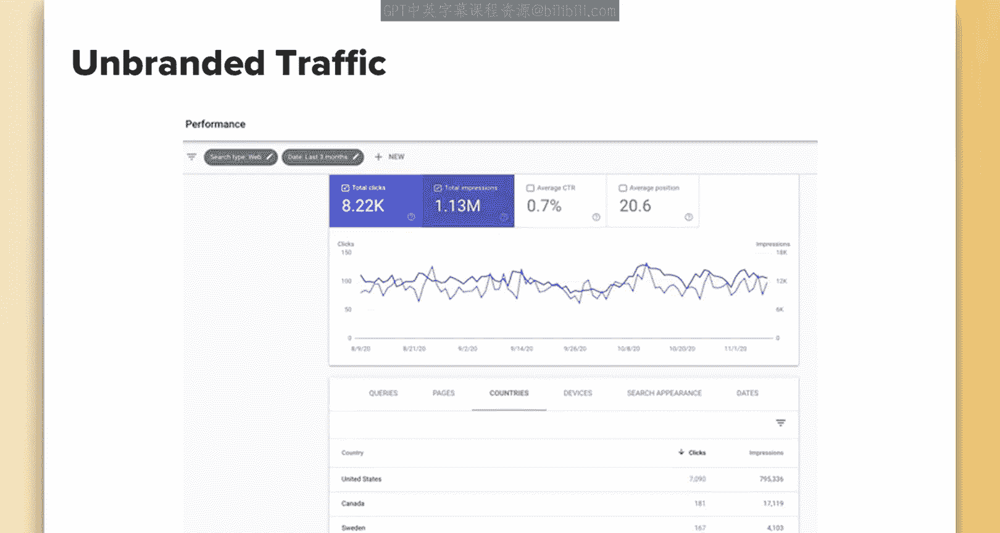
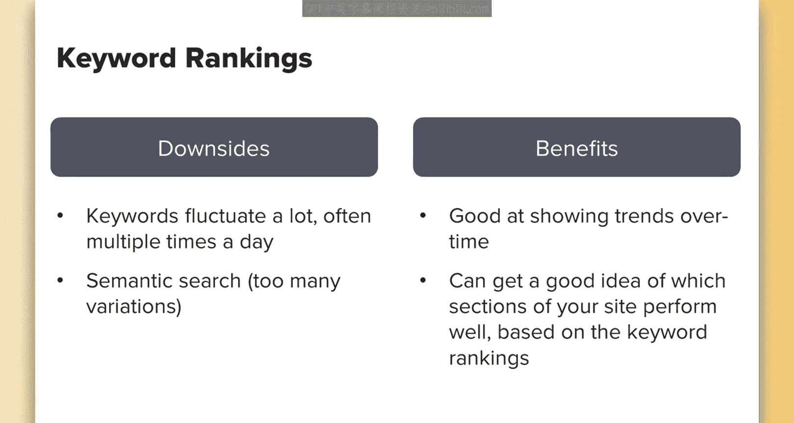
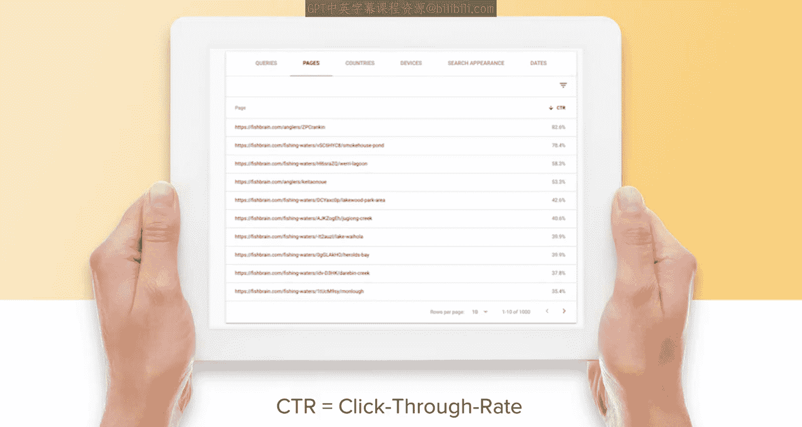
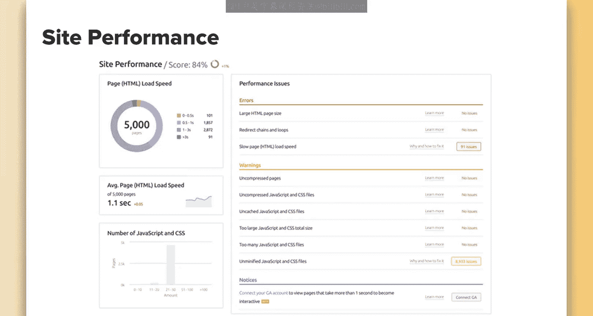

# 088：SEO关键绩效指标 第二部分

在本节课中，我们将继续探讨搜索引擎优化的关键绩效指标。我们将学习如何追踪品牌与非品牌流量、关键词排名、反向链接、点击率以及网站性能，并理解这些指标如何共同反映SEO工作的成效。

上一节我们介绍了SEO KPI的基础概念和通用原则，本节中我们来看看几个具体且至关重要的指标。

## 追踪品牌与非品牌流量

首先，我们需要区分并追踪品牌流量与非品牌流量。非品牌流量能真实反映你的SEO工作在吸引那些尚不熟悉你品牌的新用户方面的成效。

由于Google Analytics会屏蔽大量关键词级别的数据，建议在Google Search Console中进行此项分析。在Google Search Console中，你可以按点击量排序，然后过滤掉与你网站相关的品牌词。

另一个需要区分品牌流量的原因是，这部分用户已经认识你，他们已有品牌认知。这些流量可能由SEO带来，也可能来自付费社交广告等其他渠道，因此很难直接归因于SEO的投资回报率。通过追踪非品牌流量，或对比品牌与非品牌流量的关系，你能更清晰地了解新用户是如何通过你生产的内容，发现你的网站并找到问题答案的。

## 追踪关键词排名

接下来，我们谈谈追踪关键词排名。这是一个有争议的话题，各有利弊。我建议一定要追踪，因为它能为你提供哪些策略有效的宏观视角。

但务必同时关注围绕排名的其他相关KPI。例如，关键词排名频繁波动是一个缺点，如果试图在短周期（如周环比甚至日环比）内监控，可能会引起不必要的恐慌。更长时间跨度的对比总是更好，因为你能看到更广泛的趋势。

另一点需要注意的是，随着语义搜索的发展，你可能从你定位的精确关键词获得的访问量变少，而从大量你未追踪的相关关键词获得的访问量变多。这最终会导致需要追踪和优先处理的关键词数量过于庞大。

不过，你可以据此判断：如果你在主要关键词上排名良好，可以合理假设你在相关术语上也处于有利位置，并以此作为衡量标准。

你还可以根据关键词排名，了解网站的哪些板块表现更好。例如，如果你知道网站的一个板块专注于男鞋，另一个专注于男士运动服，但你在“鞋子”相关词上排名很差，在“运动服”相关词上排名很高，那么你就可以调查该板块排名不佳的原因，并寻找优化机会以提升网站的整体流量。

## 衡量反向链接

另一个需要衡量的KPI是反向链接。衡量反向链接很重要，因为它是最重要的排名信号之一，并且这一点短期内不太可能改变。我的建议是同时使用反向链接和网站权威度指标。

请记住，并没有官方的网站权威度衡量标准，因此请使用最适合你的追踪软件，例如Moz或SEMRush。无论使用哪种工具，始终使用同一个工具很重要。

需要注意的是，仅报告反向链接数量本身并不能体现链接的价值。然而，网站权威度的提升本身可能非常缓慢，尤其是随着你的权威度等级越高，提升难度越大。但将这两者结合起来追踪，以展示长期价值，是非常重要的。

以下是衡量反向链接时需关注的具体方面：
*   **总链接数**：你拥有的反向链接总数。
*   **引荐域名数**：为你网站带来流量的独立域名数量。
*   **新获取的链接**：新获得的链接数量。
*   **丢失的链接**：失去的链接数量。
*   **低质量或有害链接**：识别出的低质量或有害链接。

最后一点尤为重要，因为你应努力抵消任何低质量链接的影响。遗憾的是，这些指标更难衡量，因为你无法直接从Google获取信息，必须依赖外部工具。目前我偏好使用SEMRush，因为它能让你轻松地对链接进行分类。

## 衡量点击率

另一个你应该衡量的KPI是点击率，特别是自然搜索点击率。这不仅因为Google在确定你的网站在特定排名位置对用户的价值时会参考此信息，而且它对获取更多流量也至关重要。更高的点击率意味着有更多人点击并访问你的网站。

你可以在Google Search Console中查看点击率，甚至可以按页面筛选。你可以按点击率最高的页面排序，以了解哪些内容表现良好；也可以按点击率较低的页面排序，以便寻找改进方法并进行测试。

此外，你还可以查看点击率随时间的变化趋势，从而了解你所做的更改是提高还是降低了点击率得分。这有助于你理解网站改动或季节性因素如何影响了点击率。我个人发现季节性对点击率有很大影响，尤其是在节假日期间。这时许多广告商会增加预算，可能导致自然点击率下降。因此，在观察随时间的变化时，请记住季节性、行业重要事件等因素都可能对此产生影响。

## 追踪网站性能

最后，你应该追踪网站性能。虽然可以使用Google免费的Lighthouse工具，但因为我已将SEMRush用于其他用途，所以也用它来检查网站性能。这两个工具都能让你看到可能影响排名的潜在网站问题，例如速度问题，以便你进行修复。

不要忘记追踪网站性能指标，这非常重要，因为它们同时影响用户体验和SEO。优化网站性能应成为公司常规维护工作的一部分，以提升整体表现。

本节课中我们一起学习了SEO中几个核心的绩效指标：通过区分品牌与非品牌流量评估SEO的真实拉新能力；理性看待关键词排名的波动并利用其指导优化方向；综合衡量反向链接的数量与质量；关注并优化点击率以获取更多自然流量；以及将网站性能作为常规维护项以确保良好的用户体验和搜索表现。掌握这些指标将帮助你更全面、更有效地评估和推动SEO工作。