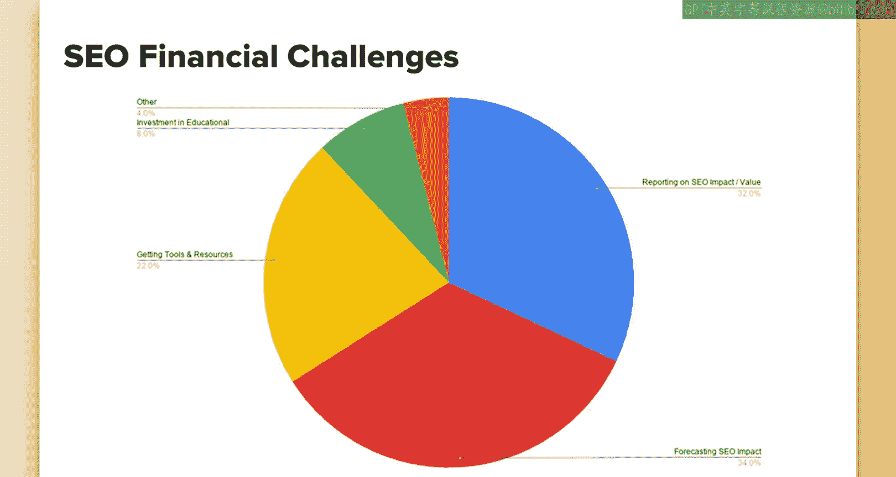

# 090：UCD《搜索引擎优化（谷歌、SEO基础、优化网站、进阶、毕业项目）｜Search Engine Optimization》中英字幕 p90 34_SEO调研发现.zh_en -BV1N66VYsEue_p90-

Hello， as we jump into the next section， I'd like to quickly discuss a survey I did of over 180 SEOs across different size organizations。

The results of the survey will help better prepare you for a successful career in SEO and help prepare you for common challenges faced in the field。

The other lessons will revolve around results of this survey。

The intent of doing the survey was to help me uncover biggest and most common challenges SEOs face within their organization。

To understand the results better， I split them up into two sections。

 The first is called Seo business challengesll， and this is where we discuss how well Seo works in the context of a company。

 This involves things like communicating with other teams。

The second area is titled Financial Challenges， and this covers things like the biggest challenges faced when it comes to anything financial related。

 such as getting investment for your projects， reporting on the financial aspect of your SEO initiatives and more。

Now before we proceed， I want to know a couple things。

The intent of this survey was to find challenges， so I knew what common challenges were to create some lessons around to better prepare you for a career in SEO。

Because this was all about finding and discovering what those challenges were。

 the survey may sound negative towards working as an SEOo because you don't get to hear about the winds and the positive aspects。

Also note that to keep the data clean， I provided common challenges from initial surveys and discussions that I had with SEOs。

 and then from this survey they could choose from a predetermined list of responses。

I did include an other option so that can take into account other areas I may not have initially considered。

So in the end， please don't take this too much to heart as far as all these negative things to expect working as SEOsio。

 it's not all negative， there's a lot of positives。

 this is just to prepare you for some challenges that you're likely to see during your career as an SEOio。

Okay， let's start off with the section titled SEOo Business Challes and go over some of the results there and how those sections are defined。

Here we have the results for the most common business challenges faced。

 so respondents were asked to select what their biggest challenges were。

The biggest by far was challenges faced by prioritizing and implementing SEO objectives。

This is defined as making SEO recommended changes to developers， content teams， and more。

 and having those changes prioritized or implemented。

The next biggest challenge faced is cross functional compatibility。

And I defined this as how well the SEO， team or individual works cross functionally with other departments in the company。

 especially those that may tie in SEO， such as PR teams， content teams， development teams， and more。

Next， we have a section that I loosely just called putting out fires。

 I really couldn't think of a better way to name this。

 but it's defined as time spent discovering and chasing down changes that were made to the site without first seeking input or guidance from the SEO individual or team there's a lot of instances where someone will change something that they think is small and not notify people but you may notice a drop in rankings or traffic and find out later that this change was made。

 so really staying on top of all of these changes， other teams within the organization could be making。

The next section is settingtting expectations of SEO results。

 and that revolves around how many people face challenges getting people to understand the ROI of an SEO objective。

How long it may take them to see the results of Seo efforts or other expectation setting。

 I find that people really are off on when to expect Seo results。

 and they either think it's very quick or very， very long when， in fact。

 it's generally somewhere in the middle。Then the other one is just other。

 which I asked respondents to choose from their。like their own biggest challenges where they could add their own results here。

 so some things people noted that I found quite common a couple different people noted the same things were things like data integrity。

 so not having accurate and reliable data sources to report your efforts from working with external partners。

 this is maybe external link building agencies， external PR agencies or more。

 or finding reliable services such as link building， a lot of services。

 especially the link building service category， isn't as reliable as we would like to be from an SEO standpoint。

Looking at the results， we see that getting things implemented is by far the biggest challenges。

 but both working cross functionally and putting out fires are also large challenges faced。

These can all relate to one another when you think about it and is more of a symptom of the issue of how to get everyone in the company to understand what levers can impact SEO。

 the value of those， and how to work together on common objectives to improve SEO。

The next is SEO financial challenges， so this will have similarities to the other side you just saw where there's definitely three big key areas that SEOs report commonly facing challenges with。

These areas are reporting on the value and impact of their SEO efforts。

Finding ways to accurately and effectively forecast future SEO impact。Getting tools and resources。

 which I defined as getting the budget for new SEO tools， new hires on the SEO team。

 or help with external partners such as content producers or link building partners。

And then a smaller portion found that their greatest challenge was investment in educational opportunities。

 but it appears that the majority of SEOs either feel that they are getting the appropriate level of investment in this area or may just not be as concerned with this。

The other section， which covered about 4% of respondents。

And most of the responses here could be folded up into other areas， so for example。

 a common response was predicting organic value of upcoming investment rounds and that could be packed into the pie piece for forecasting SEO impact so a lot of these were just related to the bigger piece and were not that relevant to go over individually。

I'd love to have your help with future surveys volunteering for these will also give you access to insights about industry survey results。

To volunteer， just go to Rebeccaam。com forward/surveys and give me your email and I'll connect with you next time I have a survey that I could use your help with。

