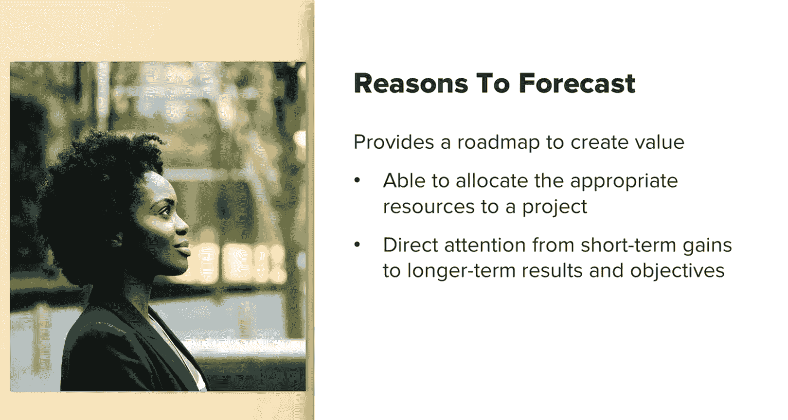

# SEO基础与进阶：091：SEO影响预测 第一部分

## 📊 课程概述
在本节课中，我们将要学习SEO影响预测。我们将探讨为何需要进行预测、预测过程中可能遇到的困难，以及如何有效地预测SEO数据。

## 🎯 为何需要进行SEO预测
上一节我们介绍了课程主题，本节中我们来看看进行SEO预测的几个主要原因。

当向新客户推销一个具体的SEO项目或服务时，如果你是一家机构或自由职业者，能够预测可能获得的收益并将其与货币价值挂钩，就更容易获得对该SEO项目的认可和投资。

以下是预测能带来的具体价值：
*   **价值创造的主要工具**：它向高层管理人员展示了SEO的价值，同时也向潜在投资者展示了价值。
*   **吸引投资**：投资者越来越频繁地要求提供与自然增长相关的预测。他们这样做是因为他们知道这是扩展业务最具扩展性的方式，因为它能带来免费流量。
*   **提供路线图**：预测为如何创造价值提供了路线图。它让管理层能够分配必要的资源和预算，以及其他可能需要的支持，以帮助你实现业务增长的收入目标。
*   **引导关注长期目标**：这可以帮助你将注意力从短期收益转向长期结果和目标，这在让人们接受SEO时是非常必要的。

## ⚠️ 预测SEO影响时面临的困难
了解了预测的重要性后，我们来看看在实际操作中可能遇到的一些挑战。

预测自然流量本身就很困难。与付费营销活动不同，在付费营销中你可以预测每花费一美元能获得多少回报，而自然流量有许多变量会影响它。

最初困扰我的一个主要问题是**准确性**。为了让管理层和潜在投资者对SEO产生兴趣，你真的需要向他们展示巨大的价值。有时，如果你知道自己不太可能获得实施SEO相关项目所需的资源，这可能会让人觉得有点不真诚。然而，请记住，一个优秀的预测不需要完全准确。它只是一个估计的预测。

以下是应对挑战的关键点：
*   **记录与沟通**：记录你的实际增长与预测增长的对比情况，并分析成功和失败的原因，都有助于加深管理层对SEO的理解和价值认可。在报告时，务必注明可能影响预测的因素，例如谷歌算法更新、竞争对手的SEO动作、整体市场状况以及个性化搜索等因素。
*   **明确不确定性**：最重要的是，记住SEO预测绝非确定无疑。由于上述挑战，SEO预测很难做到精确。你必须专注于可控因素，但必须沟通（甚至在必要时反复沟通）你的方法。你应该能够向关键的SEO利益相关者解释并说明你是如何得出估算的。
*   **展示现实性**：你需要展示你的预测是现实的。投资者希望看到巨大的增长数字，但他们也希望在投资你的公司时感到安心。他们不希望看到没有现实实现途径的巨大增长预测。投资者和管理层都明白你无法准确预测增长，这只是一个最佳猜测的估计。
*   **数据与可视化支持**：对于SEO预测，重要的是着眼于可实现的目标。为了避免显得愚蠢，同时让管理层满意，你需要有一个计划来支持你提出的数字。再次强调，始终要记住沟通。你需要准备好数据和计算来支持你的结论。你还应该始终以可视化的方式沟通你的预测。SEO利益相关者通常非常忙碌，他们没有时间查看你所有的数据并自行得出结论。向他们展示一个快速、易于理解的可视化图表，并配以简短的要点来说明你的观点或主要信息，这是关键。

## 📈 如何有效呈现预测数据
在将影响和数据可视化时，要尽可能轻松、快速地达到你的最终目标。

作为一名SEO，你的目标可能是增加网站的高质量流量，但公司的目标可能更进一步，你需要从这个角度来思考。因此，虽然你的目标可能是增加流量，但公司的目标可能是将这些流量转化为付费用户。所以，你不仅需要报告流量情况，高层管理人员和利益相关者真正希望看到的是SEO将如何**改善下载量**、**提高免费试用率**或其他能转化为业务最终结果的有形指标。

最重要的是，作为一个曾多次不得不重新规划、预测额外“假设”场景的人，我给你的最重要建议是：**尝试预测问题**。

利益相关者和管理层可能会提前提出问题，你应该将这些纳入你的预测中。例如，如果你说将达到一定的访问量，而这依赖于一个项目在既定截止日期前完成，那么你也会被问到：“如果项目延迟了，潜在影响是什么？”或者“如果我们非常努力地提前完成，那么我们可能会看到什么样的SEO结果？”

不可能预测到每一个问题，尝试计算每一个可以想象到的问题将是巨大的时间投入。但是，如果你得出了一个具体的推论，例如你的大量数据依赖于某个项目的完成，那么你绝对可以预测，如果未能按时完成，关于预测将如何受到影响的问题将会出现。因此，将这些问题融入到你提交的预测报告中。

## ✅ 课程总结
本节课中我们一起学习了SEO影响预测的基础。我们探讨了进行预测的必要性，分析了预测过程中可能遇到的固有困难，例如准确性和众多变量。我们还学习了有效预测和呈现的关键策略，包括注重沟通、展示现实性、使用可视化工具，以及提前预测并解答利益相关者可能提出的问题。记住，预测是一个指导方向和争取资源的工具，而非精确的预言。