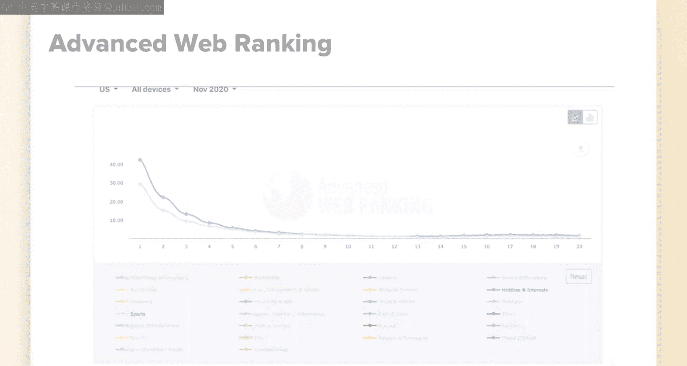
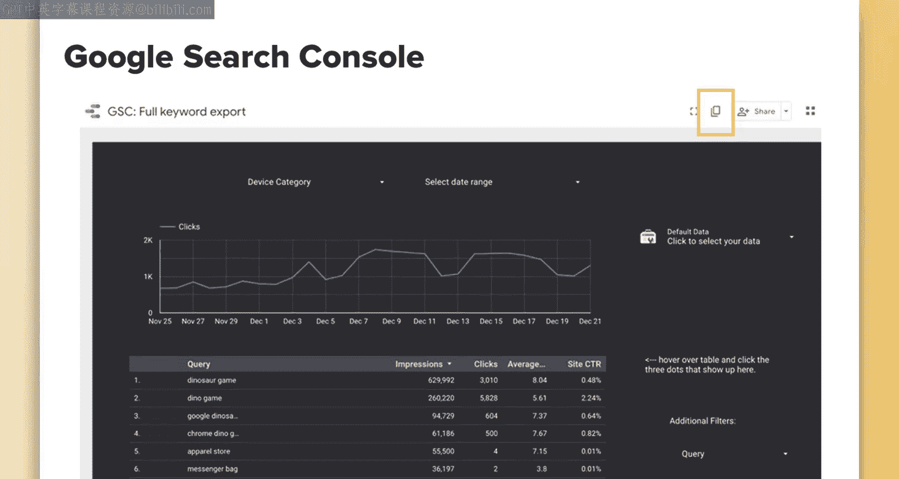
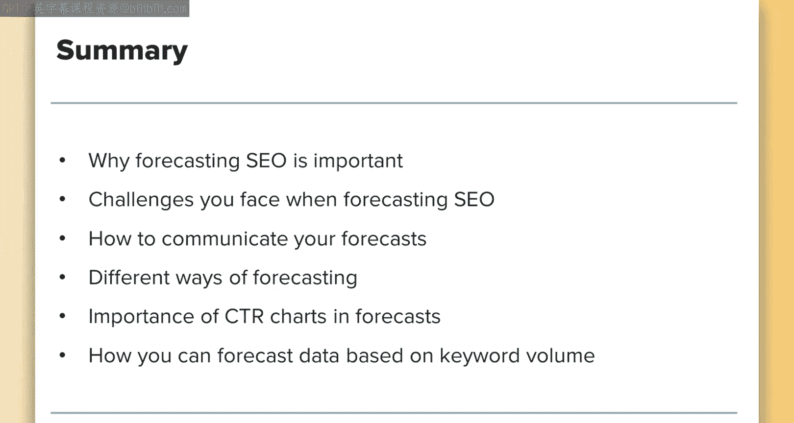

# 093：UCD《搜索引擎优化（谷歌、SEO基础、优化网站、进阶、毕业项目）｜Search Engine Optimization》中英字幕 p93 37_SEO影响预测 第三部分.zh_en -BV1N66VYsEue_p93-

There are positives and negatives to creating your own or using one online ultimately。

 users in your specific industry may have different behavior or may be likely to see a different type of search results。

 for example， some industry search result pages may have more universal search results types like YouTube videos or rich results that could impact clickthrough rate。

Creating your own click through rate chart can be time consuming and very calculation intensive。

If you're not fond of creating formulas in Excel or using programs like BI。

 then the first option may be better。However， having your own is really nice when showing how your data relates back to your own site's clickthrough rate。

 I personally think it is worth doing at least every so often and then comparing your clickthrough rate data to popular charts to see how it matches up if it's close you can save time and use the premade ones if it's really radically different then you know you did good by creating your own and can use that method and calculation going forward to just continually update it a couple times a year。

If you decide to go with a prec version， you can use the one above。

 but I'll also include a link to a site that collects data on click through rate by various industries。

 so this will at least be slightly more accurate to your industry。

That side I just mentioned is advanced web ranking。

 so if you decide to go with a precreated version I suggest checking out this one and will'll include a link in the notes what they do is they create CTR charts by industry so it will be a little bit more accurate than a standard one one of the downsides。

To this over your own is it still leaves room to accuracy questions。 For example。

 would fishing be included as sports or hobbies for the first few positions。

 the difference in CTR would present very different traffic numbers using this example。

Also note that you can only select the month， so if you have a lot of seasonality。

 you may want to look at exporting month by month to get an idea of your site's average over time。

I recommend checking out your industry and if you have time。

 calculate your own click through rate and compare it to others。

For calculating your own click through rate， I'll include some links to relevant resources at a high level you'll need to download your data from Google Search consolesole and customize this data to remove some of the inherent problems with Google search consoles accuracy。

Since the data you can download directly from Search consoles is limited to 100 rows。

 you will want to connect it to something like Data Studio to get more rows of data。

I'm going to include a link to a data studio tool， unfortunately I can't remember who originally created this template to give them credit if anybody knows drop a link but but what you can do is create a copy of this and then you can then connect it to your own Google search console account and download the data that you need for the date range you want。

 I suggest at least three months of data。

Then next， again， at a high level， manually filter out brand terms。

 this will give you a better representation of your industry click through rate。

Filter out outliers that can throw your data off。 For example。

 sometimes things with a very low number of impressions have a very high click through rate that can skew your data a little bit。

 Remember， Google search console averages and samples data。 So a lot of calculations may bethawed。

If you don't analyze that information and remove issues that can cause data discrepancies。

 your data may be off。Next， you'll want to take the sum of your clicks divided by the sum of your impressions at each rank level from Google search Cons data。

 and you'll come out with a custom CTR curve。This is really involved and unless you want to go through the entire process right now。

 but you probably don't。I'm going to go I'm not going to go through the whole steps it's a very lengthy process to help out I'll leave you with some helpful links these are two very reputable industry blogs and they have some great examples of step by step instructions on how to do this one is Searss blog and they have a nice video and another one is to ayma and they have a nice walkthrough with screenshots。

Now that you have your CTR chart in place， the next step is to consider what you're planning to accomplish over the time you're forecasting。

 for example， if you're doing annual forecasting or quarterly forecasting。

You should have a roadmap in place with your planned projects and ideal completion dates this will help you forecast when you might start to see value from your efforts。

For example， you might want to forecast sitewide improvements that might be things like technical fixes such as speed。

 removing a lot of duplicate content， improving internal linking。

 or you might want to forecast projectbased improvements such as adding a blog to your site or a new section ideally you'd probably want to do both so just really forecast what you're likely to accomplish over the period of time you set out and the dates you want those accomplished by because especially if you have seasonality as a factor in your calculations。

 having the date you implement these by will be critical to forecasting。

As accurately as you can。In general， I personally find predicting site wide improvements。

 the hardest ones to forecast， unlike adding a section share site where you can rely on content around a specific set of keywords that have data that you can predict information around。

 site wide is a little hard to relate to specific keywords and position improvements。

The best way I've found to forecast involves downloading your top keywords from Google Search consolesole。

Start by downloading your keywords from Google search console。

 just focus on the top keywords for now， you know you're already ranking and getting traffic for these。

 so making site wide improvements will。In theory， and very likely。

 just benefit these keywords and help you get more traffic to them。

And it also includes your average rank position， so you can see what your average rank is and then run estimates as to where you might be if you rank higher or God forbid lower。

Next， run these keywords through a tool like Google AdWs to get the search volume data so you can predict where you'll be in certain positions。

Next， using the clickthrough chart that you discovered or the one you made for your very own site。

 you can then take the search volume data and the click through rate position and forecast what percentage of that data you're likely to see based on what position you're in。

Next is an example for if you were to add a new section to your site this is pretty detailed for an example but let's just run through it really quick again this isn't the only way to do this。

 theres going to be multiple ways I suggest finding one that works best for you。

 but this is an example of how I recently did it for a new section on our site so I'll run through my process。

So forecasting your SEO value from new projects such as adding a blog to your site uses a similar process as forecasting site wide you want to forecast by potential positions。

 let's say you are going to create an educational section answering queries users have a particular subject。

In this case， I found various queries related to fish species such as when to fish for bass or what bait is best to use for bass。

I collected a list of about 201 longtail， remember longtail is keywords that have like three or more words to them and are generally question based。

 so longtail keywords related to this and then ran those all through Google AdWs so I could get specific search form data。

But you can use whatever keyword research tool you prefer。So in this case。

 since fishing is very seasonal， I wanted to account for seasonality。

 so I made sure to get estimated search volume for each month over my forecasted range in this case 10 month period。

I added the volume together for each month listed and then estimated the traffic we were currently receiving based on the current ranking。

 which is， say around the bottom of page1 or top of page2， so very low。

I know that we're going to make significant improvement to the content for these terms。

 so I created a forecasted CTR starting at a lower ranking or click through rate percentage and then slowly rising as we gain SE attraction throughout the year。

In this case， I estimated the potential positions of queries based on the average position of terms I know we rank well for。

And how likely we are to be able to reach similar positions based on competing search results and our domain authority。

Based on this forecast at the end of a 10 month period post implementation。

 I forecasted that we would acquire close to 490，000 extra visits。

I will then use these in scenarios and create a forecast for each scenario， aggressive， conservative。

 etc。Now I can roll this into a larger forecast， such as site wide changes or use this as an argument for getting buy in into why we should focus on。

Improving our content and improving our tools around these specific keywords so that we can create a plan for optimizing around these particular queries。

So your next steps would be to do this for big projects or work in a similar fashion for a site wide forecast。

When you're providing your forecast， be sure to provide a visualization for this and tie it back to revenue。

Be sure to add information on what it'll take to get there， for example， to get this traffic。

 we need to have this project implemented by this date。

And include different scenarios for different cases。So in summary。

You should understand why forecasting SEO is important。

Some of the challenges you may face when forecasting SEO。

How to communicate your forecasts appropriately。Different ways of forecasting upcoming Seo projects。

How to do a site wide forecast。The importance of click through rate charts in forecasting and the benefits of using an industry created one or creating your own and some general guidelines on how to create your own should you do so。

And some basic steps into how you can forecast data based on a range of keyword volume and segmenting that by months over a period of time。

