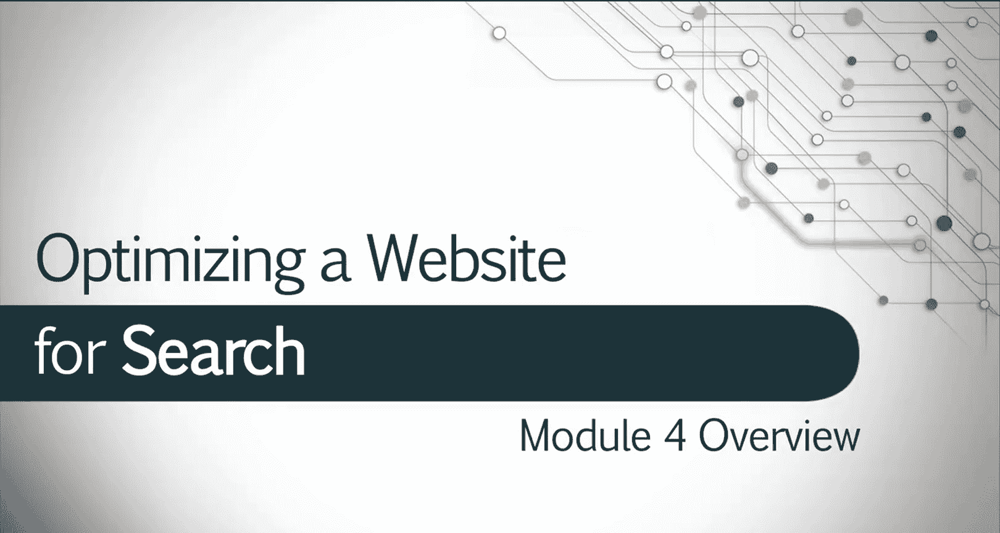
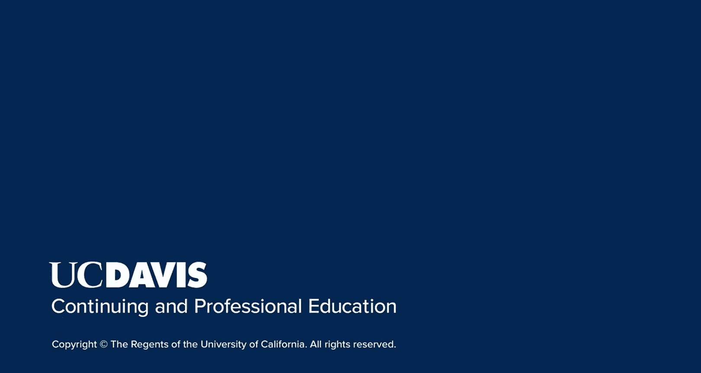

# SEO的艺术：094：创建SEO推广活动

在本节课中，我们将学习如何将之前掌握的SEO知识整合起来，应用于实际的客户项目中。我们将重点讨论客户管理、报告撰写，以及如何向客户展示SEO工作的价值与进展。

到目前为止，你已经学习了如何优化网站的页面SEO元素、分析网站受众、进行关键词研究、优化本地搜索等大量知识。但搜索引擎优化的最终目的，是帮助客户实现其网站目标。为此，你需要深入了解客户及其需求，并能够展示实现其目标的进展过程。

接下来，让我们看看如何运用已学的SEO技能来让客户满意。在本模块中，我们将讨论客户管理、报告撰写，以及在为客户工作时整合所有所学信息的其他技巧。

## 了解客户需求

上一节我们介绍了SEO的最终目标，本节中我们来看看实现目标的第一步：深入了解客户。在开始任何技术性工作之前，必须明确客户希望通过网站达成的商业目标。

以下是了解客户需求时需要关注的几个核心方面：

*   **商业目标**：客户是希望增加销售额、获取潜在客户、提升品牌知名度，还是其他？
*   **关键绩效指标**：哪些具体数据可以用来衡量成功？例如，可以是**转化率**、**自然流量**或**关键词排名**。
*   **目标受众**：客户的产品或服务面向哪些人群？他们的搜索意图是什么？
*   **竞争对手**：客户在市场中与谁竞争？他们的SEO表现如何？

## 制定SEO策略与提案

明确了客户需求后，下一步就是制定一份清晰的SEO策略与提案。这份文件将作为你与客户之间的行动蓝图。

一份完整的SEO提案通常包含以下部分：

*   **现状分析**：概述网站当前的SEO表现和存在的问题。
*   **目标设定**：根据客户需求，设定具体、可衡量、可实现、相关且有时限的**SMART目标**。
*   **策略概述**：简要说明你将采取的核心优化方法，例如：`on-page优化 + 内容建设 + 技术性SEO审计`。
*   **工作范围与时间线**：详细列出你将执行的具体任务及其预计完成时间。
*   **报告机制**：说明你将如何（例如每月一次）以及通过哪些指标向客户汇报进展。

## 执行与持续优化

提案获得认可后，便进入执行阶段。此阶段需要灵活运用之前所学的所有SEO技能，并根据数据反馈进行持续调整。

执行过程中的关键活动包括：

*   **按计划实施**：根据提案中的时间线，执行关键词优化、内容创建、技术修复等任务。
*   **监控与数据分析**：定期使用工具（如Google Analytics, Search Console）监控核心KPI的变化。
*   **A/B测试**：对于重要的改动（如标题标签、登录页），可以进行测试以确定最佳方案。代码示例：通过Google Optimize等工具设置测试。
*   **策略调整**：根据数据表现，灵活调整后续的优化重点。例如，如果发现某个内容主题流量增长显著，可以加大该方向的投入。

## 有效的客户报告与沟通

清晰、定期的沟通是维持良好客户关系并展示工作价值的关键。报告不应仅仅是数据的罗列，而应讲述一个关于进展和价值的“故事”。

一份有价值的SEO报告应包含以下要素：

*   **执行摘要**：用一两句话总结本报告周期内的核心成就与后续计划。
*   **目标进度**：直观展示相对于**SMART目标**的完成情况。可以使用图表。
*   **关键指标展示**：突出显示最重要的2-3个指标的变化，如自然流量增长百分比或排名前10的关键词数量。
*   **已完成工作**：列出本周期内完成的具体任务。
*   **洞察与建议**：基于数据，提供下一步的行动建议。这是体现你专业价值的部分。

本节课中我们一起学习了如何将SEO技术知识转化为成功的客户项目。我们从了解客户需求开始，学习了如何制定策略提案，再到执行、监控与优化，最后强调了通过有效报告与客户沟通价值的重要性。记住，出色的SEO不仅是技术工作，更是理解商业目标、管理期望并持续证明价值的过程。