# 095：UCD《搜索引擎优化（谷歌、SEO基础、优化网站、进阶、毕业项目）｜Search Engine Optimization》中英字幕 p95 39_界定SEO项目范围.zh_en -BV1N66VYsEue_p95-

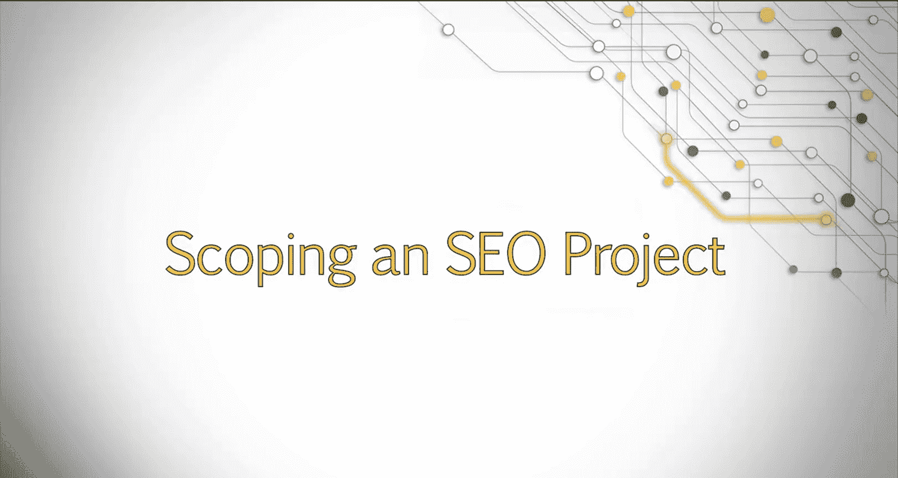

Welcome， when you begin working with the client， one of the first questions your client will have is。

 how much is all of this going to cost me。😊，To provide as accurate an estimate as possible。

 you'll need to have an idea about the amount of time you'll devote to the project。

So how do you begin to develop an accurate estimate？In this lesson。

 we'll talk about how to scope a project by conducting a mini audit and show you how to identify both quick wins and complex issues to present to your client。

Before you begin working with a client， you will first need to sell the client your services and price your service appropriately。

When you quote pricing， you can either charge hourly with an estimated number of hours you expect a project to take。

Or quote on a project cost。If using project based quoting。

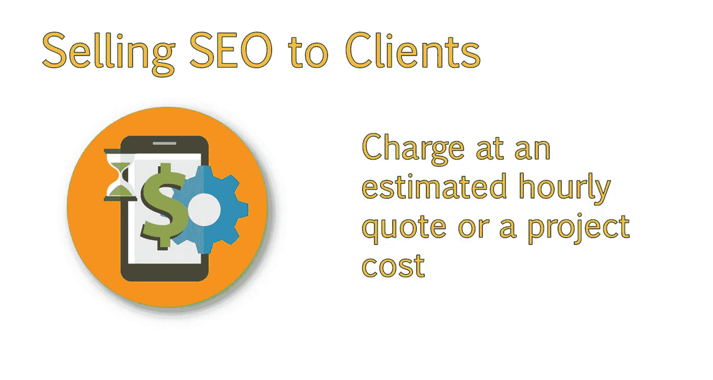

You will still need to figure out ahead of time exactly how much work you are looking at。

 so you don't charge a small fee for a lengthy project。

Pricing will usually come into play when you are working as a consultant。However。

 on the agency side of things， it may still be necessary to determine how long a project may take。

And provide that information to the client or the sales team。

Being able to determine how long a project will take。Is also important from an in house perspective。

You may be working on multiple site related projects with varying deadlines。

You will want to be able to estimate a project's length。

 prioritize your work effectively and be able to answer upper management if they ask when a new project can be completed by。

 There are a couple of things you want to look at when determining the project size。😊。

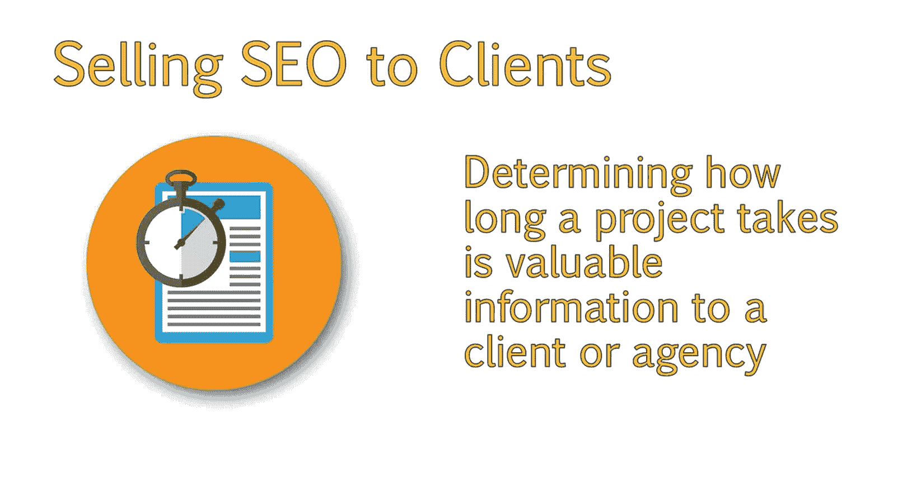

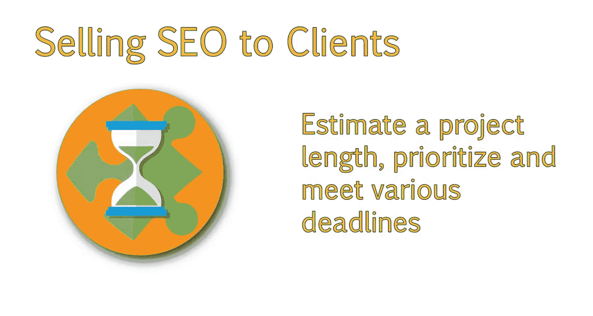

One of the first things will be to determine how large and complex the site is。

Size will definitely affect the amount of time needed to work on a project。

 as well as the cost of the project。However， in some cases。

 you will have clients with big sites and smaller budgets。In these cases。

 try to identify the top pages that will provide the most value to the client to help determine the size of the site。

 I suggest crawling the site。 Many times， the crawler will find a section of pages not immediately visible when you are manually reviewing the site。

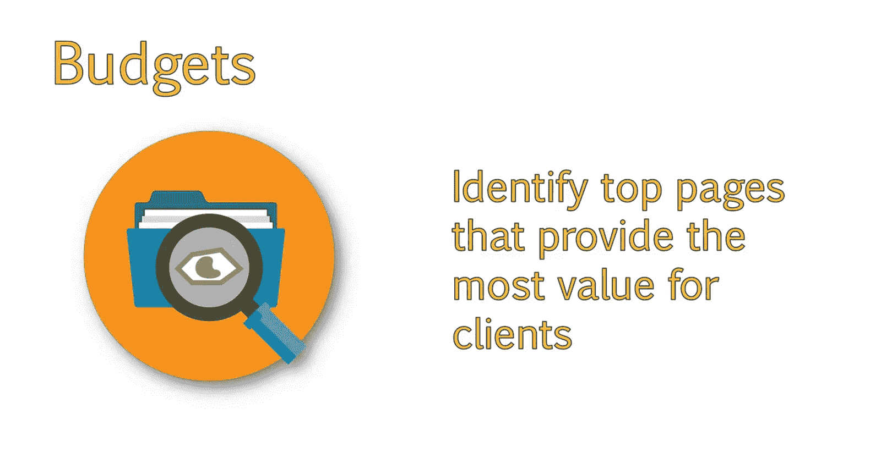

We will be addressing mostly on page elements to check for here。

 as well as a few basic technical factors and offsite factors。

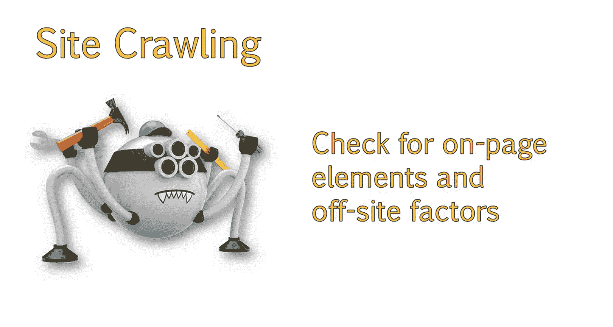

Once you have crawled the site， it's important to take note of a couple things。 First。

 look at the title tags and meta descriptions。 Ask yourself whether or not these are optimized。

By examining title tags， you can check to see if they appear to have a keyword focus。If so。

 take a selection of the keywords for those top pages and run those through a rank checking tool to see where the site is ranking。

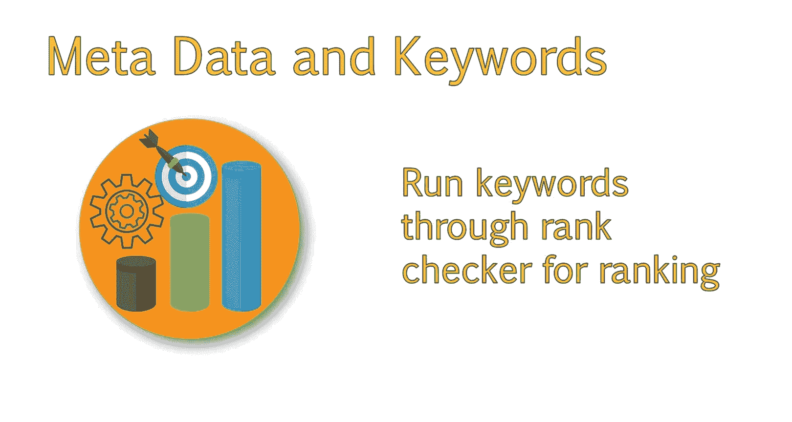

You may also want to check the volume of the terms using the Google keyword tool to see how competitive they may be。

 or if there is a need to target them based on the volume that keyword may be getting。Next。

 check to see if you see a lot of duplicate metadata。

Look at the pages and see if they have heading tags。

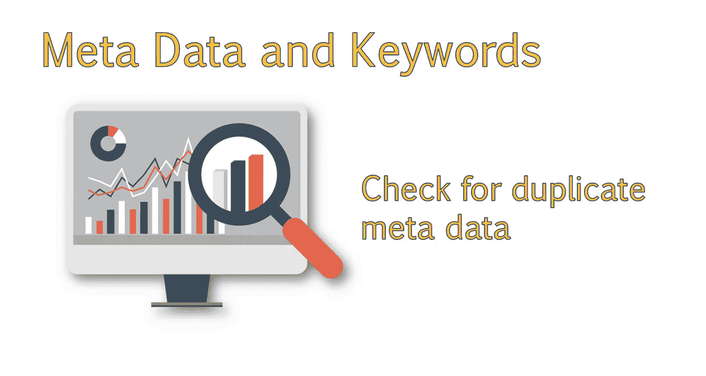

Also， look out for error pages or other issues on the site。If you see a lot of errors。

 this will likely have to be addressed in a deeper technical audit of the site。

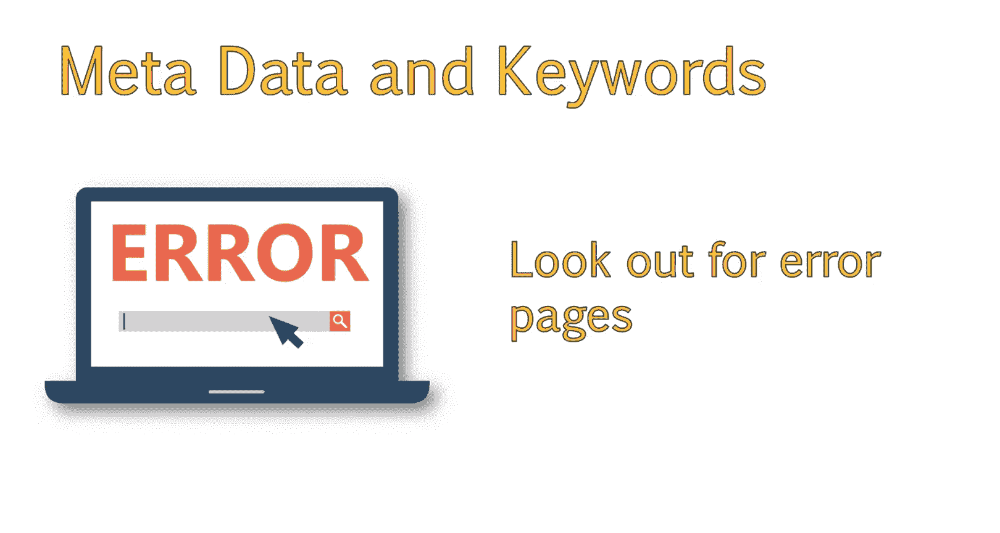

You should also visit the site and see what the on page Con looks like。

Check to see how much content they have， how optimized it is。

 and whether or not they are including useful resources such as videos or images within the content。

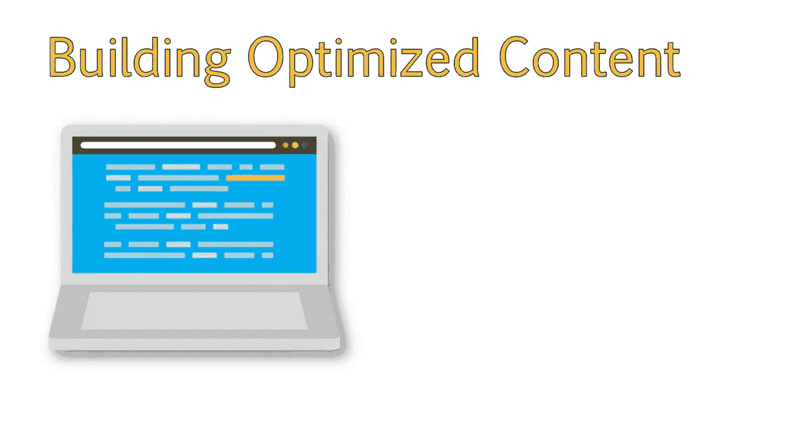

It's also a good idea to do a quick duplication check of that content。

There are tools out there that allow you to do this。 One that comes to mind is copyscape。

 But you can also just take small snippets of code from the top pages of the site and search Google for that phrase using quotes。

 It's also a good idea to do a quick check of their backling profile。😊。

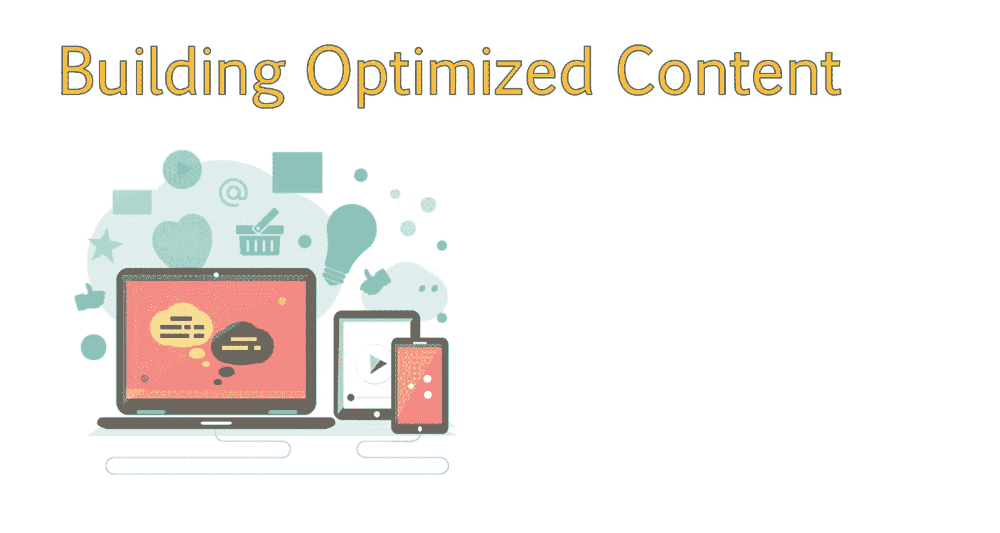

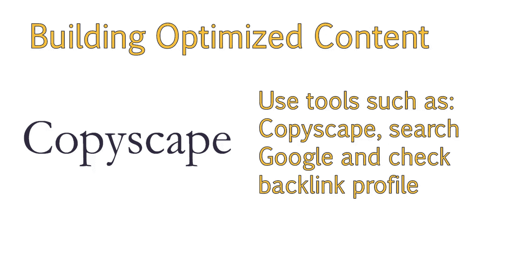

This can provide insight into whether or not they have worked with an SEO agency in the past based on the quality and anchor text of the links。

Conversely， you will sometimes notice well optimized anchor text on low quality or spammy sites。

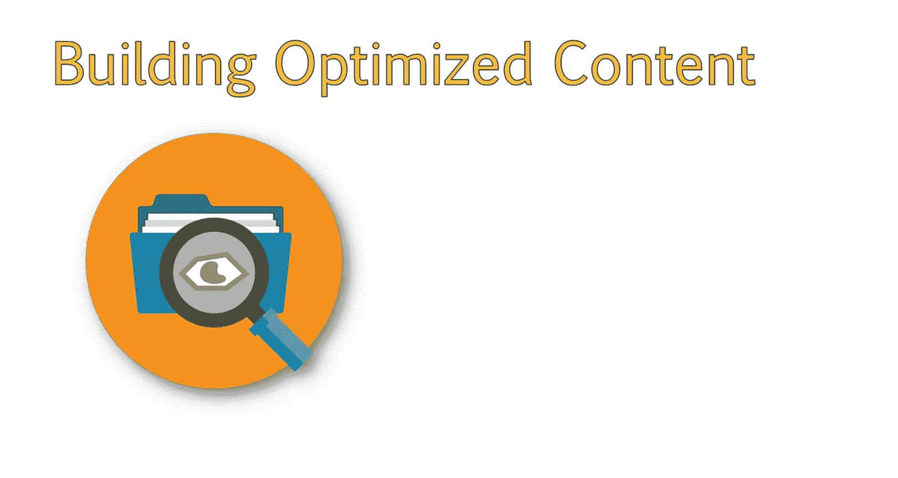

This is an indication that they have worked with the spammy Seo Company。

 and it may take more work to improve their rankings due to potential penalties and past history。

 Write down all of the areas you notice that will need optimization or look like they may have deeper issues。

I would suggest separating this by items that are considered quick wins and ones that are more complex issues that will take some time but deliver value。

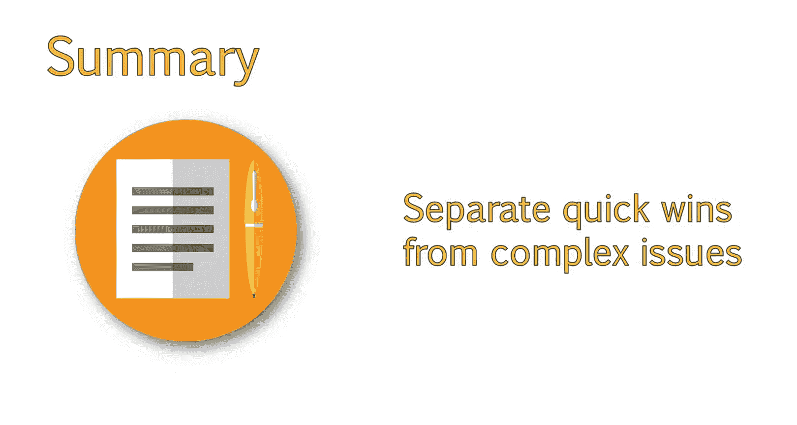

This will give you an idea of the complexity and time needed to optimize a site。

 and you can set your hours and price range accordingly。At first。

 it will be difficult to tell how many hours something takes you。

But as you work with more and more sites， you will have a better idea of project time and cost。

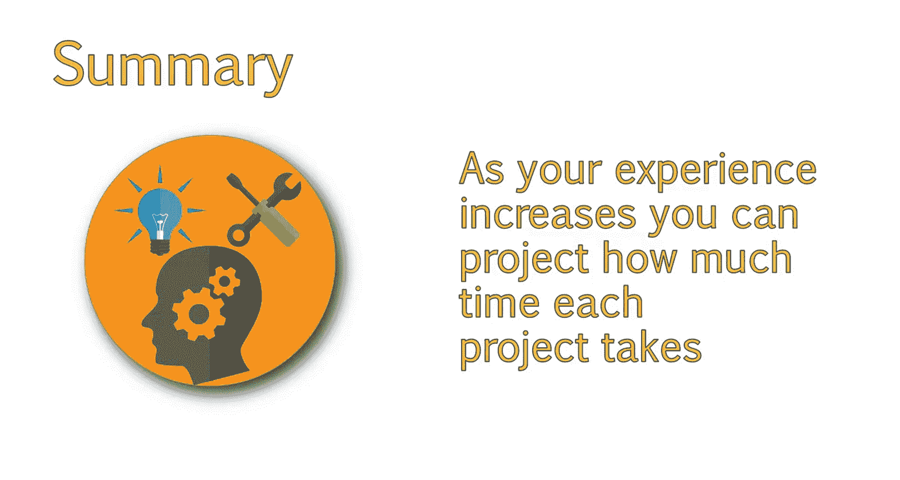