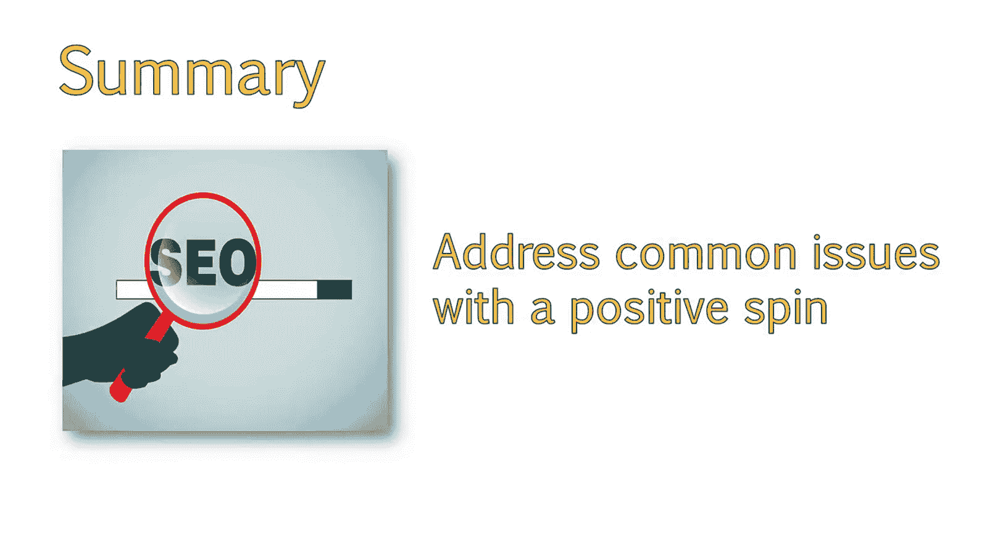

# 096：UCD《搜索引擎优化（谷歌、SEO基础、优化网站、进阶、毕业项目）｜Search Engine Optimization》中英字幕 p96 40_向潜在客户证明价值.zh_en -BV1N66VYsEue_p96-

Hello， now that we've discussed looking at your client's site to gauge how long a project may take。

 let's discuss some ways you can prove the value of your services to potential clients。

When working with clients， you'll want to make clear the potential value that a strong optimization strategy can bring to their business。

But you don't want to provide too much for free before you are hired。In this lesson。

 we'll share ways to delicately describe the value you provide in a way that doesn't give away too much free advice and frames the issues with a positive spin。

😊，A common scenario is lack of keyword direction。This means that the website has no real clear focus of keywords and may be all over the place and what they are trying to optimize for。

For example， say you were working for a business that sold recliners。

 but they were optimizing their sight for terms like furniture and living rooms。

 rather than keywords that were closely related to their business。

 such as recliners or reclining chairs。In this case。

 you could find something positive about the site to help frame the issue。

Your site is well laid out and appears user friendly。However。

 we were unable to locate a set of important keywords you want to focus on。

This helps search engines understand the theme of your site and what queries it should rank for。

With some audience analysis to determine your target user and in depth keyword research to find keywords these target users are searching for。

We would be able to recommend a variety of improvements throughout your site to increase your organic traffic。

Alternatively， you might end up with potential clients who know just enough about Seo to be harmful to themselves。

 or perhaps they hired an Seo who really didn't understand keyword targeting or what they were doing。

These people are likely to pick some keywords， usually very broad。

 competitive keywords that aren't well targeted and plant these everywhere they can。 For example。

 let's say you are working with a client that sold shoes。

But instead of using specific terms like the brand names or types of shoes。

They use the keyword shoes and buy shoes and order shoes all over the place。In this case。

 an example conversation you would have with the potential client would be from our research。

 it appears that some SEOo work has been done in the past。

The keywords are being used in the right places， but we noted the frequency of usage may be a bit too high from a search engine perspective。

You would be able to look at the chosen keywords and compare this to your rankings and how competitive the term is and then recommend best steps moving forward。

 Other common issues include incorrect keywords that are being targeted。 For example。

 if a company selling dining room furniture is trying to rank just for the word tables。😊。

Keywords being duplicated throughout the site。 For example， the shoe site。

 which just use the word shoes on each page。Content being duplicated throughout the site。

 This could be articles， product descriptions or more。

A lack of content throughout the site or important areas。 This is a common issue。

 Many sites pay more attention to the design and then worry about the content later or neglect content completely。

Another issue you may find is content that is written for search engines and not users。

This is obvious when you read the content， and it sounds very unnatural and forced。

Often you will see important keywords repeated too frequently。

I suggest creating a script for two of these scenarios and explaining to clients how the chosen scenario impacts their site and how you can improve it。

 This will help you practice finding these issues and explaining them to clients Once you have determined some of the issues impacting the site。

 you can have a more productive conversation with potential clients。

As well as show the value of what you can provide。It's helpful to go over some of the issues you discovered and how improving these issues will benefit their site。

This part of the process can be difficult because there's a fine line between giving information away for free and showing your value。

 If you simply tell the client that you can help improve their rankings without specifying how you plan to do so。

 It will be more difficult for them to have faith in your abilities。

 you can choose what issues to present and how vague you want to be。But in my experience。

Unless you can provide them with some free information they can take away。

 they won't be inclined to sign up for your services。

I won't lie and say that potential clients don't take advantage of this。

 There have been times in my career， and I'm sure you will run into the same issues for you find a client who is shopping around。

 They're just really trying to get as much free information as possible so that they can do the work themselves。

This can't really be prevented。But the amount of clients you will gain by doing this will exceed the amount who are just looking for handouts。

When bringing up sight issues you discovered， this should always be brought up delicately。

 Many times， the client tried to optimize the sight themselves。

And while they know they didn't do a good job， which is the reason they're coming to you。

You should still t carefully。Always try to frame SEO issues you find with a positive spin。

And reiterate how you can help them solve that problem。Every site will be different。

 but here are some common issues you will discover。We will go over some examples of common problems。

 Next， you should now have an understanding of common issues you may discover in your initial review that will show value to the client。

 as well as ways you can best frame these issues with a positive spin。

