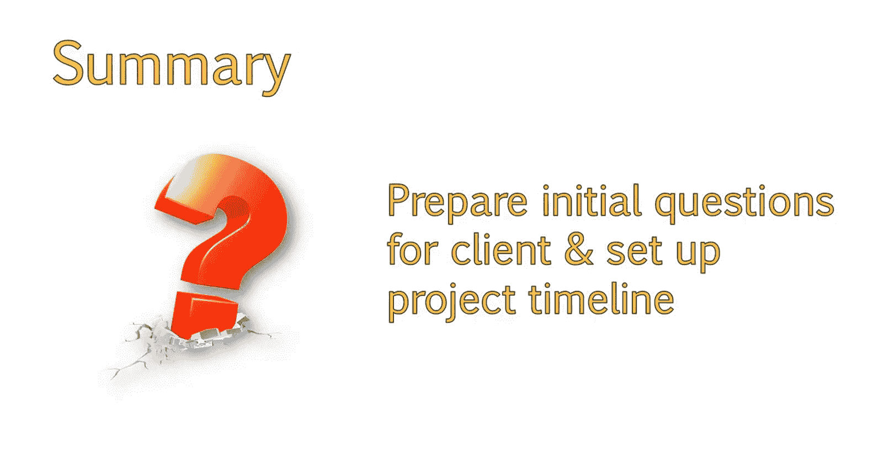

# 搜索引擎优化：098：提出正确的问题与制定项目时间线

在本节课中，我们将学习如何在与客户签约后进行有效的初次会议，通过提出正确的问题来管理双方期望，并学习如何制定清晰的项目时间线来规划工作。

上一节我们讨论了初步的销售演示策略，本节中我们来看看客户管理技巧。我们将从初次会议开始，探讨议程中必须包含的事项。虽然管理客户期望很重要，但提出正确的问题来管理自己对项目的期望同样关键。本节课将探讨这些重要问题，以及如何通过提问找到前进的方向。我们还将学习如何开始制定项目时间线。

## 初次会议：关键问题清单

一旦客户签约，应安排初次会议以深入了解其业务、过往SEO合作历史及其目标。在此过程中，获取以下信息至关重要。

以下是初次会议中需要了解的关键信息：

1.  **过往SEO历史**：客户过去是否对网站进行过SEO优化，或与其他SEO公司合作过？这一点很重要，因为这可能意味着你需要应对已有的惩罚，或需要避免即将到来的惩罚。了解前SEO公司做了什么，以及客户喜欢和不喜欢其服务的哪些方面，能让你洞察客户的期望以及你对客户的期望。例如，如果客户表示不喜欢上一家SEO公司是因为无法让他们获得第一名排名，就需要警惕。
2.  **域名历史**：确保客户过去没有使用过其他域名。如果使用过，询问更换域名的原因，以确认是否与某种惩罚有关。即使过去的域名没有受到惩罚，你也需要验证这些旧域名是否已正确重定向，否则客户可能损失大量权威性。
3.  **关键词排名追踪**：了解客户目前是否追踪关键词排名。如果是，索取其追踪的关键词列表。这让你能判断这些关键词是否可实现，并分析其网站对这些关键词的优化程度。如果从SEO角度看，他们选择的关键词并非最佳，这给你提供了提前教育客户的机会，避免在你推荐关键词时出现意外。注意，有些客户通过在浏览器中输入关键词来查看网站排名，但需记住个性化搜索的影响。这可能导致网站对他们自己显示的排名远高于对大多数人的实际排名，因此了解他们追踪排名的方式很重要。
4.  **核心产品或服务**：这个问题需要针对具体客户定制。例如，房地产客户应能提供其最重要的城市和社区简短列表。电商网站可能注意到某些产品类别总能带动其他产品的追加销售，因此他们最想推广那条特定的产品线。花时间尽可能多地了解他们的业务信息。
5.  **行业术语**：查看行业是否使用专业术语或俚语。如果是，他们的客户是否也使用这些词汇？这在B2B领域更适用，但在B2C垂直领域也可能有用。大多数情况下应避免俚语，但在某些情况下，了解行业术语以便针对这些词进行优化很重要。
6.  **网站变更实施方**：询问是他们自己实施网站变更，还是有其他资源（如开发人员）代为实施。这让你清楚实施你的建议、从而看到效果的难易程度。理想情况下，你应在销售通话中设定期望，让客户明确知道是你来实施建议还是仅提供建议。
7.  **网站性能衡量方式**：了解他们目前如何衡量网站表现。很多人会告诉你他们使用像Google Analytics这样的工具，这很有用。但重要的是注意他们是否追踪特定指标及其原因。例如，他们是否追踪特定目标（如发送邮件的用户数量）？他们是否关注互动指标？这让你了解什么对他们重要。如果你发现他们实际上没有追踪任何数据，很可能是因为他们不知道追踪什么。这给你提供了教育他们、提供价值的机会，甚至可以设立月度报告服务，详细解释数据。

此外，最好在会议中请求访问他们的分析账户。很多人可能在实际成为客户前不愿提供，这没关系，但提前获取这些信息也能为你提供一些有用的见解。

## 制定项目时间线与交付物

向新客户提供交付物时间线也是一个好做法。这让你能解释你将做什么工作、何时做，并设定他们的期望。并非所有顾问都这样做，这完全是可选的，但我发现这有助于避免很多疑问，也让客户感到安心，因为他们可以随时查看你的工作进展。你可以随时更新此时间线的状态。我喜欢将其保存在Google Drive中，以便根据需要更新和添加备注，客户则可以随时查看幕后工作的进展。随着与客户的合作，这个时间线可能需要不断调整。

以下是我提供给客户的典型交付物时间表示例，你可以下载供自己使用。你可能需要根据具体情况稍作编辑，但它能让你清楚可以向客户提供什么。

```
| 周数 | 主要交付物/活动 |
| :--- | :--- |
| 第1周 | 项目启动会议、网站全面技术审计、获取所有必要访问权限。 |
| 第2周 | 提交初步技术审计报告与修复建议。 |
| 第3周 | 关键词研究与竞争分析。 |
| 第4周 | 提交关键词策略与内容优化建议报告。**会议**：讨论初步发现与策略。 |
| 第5-8周 | 实施阶段：协助/指导技术修复与初步内容优化。 |
| 第9周 | 提交首次月度进度报告，包含排名与流量初步数据。 |
| 第10-12周 | 持续优化、链接建设策略启动、内容扩展。 |
| 第12周 | **会议**：季度回顾，讨论结果与下一阶段计划。 |
```

这个表示例涵盖了一个为期三个月、按周划分的时间表。你可以根据需要将“周数”重命名为具体日期。最好包含计划举行会议的时间点，以讨论某些交付物。你不需要包含确切日期，但注明在特定交付物之后举行会议是很好的做法。在此示例文档中，会议项用棕色标出。

## 课程总结




本节课中，我们一起学习了在与客户签约后，如何通过初次会议提出关键问题来深入了解项目背景与管理期望，以及如何制定清晰的项目时间线来规划工作流程。掌握了这些客户管理与项目规划的基础技巧，你现在已经为项目的顺利启动和推进做好了准备。下一节，我们将讨论如何在合作初期就为客户创造兴奋点并立即提供价值。