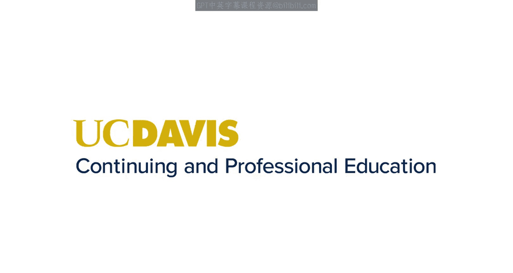
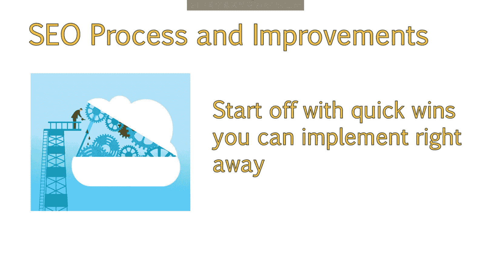
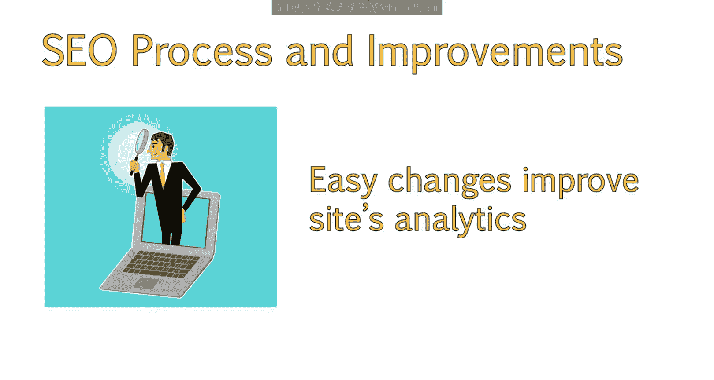
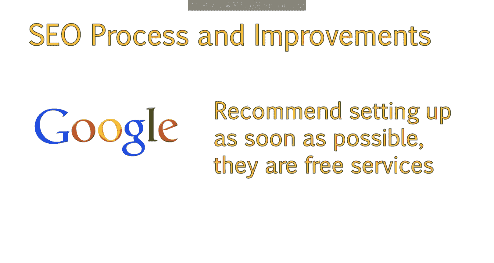
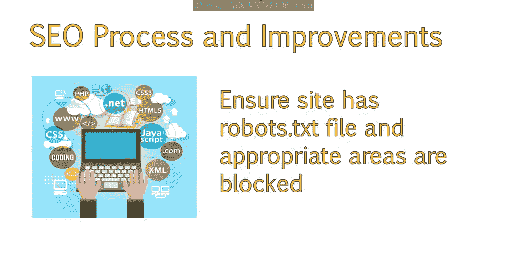
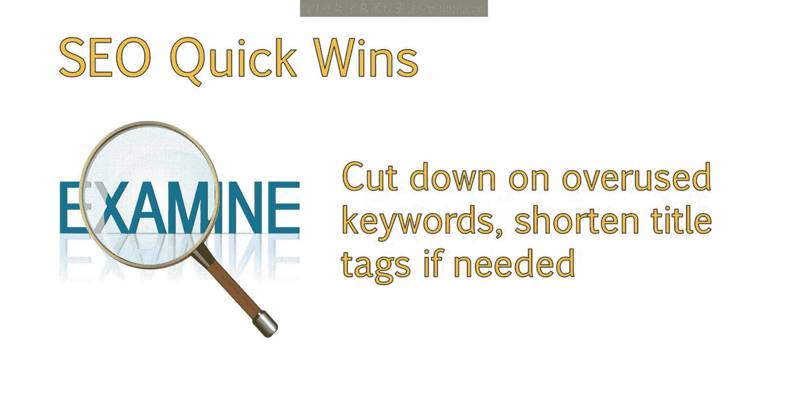
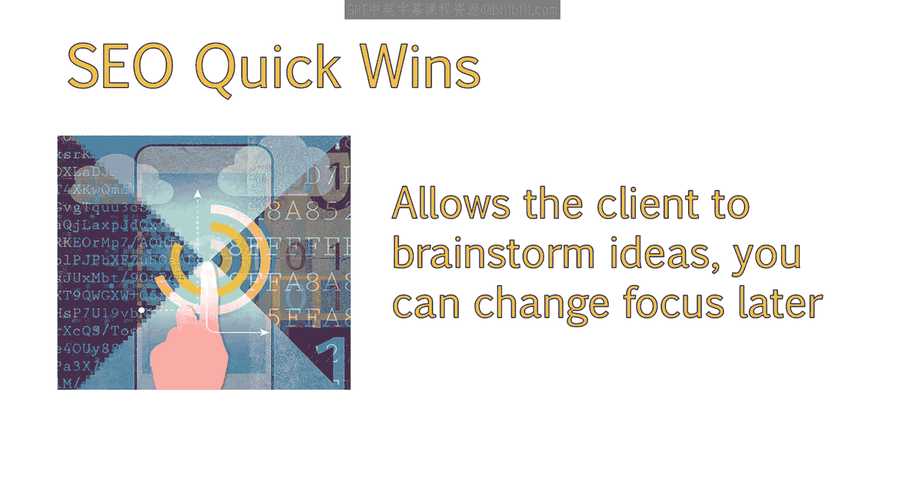
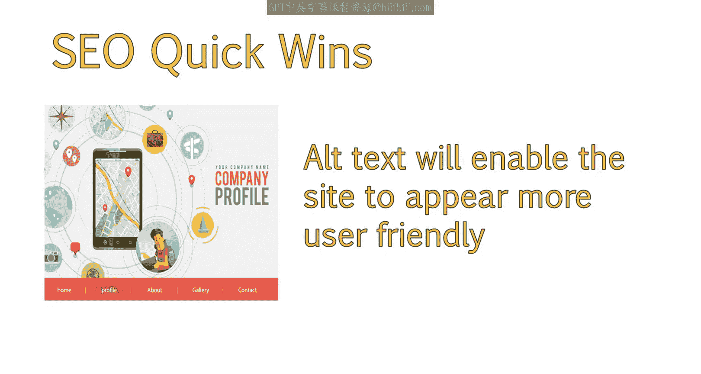
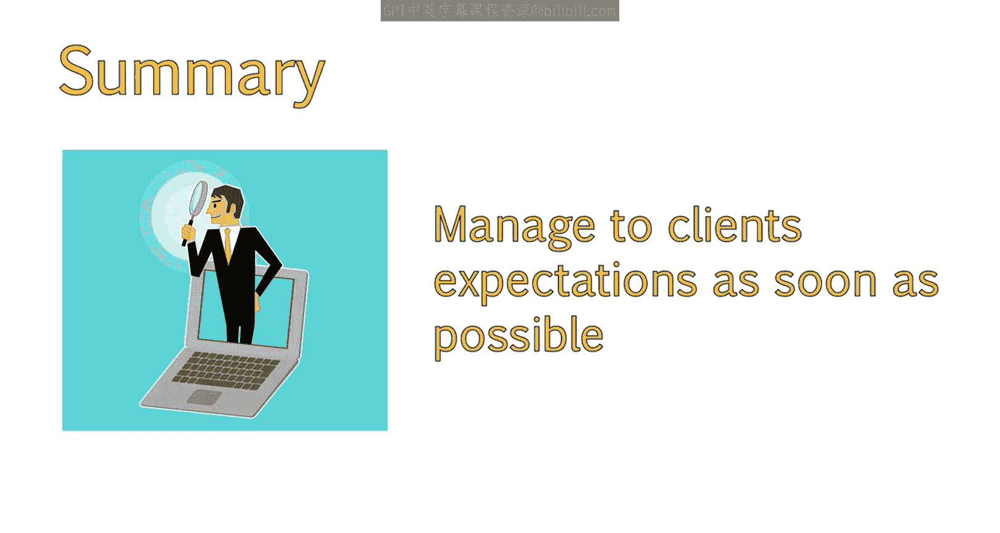

# 099：UCD《搜索引擎优化（谷歌、SEO基础、优化网站、进阶、毕业项目）｜Search Engine Optimization》中英字幕 p99 43_快速制胜的重要性.zh_en -BV1N66VYsEue_p99-

Welcome back。Now that you know more about the ways you can sell to the client and get them on board with your SEO strategy。

 let's discuss how to best manage that relationship once they sign on。

In order to generate some initial enthusiasm about the project。

 it's a good idea to begin with some quick wins that will demonstrate the immediate value of your expertise。

In this lesson， we'll discuss the importance of quick wins and explain some of the strategies for achieving these wins。

To get a new client excited about the Seo process and the upcoming improvements to their site。

 sometimes it's a good idea to start off with some quick wins they can implement right away。😊。

Quick wins are items that are easy to fix and can provide noticeable value in a relatively short amount of time。

😊，It's great to provide any quick wins or low hanging fruit you can point out right off the bat。

This not only gives them something to do while you're working on more detailed documents to be delivered later。

But these easy changes can also help the site start to improve before spending more time and more effort on bigger changes。

The first steps are to make sure your client has Google Webmaster tools and Google Analytics installed。

 If not， these are free services that you should recommend that they set up as soon as possible。😊。

Once Google Webmaster toolsol has been set up。

You should ensure an XML site map has been added to the site and that Google is aware of its location and can access it。

Another thing to make sure of is that the site has robust dot text uploaded and appropriate areas are blocked。

Quick winds will really vary by sight， and you will want to review the site to see if you spot any opportunities not mentioned here。

😊，Some examples include cutting down on keyword usage If the title tags are a long string of keywords。

Add more text to the homepage or other important pages。

This allows them to start working and brainstorming on the text。

And you can go back and change the focus later if needed， to incorporate more keywords。

Add alt text to the images if they don't have any， even if this doesn't include keywords。

 getting alt text on the images will help the site be seen as more user friendly and accessible。

If they have content， link to important pages within that content now that you know of some great steps to take as soon as your client signs on。

And how to manage their expectations throughout the engagement。

Let's move on to what metrics you should track to prove your value to the client。

