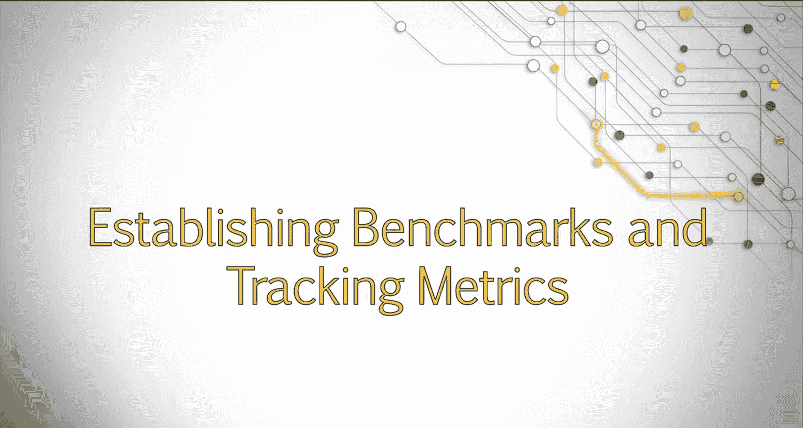
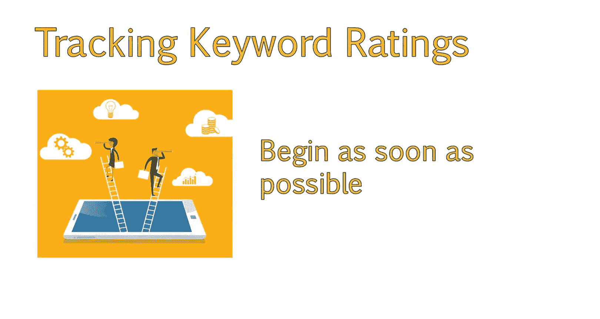
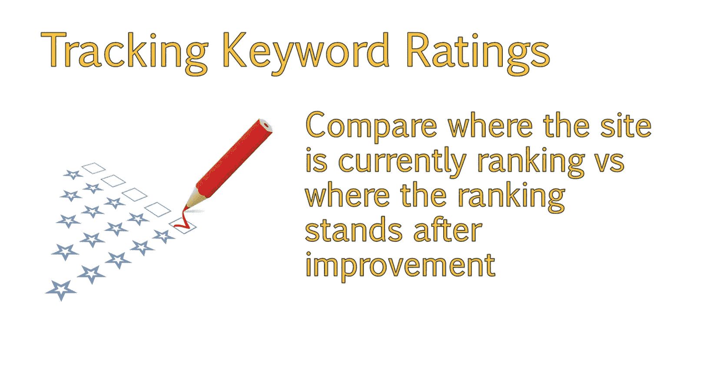
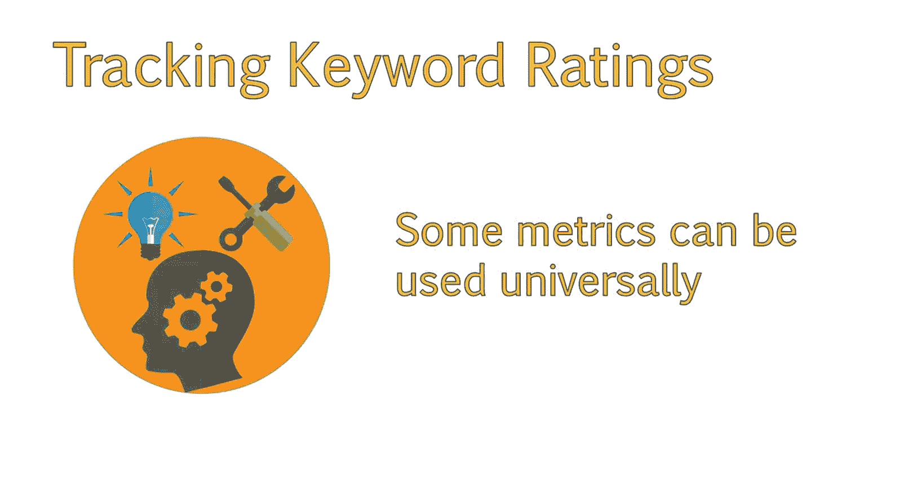
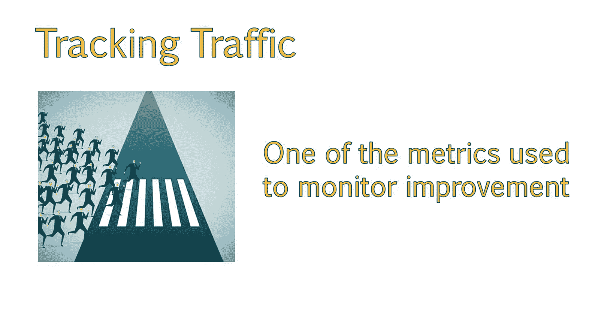
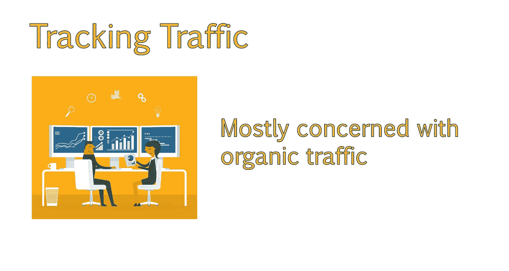
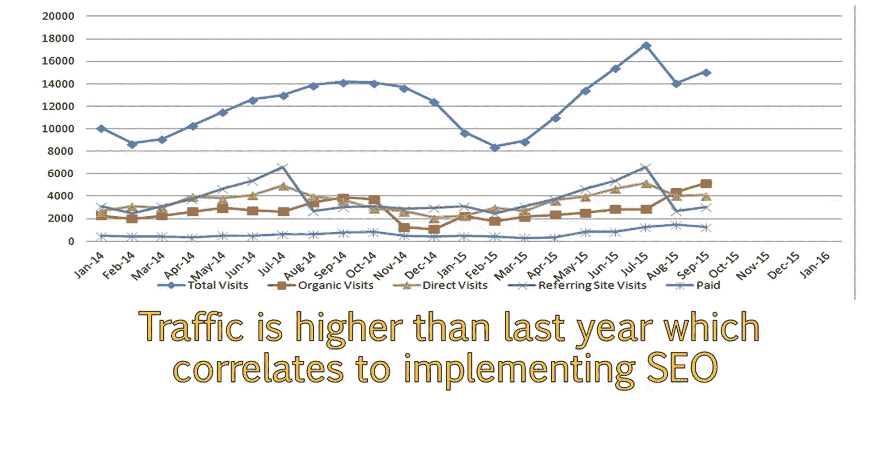
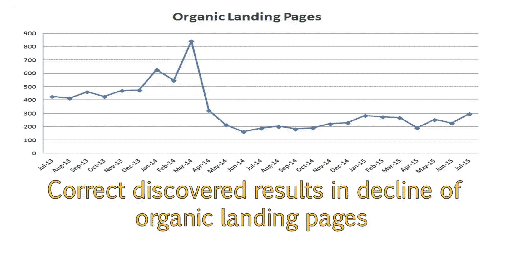
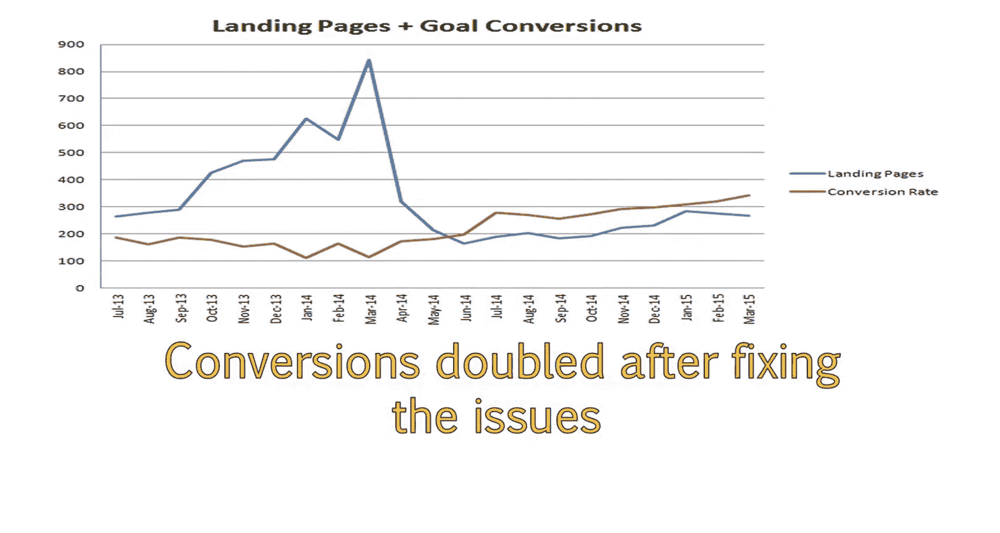

# 101：UCD《搜索引擎优化（谷歌、SEO基础、优化网站、进阶、毕业项目）｜Search Engine Optimization》中英字幕 p101 45_建立基准与追踪指标.zh_en -BV1N66VYsEue_p101-

Welcome back。In addition to tracking smart goals， you should track other metrics to help determine how well your efforts are improving the site。

In order to gauge improvement， you will need to ensure you have a set of benchmarks so you know what state the website was in prior to implementing your changes。

If your client has analytics installed， you can go back and look at past data to get a good idea of how well the website has performed in the past。

Before and after comparisons of your work can really convince clients of the power of your work。

In this lesson， we'll discuss some of the important metrics to track and how to evaluate these metrics for success based on the site's unique needs and past history。

For tracking keyword rankings， you will want to begin tracking your recommended keywords as soon as possible this way。

 you can start collecting data on where the site is currently ranking and where the rankings stands after improving the site。

When it comes to tracking data and analytics， there are a variety of metrics you may want to use。

 Many of these will be specific to each individual clients site in their goals。 However。

 there are some metrics that can be used universally， which we'll discuss now。

 increasing traffic is generally the main goal of an Seo campaign。 As such。

 this is one of the metrics always tracked to monitor improvement。

It's a good idea to look at different types of traffic next to each other and not just look at traffic as a whole。

As SEOs， we are mostly concerned with organic traffic。

 but total traffic numbers are useful as well in this chart。

 you will see a monthly chart of organic traffic over time compared to referral and direct traffic。

When tracking traffic， it's a good idea to go back at least 12 months to get a full year of data。

 This allows you to gain better insight into how traffic is actually performing。 For example。

 without comparing this to last year， it looks like the moment we began Seo in May of 2015。

 the client started seeing major increases。😊，However， comparing this to the last year。

 we see that traffic does tend to go up around the late summer months。Traffic is， however。

 higher than it was at this time last year， which does correlate to when we began Se E O。

 Having a big picture is extremely important to Se E O。 For example。

 this is a client's organic traffic from the beginning of the year， alone。

 This doesn't really tell us anything。 Why is traffic going down。 Should we be worried。

Are these the traffic numbers we should be expecting， However。

 when we add last year's data alongside of this data in a year over year view。

 we get a much better picture。 This shows that the decline is due to seasonality。

 which may be happening a bit later than usual， because of the larger than normal increase in organic traffic。

 Traic tends to decline in the summer months for the site and pick back up in winter and spring。

 not only do we get to see a nice seasonality trend。

 but we can also see that traffic didn't start out too great this year compared to last year。

 but now is exceeding last year's numbers by a large marginAlternatively。

 here is a chart from a client who didn't have analytics installed prior to requesting Seo services。

😊，Due to this， we can see traffic is increasing since the start of our campaign。

 but it's very difficult to tell just how much of an improvement this is。

 Other good metrics to track are engagement metrics。

 This tells us how engaged a user is with the content on our site and can also provide insights into how user friendly the site is。

 Like traffic。 It's a good idea to look at the engagement of organic traffic compared to other forms of traffic。

😊，In these charts， you can see that organic traffic is performing above other types of traffic in terms of both time on site and pages per visit。

 This means that the users who land on the site find it interesting enough to spend time visiting other pages。

😊，We can also see that organic traffic is more engaged than other forms of traffic。

 and that referral traffic tends to perform the worst。😊。

This may be the case of referral traffic linking to poor pages or just poor referrals in general This gives you some insight into how some of your backlink may be performing and where you should look at ways to get more links or improve your existing links。

Another metric I like to track is organic landing pages。

 There are a couple of insights you can get from this， and it's very situational。

 So you want to make sure you account for work that was done in the past and any other information you might have when looking at this。

I determine organic landing pages based on the number of landing pages from organic traffic only this allows you to see how many pages of your site are indexed and actually ranking high enough to draw in visits for a keyword。

This is different than looking at something like indexed pages。

 which will only show you how many pages of your site Google has in its index。

 not necessarily how those pages are performing。In this example。

 organic landing pages have steadily improved since we implemented SEOo changes around August。

This means that the changes we made are resulting in more pages ranking for their keyword term than in the past and are actually receiving visits for that term。

 Here is a different example where you can see that organic landing pages have dropped。

 This is an example of how situational this metric can be。 On first glance。

 you might think that a lot of pages lost their rankings and aren't receiving as much traffic as they did previously。

However， in this case， the client who was in real estate had a lot of expired home listings ranking and was receiving traffic that resulted in a high bounce rate in unsatisfied clients。

 In addition， they had some technical issues where they had a different language directory targeting incorrect geographic areas。

 This resulted in a lot of unqualified traffic for them。 These issues were discovered and corrected。

 and resulted in a decline in organic landing pages。 But in this case。

 this was good as it resulted in more targeted traffic to their site。

 We can see how the quality of traffic improved by looking at their main goal conversion rate compared to the landing page decline。

 In this case， conversions nearly doubled after fixing the aforementioned issues。

 These are just a few examples of some metrics you may want to track。😊。

You should track additional metrics such as any goals they have may set up。

 as this not only provides insight into how your efforts affect the conversion rates of these goals。

But as you can see from the past example， it is useful to look at data trends in relation to one another so you can get a better idea of how a specific change is impacting the client's bottom line。

😊，Some examples of goals include a customer clicking and add to cart button。

 a customer completing a checkout。Someone saving an item to their wish list。

A request for more information or filling out a specific form。

Downloading a white paperper or brochure。The setup of these goals will generally require more advanced skills in Google Analytics。

 and this should be done by your client or their development team unless you specialize in analytics customization。

