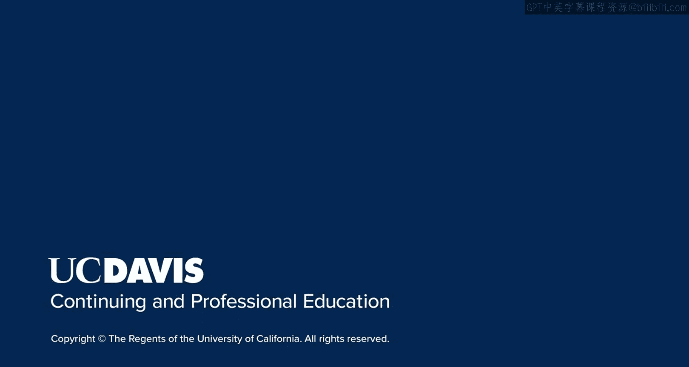

# 103：UCD《搜索引擎优化（谷歌、SEO基础、优化网站、进阶、毕业项目）｜Search Engine Optimization》中英字幕 p103 47_课程总结.zh_en -BV1N66VYsEue_p103-

Welcome back everyone again I want to thank you for joining me for this third course on optimizing a website for search。

Congratulations！If you have taken this course on its own。

 I hope you enjoyed it and will consider continuing your SEO education。

We've covered a great deal of content in this course。

 and you should feel much better equipped to analyze content， design an effective strategy。

 and develop truly great content for your site。Along the way。

 you should have also picked up some tips and tools that you can apply to your SEO toolkit。

I hope you'll continue to develop your expertise in SEO。

Whether you decide to take the additional courses offered by me and my colleagues。

 or continue to do your own independent research into the world of SEO。

I wish you the best of luck and thank you for joining us。

