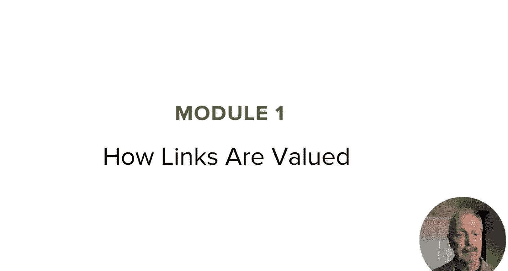
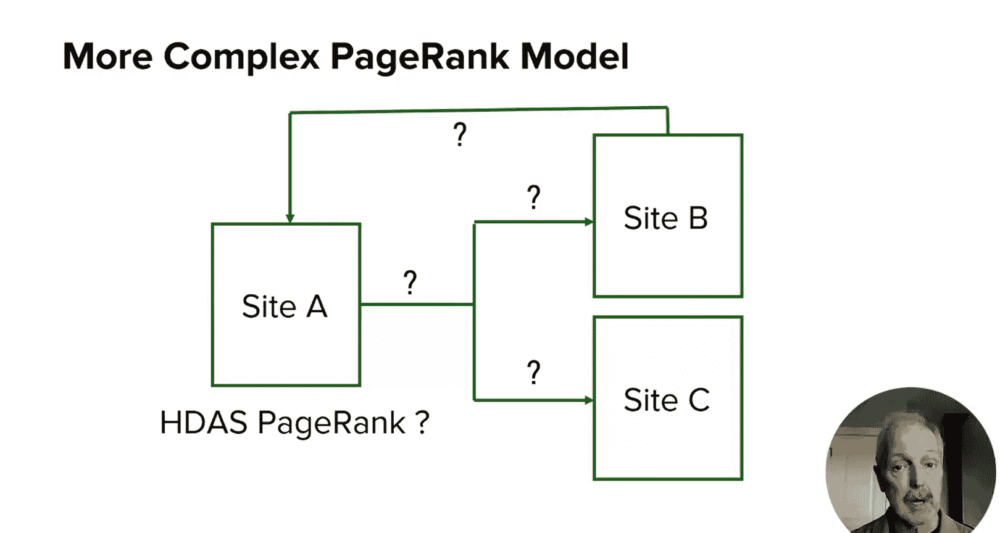
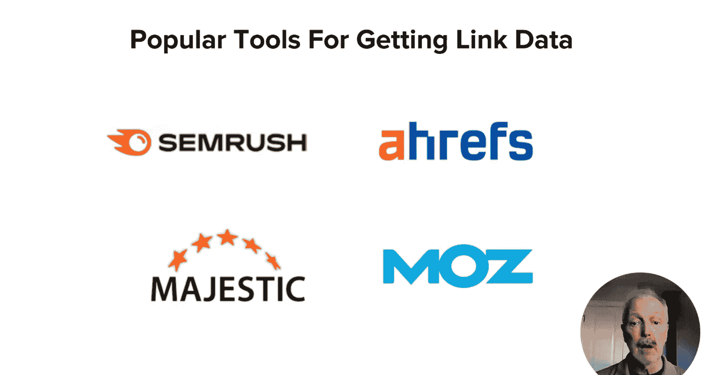
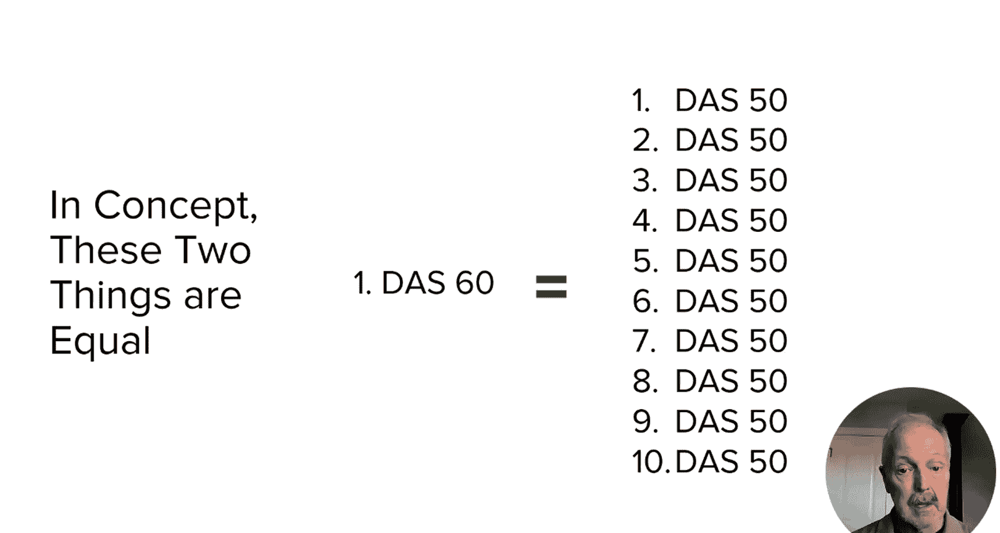
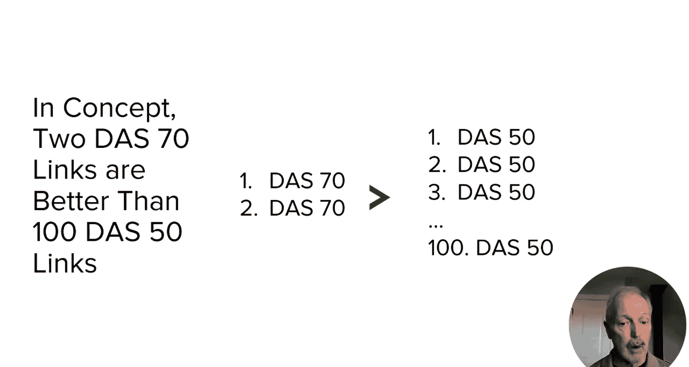
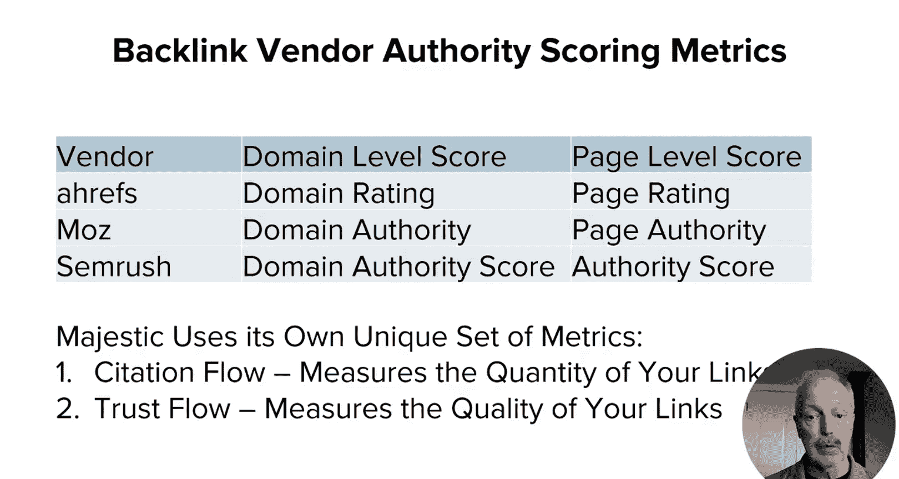
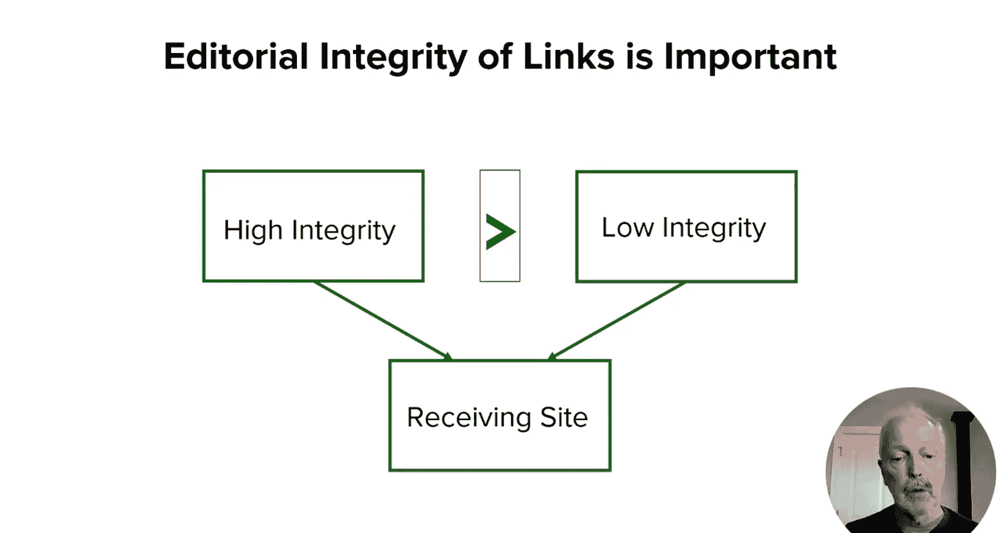

# 106：UCD《搜索引擎优化（谷歌、SEO基础、优化网站、进阶、毕业项目）｜Search Engine Optimization》中英字幕 p106 2_链接价值评估.zh_en -BV1N66VYsEue_p106-

🎼，🎼Yeah。In the last lesson I started to give you some visibility into how links play a role in search engine rankings In this lesson I plan to show you more about how links are valued by search engines and start to give you some idea how you can get measurements of link value for yourself to start。

 I want to talk about the basics of page rank which was the original way that Google valued links。

Please note that Google has told us that the original page rank algorithm。

 as I describe it here within this lesson doesn't work the exact same way Today。

 It's been highly modified， as well as supplemented by entirely new algorithms， still has value。

 though to understand basically how this used to work。

 because it help us understand how to think about the value of links。

So to get an idea of how it works， let's call a quantity of page rank that a page has。

And a certain percentage of that can be voted by that page and links to other pages。

 which we'll call F of x as in the algebraic function kind of thing。

The way that works though is that pay rank is split in some fashion among the outgoing links In this case。

 I'm showing F of x being the page rank that it's voting out and it can split equally between two pages Now to be fair in practice。

 it probably isn't exactly equal to 50% that would be given to each of the two links here in my example。

 it could be slightly different based on where a link is based on a page。

 link relevance and other factors， but for purposes of this discussion。

 you can just imagine that it's exactly equal。So far， the picture looks pretty simple。 However。

 here's where it starts to get a little bit more complicated。

 Imagine you have page J over here on the left。And that it links to pages B and C shown on the top right in the bottom right so far that straightforward。

 But now page B links back to page A。 Now the math already starts to get very complicated because page A has voted some of its page rank to page B。

 which votes some of its page rank back to page A， which makes page A's page rank go up。

 but then it's voting some of that increase page rank back to page B B。

 which can then vote more back to page A， and it gets very iterative becomes a complex calculation to figure out what the final page rank values are。

This is a problem that search engines solve all the time， In fact。

 it's a heck of a lot more complex because the real lab web looks something more like this。 In fact。

 even this diagram that I'm showing now is relatively simplistic。

 The real web consists of hundreds of trillions of web pages。

 all linking to other web pages in various ways， Re in this massive array of links going back and forth。

 Google and other search engines are able to resolve those calculations and figure out the page rank value for each of the pages that they index。

If you assume that each page starts with a page rank value of one and then gains more page rank as other pages vote for it。

 you can see that some of the pages may， in fact have very， very high page rank。

 Imagine the page rank for the homepage of Google。 Now， note， Page rank is assigned to web pages。

 not websites。 there's no such thing as a page rank for a domain or site。

 thats even though the tools vendors offer such a metric， Google says they don't consider that。

 That's an important thing for you to remember。There are several great tools that help you get data on which pages in the web and link to which other pages these include AHTs。

 majestic Serush and Mos link Explorer these tools are helpful because you can see which sites have pages where they are willing to link out the other pages on the web that they consider important。

The tools， as I've already discussed， also provide a score that is a measurement of the linking sites authority and another metric。

 which is a measure of the linking pages authority。

These scores typically run from 0 to 100， however， be aware that these scores operate on a logarithmic scale。

 So for example， a site with a semiash domain authority score or a DAS of 60 actually has 10 times as much authority as a page or a site with a domain authority score of 50。

Therefore， in theory， it's likely better to have one DAS 60 link than it is to have5 DS 50 links。

 assuming equal relevance。

So to expand upon our example， since one DAS 70 link would be worth 10 DAS 60 links。

 it's also worth 100 DS 50 links and so forth， One DAS 70 link is actually in theory， worth 100。

000 DS 20 links。Remember， I said earlier on， one link can be worth a million times more than another one。

 This is just really an illustration of that。 You can see the same thing with my example over here on this slide。

 where two Ds 70 links are worth more than 100 D S 50 links。

There are many tools for gathering data on backlinks to a page or website。

 and each of these have their own metrics intended to measure links's value Aka， their authority。

 these are shown on the current slide。 The metrics provided by the tool vendors are just approximations of authority and Google has their own page rank scores and they have no way to gain access to what these scores are。

 In addition， Google filters out a large number of links regardless of their pageing score。

 a simple example is that links which have the no follow attribute on them don't pass any page rank。

 This is true for all social media sites， for example。

There are two more things to cover about links and you should have these things in mind when you're looking at the value of a link the first of these is how relevant it is if you have a page about use For Must eggss and you get a link from a weather site well that's not very relevant is it that's pretty low value contrast that with a link from Car and driver magazine that link clearly seems a lot more relevant and you're getting a vote here from an authority on your pages' topic。

And as a result， that should carry more weight and the search engines understand that。

Second thing to consider is the editorial integrity of the site providing the link。

 This is important because if the site sells links or has very poor quality content。

And those links may be entirely blocked from passing any value。

Note that we don't know exactly how Google scores or evaluates this type of factor。

 but we do know that the discount links from many types of sites。

In terms of your overall strategy， make a point of learning which sites are authoritative in your market space here I'm talking about topical authority。

 imagine you have this website which is about Ford Mustangs and you can attract numerous links from other authoritative car sites。

This is a great way to build your presence in the market。 It's something that you would do。

 even if search engines didn't exist。Links from those sites probably carry more value as well。

 compareare that with another site that doesn't have those relevant authoritative links and you rank them for nearly all queries for which you have largely equal relevance。

In this lesson we talked about how links are valued and what makes one link more valuable than another。

 we also talked a bit about how you can make a determination of a link's value for yourself in the next lesson we'll start to talk about link attraction which is the process of creating content to attract links to your site。

I'll also provide you some guidelines that will help you keep you from going about tracking links to your site in a manner that search engines don't like。

