# 搜索引擎优化（谷歌、SEO基础、优化网站、进阶、毕业项目）：108：链接获取准则

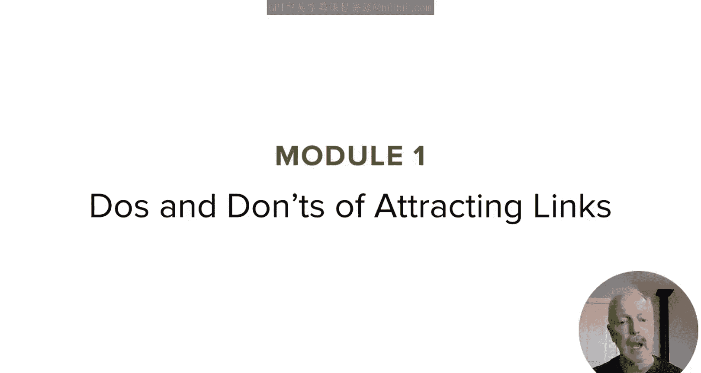

在本节课中，我们将详细探讨链接建设的具体可行方法与需要避免的陷阱。上一节我们概述了谷歌不喜欢的链接建设实践，本节中我们来看看具体的“可为”与“不可为”。

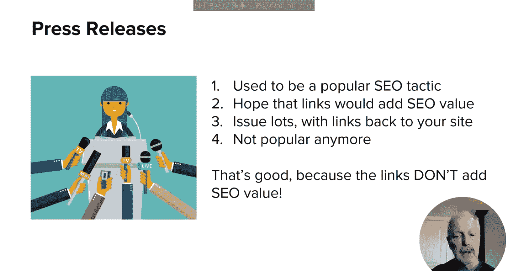

## 新闻稿的误区与正确用法

以下是关于新闻稿链接建设需要了解的内容。

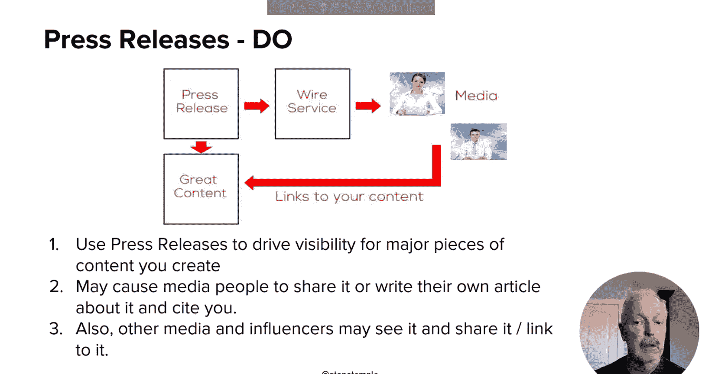

*   **避免为SEO目的发布新闻稿**：过去，通过新闻稿服务发布大量包含返回自身网站链接的新闻稿是一种流行策略。十多年前，这些链接确实具有SEO价值，但如今已不再有效。因为新闻稿服务上的链接通常都带有 `rel="nofollow"` 属性，这意味着它们不会传递SEO价值。
*   **新闻稿的正确用途**：通过新闻稿服务发布新闻稿，其价值在于提升业务知名度。它可能促使他人联系你、在社交媒体上分享、链接到你的内容，或仅仅是开始了解你的品牌。这些都是积极的结果。

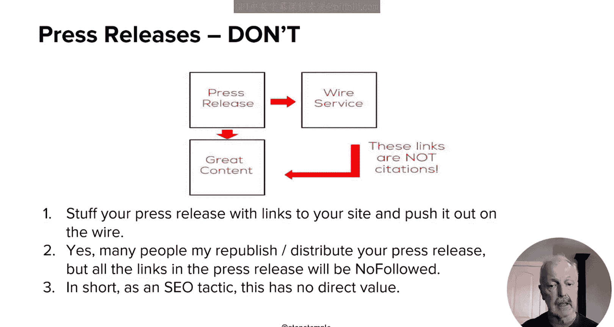

**核心概念**：新闻稿中的链接通常带有 `rel="nofollow"` 属性，例如 `<a href="https://example.com" rel="nofollow">链接文本</a>`，这会导致搜索引擎忽略该链接的权重传递。

因此，如果你试图通过新闻稿中的链接来获取SEO价值，这是在浪费时间和金钱，应避免此策略。

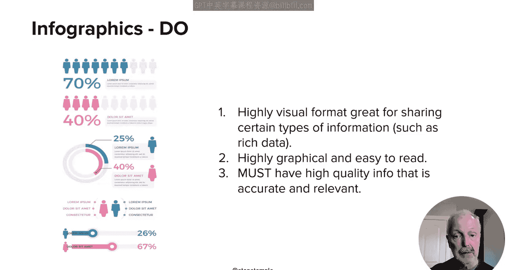

## 信息图的使用注意事项

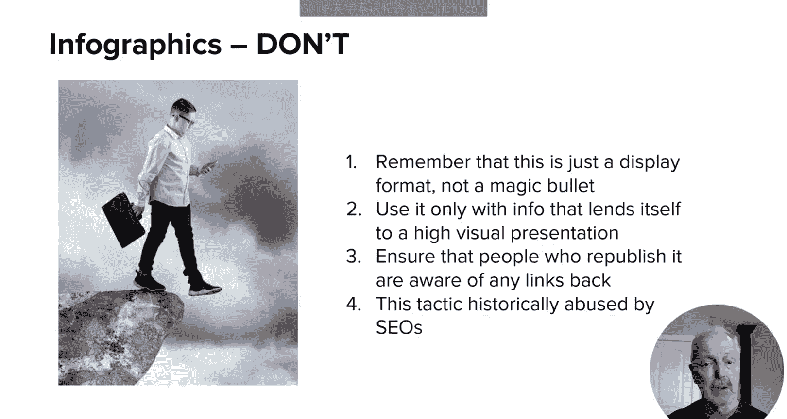

信息图是一种流行的内容形式，能以高度图形化的方式在单个页面上呈现大量数据，便于快速理解和阅读。准确、相关且高质量的信息图本身没有问题。

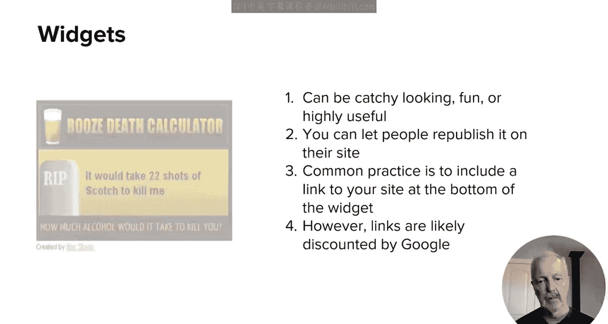

然而，在使用信息图进行链接建设时，需注意以下几点。

*   **确保质量**：不要使用不准确、不相关或信息质量低下的信息图。
*   **明确链接意图**：当其他网站转载或嵌入你的信息图并包含返回你网站的链接时，需确保发布方知晓他们正在链接回你的网站，并了解所链接的内容。如果操作不当，搜索引擎会对此非常关注。

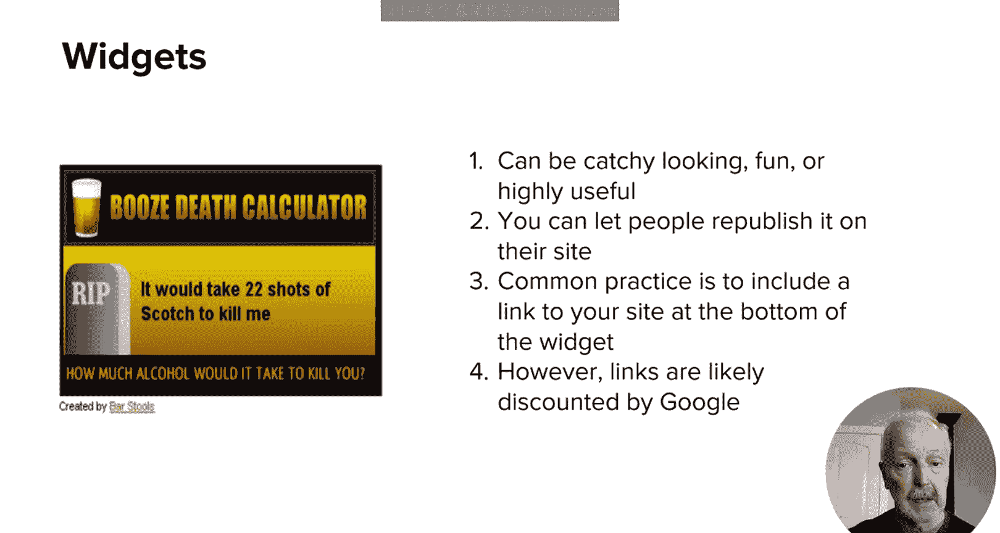

## 小部件与内容联合发布的策略

上一部分我们讨论了信息图，现在来看看另外两种内容分发方式。

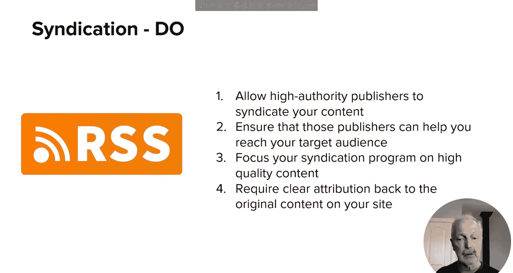

**谨慎使用嵌入式小部件**
除非小部件与你及对方网站高度相关，否则应谨慎创建允许其他网站嵌入的小部件。例如，一个名为“酒精致死量计算器”的有趣小部件曾被广泛嵌入，但其底部包含一个指向创建者网站的“由 Bar Stools 创建”的链接。这种活动的根本目的就是为了获取以特定关键词“Bar Stools”指向创建者页面的链接。这类链接几乎肯定会被谷歌忽略，尝试此类策略需格外小心。

**内容联合发布的正确方法**
内容联合发布是指允许他人在其网站上发布你的内容。这本质上会产生重复内容，但如果操作得当，则没有问题。以下是正确的做法。

*   **选择高权威站点**：确保你的内容仅被发布在声誉极高的网站上。一些联合发布服务（如 *Staer*）能很好地确保内容只出现在高质量站点。
*   **使用规范链接**：最佳做法是要求发布方在其页面使用 `rel="canonical"` 标签指向你网站上的原始内容页面。这能消除重复内容问题，并让你获得链接价值。
    **代码示例**：`<link rel="canonical" href="https://yourdomain.com/original-article" />`
*   **包含来源链接**：次优选择是在联合发布的内容中包含一个指向你网站原始页面的链接。这向搜索引擎表明你是原始发布者，能传递一定的链接价值。
*   **避免的做法**：最差的选择是发布方将你的内容页面标记为 `noindex` 并链接回你。这虽消除了重复内容担忧，但谷歌会忽略来自 `noindex` 页面的链接价值。

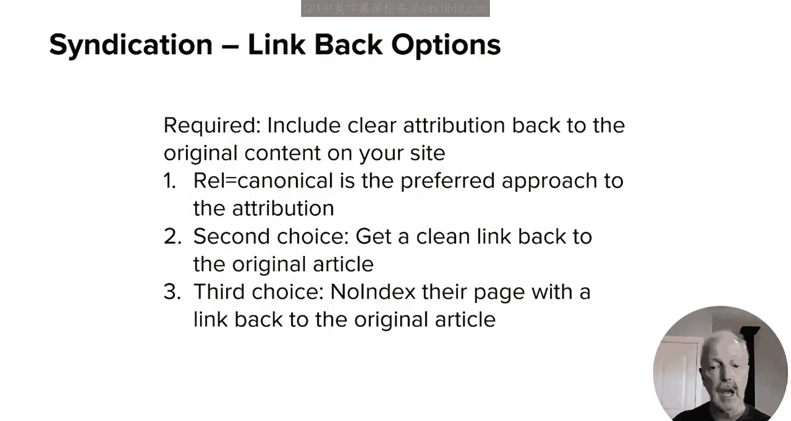

以下是实施内容联合发布时需要避免的事项。

*   不要允许低权威或质量差的网站联合发布你的内容。
*   除非你能严格控制发布网站的质量，否则不要将内容推送给数百个网站。
*   专注于那些能触及你目标受众的高权威、大流量网站。
*   确保你提供的是优质内容，这是接触他人受众的机会。
*   不要只让他们链接到你的主页，应确保规范链接或来源链接指向包含原始文章的特定页面。

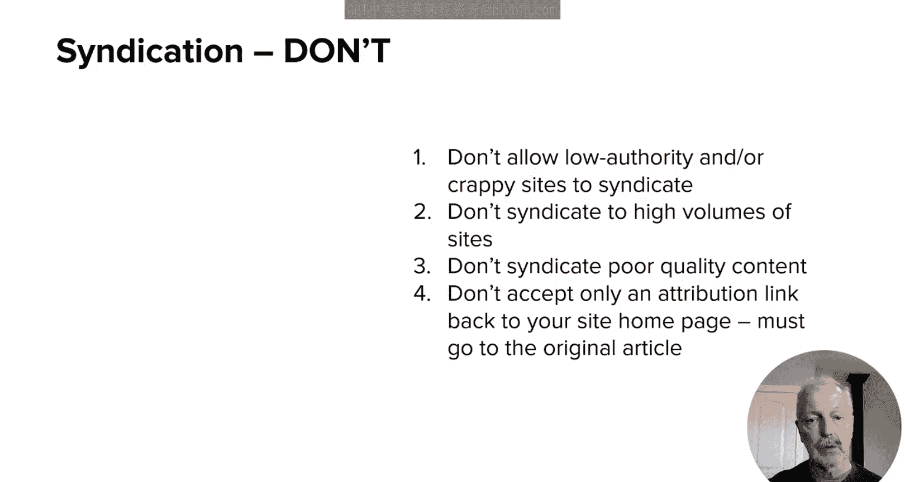

## 需要避免的链接建设误区与不良实践

了解了有效策略后，我们来看看一些常见的误区和必须避免的不良实践。

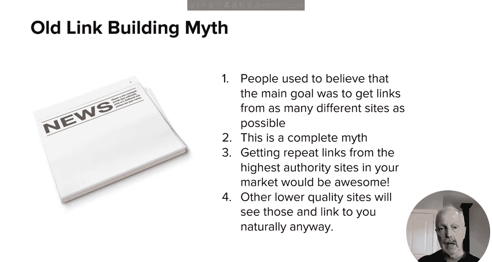

**破除“单站多链无用”的误区**
一个长期存在的误区是：从同一个网站获得一个链接后，再获得更多链接的价值会降低或微乎其微。这并不正确。搜索引擎像用户一样评估内容价值。偶尔被《纽约时报》报道一次固然很好，但成为《纽约时报》的专栏作家显然更能建立权威和声誉。多次来自同一权威网站的链接能持续强化这种信号。

**避免获取无关地理区域的链接**
不要从你不开展业务的国家或地区寻求链接。例如，如果你不在波兰、俄罗斯、匈牙利、巴基斯坦或印度开展业务，就不要实施旨在从这些地区获取链接的策略。反之亦然，如果你只在印度开展业务，则无需专注于从美国获取链接。

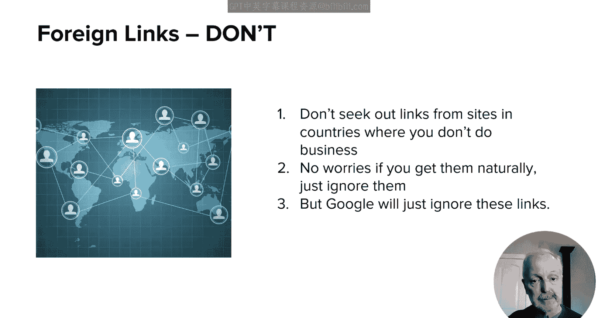

**杜绝垃圾评论链接**
在博客评论或论坛中堆砌链接是一种为自己“投票”的过时做法。如今，几乎所有评论平台的用户生成链接都带有 `nofollow` 属性，这意味着它们不传递价值。即使找到少数不带 `nofollow` 的，谷歌也很可能将其忽略。这种行为不仅是糟糕的网络行为，也无助于你建立受众。

**其他应远离的链接方案**
以下是一些同样需要避免的链接建设方式。

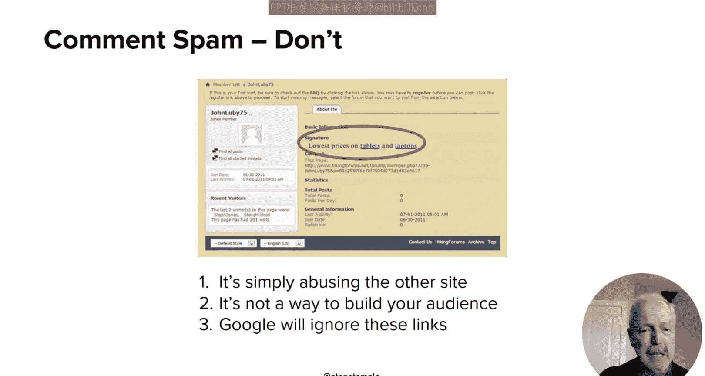

*   **链接交换**：如前所述，应避免单纯的“你链接我，我链接你”的交换。
*   **徽章/挂件**：这类小部件链接通常被视为低质量或无关链接。
*   **软文广告**：即付费发布本质上为推广自己产品的文章并包含链接。谷歌能轻易识别这类链接缺乏编辑价值，不会赋予其SEO权重。

所有这些做法都不能提供真正的SEO益处。这并不意味着你不能出于其他商业目的使用它们，但切勿将其用于链接建设目的，因为谷歌认为它们没有SEO价值。

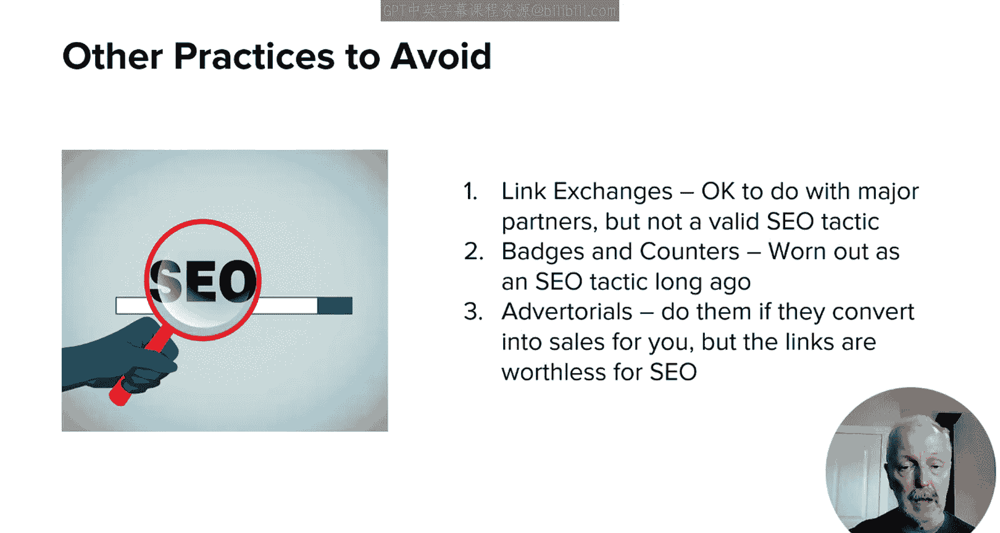

## 总结与下节预告

本节课我们一起学习了链接建设中的具体可行方法与必须避免的陷阱。真正的**内容营销**自然会引导你远离这些不良实践。在高度商业化的环境中，寻找捷径是自然的，但严格遵守本节课提到的禁忌至关重要。请确保只专注于搜索引擎认可的策略。

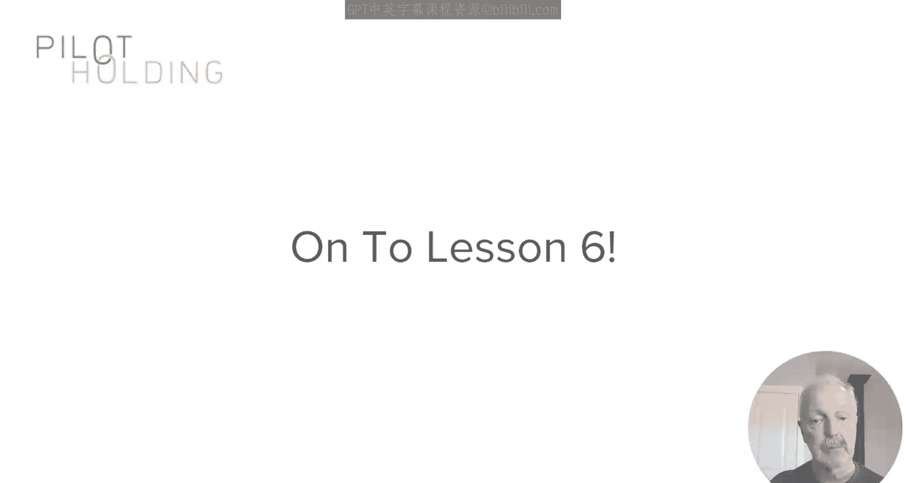

随着本模块的深入，你将看到专注于通过内容营销来建立声誉和知名度，是吸引高质量链接的最佳且最安全的方法。这正是搜索引擎所看重的。我们将在下一节课开始讨论相关内容，并带你了解内容营销的基础知识。