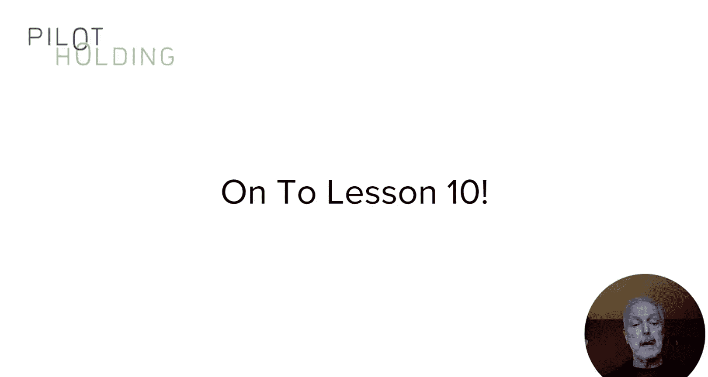
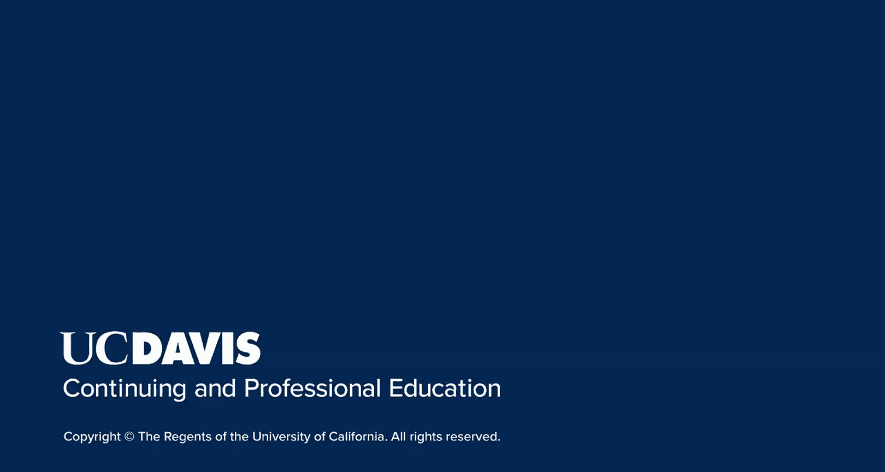

# 搜索引擎优化：112：客座发文策略

在本节课中，我们将探讨一个在SEO领域颇具争议的策略——客座发文。我们将学习如何通过在其他网站上发布文章来提升自身权威、扩大受众，并获取有价值的链接。同时，我们也会重点指出哪些做法是错误的，需要避免。

上一节我们讨论了访谈和数据驱动研究。本节中，我们来看看另一种内容营销策略：客座发文。

这里展示的是我个人在搜索引擎期刊（Search Engine Journal）上发表的一篇文章示例。这是一个在整个营销领域具有很高权威性的网站。

请注意，这篇文章**没有**包含指向我当前网站的链接，但它链接到了我在该网站上的个人简介页面。

从直接的SEO角度来看，缺少链接是令人失望的。但这个网站无疑将我极大地展现在了我的目标受众面前，其中也包括媒体人士。此外，我还在他们举办的SMX会议上发表演讲。这些共同为我带来了巨大的曝光度。

正如我们在课程介绍中提到的，这些策略有助于为你传递额外的权威并扩大你的受众群体，是你整体内容营销战略的核心。我至今仍会不时在该网站发文。

当然，也有一些网站允许你在个人简介中包含链接。如果你的网站上有与你所发文章高度相关的内容，他们也可能允许你在文章中链接到它。例如，搜索引擎期刊会从你的作者简介页面链接到你的网站，不过该链接是`nofollow`的。

在本节课的剩余部分，我将重点讨论那些能让你获得某种链接的客座发文，无论是作为署名链接，还是在内容合适的情况下获得上下文链接。

然而，错误的做法也有很多。以下是需要避免的情况：

*   **低质量网站**：避免在内容粗糙、编辑标准低下的网站上发文。
*   **不相关网站**：避免在与你的领域无关的网站上发文。
*   **付费发布**：远离那些要求你付费才能发布文章的网站。实际上，你可以选择付费发布，但不要期望从中获得的链接有任何SEO价值。只有当这些网站能高度相关且有效地将你展示给目标受众时，才考虑这么做。

之前我讨论过“权威”这个概念，现在我想稍微扩展一下。请记住，我强调过**一个链接的价值可能比另一个高出百万倍**。在后续课程中，这一点将非常重要，切勿忽视。

创建客座文章时，你需要考虑发布平台的相关性，因为这是决定链接价值的一个重要权重。

在较早的课程中，我讨论过相关性。例如，如果我有一个关于二手福特野马的页面，而我从一个关于木工的网站获得链接，那么这个链接的价值就很低，因为缺乏相关性。

对此进行扩展：你需要考虑**给出链接的网站**、**给出链接的页面**、**你网站上接收链接的页面**以及**你网站的整体相关性**。所有这些元素彼此之间的相关性越高，链接的价值就越大。请记住，这是在之前提到的整体“权威”重要性之外的附加因素。你需要让这两者都为你服务：**高权威**和**高相关性**。

过去，SEO从业者中流行一种观点，认为每次客座发文都应该选择一个你从未获得过链接的域名。他们认为，获得链接的域名越多越好。这在过去是成立的，但早已不再正确。

**你获得链接的平台和域名的质量，远比最大化不同域名数量这一概念重要得多。**

如果我拥有10个极其高质量的域名，并且能持续不断地从它们那里获得链接，这远比从100个不同的域名各获得一个链接要好。

此外，正如我在此图表中所建议的，每个市场领域内覆盖它的高质量域名数量是有限的。

如果你每次发文都去一个新网站，最终不可避免地会使用到低质量域名。此外，谷歌会观察到你的这种行为，并可能将你通过这种方式获得的所有链接视为操纵行为而予以降权。

需要避免的另一件事是客座发文垃圾信息。这里有一个多年前某人发布的文章示例。

我在新西兰的某个网站上发现了它。发布者非常努力地确保将关键词“B cars”作为锚文本链接回他们的网站，以至于他们甚至无法将这两个词放在同一个句子里。这显然是一篇极其垃圾的帖子，搜索引擎绝不可能重视这个链接。当然，任何允许你这么做的网站，其链接本身也毫无价值。

你还需要非常小心客座文章中的链接。

这里我故意创建了一个例子，在这个虚构的网站`your acmetravelsite.com`中，我塞进了好几个链接，并在中间部分包含了一个关键词丰富的锚文本链接“travel package deals”。对此要非常小心。

如果你与某个网站有专栏合作，并且长期在那里发布文章，同时文章上下文确实需要链接到文章中间的某个内容，那么这样做可能是可以的，但这本质上是一个尺度问题。

顺便说一下，大多数有价值的网站无论如何都不会允许你以垃圾邮件的方式这样做。大多数高价值网站不会允许你在文章内联中放置指向自己网站的链接，除非这对用户有非常高的价值。

一种可能行得通的场景是：如果你发布了一项出色的数据驱动研究报告，并同意在另一个网站上就你的研究发现撰写一篇客座文章。在某些情况下，这些网站会允许你链接回原始研究报告，因为这为那些希望了解更多研究发现的读者提供了很大价值。

本节课中，我试图向你介绍客座发文的概念，以及它们如何帮助你提升声誉、增加曝光度和优化SEO。我也谈到了需要避免的几种客座发文策略。

下节课，我将开始为你自上而下地概述内容营销计划的主要组成部分。