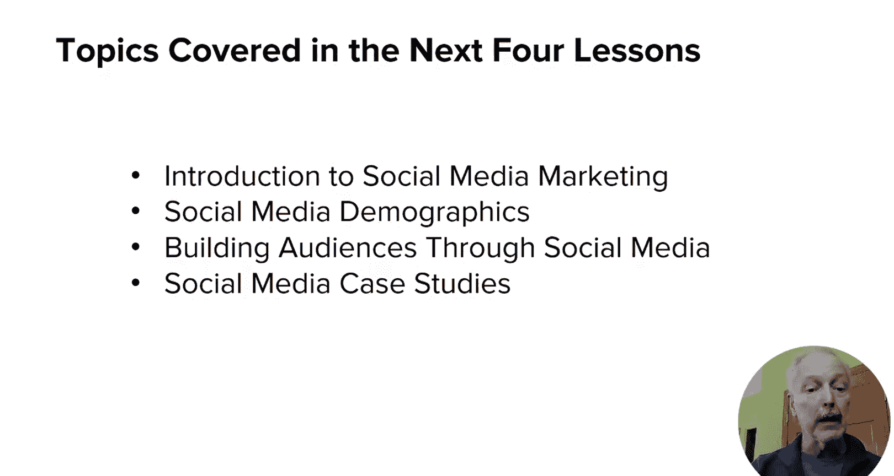

# 115：UCD《搜索引擎优化（谷歌、SEO基础、优化网站、进阶、毕业项目）｜Search Engine Optimization》中英字幕 p115 11_模块二导论.zh_en -BV1N66VYsEue_p115-

🎼，🎼Yeah。In this module， I'll focus on social media marketing， and in particular。

 the role it plays in supporting your content marketing efforts。

Social media can play a very significant role in helping you build your own audience。

 which makes content marketing success much easier。In addition。

 social media can help you build relationships with influencers and they can help accelerate the entire process。

This module will cover how the basic social interaction courtesy that guide your behavior offline should also guide your behavior online。

 I'll go into more detail about how to build your audience。

Also included is a discussion of the role that links in social media do or don't play in SEL finally。

 I'll provide you some case studies about businesses using social media to drive reputation and visibility。

The next four lessons in this module will cover the following。

Lessson two will review how social media does and doesn't influence SE。

Lessson three will discuss the importance of understanding the demographics of social media platforms。

To help you better target your social media efforts。

Lesson four focuses on building audiences with social media。

As your audience of engaged followers grows， so does your influence。

And lesson five goes through four case studies of businesses that are using social media very effectively。

Let's get started。

