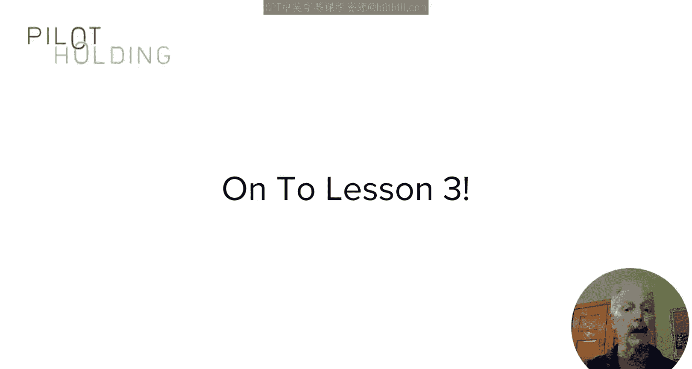
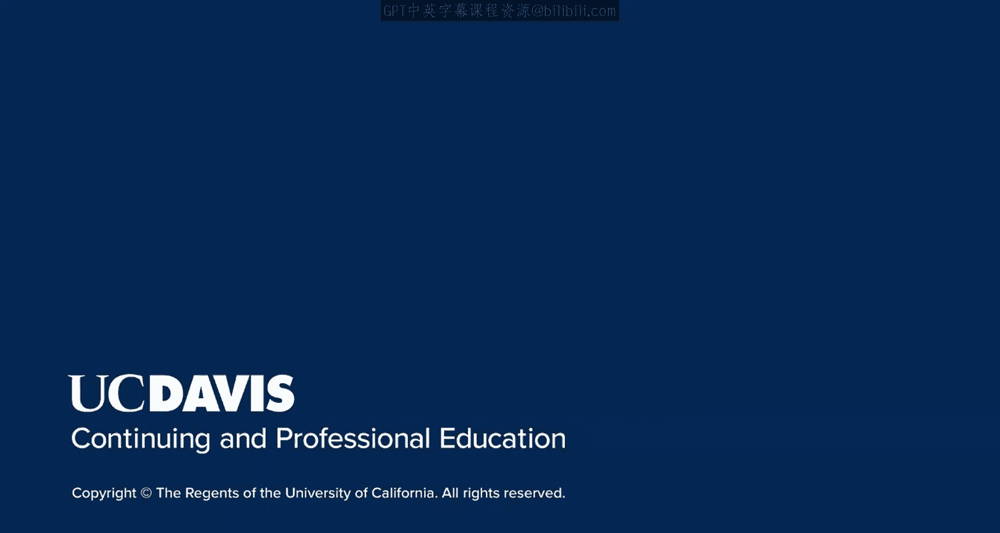

# 116：社交媒体营销入门

在本节课中，我们将讨论社交媒体及其对内容营销和搜索引擎优化（SEO）的影响。

我们将涵盖以下主题：社交媒体链接如何影响SEO、社交媒体是否是谷歌的排名因素，以及社交媒体如何支持SEO。简而言之，社交媒体通过多种间接方式帮助SEO，两者之间存在许多相关性。但从社交媒体获得的链接本身，并不带来直接的SEO益处。

为了深入探讨，让我们首先回顾一下链接中的 `nofollow` 属性是什么。

## 理解链接属性：`nofollow`、`sponsored` 与 `UGC`

上一节我们提到了社交媒体链接不直接传递SEO权重，这与其使用的链接属性密切相关。本节中，我们来看看这些具体的属性。

`nofollow` 是添加到链接HTML代码中的一个属性，它告诉谷歌**不要**将页面权威（Page Authority）或页面排名（Page Rank）传递给被链接的页面。谷歌建议在链接是付费链接、赞助链接或其他非自然获取的情况下使用此类属性。这包括链接由用户生成的情况，例如在社交媒体上。

2019年9月，谷歌更新了关于 `nofollow` 链接的建议，新增了两种链接属性：`sponsored` 和 `UGC`。
*   `sponsored` 属性用于那些由接收链接的网站（或代表其）付费购买的链接。
*   `UGC` 属性在社交媒体和SEO领域更为重要，因为UGC是“用户生成内容”的缩写。它用于网站用户（如社交媒体用户）添加的链接，而非网站所有者添加的链接。

回顾这些概念的原因是，所有主要的社交媒体平台都已在终端用户添加到其平台的所有链接上，实施了 `nofollow` 或 `UGC` 标签。

因此，这些平台上的任何链接都**完全不传递**任何SEO权威或页面排名。

## 社交媒体对SEO的间接影响

既然社交媒体链接不直接传递权重，那么它对SEO意味着什么呢？重申一遍：社交媒体上由用户实现的链接不会向被链接页面传递权威。所以，虽然这在任何方面都没有直接的SEO影响，但谷歌实际上仍然会爬取这些链接，并用它们来**发现和索引**相关内容。

这可以带来间接的好处：让你的内容被谷歌发现、索引和排名的速度，比你单纯发布并等待要快。看到你社交媒体帖子并分享的人越多，谷歌可以爬取和发现的链接就越多，这意味着你的内容及其任何更新都会被更频繁地爬取。

社交媒体平台帮助SEO还有其他间接益处：
*   **增加内容互动**：社交媒体链接可以引导更多人参与你的内容。这种互动可能意味着更多的评论和其他帖子互动，这有助于其SEO。
*   **引发自然外链**：看到你帖子的人越多，他们与其他人分享的可能性就越大。总体而言，接触到你的帖子并与他人分享的人越多，你从其他网站获得提及或被链接（且该链接是 `dofollow` 并传递权威）的可能性就越大。
*   **提升品牌声誉**：我们知道谷歌会考察网上的品牌提及和声誉（不局限于链接上下文）。因此，如果你的品牌在网络上拥有积极的情绪，并在不同平台上被频繁讨论，这可以帮助你的SEO。
*   **影响搜索排名**：此外，在2017年的PubCon大会上，谷歌的Gary Illyes曾表示，你在网上互动的环境以及人们如何在网上谈论你，实际上会影响你的排名。从《质量评估指南》和其他资料中我们也知道，谷歌聘请的人工质量评估员会被要求查看一个品牌的权威性。涉及你组织的在线讨论的频率和深度，可能是确定这一点的一种方式。

## 优化社交媒体资料与内容

别忘了，社交媒体帖子还能在其他方面有益于你的营销，其中一些益处可能间接有助于SEO。

以下是社交媒体带来的一些其他好处：
*   **延长内容生命周期**：让优质内容持续获得曝光。
*   **提高内容分发度**：扩大内容的覆盖范围。
*   **提升品牌知名度**：帮助建立品牌认知。
*   **树立思想领导地位**：将你定位为行业思想领袖。

请记住，虽然链接本身不传递权威，但你仍然可以优化你的社交媒体资料。你的社交媒体资料通常会被索引，并包含帮助人们找到你的重要关键词。请务必描述你的业务以及你在平台上分享的内容类型。

帖子本身也可能被谷歌索引。使用正确的关键词、标签、图片等，都可以帮助你的社交帖子通过常规搜索或在平台内部搜索中被发现。

## 总结与核心要点

本节课中我们一起学习了社交媒体与SEO的关系。你现在应该更好地理解了社交媒体对SEO的间接益处，以及它对整体营销组合的直接益处。

**核心要点总结**：
1.  **直接权重传递**：社交媒体链接（用户生成）通常带有 `rel=“nofollow”` 或 `rel=“ugc”` 属性，**不直接传递**页面排名或权威。公式上可理解为：`SEO权重传递值 = 0`。
2.  **间接核心价值**：社交媒体的主要SEO价值在于**内容发现与索引**、**品牌信号构建**以及**引发自然外链**。
3.  **优化方向**：应优化社交媒体资料（关键词、描述）和帖子内容（关键词、标签、多媒体），以提升在站内及搜索引擎中的可发现性，并促进用户互动与分享。

最终，应将社交媒体视为一个强大的**内容分发和品牌建设渠道**，它能通过扩大影响力和声誉，间接但显著地支持你的SEO目标。