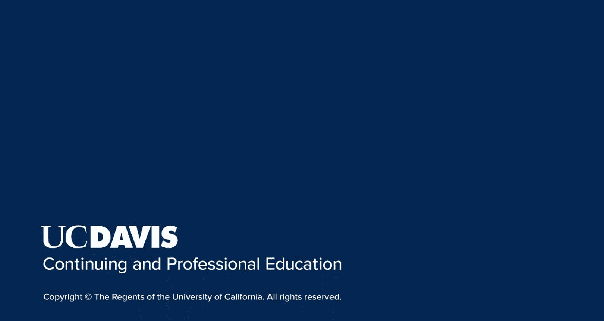

# 搜索引擎优化（谷歌、SEO基础、优化网站、进阶、毕业项目）：13：社交媒体用户画像

在本节课中，我们将要学习社交媒体平台用户画像的重要性。了解不同平台的核心用户群体，能帮助你选择最合适的平台进行营销，从而更有效地触达目标受众。

上一节我们介绍了如何定义目标受众，本节中我们来看看如何根据用户画像选择社交媒体平台。

## 社交媒体平台用户画像的重要性

社交媒体平台的用户画像至关重要，因为它影响着你应重点活跃于哪些平台。你需要选择与你的目标受众最匹配的平台。这样，你才能出现在他们所在的地方，并使用最符合你商业目标的营销策略。

你的目标受众可能同时在多个社交媒体平台上活跃，这很常见。你的目标是找到他们使用最频繁的平台。但如何知道他们去哪里呢？

## 如何研究平台用户画像

在整个研究过程中，你需要记住，平台会随着时间演变，其用户群体也会随之变化。不同平台吸引着不同年龄、性别、兴趣等特征的用户。新兴的平台可能暂时没有你的目标受众，但或许是一个不错的起点。平台有兴衰，因此请确保你的营销组合多样化，以防用户习惯改变或平台关闭。

以下是找出目标受众活跃平台的一些方法。

首先，你可以通过谷歌搜索进行初步研究。

*   **进行谷歌搜索**：搜索“平台名称 + demographics（用户画像）”关键词，以查找关于该平台用户性别、年龄范围、地理位置等画像的研究报告。请务必寻找最新的研究，因为这些数据会随时间变化，旧的研究可能已过时。

其次，确保扩展你的搜索范围。仅仅因为一个平台在年龄或性别等部分画像上与你的受众匹配，并不一定意味着它也符合他们的兴趣。

*   **在平台上搜索相关话题**：为你的业务列出一系列相关主题或话题标签，然后在相关平台上搜索这些内容。这里展示一个在Facebook上搜索“wine groups（葡萄酒群组）”的例子。再考虑一个利基网站的例子，比如钓鱼应用Fishbrain。我们可能会搜索“outdoors（户外）”甚至“trout（鳟鱼）”等具体鱼种。这样，你不仅能查看你的受众是否在这些社区中活跃，还能观察他们如何与平台互动、分享什么内容以及如何与其他用户交流。

此外，不要忽视那些垂直的社交网络。

*   **探索利基社交网络**：像Fishbrain这样的利基社交网络有很多。几乎每个爱好都有专门的社交媒体网站。花点时间挖掘一下，看看有哪些社交网络专门服务于或设有专门版块，讨论与你的目标受众或业务需求相关的活动或爱好。

在你的整个研究过程中，请务必密切关注在这些平台上最常被分享和互动的内容类型。

*   **关注内容趋势**：内容趋势会随时间变化，因此定期审核你的受众如何与平台互动，并确保你仍然能触达他们，这对你非常有利。

## 实践练习：制定平台策略

现在让我们将所学付诸实践。我希望你完成一个小练习。

1.  **选择平台**：选择一个你认为与你的业务相关的社交媒体网络。
2.  **研究画像**：花时间研究该平台的用户画像。
3.  **分析内容**：描述在该网站上与你的业务相关且受欢迎的话题和内容类型，并说明原因。
4.  **制定策略大纲**：创建一个你可以在该平台上潜在使用的策略大纲。

如果你认真完成，这并非一个简短的练习，其中可能涉及大量的工作和规划。在你认真投入任何一个社交网络之前，这是为了获得成功而必须完成的工作。它将影响你选择重点关注的社交平台，以及你在这些平台上选择发布的内容类型。

接下来，考虑潜在的收益范围。

*   **评估投入与回报**：建立一个庞大的受众群体有多难？提示：这通常需要大量的努力和时间，并且起步阶段会缓慢得令人沮丧。考虑到你业务目前的状况，投入这些时间和资源是否值得？或者这是否是你应该计划在稍后阶段再开始的事情？在社交媒体上取得成功固然有益，但通常在开始之前就需要付出大量努力。在着手之前，请评估你目前希望在这方面投入多少。

## 平台数据对比与策略调整

考虑到以上所有因素，让我们在接下来的幻灯片中看一些真实数据。我整理了一些供我们参考的总体统计数据。

尽管这些数据非常基础，你已经可以看到表中所示平台之间存在一些显著区别。例如，Facebook、YouTube和Instagram拥有最大的用户群。然而，TikTok显著侧重于较低年龄段的用户，而Pinterest的女性用户比例更高。

这些指标可以让你大致了解，针对不同平台，你的营销方法应如何调整。当然，你需要继续深入研究更详细的指标，以进一步确定哪些平台最适合你。此外，你可以利用这些数据来调整你在每个选定平台上的信息传达方式。

## 课程总结

本节课中，我们一起学习了社交媒体网络用户画像的重要性。如果你打算在社交媒体上进行投入，请花时间确保你的投资放在了对你最有效的平台上，并且你在这些平台上发布的是正确类型的内容。

在下一节课中，我将讲解构建受众的核心原则。

