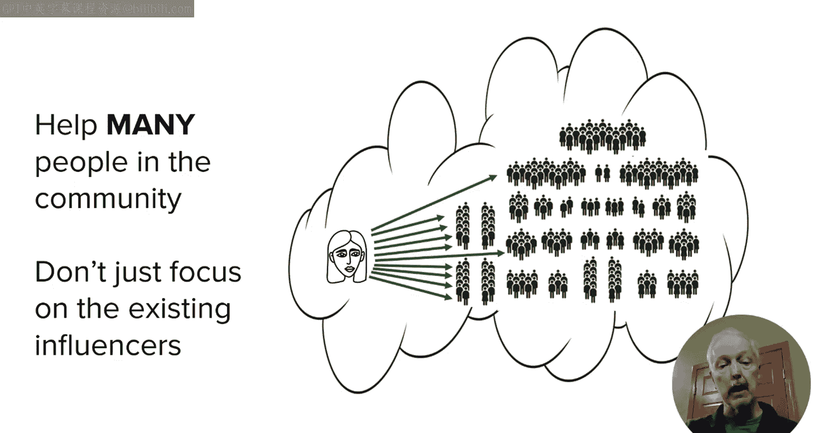
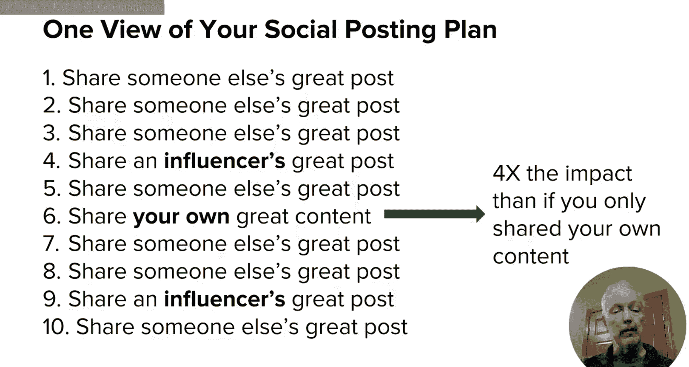
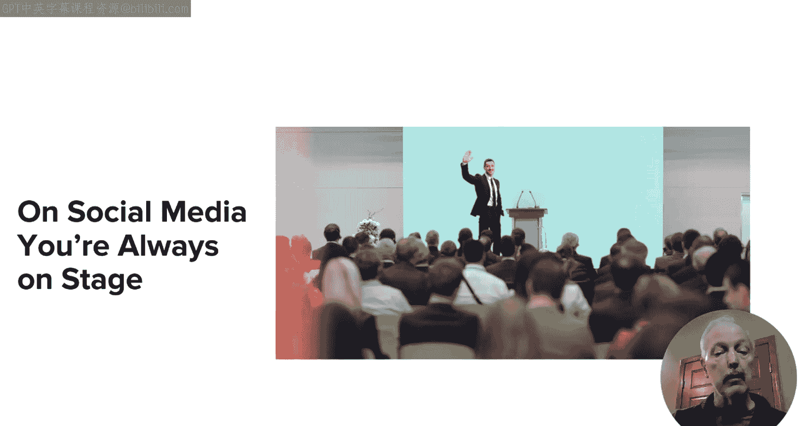
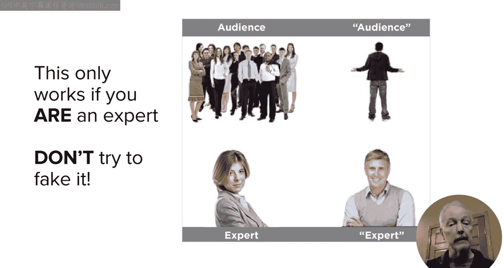
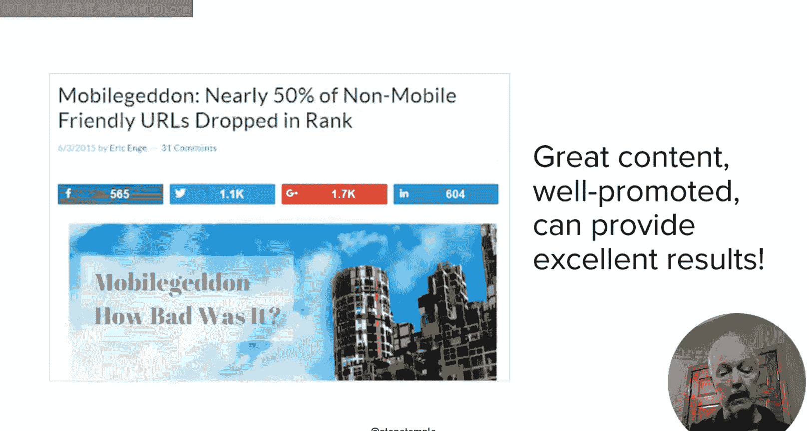
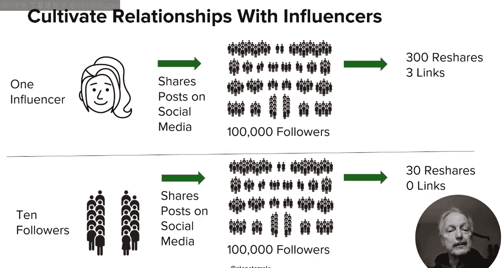
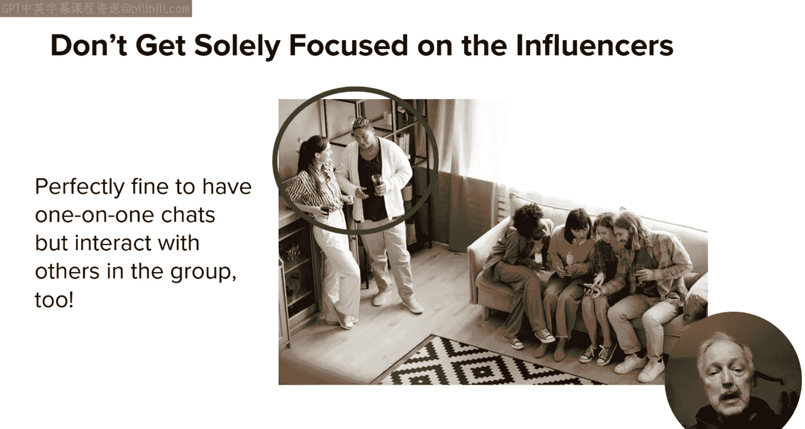
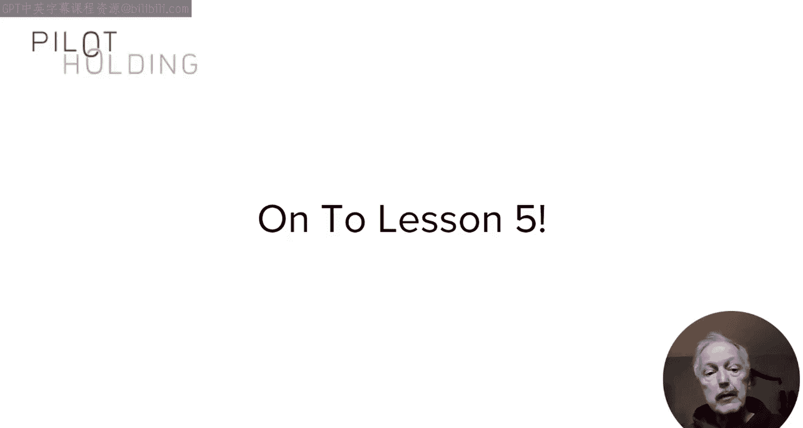
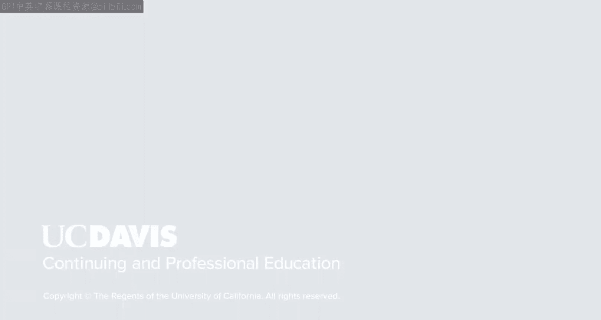

# 搜索引擎优化（谷歌、SEO基础、优化网站、进阶、毕业项目）：118：社交媒体受众培养

在本节课中，我们将要学习如何在选定的社交媒体平台上构建受众。核心在于理解如何与目标受众互动并建立关系，而非仅仅进行自我推广。我们将探讨提供价值、分享策略、专家定位以及如何与影响者和普通用户互动。

上一节我们讨论了影响社交媒体平台选择的因素。本节中，我们来看看如何在选定的平台上构建受众。

## 成为社区的一员，而非索取者

首先，必须将社交媒体平台视为一个社区，而你是其中的一员。平台并非仅为你的商业利益服务。你需要为社区带来价值，像普通成员一样积极参与。目标是成为社区中重要的一员，但始终记住你只是社区的一部分。

## 先提供价值，再寻求回报

你需要多次为社区提供价值，然后才能寻求回报。这就像搬入新社区后参加邻里聚会，你不会一进门就向每个人要钱。社交媒体关系的建立也是如此。

以下是构建健康分享比例的核心概念：

*   **80%的时间**：分享他人的优质内容。
*   **20%的时间**：分享自己的优质内容。

如果你遵循这个比例，你分享自己内容的效果，将比你只发布自己内容的效果**放大四倍**。这个概念的核心在于：你分享他人内容越多，你分享自己内容时，他人会认为其价值越高。

## 公开舞台与专家定位

在社交媒体上，除非是私信，否则你的每一次对话都发生在公开舞台上。关注你的人都能看到这些对话。这意味着你始终处于公众视野中，这应指导你的行为。

另一个重点是**成为真正的专家**。这是提供价值的最坚实基础。你无需精通所在市场的所有领域，只需在某个特定领域成为专家，这就能成为你为目标受众提供价值的关键。试图伪装成专家很难建立起真正的受众。

## 创造值得分享的内容

成为专家也让你更容易创造出值得分享的内容。例如，我曾针对谷歌的“移动友好”算法更新撰写了一篇深度分析文章。由于投入了大量精力，这篇文章获得了超过3000次社交分享。关键在于：如果你的内容不值得分享，就不会有人分享它。

请确保即使在社交媒体帖子中，你发布的也是优质、引人入胜的内容。以佛蒙特州的公司“第七世代”为例，他们销售环保家居用品。虽然产品话题性不强，但他们通过聚焦环保理念，创造了引人参与的内容，例如“我们有权知道家用喷雾、肥皂和清洁剂中含有什么成分”。同时，他们也会积极回复评论。

## 与影响者建立关系

社交媒体也能有效帮助你与影响者建立关系。影响者拥有大量受众和影响力。如果他们分享了你的内容，会比你自己分享更能引起人们的关注，从而帮助你扩大受众并获取反向链接。

但这个过程不能操之过急。可能需要一年时间才能让影响者真正信任你。与整个社交媒体策略一样，重点应放在为他们提供价值，而非索取。当你需要提出一个对双方都有利的合作想法时，例如一个由你承担大部分工作，但需要他们提供见解、建议并帮助推广的联合项目，时机就成熟了。

## 关注更广泛的关系

然而，你不能只关注与影响者的关系。想象一下在邻里聚会上，如果你整晚只和一个人交谈，而忽视其他人，会显得很奇怪且目的性太强。这在现实生活和社交媒体中都不奏效。你必须关注整个受众群体，而不仅仅是影响者或潜在商业伙伴。

## 动员员工与多路径互动

你也可以动员员工通过他们的社交媒体账号进行分享。研究表明，活跃在社交媒体的员工经常会讨论他们的雇主。但需注意，在美国有联邦贸易委员会的披露指南，其他国家也有类似规定。如果员工分享公司内容，需确保他们了解并遵守相关规则。这样做能让你接触到他们的受众。

同时，考虑在社交媒体上打造内部专家的个人品牌。例如，美国联合航空公司就从员工中培养了一批社交媒体影响者。

最后，请意识到建立良好关系有多种路径。你可以从与业务无关的话题开始对话。例如，如果某人分享了一场体育赛事，你可以就此展开交流。当然，注意不要让整个关系都围绕该话题，但一个良好的开端可以为后续更相关的业务讨论打开大门。

本节课中，我们一起学习了在社交媒体平台上构建受众的核心方法，重点在于关系建设。我们探讨了以社区成员身份参与、遵循80/20分享原则、树立专家形象创造有价值内容、以及与影响者和广大受众建立真诚互动的重要性。

在下一个也是本模块的最后一课中，我将为大家呈现几个与企业在社交媒体运营相关的具体案例研究。