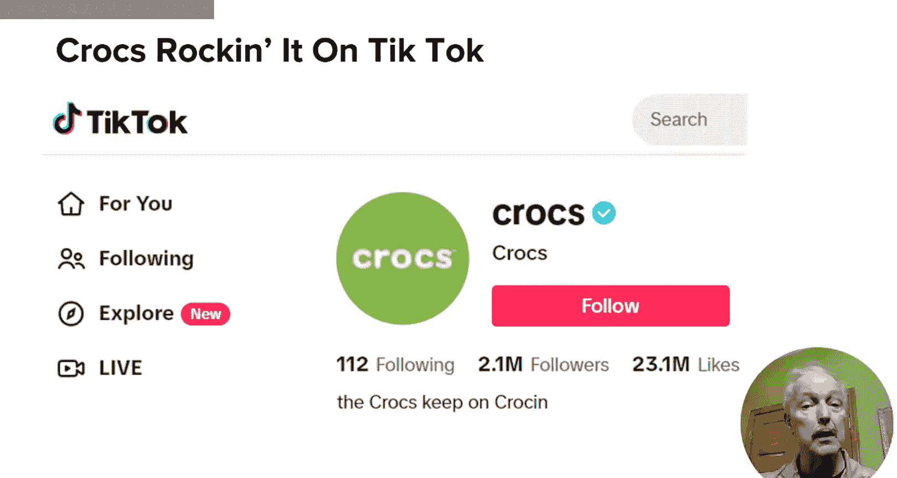
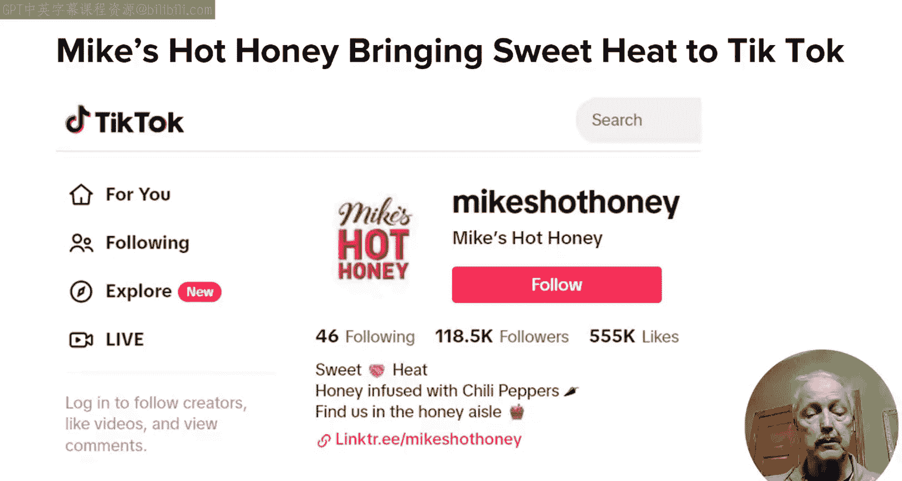
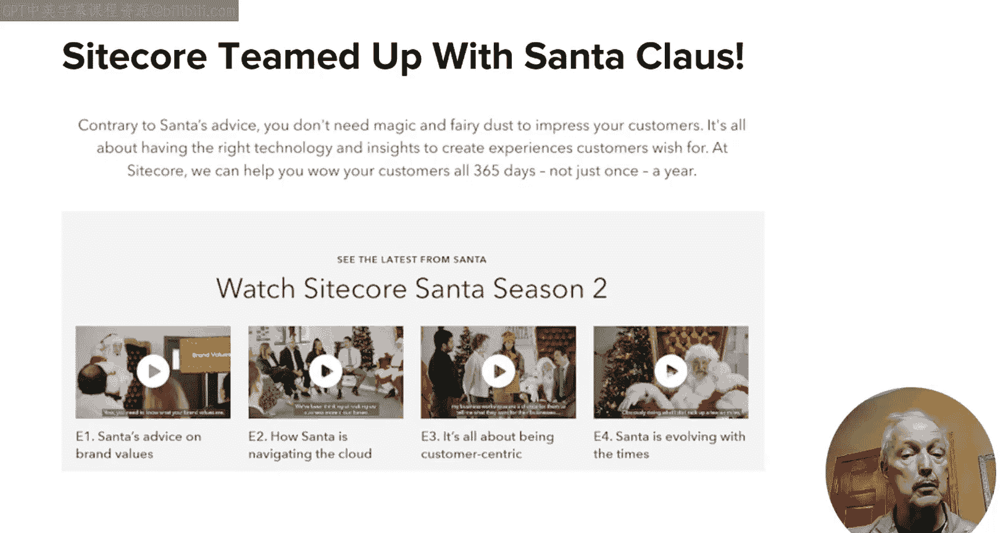
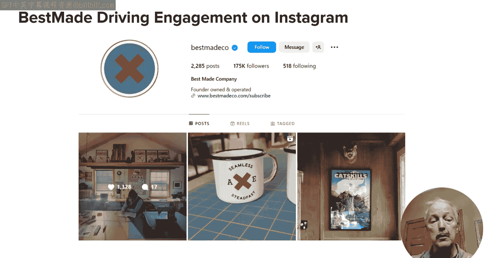

# 119：UCD《搜索引擎优化（谷歌、SEO基础、优化网站、进阶、毕业项目）｜Search Engine Optimization》中英字幕 p119 15_社交媒体案例研究.zh_en -BV1N66VYsEue_p119-

🎼，🎼Yeah。In the prior lesson， I focused on the types of things you need to do to build relationships and build your audience at the same time。

In this lesson， I plan to close out the social media module with several case studies of companies and their social media efforts。

First of all， one platform that can be great for building your brand and visibility is TikTok。

Here are some examples。Fros has built a large following on TikTok with 2 million followers and more than 23 million likes。

One of their more successful campaigns was called hashtag 000 Crocs。

 and in this campaign they challenged their followers to create a design for Croocs showing what they would look like if they cost a thousand bucks。

This creative campaign drove significant user engagement。

The NBA has more than 20 million followers on TikTok and has over 400 million likes for their content。

Kudos to them for recognizing the power of the TikTok platform for short videos of great plays from their games。

Mike's Ho Ho has more than 100 K followers on TikTok and routinely gets hundreds of views for each video they release。

Some of their most popular videos get millions of views。

So now I've shown you three of these TikTok profiles， and for each of them。

 consider spending time digging into their content。

And their strategy overall to better understand how they drive success on the TikTok platform。

Switching away from TikTok， but staying with video for a moment more。

 the drum published a case study on housescore， which is a B2B company。

 used a Santa Claus campaign on YouTube to promote a more human approach to customer experience design。

The campaign showed how Santa preps for the holidays in an entertaining manner。

The whole thing was inspired by the TV show of the office and David Brent In the video。

 the Santa plays a lovable fool that's also a bit of a buffoon。 He lazees around。

 shows off to the cameras and annoys his staff。 He also jokes about how his business operates and creates a great customer experience。

😊，Its shot in a mockumentary style， which adds to the entertainment。

The campaign was a great success and generated 577K views， 8K engagements， 1。8K clicks。

 and 100% positive or neutral sentiment。

Best madeco is a small company that makes axes as such。

 it's a small outdoor business brand that has built a loyal following on Instagram。

They share a wide variety of images and videos focused on the outdoor experience。

Some of these include their acts， but most of them actually don't。

 primarily about sharing great visuals of living an outdoor lifestyle。

It's bringing them great results if their posts regularly get hundreds or thousands of likes and many comments。

The drum published another case study involving Virgin Atlantic and a campaign to show dyslexic thinking in a positive light。

Historically， dyslexia has had a negative perception， but many very successful people are dyslexic。

 including Virgin Atlantic's founder and chairman， Sir Richard Branson。

The campaign was launched on LinkedIn and include partnering with Made by Dlexia。

 LinkedIn and Dictionary Com to expand its reach。As part of this。

 LinkedIn added a new official skill called dyslexic thinking。And dictionary。

com also added the term to their dictionary。Then they released a video online called dyslexic Thinking that highlighted very successful people who are dyslexic。

The campaign was covered by more than 250 media outlets， including the BBC and Bloomberg。

FCB Inferno tracked social media sentiment around dyslexia and saw that positive mentions were up 1。

562% and negative mentions dropped 4，450%。Pretty dramatic results。

These types of campaigns can have a significant impact on your business。

They can increase awareness of your brand and drive unique visitors to your site。

And then there's the organic search traffic point of view， this is。

 after all the SEO specialization we're in and the visibility lift that social media can bring to your brand can drive increases in overall SEO traffic as well。

The Virgin Atlantic dyslexic thinkinging story is a great example of a campaign that drove tons of links。

In this lesson， I walked you through six case study examples of companies having strong social media success。

 I started with three of examples companies driving great results on TikTok。

I also really applaud the efforts of the SyCOps team with their Santa Claus CX campaign。

 it wass a highly creative way to make social media work to support a B2B marketing program。

And best made is a great example for a smaller company using social media very effectively to drive engagement。

In addition， Richard Branson and Virgin Media adopted a great cause and got great exposure for their brand and lots of links at the same time。

Associating your brand with a great cause and actively helping it can bring powerful results。

 as we see with that campaign。Well， that's the end of the module on social media and the next module we'll talk more about influencers and how to cultivate those relationships thanks for watching。

