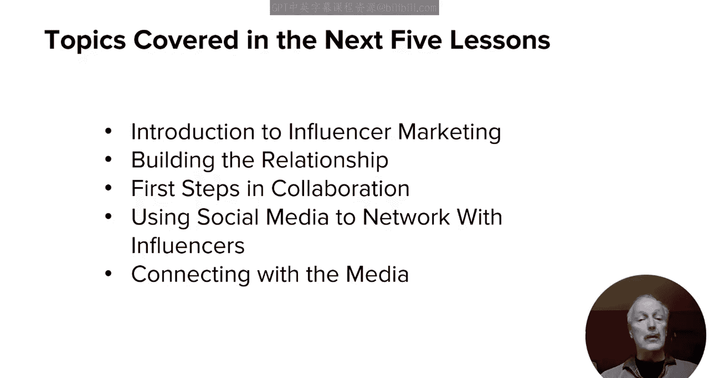
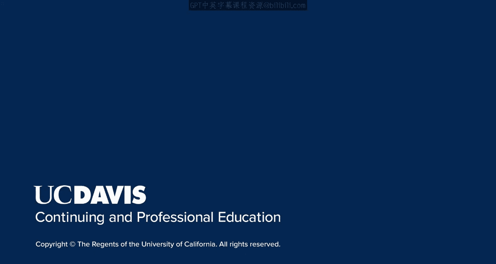

# 120：导论

在本节课中，我们将要学习模块三的核心内容，即如何利用有影响力的人物来推动你的内容营销策略。我们将探讨影响力营销的重要性，并学习如何与他们建立联系并展开合作。

在上一模块中，我们学习了社交媒体营销，以及它如何在推动内容营销工作中发挥重要作用。

在本模块中，我们将延续这一主题，但特别聚焦于有影响力的人物所能扮演的角色。你将了解到他们的影响力有多么显著，以及为什么值得投入额外精力去关注他们。

我们还将深入探讨建立关系并开始与他们合作的过程。我也会与你分享一些高级技巧，教你如何在Facebook和Instagram上精准定位这些有影响力的人物。

以下是本模块接下来五节课的内容概览：

*   **第二课**：介绍影响力营销的益处。
*   **第三课**：讨论如何开始与有影响力的人物建立联系的初步想法。
*   **第四课**：深入探讨更多与有影响力的人物合作及建立关系的方法。
*   **第五课**：回顾如何利用社交媒体网络与有影响力的人物建立联系。
*   **第六课**：深入讲解如何接洽媒体，包括正确和错误的方法。

本节课中，我们一起学习了模块三的总体框架，明确了影响力营销在本课程体系中的位置以及我们将要探索的具体路径。接下来的课程将为你提供实用的知识和步骤，帮助你有效地利用这一强大的营销策略。