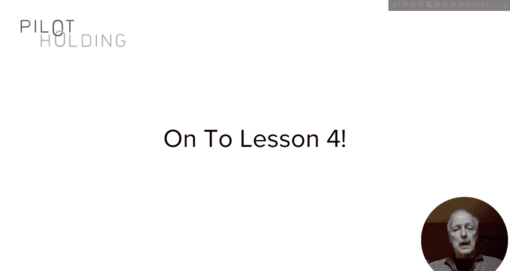

# 122：UCD《搜索引擎优化（谷歌、SEO基础、优化网站、进阶、毕业项目）｜Search Engine Optimization》中英字幕 p122 18_关系建立策略.zh_en -BV1N66VYsEue_p122-

🎼，🎼Yeah。In this lesson and the next one， I'm going to focus on the process of building a relationship with an influencer。

To start， you must have the right mindset to build the relationship without getting this right。

 your efforts will surely fail。With it， you have a much better chance of success。In short。

 it's a complex process and you must be patient。In addition。

 it will be different for every influencer that you interact with。

First thing you need to realize is that building a relationship involves many steps。

Go through each of these steps in sequence， if you try to skip ahead。

 you likely hurt your chances of long term success。

It's not like you send one email to someone or mention them once on Instagram and Presto you've got this wonderful relationship。

 takes time， takes effort， and you have to go about it the right way。

The approach that I shared on that last slide， it just isn't going to work。

 no one likes to be approached this way， so don't use this approach in your online relationships。

I like to start by studying what they share what they write about and seeing what their professional lives are about it's the beginning of the process of learning who they are and what they care about you need to take the time to learn about them that's beyond just learning the professional stuff it's useful to know the other things they like to talk about and share about too。

So maybe they're into wine or a sports team or cars or anything along those lines。

Not that your conversation is necessarily going to center around those things。

 but elements of that might you can do a dialogue along the way。

 this is something that I've used quite successfully in my own case I remember once I shared Twitter posts about owning a Tesla which I do that actually attracted the attention of some people who started interacting with me about the car。

It turns out that those relationships had value beyond the discussion about the car。Ultimately。

 this is about creating a way to connect with someone and gaining their trust。

You can also look for a kickstar to the process， for example。

 it's awesome if you can get an introduction from someone that they already know and trust。

This will confer some trust to you， which is great。 But don't move too fast with it。

 Don't assume that the intro gives you carte blanche to start asking them for favors。

It helps to have the intro and this can accelerate the development of a relationship and trust with them。

 but you still need to use judgment and not try to move things too fast。

The knowledge of what these people are about and how they think and what they like is really important。

Once you have that， you can take the next step。And this step is to actually start adding value to them。

 help them grow their visibility that's a great way to start so do that by resharing some of their content。

 but not all of it which would make you look a bit more like a stalker and you don't want to do that。

In addition， if they accept comments on their feed。

 find opportunities where you can add meaningful value to saying great post， by the way。

 is not meaningful value。But。Find the feed where they're accepting those comments and add a useful comment then don't be disappointed if they don't respond right away it might take time in addition it's great if some of the other readers or fans respond to your comments and then freely engage those other readers or fans and dialogue the influencer will probably notice that。

But you need to look beyond that too， because if the only thing that the influence or any person sees you doing online is interacting just with them。

 it just doesn't work。It's going to creep them out in the long run actually。

 it's really important for them to see that you're adding value to others in the community and in other ways and through their feeds and that you're really about being a part of that larger community。

This， I find is essential in establishing a successful relationship。In fact。

 a great way to manage the balance is to actively help out other people than influencers and interact with those people more than you do with the influencers。

This can include helping out people while commenting in the influencer feeds。

 but you can do it outside of those feeds too if you think about normal social behavior。

 this is often how it works。 If you do nothing but focus on one person。

 it just looks and feels like it's out of balance。In addition。

 I'm a fan of actually going to conferences。I've built relationships by going to a conference when an influencer has been presenting。

 sitting in the front row， waiting until the presentation was over。

 And just as the moderator is saying， so thank our speakers。

 I'm out of my chair and I'm up there and I'm talking to them first up to meet them Now I have a chance to get a face to face meeting with them。

 you're going to do this， though， make a point of having something relevant and interesting to say。

 such as sharing a common viewpoint with something that they said and then sharing your own perspective on it。

 The point is the higher value of the relationship。

 I higher the effort you should be willing to go through in order to build it。In this lesson。

 we discuss certain aspects of building a relationship with an influencer or really anyone else for that matter。

And that it's going to require effort， real effort。

 you have to establish the right mindset before you start once you have that right。

 you're ready to start thinking about the next steps。

That's what we'll cover in the next lesson。

