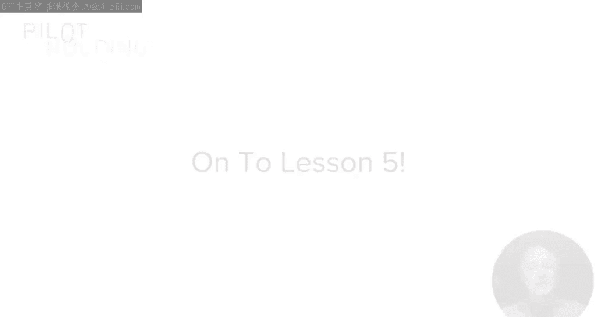
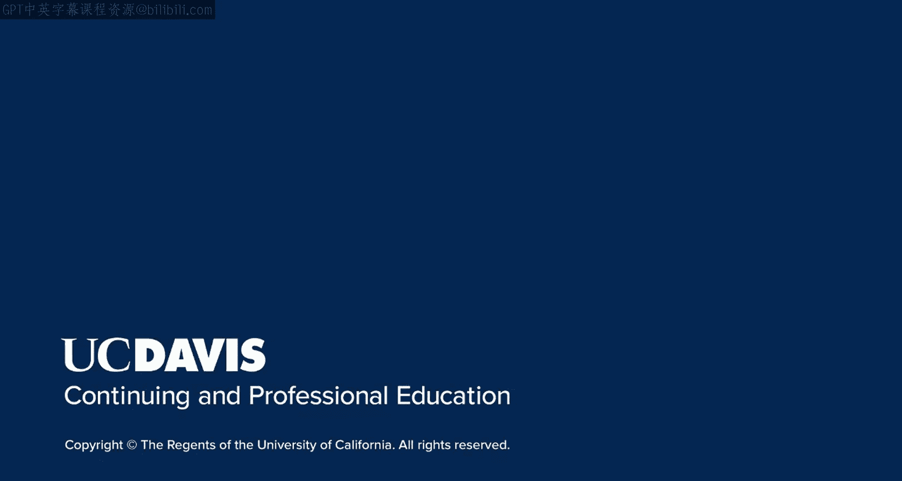

# 搜索引擎优化（谷歌、SEO基础、优化网站、进阶、毕业项目）：123：合作初始步骤

## 概述
在本节课中，我们将学习如何开始与行业内有影响力的人士进行合作。我们将探讨一系列具体的策略和步骤，帮助你从建立关系到开展协作，并始终强调为对方提供价值的重要性。

上一节课我们讨论了将接触影响者的过程视为建立互利关系。事实上，我们建议你尝试提供比你获得的更多的价值。本节中，我们将进一步深入，探讨一些具体的策略，以及你如何开始与影响者协作。

## 具体协作策略

正如上节课所讨论的，最初的策略之一是密切关注他们在社交媒体上的行为。

但更进一步，观察他们何时发布关于地点、事物的问题，或者是否在寻求帮助。

以下是杰伊·贝尔在自己Facebook动态上发布的一条评论，他请求人们对他为S A S dot com网站撰写的一篇投稿文章提供反馈。

这是一个与杰伊·贝尔（营销领域的主要影响者）互动的绝佳机会。在我制作这张幻灯片时，还没有人回复。正如我所说，这是某人开始与杰伊对话的开放机会。他会很乐意在他的Facebook页面上进行有益、有吸引力的对话，这也是开启关系的好方法。

接下来，有一个我称之为“低垂果实”的技巧。事实就是，有些人比其他人更容易接近。

有些影响者今年、明年甚至后年都可能不会理睬你。这可能是因为他们太忙，或者可能因为他们对你产生了某种初步的负面印象。这并不重要。

例如，你可能尝试与八位影响者互动，但只有两位以任何方式回应。这没关系。

不要因为那些没有回应的人而疏远他们，或者不断打扰他们，因为以后你可能处于更好的位置再次接触他们。目前，从那些对你最开放的人开始。充分利用这些机会。当你这样做时，你会获得更多曝光，从而提高你在其他人眼中的可信度。

另一个很好的做法是主动提出采访影响者。

想象一下，你对一位主要影响者进行了一对一的采访。也许你只是通过Zoom直播电话或电话与他们交谈，然后转录内容，发回给他们审核、编辑和最终批准。或者，如果他们愿意，你可以通过电子邮件发送问题，他们可以回复答案。这需要一些工作，但你可以为他们量身定制，而且没有人会因为被请求采访而生气。

如果他们太忙，可能会拒绝，但被请求总是有点令人高兴的。这也是开启关系的好方法，对他们来说工作量不大，并且有助于他们继续扩大自己的知名度，即使只是一点点。他们也在经营自己的受众。

记得在本模块前面，我谈到了不仅要面向影响者，还要面向整个受众的重要性。影响者也需要这样做，接受你的采访可以被他们视为一种回馈的方式。

截屏顶部展示了一个采访示例，是Poodlepress.com对数字营销领域的主要影响者、SparkToro的兰德·菲什金的采访。

采访知名影响者的一个好处是，发布的采访可以吸引大量链接。以Poodlepress的这次采访为例，根据SERush的数据，它获得了超过1000个链接，其中三个链接的SERush权威评分大于90。这非常不错。

下一个策略是参加他们所做的任何现场演讲。

多年前，我专程飞往纽约参加一个会议，就是为了见到当时负责谷歌网站管理员垃圾邮件团队的马特·卡茨。我坐在第一排，是第一个与他交谈的人。当那个小组讨论结束时，我计划给他留下深刻印象。我不是随意做的，实际上我经过了思考：**“以下是我将在与他的对话中提出的要点”**。我做了一些事情，所以我知道我会给他留下印象。

请注意，我在这里展示的图片是我在SMX Advanced大会上，受邀与丹尼·沙利文共同登台进行主题演讲。我之所以能有这个机会，是因为我多年来为建立与他们的关系付出了巨大努力，包括在行业中大声疾呼，倡导高度道德的SEO方法。这是我为谷歌受众增加价值的重要部分。

对于最重要的影响者，可能值得专程飞去见面。当然，你必须善于抓住机会，当机会出现时，你必须愿意采取行动。

我之前谈过关注他们的推文等。但当机会出现时，你必须愿意抓住它。这可能不像告诉他们孟菲斯最好的烧烤店那么简单，可能会复杂得多。

现在，我将通过一个个人例子来讲解如何抓住机会。

多年前，当兰德·菲什金还不怎么认识我的时候，他在Moz博客上发表了一篇关于免费Li页面想法和网站分析的文章。他说，肯定有人想跟进这个想法进行研究，因为你会获得50，000名访客和10，000个链接。他把这个想法发布在Moz博客上，而我是第一个自愿参与的人。事实上，我是第一个在那篇文章下评论的人。

要明白，我必须在60秒内做出这个决定。我知道我即将承担数百小时的工作。结果，大约一年前，一份名为“网站分析对决报告”的东西发布了，在媒体上获得了巨大的关注。虽然没有兰德建议的那么大，但确实获得了大量链接。顺便说一句，这也促成了我在数字营销行业的首次演讲机会，那是在圣何塞的搜索引擎战略大会上。

最终，这导致一年后斯蒂芬·斯宾塞找到我，问我是否考虑与兰德·菲什金、斯蒂芬和杰西·斯特里奥拉合著《SEO的艺术》一书。我怎么能拒绝这个机会呢？与这些人合著。我们现在已经出到第四版了。这就是抓住机会的重要性，当事情足够重要时，你必须愿意快速做出决定。

为了好玩，这是2009年11月出版的《SEO的艺术》第一版的封面。

延续这个主题，这是2023年9月出版的第四版的封面。这本书的出版商是O‘Reilly Media，这本书对我个人的声誉和知名度起到了巨大的作用。

## 总结
本节课中，我们一起回顾了开始建立关系以及与影响者开展协作的多种不同方法。永远不要忘记，在过程的每个阶段，你都应该始终努力为他们提供大量价值。

在下一节课中，我计划向你展示另一个技巧，即如何利用Facebook和/或Instagram来加速你在目标影响者中的知名度。