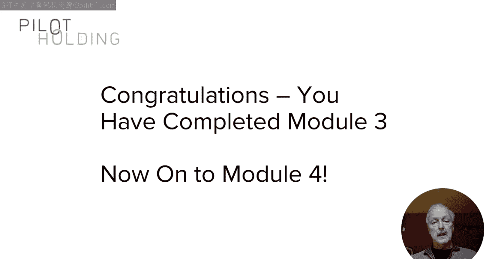
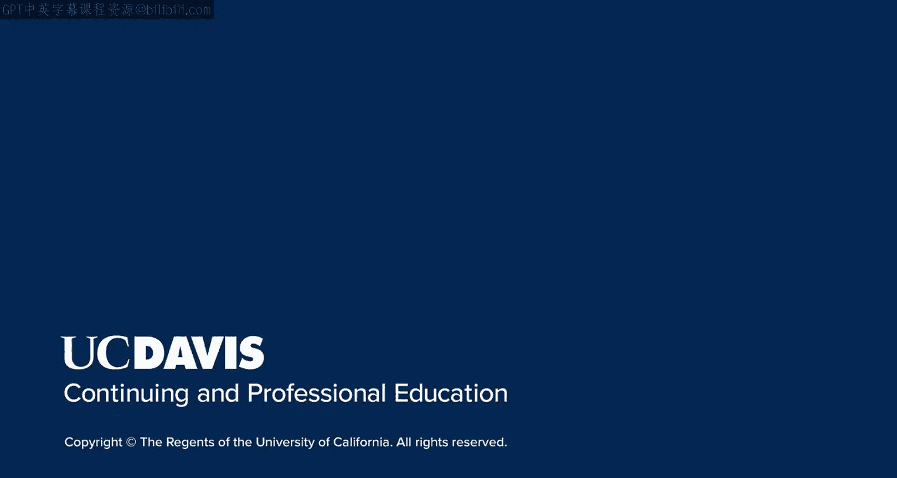

# 125：媒体渠道对接

在本节课中，我们将学习如何与一类特殊的影响者——媒体——建立联系。媒体在内容营销策略中扮演着关键角色，能为你带来高价值的提及和链接。我们将探讨如何识别并有效接触这些媒体渠道。

上一节我们介绍了如何利用社交媒体与影响者建立联系。本节中，我们来看看一类特殊的影响者：媒体。

在本课程的讨论中，“媒体”一词也指那些定期撰写与你所在市场相关主题的博主。媒体在你的整体内容营销策略中扮演着重要角色。他们是一类特殊的影响者，在媒体网站上发布内容，你可以在这些网站上获得提及或链接。

从SEO的角度看，其中一些媒体网站远比其它网站重要。这些链接代表着巨大的价值，即使是提及，也对你的声誉和可见性极有好处。此外，这些提及和链接是可引用的，这意味着当你与其他影响者（包括其他媒体）对话时，你可以告知他们哪些媒体网站已经引用并链接了你。如果这些网站是主流媒体，这一点尤其有价值。

主流媒体的例子包括《纽约时报》、《华尔街日报》、《华盛顿邮报》、TechCrunch、Mashable等类似网站。此外，你所在的特定商业领域也会有一些顶级域名，鉴于它们与你的市场高度相关，它们同样是权威的链接来源。

例如，如果你从事家居装修行业，你可能会考虑像ThisOldHouse.com和BobVila.com这样的网站。家居装修并非我活跃的领域，因此我无法告诉你是否能从这两个网站获得链接。但作为一个例子，这类网站是你需要考虑的——那些与你垂直市场高度相关的网站。它们在广义上可能不如《纽约时报》或《华盛顿邮报》那样权威，但由于高度相关性，对于你所在的市场（假设你身处该市场），它们是同样权威的链接来源。

因此，你需要做的一部分工作是详细分析你的市场，找出那些特定领域的权威网站，并确定哪些网站你有可能与之合作，或将其视为链接和/或提及的来源。作为一个有趣的练习，假设你身处家居装修市场，思考一下你能为ThisOldHouse.com提供哪些他们没有但可能需要的东西。

承接上一张关于家居装修市场的幻灯片，下一步是确定哪些主题领域与你业务的每个子主题领域高度匹配。在你制定内容营销计划细节时，请牢记这一点。

你接触他们的方式与你接触任何其他影响者的方式类似，适用相同的通用规则：获得引荐、去听他们演讲或参加线上直播活动、在社交媒体上与他们互动、评论他们的文章和帖子，并抓住机会找到与他们展开对话的方式。

就像对待影响者一样，你不能用质量低下或与他们兴趣无关的内容提案来浪费他们的时间。由于你的大多数提案将以书面形式（例如通过电子邮件）进行，你需要撰写简洁高效的提案。不要用冗长的电子邮件浪费他们的时间，确保提案能直切要点。

请记住，任何为热门媒体网站定期撰稿的人每年都会收到成百上千份提案。你的提案很容易被忽略。同时要注意，你给他们的第一份提案必须非常切题。如果你发送的第一份提案与他们无关，你很可能会毁掉建立这段关系的机会。他们可能会将你的电子邮件地址列入黑名单，或者养成忽略你邮件的习惯。不要让这种情况发生，从第一份提案开始就要保持相关性。

媒体人士习惯于接收提案，这是好事，但不要浪费机会。要非常小心地培养这些关系，让你的前几份提案成为出色的提案。以下是一些指导原则。

以下是撰写有效媒体提案的一些关键指导原则：

*   **撰写出色的主题行**：一个能吸引他们打开邮件的主题行，这意味着要在主题行中让他们知道你的提案与他们有何关联。
*   **保持提案简短**：最多四到五段。快速切入要点。
*   **在第一段建立权威性和可信度**：用第一段来建立你的权威性、可信度，并说明你希望他们考虑阅读的内容性质。
*   **包含几个要点**：用几个要点列出你内容中最有趣的部分。
*   **数据驱动的内容通常是首选**：在试图建立关系时，数据驱动的内容通常是首次向记者提案的最佳方式。当你能够整理出一些数据，为市场中热门话题领域的讨论增添价值，并且该话题领域正是这位媒体人士在其文章中经常讨论的时，这一点尤其正确。

然后，随着时间的推移，小心地培养这段关系。一旦与他们开始了初步对话，要继续审慎地逐步建立关系。仅仅因为他们写过一次关于你的报道，并不意味着他们已成为你最好的朋友。你仍然需要专注于保持提案的高度相关性和价值。

你可能有一些关系，能让他们写一次关于你做的事情，然后就此结束。在其他情况下，你可能能够建立一种持续的关系，让他们定期报道你的内容。这两种结果都不错，尽管其中一种显然优于另一种。随着你在这些关系中取得进展，请继续以专业和尊重的态度对待他们。

在本节中，我们讨论了媒体关系的独特之处。同时，我们也来到了“影响者”模块的结尾。在下一个模块中，我将把我们目前涵盖的所有信息整合起来，为你提供一个关于内容营销计划的宏观视图。

本节课中，我们一起学习了如何识别和对接媒体这类特殊的影响者，了解了主流媒体和垂直领域权威网站的价值，并掌握了通过撰写简洁、相关、有价值的提案来与媒体建立有效联系的关键原则和步骤。