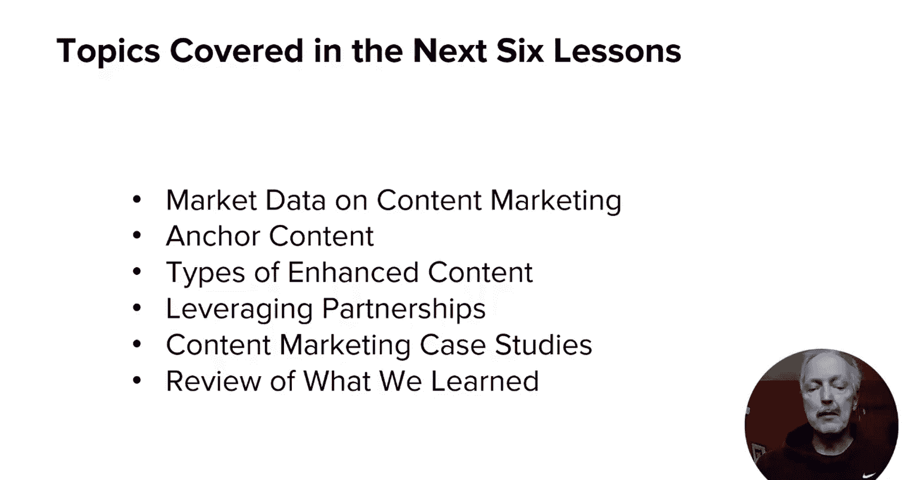
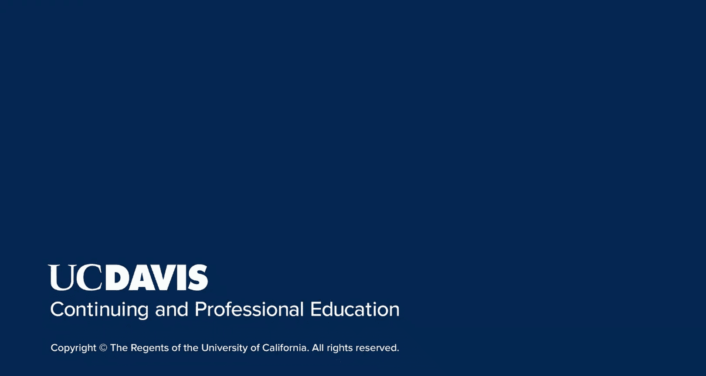

# 126：UCD《搜索引擎优化（谷歌、SEO基础、优化网站、进阶、毕业项目）｜Search Engine Optimization》中英字幕 p126 22_模块四导论.zh_en -BV1N66VYsEue_p126-

🎼，🎼Yeah。Welcome back everyone， this module is the final module in the content marketing course。

So far， you've seen the basics of content marketing and how social media and influencer marketing can play a role in driving your content marketing efforts。

In this module we'll talk about content marketing and taking it to that next level， remember。

 content marketing is about growing your reputation and visibility online。For that reason。

 good content is not enough。You'll only succeed if you regularly publish outstanding content。

Review data that shows what content is the most shares， show examples of very successful content。

 how partnerships can work， and some case studies， I'll wrap things up with a review of all that we've learned in the entire course。

By the end of this module， youll have cemented your knowledge on content marketing and have a strong knowledge that will increase your chances of success。

The next six lessons in this module cover the following topics。

Lessson two will show some market data on content marketing。

Lessson three introduces the concept of anchor content。

Lessson four provides insight into different types of anchored content。

Lesson five discusses the role that partnerships can play in your program。

Lessson six dives into several more content marketing case studies。

And lesson7 provides a final wrap up for moduleule 4。

