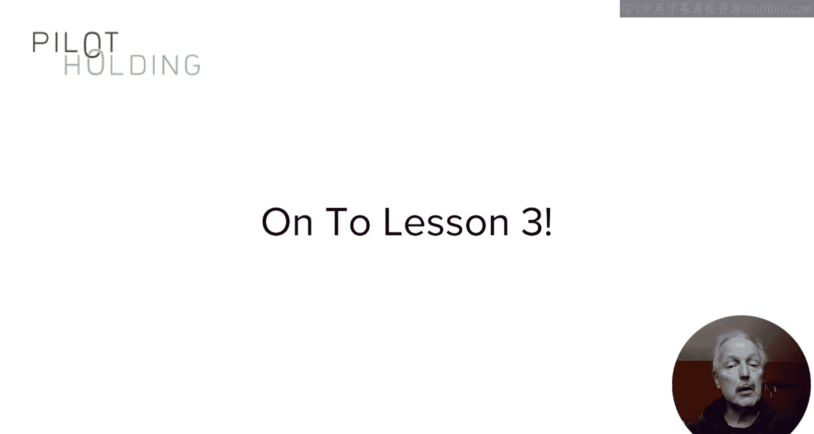

# 搜索引擎优化：127：内容营销市场数据分析 📊

在本节课中，我们将回顾几项行业研究，分析网络用户如何与内容互动，以及他们倾向于分享和链接哪些类型的内容。课程结束时，你将获得关于如何获取内容分享和外部链接的新视角。

## 社交分享与阅读时间的关联性

上一节我们介绍了内容营销的目标，本节中我们来看看用户行为数据。首先，我们分析一项由Chartbeat在2014年进行的研究，该研究探讨了人们是否真的阅读了他们在社交媒体上分享的文章。

观察下图可以发现，大多数阅读时间长的文章，其社交分享量却很低。

图中，高阅读时间的文章位于右半部分，而高社交分享量则由上半部分表示。这意味着，**高阅读时间**与**高社交分享**同时出现的区域（右上象限）几乎为空。此外，大多数高社交分享的文章阅读时间都很短。

这似乎表明两者之间存在脱节。那么，这告诉我们什么？**最有可能被社交分享的内容，通常是那些易于快速消费的内容**，例如非常可爱或古怪的宠物照片。

有趣的是，Chartbeat在2017年重复了这项研究，但得到了略有不同的结果。

2017年的图表显示数据点分布更为随机，两者之间几乎没有相关性，甚至连负相关都不明显。

虽然两项研究的结果略有不同，但**它们都没有证明高社交分享量与高阅读时间之间存在正相关**。因此，请谨慎对待，不要将高社交分享量作为你的核心指标。

## 链接与社交分享的相关性研究

既然社交分享不能直接带来链接，那么什么可以呢？接下来，我们看第二项由Moz和BuzzSumo在2014年进行的研究。这些数据虽然相对较早，但我坚信其揭示的动态关系在今天依然适用，并且目前没有更新的同类数据。

这项研究分析了超过10万个随机帖子，试图找出能同时获得链接和分享的内容类型。还记得我说过在内容营销中“足够好”并不够吗？这就是原因。**绝大多数内容在社交媒体上未能获得太多关注**，研究中75%的内容在社交媒体上获得的分享数不超过39次。

以下是该研究的测量方法概述：

*   **皮尔逊相关系数**：研究使用该技术进行测量，其得分范围从 **-1** 到 **+1**。
    *   **-1** 表示完全负相关，意味着社交分享增加时，链接数减少，反之亦然。
    *   **+1** 表示完全正相关，意味着社交分享增加时，链接数也增加，反之亦然。
    *   **0** 表示无相关性，即两个因素之间没有关联。

我们显然希望寻找具有正相关性的因素。通常，**相关系数达到 +0.3 或更高**，才开始代表合理或显著的正相关。

然而，在所有被检查的10万个帖子中，**分享数与外部链接数之间的相关系数仅为 0.011**，非常接近零。这意味着，**从整体上看，社交分享数与获得的链接数之间没有相关性**。

研究还发现，没有任何一个社交媒体平台表现出强相关性。Facebook、X（原Twitter）、LinkedIn和Pinterest的表现都很一般。请注意，这项研究未包含TikTok、Snapchat和Instagram等其他社交网络，但没有理由认为它们会表现出更强的相关性。

## 能同时获得分享与链接的内容类型

那么，究竟哪些类型的内容能同时获得分享和链接呢？研究对超过75.7万条内容进行了采样，其中包含6.9万个分享数超过1万的帖子。即使在这些高分享帖子中，链接与分享的相关系数也仅为0.1，仅达到“显著相关”标准的三分之一。

不过，确实有一些网站在链接和社交分享之间表现出很高的相关性。以下是几个例子及其原因分析：

*   **《纽约时报》、《卫报》、BBC新闻**：这些网站专注于**观点塑造型新闻**，在新闻内容方面享有盛誉。这种方法的前提是你已经建立了这样的声誉，让他人重视你的观点。
*   **皮尤研究中心、美国人口普查局**：这些网站专注于**数据驱动型研究**。这是另一类人们既喜欢分享又喜欢链接的内容类型。与观点型新闻不同，**数据驱动型研究是大多数网站发布者都可以执行的内容策略**。

## 内容长度的影响

关于内容长度，它有多大影响呢？研究中，**86%的样本文章字数少于1000字**，总计超过41.8万篇。此外，研究中很少有文章超过3000字，这很合理，因为创作长篇内容需要更多工作量，并且需要足够大的主题来支撑。

然而，数据显示，**长篇内容往往能吸引更多链接**。原因在于，当长篇内容做得好且主题合适时，它更有可能提供有价值、新颖的见解，从而值得被分享和链接。

## 课程总结

本节课我们一起学习了内容营销中的关键市场数据。开始你可能认为获得大量社交分享的内容也容易获得大量链接，但我们看到事实并非总是如此。一个原因是人们喜欢分享能引发情感反应的内容，而大多数引发情感的内容未必在重要话题上具有权威性。正如我们所看到的，**更权威的内容才最有可能获得链接**。

在下一节课中，我们将讨论“支柱内容”的概念，这类内容是成功内容营销计划的基石。