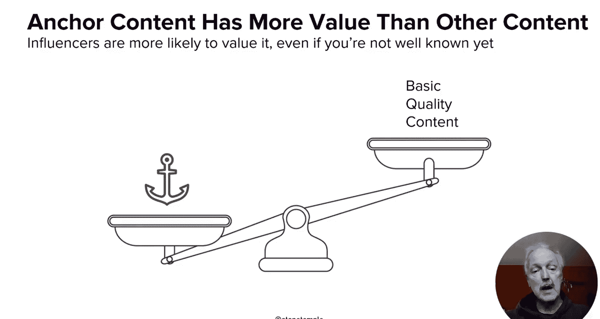
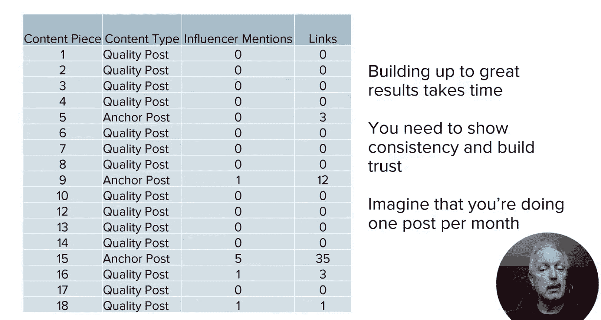
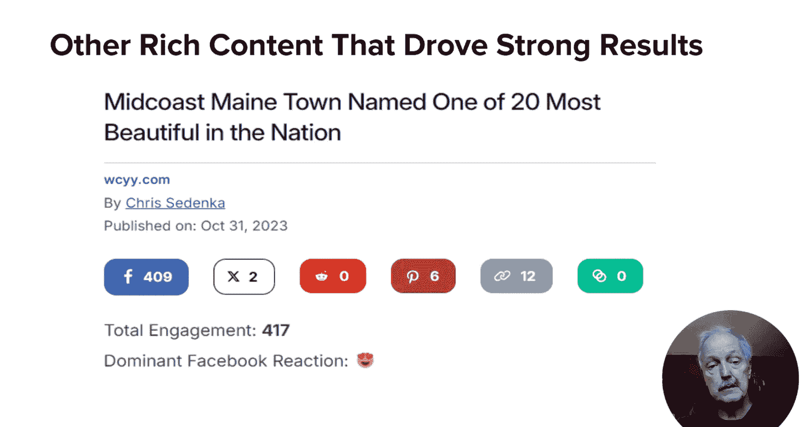
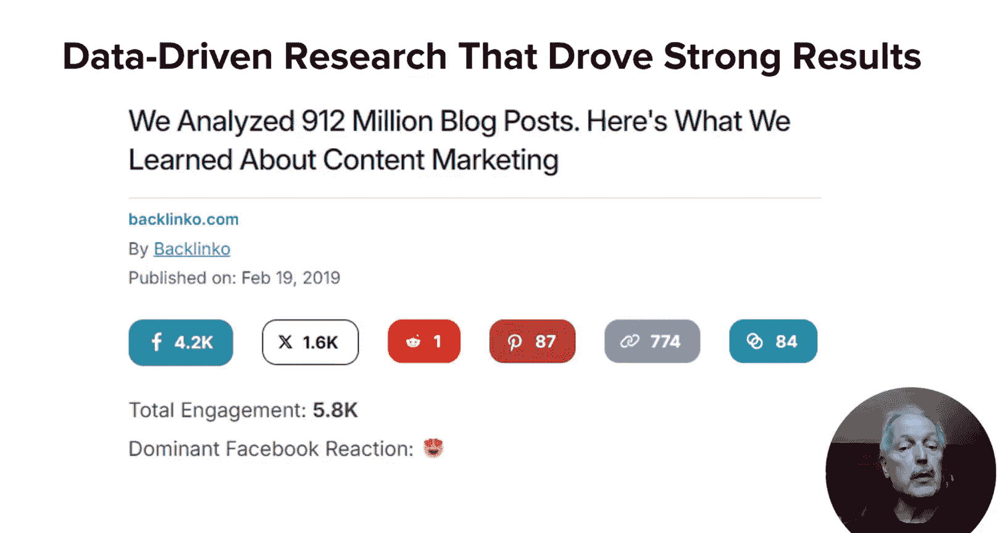
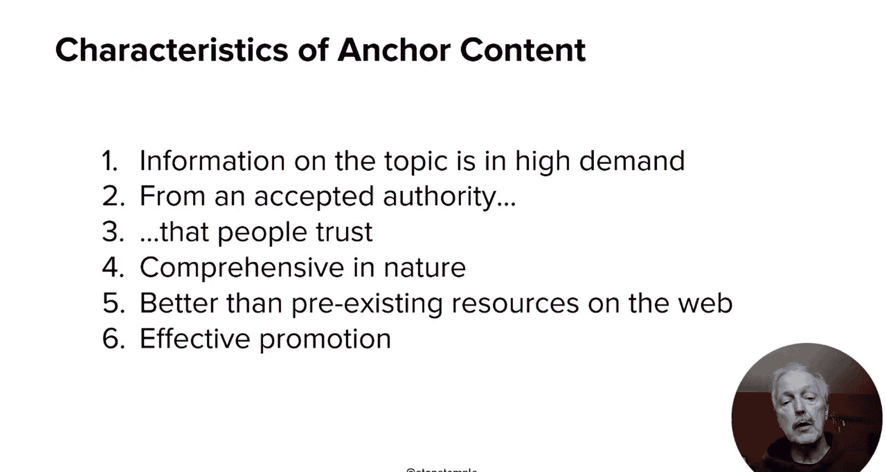
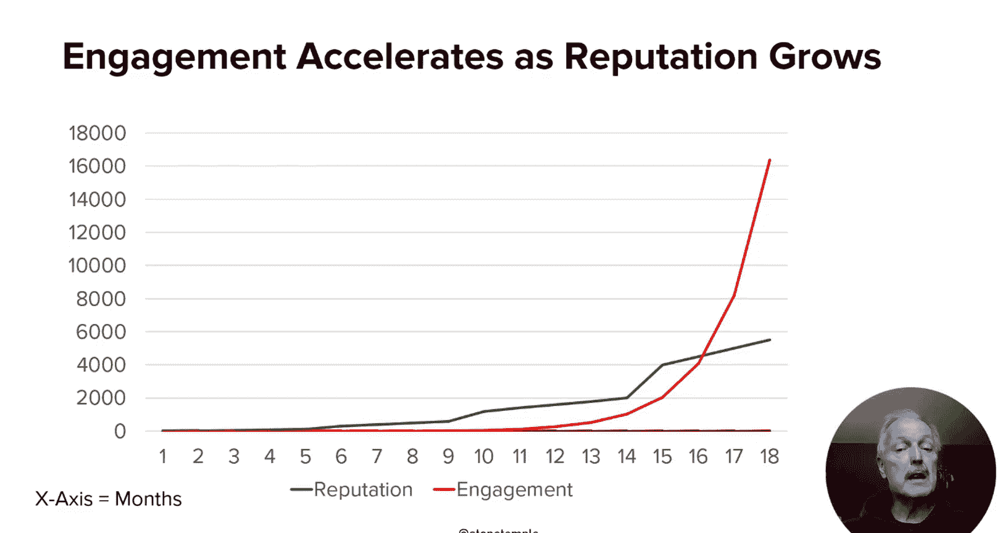
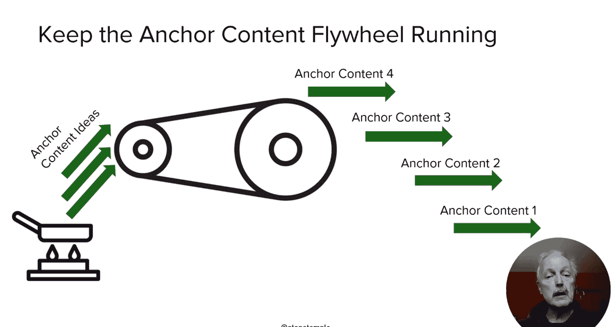

# 128：锚点内容策略

在本节课中，我们将要学习什么是“锚点内容”，以及它在内容营销策略中的核心作用。我们将探讨锚点内容的定义、特征，并理解它如何帮助提升品牌声誉和在线可见性。

## 什么是锚点内容？

首先，什么是锚点内容？它是一种能够通过单篇内容显著改变品牌声誉和可见度的内容。这意味着它不能仅仅是“好”内容，而必须是“杰出”的内容。这听起来是件很棒的事情。

所以，让我们深入探讨这可能是什么。正如我们在上一课中谈到的，它可以是数据驱动的研究。在我的职业生涯中，我在这类内容上取得了巨大成功。

这张图表展示了以每月一篇的速度发布的18篇帖子。在这张图表中，最初几篇高质量帖子确实是高品质的作品。但它们实际上未能引起任何关注。在内容营销的早期阶段，你可能还没有完全到位。因此，没有人知道你是谁，也不知道他们为什么应该关心你的观点。

顺便提一下，如果你是一个大品牌，但一直没有发布非商业性的信息内容，情况会有些不同。但事实仍然是，你的受众还不习惯看到你发布这类内容。因此，你仍然需要经历一个市场接受度的爬升曲线。

## 锚点内容的成功路径

不过请注意，数据驱动内容并非唯一的成功路径。以下是wcyYy.com上的一个例子，它成功获得了一些链接。这无论如何都不是一个“全垒打”，但它仍然产生了影响。所以，即使你不会认为它是锚点内容，它仍然是好的、成功的内容，你可以基于一系列这类内容建立一个成功的营销计划。而锚点内容只会让你的计划增长得更快。

当然，及时的数据驱动内容，就像我在这里展示的这个组织得非常出色的例子，有时能带来惊人的效果，这就是我所说的锚点内容。需要注意的是，仅仅“数据驱动”是不够的。这些数据必须是之前没有出现过的，能提供深刻见解，并且你的分析必须高度可信。本幻灯片中展示的例子来自Backlinko的Brian Dean，他以擅长此类分析而闻名。

## 锚点内容的特征

那么，锚点内容有哪些特征呢？以下是其核心特征：

*   **广泛关注的主题**：它必须是一个很多人关心的话题。
*   **权威性重于情感性**：之后，它更侧重于权威性而非情感性，因为这最有可能同时为你带来分享和链接。
*   **主题全面**：它通常对一个主题进行全面的阐述。
*   **显著优于现有资源**：它必须比网络上已有的、其他人发布的同一主题的资源有实质性的提升。
*   **依赖作者和发布者的可信度**：其效果依赖于作者和发布者的可信度。
*   **有效的推广是关键**：有效的推广也是关键。

这就是为什么在第二和第三模块中，我们讨论了社交媒体营销和影响者营销。锚点内容有助于你在这些受众中建立可信度。

一旦市场开始相信你是锚点内容的可靠来源，你所有的内容都倾向于更容易获得更高的参与度。但你必须明白，这需要时间来建立。即使你一开始就制作了出色的内容，并且在开始后两周就发布了锚点内容，你可能还没有建立起作者的可信度。所以你必须为此计划一些时间。

有时，内容营销活动需要18到24个月才能达到临界规模。但一旦你达到那个点，它的力量就非常强大。当你的声誉跨越某个阈值时，就达到了临界规模。那些关键的内容或锚点内容是一个重要的关键，但一次巨大的可见性提升也能有所帮助。

## 持续发布与长期策略

你需要维持发布锚点内容的速度。一旦你做到了这一点，现在即使是你更普通的内容，也可能获得一定程度的较高参与度，甚至可能获得一些链接。尽管它本身可能不是锚点内容，但无论你做什么，都必须持续产出锚点内容，你必须继续支持你的营销活动，因为这是你整体内容营销策略中一个非常重要的环节。当你达到目标时，不要搞砸了。

## 总结与下节预告

本节课中，我们一起学习了锚点内容的概念，以及构成这类内容的特征。此外，还讨论了达到目标所需的权威性以及随之而来的可见性。

在下一课中，我计划带你了解不同类型的内容及其各种属性，以及它们对内容营销活动的整体价值。

