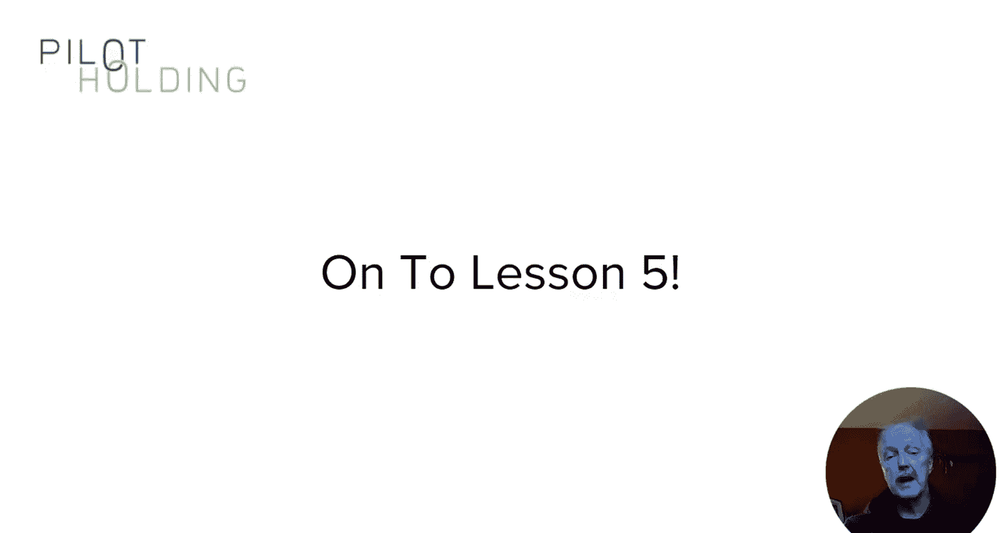

# 129：增强内容类型

在本节课中，我们将学习各种可用于内容营销的增强内容类型。我们将探讨视频、信息图、数据驱动研究、互动内容等多种形式，分析其优缺点，并了解它们如何应用于实际营销活动。

上一节我们介绍了“锚定内容”的概念，它是任何内容营销活动的核心。本节中，我们来看看可以围绕核心概念创建哪些不同类型的内容，以增强营销效果。

## 视频内容

对于合适的组织，视频可能是理想的选择。
圣地亚哥动物园在视频内容方面做得非常出色。他们在YouTube上拥有13.1万订阅者，在TikTok上拥有250万粉丝。他们擅长捕捉公园里发生的独特瞬间，动物们天生就适合镜头。

你可能会好奇，在TikTok上的强大影响力是否能帮助提升在谷歌的搜索表现。可以考虑Fenty Beauty的案例，它在TikTok上积累了260万粉丝。是的，其谷歌搜索流量也一直在显著增长。

## 信息图

接下来是信息图，这也是一种视觉格式。这是另一个潜力巨大的领域。关于信息图需要记住的是，它只是一种展示形式。
如果你没有适合高度图形化输出的信息类型，那么你的信息图就不会成功。

Shutterstock在其创意趋势信息图方面做得非常出色。在他们发布2019年版本当天，就获得了超过170个反向链接，其中包括来自Adweek、Campaign、Vogue Australia、Design Jungle、The Colors和W&V的链接。

确保信息图准确、质量非常高，并且包含人们会关心的有用信息。正如我已经提到的，你需要拥有适合高度视觉化呈现的数据类型，否则就应该避免使用信息图。

## 数据驱动研究

然后是我最喜欢的数据驱动研究。
一个例子是Study.com进行的一项调查。这项调查的出色之处在于其时机。它调查了教师是否将ChatGPT视为教学工具，还是会导致创新作弊增加的问题。它在2023年初发布，距离ChatGPT首次发布不久。这个概念有时被称为“新闻劫持”，该活动总共获得了314个反向链接，其中184个是有效链接。

数据驱动内容的另一个例子是Orbit Media的Andy Crestodina对1000多名博主进行的调查。追踪上千名博主并获得他们对调查的反馈并非易事。因此，这很难复制。Crestodina使这更难被模仿，因为他现在已经连续10年进行这项调查。该页面拥有超过17，000个反向链接。

## 互动内容

接下来是《纽约时报》做的一个非常酷的互动内容示例。
他们创建了一个互动图表，向你展示一个空白的图表，X轴是父母的收入水平，Y轴显示他们的孩子上学的机会。你需要画出你认为家庭收入对孩子上大学前景影响的线。你可以看到我画的红色线，以及在你画完之后才显示的实际真实线，用蓝色表示。这是一个极其成功的内容。Ahrefs数据显示，它从115个引用域名获得了276个反向链接。

这种让用户参与互动内容的想法非常有价值，因为它能吸引他们，因为他们想与之互动。但请再次记住，如果数据没有价值，人们不关心答案，它就不会吸引任何人的注意。

## 其他内容机会

我已经向你详细展示了几种不同的内容和机会，但实际上还有很多。
以下是另一个例子。Best May在Instagram上的图片和视频做得非常出色，并且获得了极佳的互动。这些东西能获得链接，是因为它们讲述了一个故事，同时与业务建立了情感联系。

影响者访谈是另一个好主意，我在模块三中讨论过，当时我分享了Rand Fishkin的一个访谈示例。与影响者建立关系，采访他们，然后发布。影响者可能会分享它，其他人看到采访后也可能分享，这些都能为你带来一些链接。我在模块三分享时，你已经看到了那些结果。

另一个可能有效的策略是案例研究。人们喜欢现实世界中的实例，而案例研究是展示这一点的好方法。这里我展示的是SEO Clarity案例研究页面的Ahrefs反向链接报告。虽然没有数百个链接，但它们极具价值，因为它们帮助该页面获得高排名并带来一些自然搜索流量。

## 总结

我希望这能让你了解到，存在许多不同类型的内容机会。
从一个角度看，你的创造力是唯一的限制。但你内容营销成功的关键在于，选择最适合你业务需求和目标的内容类型，同时也要处理那些在市场上会广受欢迎的主题。你的内容创作能力也是一个不容忽视的因素。

在下一课中，我将重点介绍合作伙伴关系的威力，以及它们在内容营销中可以发挥的作用。