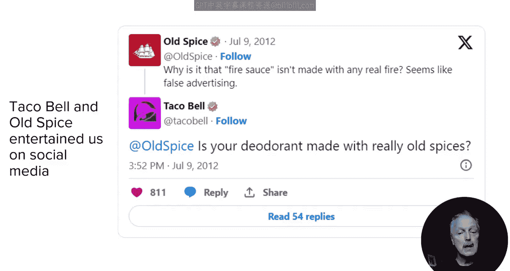
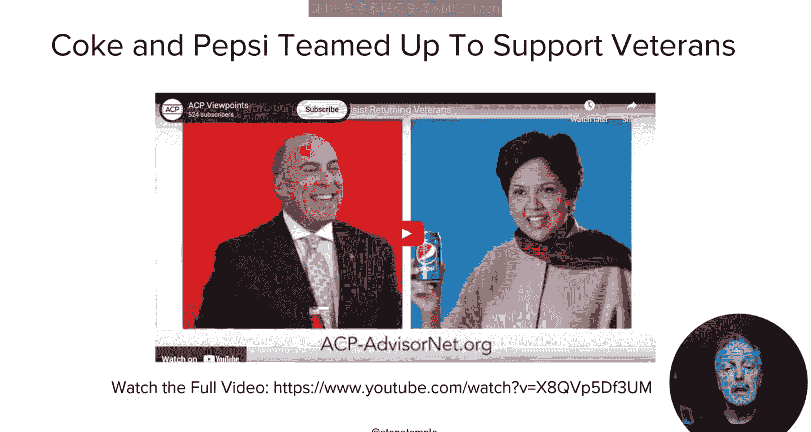
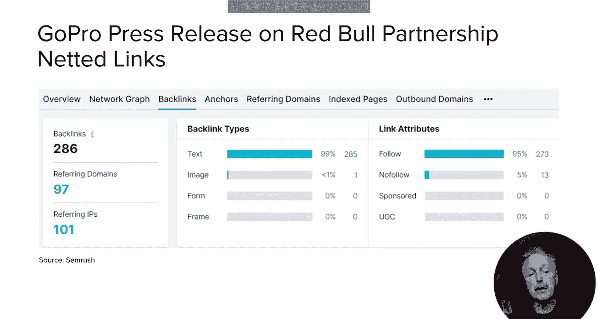
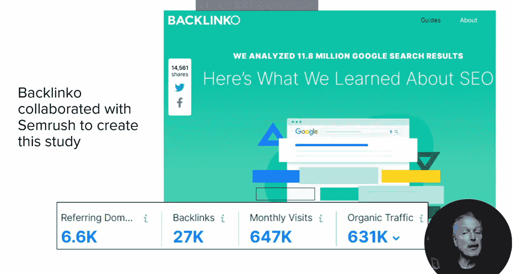
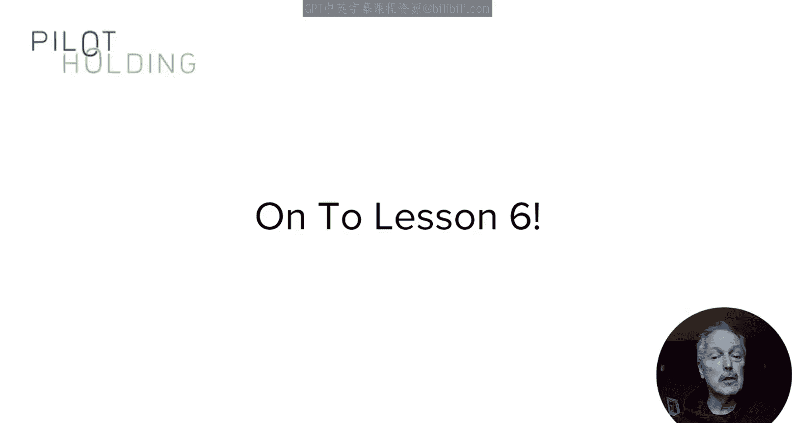
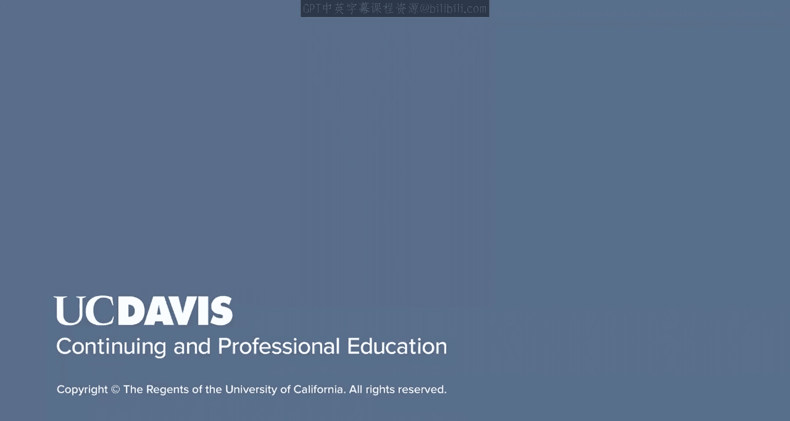

**SEO基础与进阶：130：合作伙伴关系建设**

在本节课中，我们将深入探讨如何通过建立合作伙伴关系来拓展行业联系，并利用这种策略为你的网站和品牌创造更大的影响力与杠杆效应。

上一节我们回顾了多种内容类型和机会。本节中，我们来看看如何通过与其他品牌或组织合作，将你的影响力提升到新的高度。合作伙伴关系不仅能帮助你接触到新的受众，还能通过资源共享和创意碰撞，创造出单打独斗难以实现的效果。

以下是几种不同类型的合作伙伴关系示例，它们展示了合作的多样性和潜力。

*   **品牌联名合作**：Homesick与Lucasfilm合作，推出了星球大战主题的蜡烛系列。Lucasfilm授权其使用品牌标识，并对产品设计提供反馈。该系列于2022年5月4日（星球大战日）推出，立即获得了Mashable、Cosmopolitan等数百家媒体的报道。
*   **社交媒体互动**：Old Spice和Taco Bell在Twitter（现称X）上进行了一次幽默的隔空喊话。这场有趣的互动不仅吸引了大量社交媒体关注，还获得了《时代周刊》、ABC新闻等主流媒体的报道。
*   **创意公益营销**：阿根廷的Burger King曾有一天停止销售皇堡，目的是为了帮助麦当劳提升巨无霸的销量。起因是麦当达当时承诺为每位患癌儿童捐赠2美元。Burger King希望通过此举增加麦当劳的捐款总额。这个极具创意的活动在社交媒体上获得了巨大关注，并得到了全球媒体的报道。
*   **联合公益倡议**：可口可乐和百事可乐曾罕见地联手，为其同支持的非营利组织ACP AdvisorNet制作公益广告，该组织致力于帮助退伍军人重新融入社会和职场。
*   **技术与内容联盟**：GoPro与RedBull建立了合作伙伴关系。GoPro成为RedBull媒体制作的独家视角摄像机提供商和内容合作伙伴，而RedBull则获得了GoPro的股权。相关的新闻发布页面获得了大量外链。
*   **数据研究合作**：Backlinko与SEO工具提供商Ahrefs、SEMrush以及Clearscope合作，分析了1180万个搜索结果，以找出与搜索引擎排名相关的因素。Backlinko的创始人Brian Dean在发布的研究报告中显著地引用了这些合作伙伴，尤其是主要数据提供商SEMrush。

那么，为什么这类合作活动能够如此成功？关键在于它们结合了三个要素：

1.  **强大的分析能力**：例如Backlinko的Brian Dean。
2.  **领先的数据资源**：例如SEMrush、Ahrefs等提供的大规模数据源。
3.  **吸引市场关注的核心理念**：你需要提前进行尽职调查，验证市场对你计划产出的数据是否有需求，并了解最能吸引媒体的具体角度。

我在2019年也曾与Moz合作进行过类似的研究，分析了点击率数据以及搜索结果页面功能对点击率的影响，也取得了不错的效果。

你可能会问，为什么拥有数据的公司愿意与你合作？原因有几个：首先，由第三方进行分析和发布，会使结论显得更加客观和可信，从而更容易获得媒体和博主的青睐。其次，他们自身可能缺乏进行分析或撰写报告的专业人才或领域专家。

本质上，合作伙伴关系与影响者关系类似，双方都致力于为彼此带来巨大价值。正是这种互利共赢的动力，使得合作伙伴关系变得非常强大。

在本节课中，我们一起学习了合作伙伴关系的多种形式及其在SEO和内容营销中的强大作用。从品牌联名到数据研究合作，成功的核心在于结合各方优势，创造共赢价值。下一节课，我们将通过更多案例研究，看看其他人是如何出色地运用内容营销策略的。