# 132：内容营销核心回顾 🎯

在本节课中，我们将回顾内容营销的核心概念与运作机制。我们将从顶层视角出发，系统性地梳理内容营销的目标、策略与执行步骤，帮助初学者理解如何通过高质量内容建立声誉、吸引受众并获取链接。

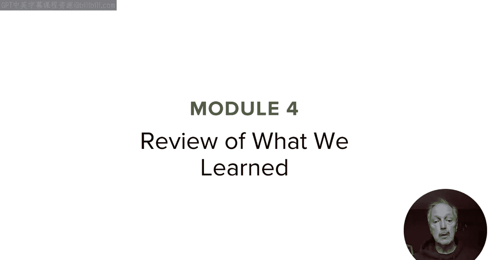

---

上一节我们回顾了优秀的内容营销案例。现在，作为本模块也是整个课程的最后一课，是时候回归基础了。

让我们自上而下地审视内容营销的本质及其运作方式。

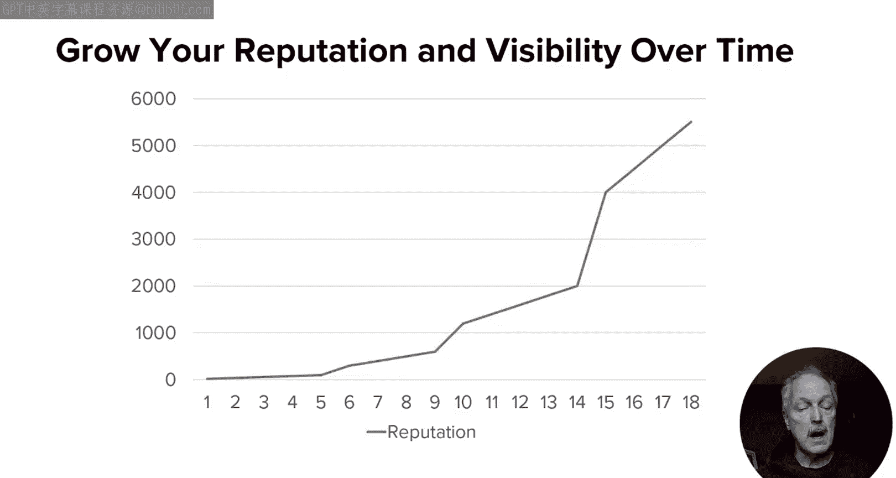

记得我从一开始就强调，内容营销始于在网络上建立你的声誉和可见度。这正是我们的核心关注点。请注意，建立这些可能需要相当长的时间。

在整个过程中，我们将通过积累受众来扩大影响力。这里的“受众”指的是那些主动寻找我们更多内容的人群。受众规模越大，后续工作就越容易。

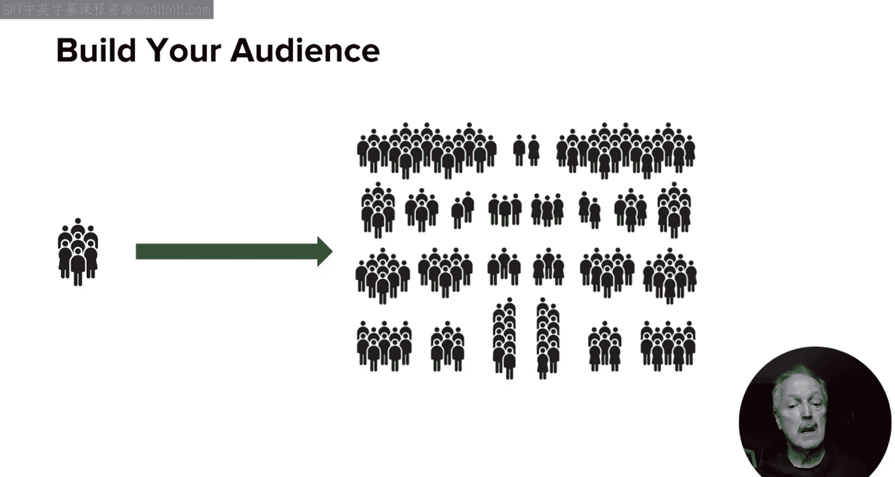

无论你服务于一个大品牌，还是刚刚开始内容营销，你都需要努力构建一个期待从你这里获取此类内容的受众群体。

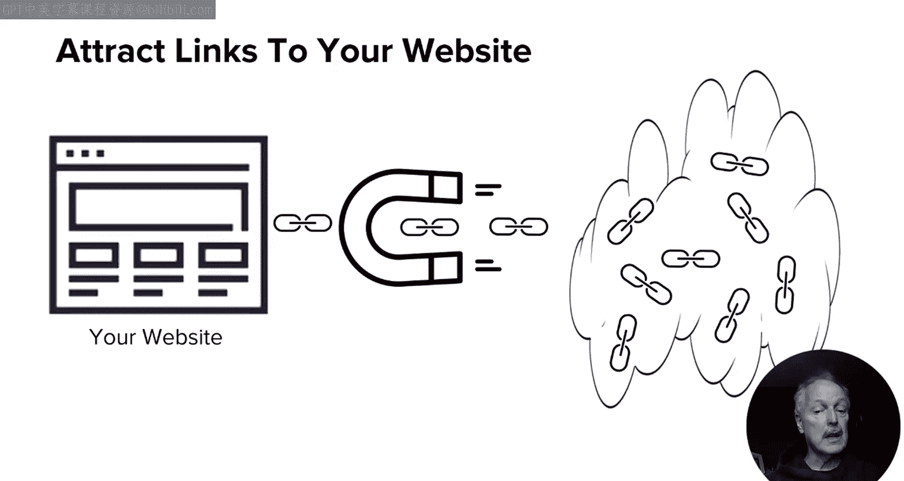

由于这是一个SEO专项课程，我们希望通过内容吸引一些指向我们网站的链接，因为这将有助于为我们的整体业务带来SEO价值。

然而，许多公司为了获取链接而采取操纵性手段，从而陷入麻烦。

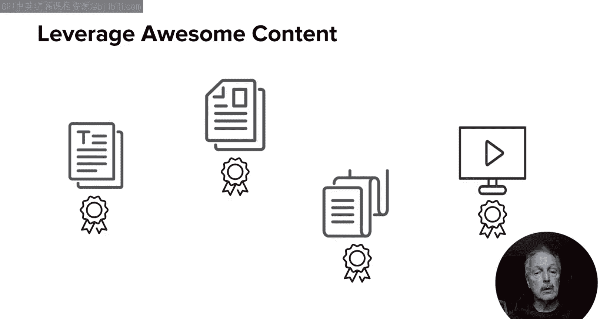

我们应该避免这种做法。吸引网站链接的最佳武器是专注于创造目标受众喜爱的高质量优质内容。

请记住，你的目标受众不仅包括潜在客户，还包括有影响力的人、媒体和博主。

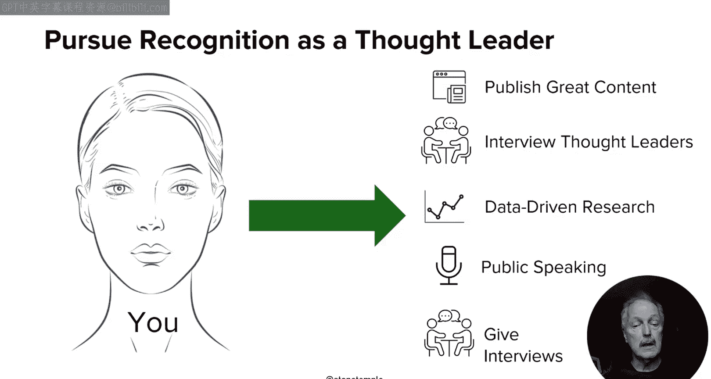

在此过程中，努力争取成为公认的思想领袖。这可以是为你的整个组织，也可以是为组织中的一个或多个个人。实现这一地位将使你所有的内容营销目标更容易达成。

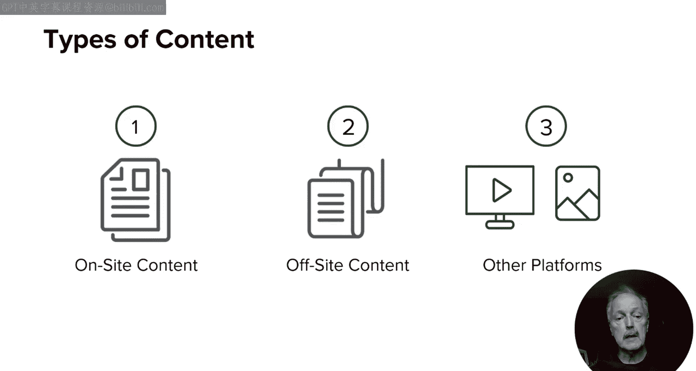

你可能会在许多不同的地方发布内容：在你的网站上、在选定的第三方网站上、以及在社交媒体平台上。所有这些都是一项成功计划的一部分。

无论我们在何处发布，都要坚持内容质量标准，并努力确立你的思想领导力。

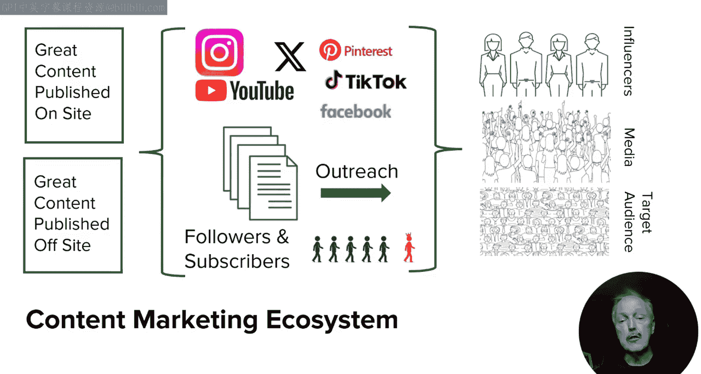

确保系统性地在内容营销生态系统中运作。作为其中的一部分，你将利用社交媒体、主动外联、关系建设，并发展你自己的关注者和订阅者网络。

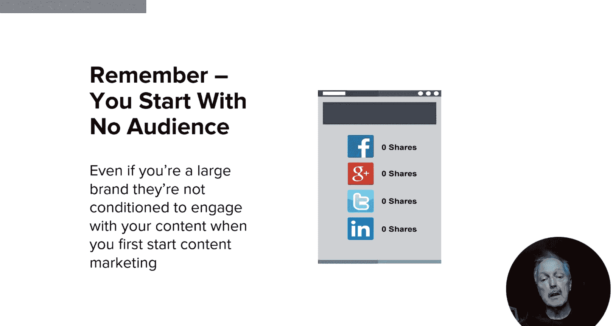

请记住，当你刚开始时，你可能是受众很少或没有受众的小型组织，也可能是拥有产品受众但刚刚开始内容营销的大型品牌。无论哪种情况，你仍然缺乏一个寻找你内容的受众群体，因此你需要构建这种类型的受众。

社交媒体分享可以帮助你建立受众。正如我之前展示的，在你自己的社交媒体动态中分享内容，可以让你出现在你的受众面前。

这可能导致其他人看到它并成为你的关注者。当然，你的一些关注者可能会重新分享它，让你出现在他们的受众（我称之为“他人的受众”或OPA）面前，而他们的一些受众可能会关注你。

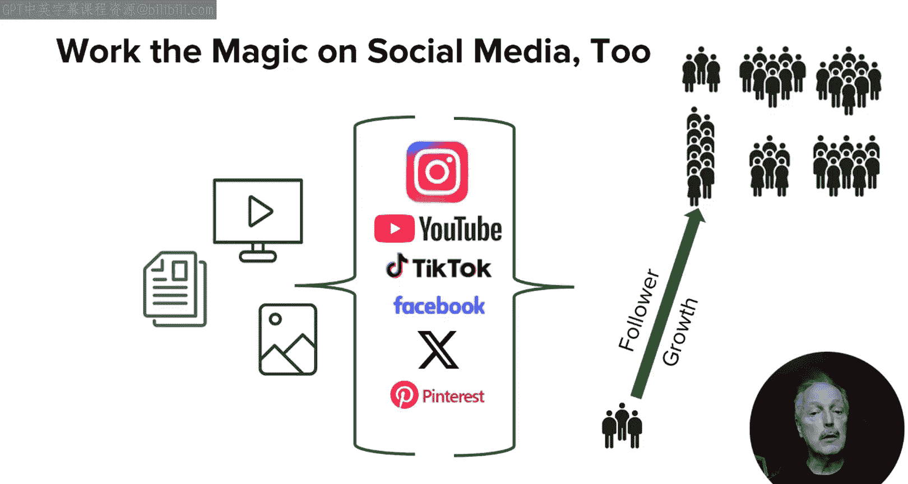

这个过程的效果取决于你的内容质量、独特性以及是否涵盖了热门话题。

也不要忘记有影响力的人。他们拥有更大的受众群体，并且对他们的受众有更大的影响力。此外，他们的受众也包括媒体和其他有影响力的人。正如我在社交媒体模块中指出的，他们对人们及其受众也有更大的影响力。

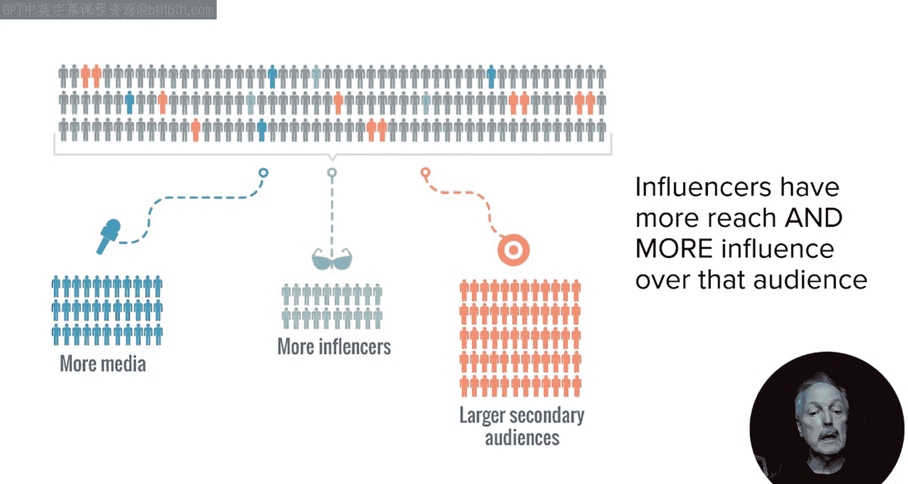

现在，让我们更详细地看看整体的动态过程。在这张幻灯片上，我展示了过程中的许多步骤。

你发布内容，在社交媒体上分享它，一个有影响力的人分享了它，然后他们的关注者看到了它。其中一些人关注了你，另一些人分享了它，然后他们的一些关注者看到了它，其中一些人开始成为你的关注者。

顺便说一下，如果这张幻灯片中第三个位置的人不是有影响力的人，这个过程同样有效，只是速度更慢。非影响力人士的受众规模更小，他们的受众响应率也更低。这就是为什么有影响力的人如此重要。

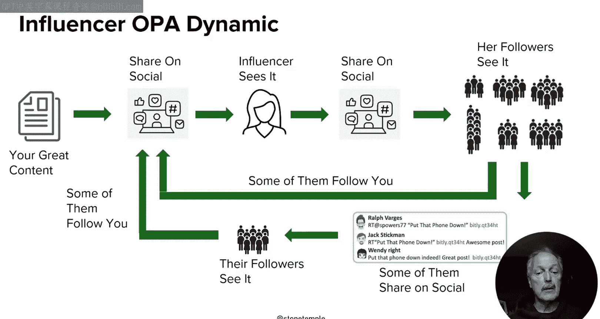

接下来，让我们考虑有影响力的人如何帮助联系媒体人士。当有影响力的人分享你的内容时，它会立即提升到一个更高的可信度水平。

如果媒体人士在有影响力的人的动态中看到它，并且觉得足够有趣，他们甚至可能关注你或在他们的社交媒体上重新分享它。最终，这甚至可能导致他们中的一些人撰写相关内容并链接到它。

当然，我们不想仅仅依靠有影响力的人来接触媒体人士。我们也应该愿意直接联系他们。为此，你必须确保只就你有充分理由相信他们可能感兴趣的话题联系他们。

这应包括积极研究他们在网上发布的相关内容，并找出你的新内容能为他们已经完成的工作增加价值的领域。

一旦你确定了那些协同效应很强的媒体人士，你需要联系他们，让他们知道你创造了什么，以及它如何补充他们已经发布的内容。

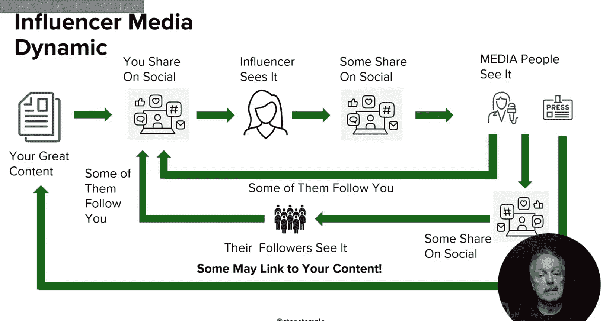

如果你做得好，你可能会让一些人撰写关于你所做的事情的文章，其中一些人可能还会链接到你的文章。

以上就是核心内容。永远不要忘记，内容营销首先需要关乎建立你的声誉和可见度。

你只是你希望在其中被认可的更大社区的一部分。你希望成为该社区的主要贡献者。这些原则是任何成功内容营销计划的核心。

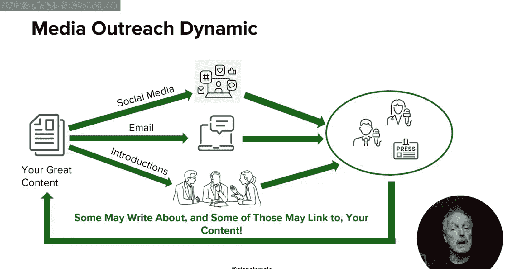

本课程只剩最后一个视频来收尾，在那段视频中，我计划分享一些最后的想法，希望能为你自己在内容营销道路上的探索提供一些视角。

---

**本节课总结**

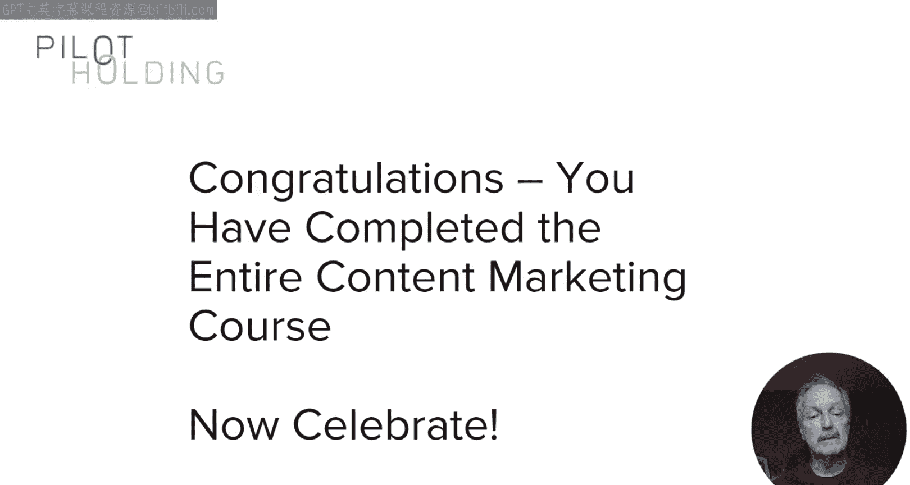

在本节课中，我们一起回顾了内容营销的核心框架。我们学习了内容营销始于长期建立**声誉**与**可见度**，核心目标是构建寻找你内容的**受众**。吸引有价值的**链接**应通过创造**高质量内容**自然实现，而非操纵手段。过程中应努力成为**思想领袖**，并在网站、第三方平台和社交媒体等多渠道发布内容。系统性地利用**社交媒体**、**主动外联**和**关系建设**来扩大网络至关重要。我们详细分析了通过**有影响力的人**和**媒体**扩大影响力的动态过程，并强调了直接、有针对性的媒体联系策略。最终，所有努力都应围绕成为目标社区的**有价值贡献者**这一核心原则展开。