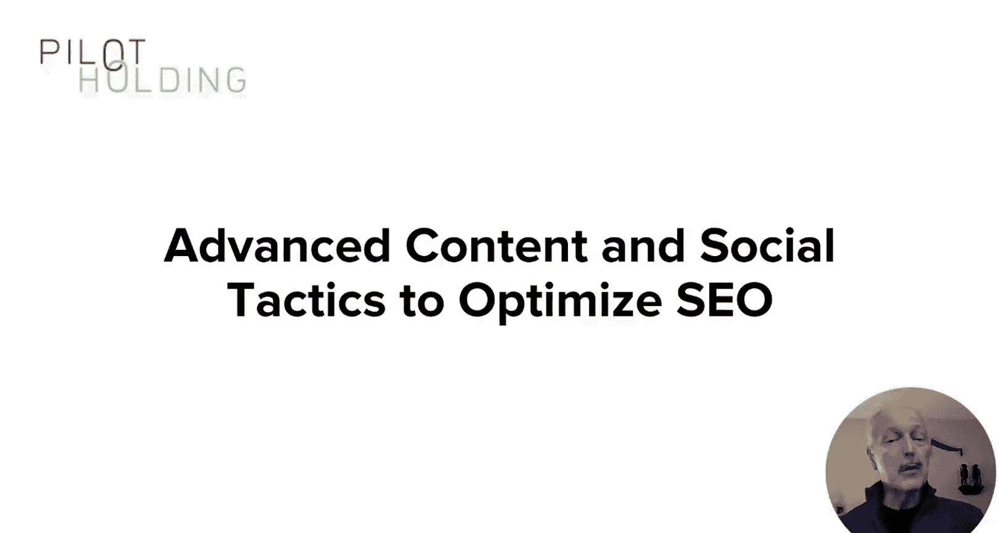
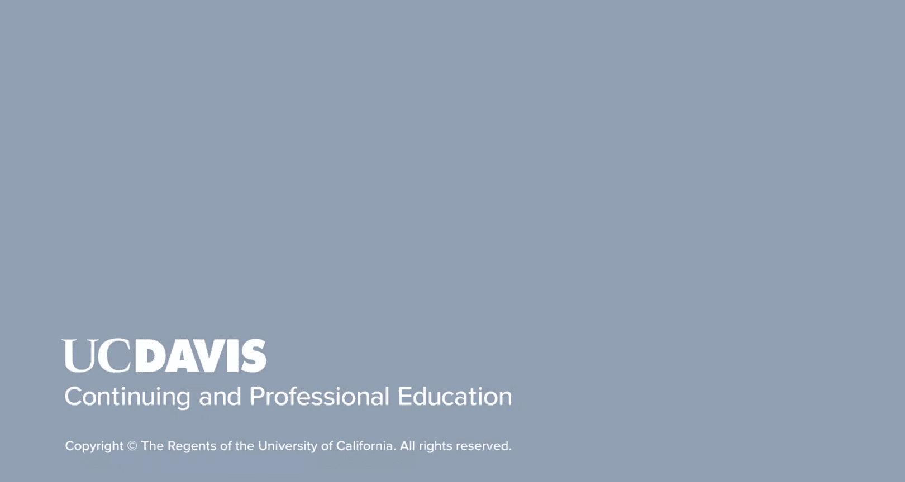

# 内容营销课程：133：课程总结

在本节课中，我们将对内容营销课程进行总结，回顾核心收获，并探讨如何将所学知识应用于实际工作与职业发展中。

恭喜你，你做到了。你已经完成了内容营销课程。

我希望这些知识能够帮助你推动所在组织的增长，并促进你的职业发展。

请记住，构建一个内容营销项目是一段旅程。

但这是一段沿途充满回报的旅程。现在你需要思考接下来的步骤。

你将如何推动你的组织开始实施内容营销？

开始规划你的方案，并思考如何让团队参与进来。一旦开始行动，请确保享受这个过程。

---

## 核心要点回顾

以下是本课程的核心要点总结：

*   **内容营销是战略旅程**：它并非一蹴而就，而是一个需要持续规划、执行和优化的长期过程。
*   **知识与实践并重**：课程提供了可立即应用的知识框架，旨在驱动实际业务增长与个人职业发展。
*   **启动与规划是关键**：学习结束后，首要任务是制定具体计划并争取组织内部的支持与参与。
*   **享受过程**：在推进内容营销的过程中，保持积极心态并享受学习和成长的乐趣至关重要。

---

## 总结

本节课中，我们一起完成了内容营销课程的学习总结。我们重申了将知识转化为实践的重要性，并强调了启动计划、争取支持以及享受整个营销旅程的积极态度。现在，你已装备好必要的知识，可以开始规划和实施你的内容营销战略，为组织和自身的成功铺平道路。