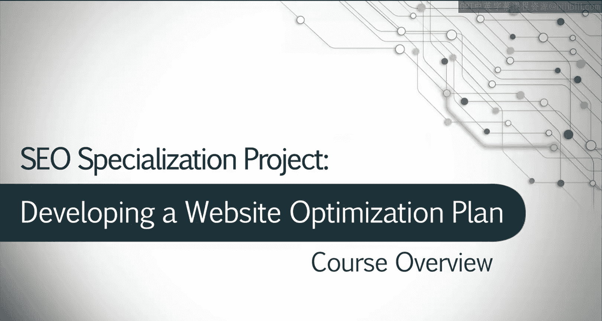
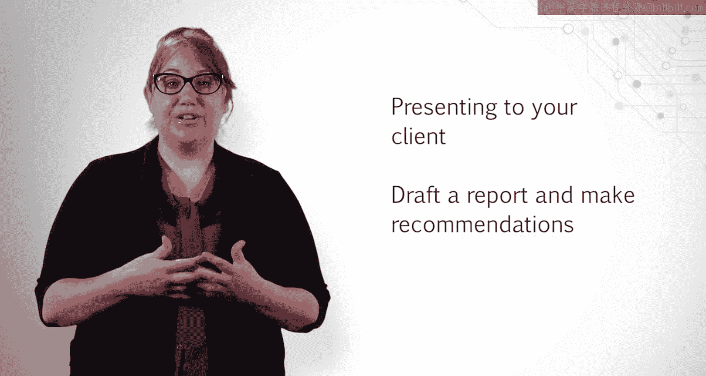

# 134：UCD《搜索引擎优化（谷歌、SEO基础、优化网站、进阶、毕业项目）｜Search Engine Optimization》中英字幕 p134 0_项目导览与概览.zh_en -BV1N66VYsEue_p134-

Hello and thank you for joining me I'm Rebecca May and for those of you who don't know me。

 I manage the SEO Department of a digital marketing firm and I've been doing SEO for about 10 years now。

By now， most of you should have completed the five course series on SEO。

 so congratulations on making it this far。Some of you may just be joining me for this project based course and we're happy to have you。

The skills you will need to successfully complete this project based course can be found throughout the courses of the specialization。

First， let's go over some of the skills you'll need。For milestonele one。

 you'll need to be able to analyze a website for search engine optimization。

 which includes knowing how search robots crawl the web， access websites， and index pages。

You'll need to know how and why metadata and other HTML elements such as heading tags impact SEO。

And be able to review content on a website to determine its optimization and ability for improvements。

In milestonele2， you will need to be able to identify your audience through building an ideal persona。

Remember， knowing who your likely audience is the basis for all SEO。

 and once you work more with clients， they will be able to help you understand the audience they are trying to reach as well。

Also， for this milestone， you will need to know how to conduct keyword research using tools like Google AdWs。

 Google Trends， and other tools to help you optimize your website。

The final part of the milestone requires you to do a competitive analysis comparing your site with two to three other similar competitors。

You'll want to know how are they different？How are they the same？

How can you differentiate your content from theirs and increase your SE rankings？

Knowing your competitors and what they are doing helps you determine how competitive a phrase or a keyword might be。

So now that you've identified your audience， conducted your keyword analysis and determined your top competitors。

 it's time to move on into auditing your website and putting everything together。For Mile three。

 you will need to be able to analyze the content in HTML elements not only on your own website。

 but your competitors as well。This includes optimizing title tags， metadata， heading tags。

 link building。How your audience responds to content you or your competitors produce through social engagement。

And determining content improvements for your own website。

You will also use your keyword research to assign keywords to pages throughout your site。

And find any technical problems that would inhibit search robots from accessing your content。

Like ensuring you have a robots。text file or resolving any errors you see such as four or4 pages on your site。

In the final milestone， you will be presenting to your client。

You will need to draft a website optimization report that includes your findings， your strategy。

 and your recommendations。You will also need to discuss how your recommendations will help your client achieve their goals and what metrics you need to measure to ensure the goals are met。

Once you know how to complete all of these steps， you will be on your way to starting a career in SEO。

