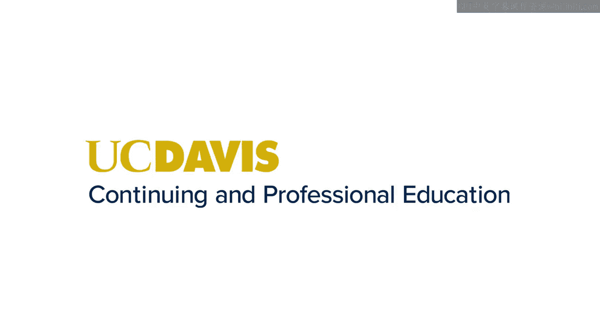
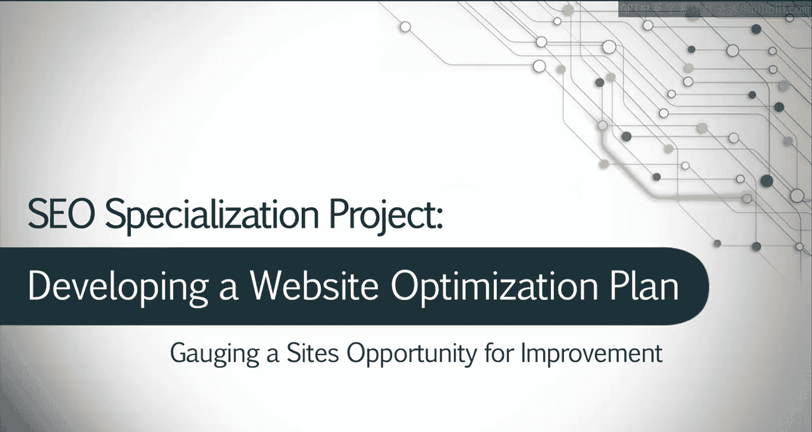
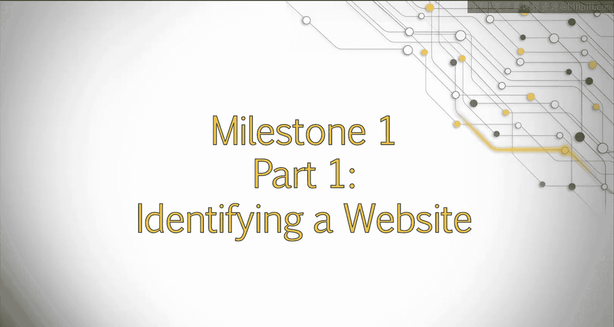
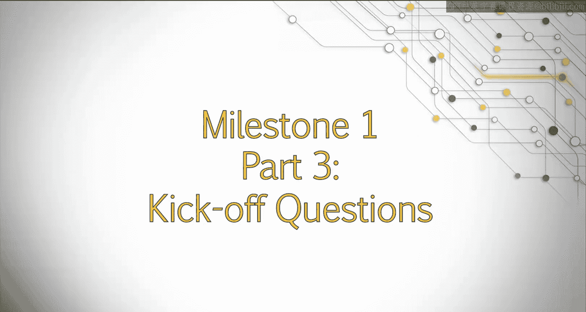

# 搜索引擎优化：阶段一：项目任务概览 🎯

在本节课中，我们将学习毕业项目第一阶段的核心任务。这一阶段的目标是识别一个网站的优化机会，并为潜在客户或管理者准备一份专业的提案。

## 识别目标网站 🔍

上一节我们介绍了本阶段的目标，本节中我们来看看如何开始。首先，你需要找到一个有潜力在搜索引擎中获得更高排名的网站。你应该运用在整个专项课程中学到的知识来发现这些机会。

以下是评估网站时可以考虑的几个方面：
*   **标题标签是否优化**：检查网站的标题标签是否包含关键词且具有吸引力。
*   **页面内容是否充实**：评估页面内容是否丰富、有价值且满足用户搜索意图。
*   **网站是否存在大量错误**：在浏览网站时，注意是否存在404错误、加载缓慢或代码错误等问题。

我建议你查看多个不同的网站，并评估提升其搜索排名所需的工作量。对于这个项目而言，修复网站所需的工作量越大，你在后续任务中就越能充分展示你的能力。

你可以通过多种方式寻找目标网站。以下是几种推荐的方法：
*   **联系真实客户**：你可以主动为需要帮助的真实企业或网站所有者提供服务。
*   **模拟客户项目**：你也可以找一个排名不佳的网站，假设自己正在直接为网站所有者工作，并完成项目任务。

如果可能，我强烈建议你借此机会联系可能需要帮助的真实企业主。这不仅能让你获得直接与客户合作的经验，还可能为你带来未来的推荐或可用于展示的案例研究。

以下是一些寻找可能对SEO服务感兴趣的客户的方法：
*   在Craigslist或类似网站上发布广告，说明你是一名学生，需要为毕业项目寻找一个网站。
*   在Craigslist或其他网站上寻找正在发布SEO帮助需求的企业，但务必声明你是学生，并询问他们是否愿意与你合作。
*   寻找你所在地区可能受益于SEO策略的初创公司。
*   寻找可能愿意接受SEO审计的本地非营利团体和组织。
*   如果你有朋友或家人拥有企业，可以询问他们是否愿意接受你提供的SEO建议。

如果你选择不直接与网站所有者合作，这也没关系。你可以通过头脑风暴一个主题或行业，并执行相关的关键词搜索来寻找网站。建议避免选择搜索结果第一页的网站，因为这些网站的优化机会可能较少。

## 准备并展示提案 📊

现在你已经确定了要合作的网站，是时候准备一份提案，以便潜在客户或管理者能够看到该网站在提升排名方面的机会。

首先，创建一份网站主要优势和劣势的清单。针对每一项劣势，提出一个论点，说明在改进这些弱点后，网站将如何获得更好的排名。

准备好这些信息后，让我们来创建一份实际的提案。为了让潜在客户或管理者更直观地理解你的观点，使用截图、图表或其他数据作为支持会很有帮助。你需要创建一个包含5到10张幻灯片的PowerPoint演示文稿，来阐述这些优化机会。

制作演示文稿时，请注意以下几点：
*   每张幻灯片最好只阐述一到两个主要观点，并尽可能使其可视化。
*   在需要强调特定元素的地方，使用项目符号或少量文字进行说明。

例如，如果标题标签是一个可以改进的领域，你可以向他们展示标题标签的位置、当前标题标签的文本，并强调这对SEO策略的重要性。

通常，你会通过电话会议向客户展示你的发现，同时共享你的PowerPoint。对于这部分任务，请使用屏幕录制软件，在讨论每张幻灯片的同时展示你的PowerPoint演示。

## 制定后续策略 📝

最后，让我们假设客户喜欢你的提案，并决定使用你的SEO服务。或者，这也可以是你被聘为内部SEO专员的企业。

你需要制定一份问题清单，以帮助你规划出最佳的后续SEO策略。这些问题应与以下方面相关：
*   客户的**目标受众**。
*   客户对网站业务的**目标**。
*   网站的**历史**，例如过去是否进行过SEO工作。
*   他们可用的**资源**等等。

你需要提出足够多的问题，以便清楚地了解从何处开始，以及对他们而言成功是什么样子。请制定一份包含10到15个问题的清单，这些问题可以在典型的项目启动会议上与新客户或经理进行讨论。

---

本节课中我们一起学习了毕业项目第一阶段的核心任务：识别网站的SEO优化机会、准备并向客户展示专业提案，以及为后续策略制定启动问题清单。这是将理论知识应用于实践的关键一步。