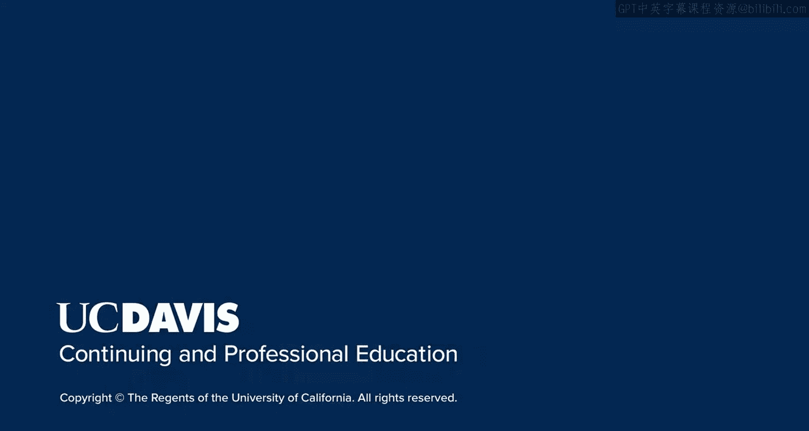

# 138：UCD《搜索引擎优化（谷歌、SEO基础、优化网站、进阶、毕业项目）｜Search Engine Optimization》中英字幕 p138 4_阶段四任务概览.zh_en -BV1N66VYsEue_p138-

Welcome to the final milestone for this project based course。

 you've come a long way and I'm confident that with the skills you've gained throughout this course。

 you will see success in SEO。Now let's take everything you've learned and put it together into one cohesive document so you can present your strategy and findings to your client or manager。

For this part， however， you will be presenting your final work and strategy to the class。

This will give you practice in presenting your findings and recommendations。

 which is essential to any career in SEO。I recommend using a Word document to outline your findings and recommendations。

Break up your document into the following sections。Start with an overview of the project。

 Give a brief description on the state of the site。

 what challenges you face and what the goals of the project are。

This is also a good area to describe your approach to the project。Next。

 give an overview of the buyer or audience。Note down how your recommendations will appeal to them based on key findings and recommendations。

Describe how this impacted keyword choice or the content recommendations you made。

Create an area for competition， list who the top competitors you identified are and give a brief overview on the state of their site and how their audience responds to content。

List out their individual strengths and weaknesses and what your strategy is for competing against these sites in organic search。

Did this impact your keyword strategy at all？Now it's time to get into the nitty gritty of the details。

I recommend starting out with your technical findings and then moving on to content。

Give a brief overview of any technical problems you discovered with the site。

 how these problems negatively impact Se O。How improving them will help and what your recommendations are for improving the problem you found。

Depending on the amount of technical problems you find。

 sometimes the technical recommendations are split up into different deliverable。For this part。

 we are putting it all together into one document。Next， move on to your content recommendations。

 This is the bulk of the document and will include recommendations you have around keywords。

 title tags and content itself。You'll be using the work you did on deliverables。

 such as the keyword matrix to roll up your recommendations into this document。For this portion。

 I recommend creating a section for each page of the site。Under each page。

 list the URL and the keywords you are recommending they target。

Provide recommendations for new title tags and meta descriptions。

Make sure these utilize keywords and are the appropriate character limit。

Provide recommendations for any heading tags on the page。If this page has headings。

 how do you recommend improving them？If this page doesn't list where you might place one and what you would recommend as the heading tag。

Provide an analysis of the content on the page。Does the content use keywords effectively？

Does it sound too over optimizeimized and spammy。How well does the content link to other internal or external resources？

Look at recommendations around the content on the page as well， for example。

 can images or videos be included？Look at how you can improve the conversion and engagement of the page。

 For example， does the page include a call to action and does the content answer questions that may have drawn the buyer there。

Also， include a list of pages you are recommending to be added to the site。

Make sure to note the keyword focus， title tag， meta description and recommendations for the content itself。

 Last， include any success metrics the client should track in order to gauge the success of your Seo efforts。

😊，If you decided to work on a real site with a real client through the process。

 list out what their goals were and what you may be able to monitor to judge how well those goals are being met。

If you are working on the site you discovered and not with a real client。

 let's out metrics pertaining to the goals you identified。Also。

 note what metrics should be tracked to measure how well you are meeting these goals。For example。

 should you be tracking site visits， landing pages or something else？

Once you've created this document， you're able to present your formal SEO plan to your client。

 then together you will develop your action plan。

