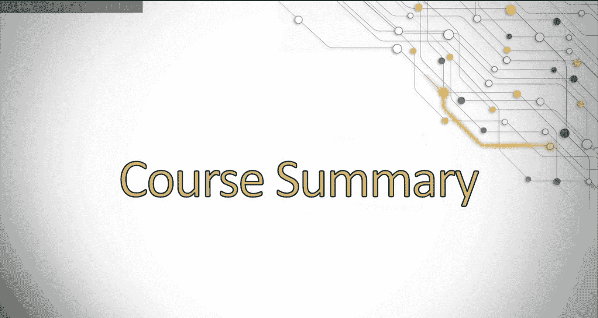
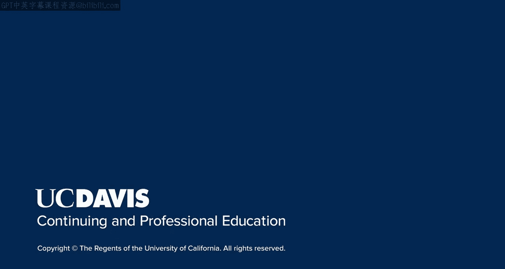

# 139：UCD《搜索引擎优化（谷歌、SEO基础、优化网站、进阶、毕业项目）｜Search Engine Optimization》中英字幕 p139 5_项目总结.zh_en -BV1N66VYsEue_p139-

You did it， congratulations for your dedication and successful implementation of these techniques。

On behalf of UC Davis and my colleague， Eric Ine， we would like to thank you for choosing us on your learning journey。

We sincerely hope that you're able to take the techniques you learned in this course and implement successful SEOO strategies on behalf of your clients or organization。

Remember， your learning journey doesn't stop here， and we would love to know how your journey is progressing。

Feel free to reach out and let us know where you are in your journey and how this course has helped。

As always， continue improving and expanding on your skills。Eo is ever evolving。

 and it's really important to continue monitoring Google for algorithm updates。

 expanding your knowledge by reading Seo blogs。😊，And always practice， practice， practice。Again。

 congratulations and thank you and good luck out。

